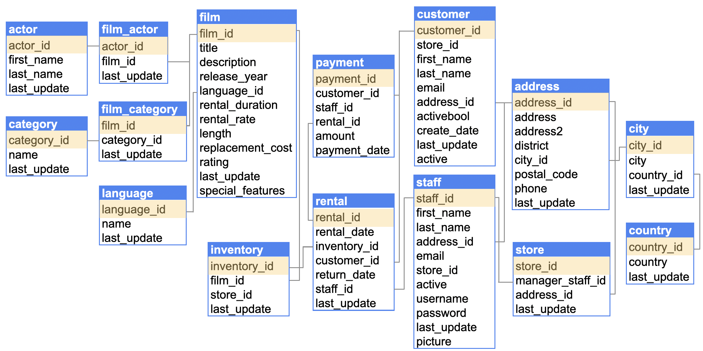

# Interacting With a Relational Database Using SQL

As a Data Engineer, you want to help the organization find valuable insights through data. To do so, you should learn the basics of querying and manipulating data with SQL.

In this lab, you will be working with a DVD rental sample relational database where you will find information about stores, customers, and rented films. Below you will find the diagram showing the relationships between the tables, and a brief description of each table.

The purpose of this lab is to use SQL language to query the database in order to answer business questions. As you complete each exercise, you should check the output you get from each exercise cell block with the expected output. If you get stuck, you can always check the solution notebook.

To open the solution notebook, follow these steps:
- Go to the main menu and select `File -> Preferences -> Settings`.
- Click on `text editor` on the left, then scroll down to the `Files: Exclude` section.
- Remove the line `**/C2_W1_Lab_1_SQL_Solution.ipynb`. The file will now appear in the explorer.
- You can close the `Settings` tab.

# Table of Contents
- [ 1 - Database](#1)
- [ 2 - Running SQL Commands in a Notebook](#2)
- [ 3 - Create, Read, Update, and Delete (CRUD) Operations](#3)
  - [ 3.1 - CREATE TABLE](#3-1)
    - [ Exercise 1](#ex01)
  - [ 3.2 - SELECT](#3-2)
    - [ Exercise 2](#ex02)
    - [ Exercise 3](#ex03)
  - [ 3.3 - WHERE](#3-3)
    - [ Exercise 4](#ex04)
  - [ 3.4 - INSERT INTO](#3-4)
    - [ Exercise 5](#ex05)
  - [ 3.5 - UPDATE](#3-5)
    - [ Exercise 6](#ex06)
  - [ 3.6 - DELETE](#3-6)
    - [ Exercise 7](#ex07)
- [ 4 - SQL Clauses](#4)
  - [ 4.1 - ALIASES](#4-1)
    - [ Exercise 8](#ex08)
  - [ 4.2 - JOIN](#4-2)
    - [ Exercise 9](#ex09)
    - [ Exercise 10](#ex10)
  - [ 4.3 - GROUP BY](#4-3)
    - [ Exercise 11](#ex11)
  - [ 4.4 - ORDER BY](#4-4)
    - [ Exercise 12](#ex12)

<a id='1'></a>
## 1 - Database

You will be working with a modified version of the [Sakila Sample Database](https://dev.mysql.com/doc/sakila/en/), which is licensed under the [New BSD license](https://dev.mysql.com/doc/sakila/en/sakila-license.html).

For learning purposes, let's assume that the data belongs to _Rentio_, which is a fictitious company dedicated to renting movies to clients from all around the world.

In the database, you will be able to find the data of the stores and the staff who work in them as well as their addresses. Each store manages its inventory, so when a store receives a new DVD, information about the film, category, language and actors is inserted into the database. Also, every time a new customer rents a film, the customer's basic information is inserted into the database along with their address. Additionally, a rental is added as soon as a transaction occurs with information about inventory, film, and paying customers.

Throughout the exercises in this lab, you will work with the various tables in this database, helping the business understand the most rented films by different attributes.

Rentio's transactional database includes the following tables.

- `actor`: Contains the actor's data such as first and last name.
- `address`: Contains address data of staff and customers.
- `category`: Contains category data of the film.
- `city`: Has city names.
- `country`: Has country names.
- `customer`: Contains customer data such as first name, last name, stores where they bought, and if it is active or not.
- `film`: Contains film data such as title, description, language, and ratings.
- `film_actor`: Stores the relationship between film and actor.
- `film_category`: Stores the relationship between film and category.
- `inventory`: Contains inventory data related to the films and the store where they are stored.
- `language`: Has language names.
- `payment`: Contains payment data from customers related to the staff, the amounts, and dates.
- `rental`: Contains rental data related to the customer, staff, rental dates, and return date.
- `staff`: Contains staff data such as first name, last name, stores where they work, and if it is active or not.
- `store`: Contains store data such as the manager and store address.

Here you can find the entity-relationship model (ERM) of the transactional database showing all the tables and how they are related:



**Note**:
As you're scrolling down to do the SQL exercises, you can split this editor into two to keep the database diagram next to you.
- Type "Ctrl + \\" or "Cmd + \\", a new window should be opened on the right.
- Then from the explorer menu on the left, you can open the image folder and drag the rentio_database_erd_2.png image to the second window. And in this current window, you can keep this notebook open to complete the exercises.
- Feel free to customize your windows using the toggle options found in the top right corner of this editor.

<a id='2'></a>
## 2 - Running SQL Commands in a Notebook

In this lab, you will leverage the use of SQL "magic"  (`%sql` or  `%%sql`) offered by the `ipython-sql` [extension](https://pypi.org/project/ipython-sql/), which allows you to connect to a database and issue SQL commands interactively within a JupyterLab notebook.  JupyterLab defines "magic" as special commands prefixed with `%`. Here, you'll employ the `load_ext` magic to load the `ipython-sql` extension. Load the SQL module:


```python
%load_ext sql
```

The provided magic command loads the `ipython-sql` extension, enabling connection to databases supported by [SQLAlchemy](https://www.sqlalchemy.org/features.html). Before you start issuing SQL queries to the database, you need first to establish a connection to the MYSQL database. For that, you need information such as the database username, password, hostname (or address), port number and the database name. This information is provided to you and stored in the environmental variables defined in the `src/env` file. Run the following cell to load the values for these variables, and establish a connection to the MYSQL database.


```python
import os 
import socket

from dotenv import load_dotenv

load_dotenv('./src/env', override=True)

DBHOST = socket.gethostname()
DBPORT = os.getenv('DBPORT')
DBNAME = os.getenv('DBNAME')
DBUSER = os.getenv('DBUSER')
DBPASSWORD = os.getenv('DBPASSWORD')

connection_url = f'mysql+pymysql://{DBUSER}:{DBPASSWORD}@{DBHOST}:{DBPORT}/{DBNAME}'

%sql {connection_url}
```

<a id='3'></a>
## 3 - Create, Read, Update, and Delete (CRUD) Operations

CRUD stands for Create, Read, Update, and Delete, which are basic operations for manipulating data. When we talk about databases, we use `INSERT INTO`, `SELECT`, `UPDATE`, and `DELETE` statements respectively to refer to CRUD operations.

<a id='3-1'></a>
### 3.1 - CREATE TABLE

Before using the statements for CRUD operations, you will see the `CREATE TABLE` statement which is used to create a new table in a database. You must specify the name of the columns, and the data type for each column. You can check the full list of data types [here](https://dev.mysql.com/doc/refman/8.0/en/data-types.html).

```sql
CREATE TABLE table_name (
    column1 datatype,
    column2 datatype,
    column3 datatype,
   ...
);
```

<a id='ex01'></a>
### Exercise 1

Write a SQL query to create a replica of the `category` table called `category_copy`. Use these columns:

| column name | data type   |
| ----------- | ----------- |
| category_id | INTEGER     |
| name        | VARCHAR(25) |
| last_update | TIMESTAMP   |

VARCHAR(25) means a string of variable character length that can contain up to 25 characters in it.

**Note:** You will be using the magic command `%%sql` to allow multiline query syntax.

**Note:** Replace all `None` in the provided code.


```sql
%%sql 
CREATE TABLE category_copy (
    category_id INTEGER,
    name VARCHAR(25),
    last_update TIMESTAMP
);

```

<a id='3-2'></a>
### 3.2 - SELECT

The `SELECT` statement is used to get data from a database. It also goes along with the `FROM` clause to indicate the table you want to query.

You could specify the columns of the table you want to retrieve from the query by listing each one as follows:

```sql
SELECT
    column1,
    column2,
    column3,
    ...
FROM table_name;
```

What's more, you could use `*` to get all the columns from the table:

```sql
SELECT
    *
FROM table_name;
```

The `LIMIT` clause is used to limit the number of rows the query is returning.

```sql
SELECT
    *
FROM table1
LIMIT 1;
```


<a id='ex02'></a>
### Exercise 2

Write a SQL query to retrieve the title, length, and release year of the `film` table. Limit output to only 4 records.


```sql
%%sql
SELECT title, length, release_year
FROM film
LIMIT 4;
```

##### __Expected Output__ 

**Note:** The order and actual values in the records may change.

| **title**         | **length** | **release_year** |
| ----------------- | ---------- | ---------------- |
| ACADEMY DINOSAUR  | 86         | 2006             |
| ACE GOLDFINGER    | 48         | 2006             |
| ADAPTATION HOLES  | 50         | 2006             |
| AFFAIR PREJUDICE  | 117        | 2006             |

<a id='ex03'></a>
### Exercise 3

Write an SQL query to get all the columns of the store table.


```sql
%%sql
SELECT *
FROM store;
```

##### __Expected Output__ 

**Note:** The order and some details of the records may change.

| **store_id** | **manager_staff_id** | **address_id** | **last_update**         |
| ------------ | -------------------- | -------------- | ----------------------- |
| 1            | 1                    | 1              | 2006-02-15 09:57:12.000 |
| 2            | 2                    | 2              | 2006-02-15 09:57:12.000 |

<a id='3-3'></a>
### 3.3 - WHERE

The `WHERE` clause is used to filter data based on a condition. In the end, the query will return the rows which satisfy the condition.

```sql
SELECT
    *
FROM table_name
WHERE column1 = 'value1';
```

<a id='ex04'></a>
### Exercise 4

Write an SQL query to retrieve the first name, last name, and email of each `active` staff member from the `staff` table.


```sql
%%sql
SELECT first_name, last_name, email
FROM staff
WHERE active;
```

##### __Expected Output__ 

**Note:** The order of the records may change.

| **first_name** | **last_name** | **email**                    |
| -------------- | ------------- | ---------------------------- |
| Mike           | Hillyer       | Mike.Hillyer@sakilastaff.com |
| Jon            | Stephens      | Jon.Stephens@sakilastaff.com |

<a id='3-4'></a>
### 3.4 - INSERT INTO

The `INSERT INTO` statement is used to insert new rows in a table.

You could insert new rows without specifying some columns, but you will have to write the column names and values that you want to insert. That's useful when some columns are filled automatically by the default value of the column or when the column is of `SERIAL` data type.

```sql
INSERT INTO table_name (
  column1,
  column2,
  column3,
  ...
)
VALUES (
  'value1',
  'value2',
  'value3',
  ...
);
```

If you are adding a row to a table and will be specifying all the column values, then you don't need to specify the column names and can just specify the values to be inserted.

```sql
INSERT INTO table_name
VALUES (
  'value1',
  'value2',
  'value3',
  ...
);
```

<a id='ex05'></a>
### Exercise 5

Write an SQL query to insert the following rows to the `category_copy` table:

| **category_id** | **name**  | **last_update**         |
| --------------- | --------- | ----------------------- |
| 1               | Horror    | 2006-02-15 09:46:27.000 |
| 10              | Animation | 2006-02-15 09:46:27.000 |
| 20              | Pop       | 2006-02-15 09:46:27.000 |


```sql
%%sql
INSERT INTO category_copy 
VALUES 
(1, 'Horror', '2006-02-15 09:46:27.000'),
(10, 'Animation', '2006-02-15 09:46:27.000'),
(20, 'Pop', '2006-02-15 09:46:27.000');
```

Execute the `SELECT` statement on the table to check that the values were successfully added:


```sql
%%sql
SELECT *
FROM category_copy;
```

##### __Expected Output__ 

**Note:** The order of the records may change.

| **category_id** | **name**  | **last_update**         |
| --------------- | --------- | ----------------------- |
| 1               | Horror    | 2006-02-15 09:46:27.000 |
| 10              | Animation | 2006-02-15 09:46:27.000 |
| 20              | Pop       | 2006-02-15 09:46:27.000 |

<a id='3-5'></a>
### 3.5 - UPDATE

The `UPDATE` statement is used to change the values of some columns on existing rows in a table. You could use the `WHERE` clause to filter the rows you want to change.

```sql
UPDATE table_name
SET
  column2 = 'value2',
  column3 = 'value3',
...
WHERE column1 = 'value1';
```

<a id='ex06'></a>
### Exercise 6

Write an SQL query to perform the following changes in the `category_copy` table:

- Change the `last_update` value to `2020-09-12 08:00:00.000` for all the rows.
- Change the `category_id` value to `2` for the row with the `name` of `Animation`.
- Change the `name` value to `Action` for the row with the `category_id` of `1`.

You can add more cells for each query if you want.


```sql
%%sql
UPDATE category_copy 
SET last_update = '2020-09-12 08:00:00.000';

UPDATE category_copy 
SET category_id = 2
WHERE name = 'Animation';

UPDATE category_copy 
SET name = 'Action'
WHERE category_id = 1;
```

Execute the `SELECT` statement on the table to check that the values were successfully updated:


```sql
%%sql
SELECT *
FROM category_copy;
```

##### __Expected Output__ 

**Note:** The order of the records may change.

| **category_id** | **name**  | **last_update**         |
| --------------- | --------- | ----------------------- |
| 1               | Action    | 2020-09-12 08:00:00.000 |
| 2               | Animation | 2020-09-12 08:00:00.000 |
| 20              | Pop       | 2020-09-12 08:00:00.000 |

<a id='3-6'></a>
### 3.6 - DELETE

The `DELETE` statement is used to delete existing rows in a table. It also goes along with the `FROM` clause to indicate the table where you want to delete the rows. You could use the `WHERE` clause to filter the rows you want to delete.

**You have to be careful because you will delete all rows of a table if you don't specify a condition:**

```sql
DELETE FROM table_name;
```

That's why you should add a condition unless you want to delete all rows:

```sql
DELETE FROM table_name
WHERE column1 = 'value1';
```

<a id='ex07'></a>
### Exercise 7

Write an SQL query to delete the row where the `category_id` is `20` from the `category_copy` table.


```sql
%%sql
DELETE FROM category_copy 
WHERE category_id = 20;
```

Execute the `SELECT` statement on the table to check that the row were successfully deleted:


```sql
%%sql
SELECT *
FROM category_copy;
```

##### __Expected Output__ 

**Note:** The order of the records may change.

| **category_id** | **name**  | **last_update**         |
| --------------- | --------- | ----------------------- |
| 1               | Action    | 2020-09-12 08:00:00.000 |
| 2               | Animation | 2020-09-12 08:00:00.000 |

<a id='4'></a>
## 4 - SQL Clauses

In the next sections, you will see how to create more complex SQL queries to read data from a database using the most common clauses.

<a id='4-1'></a>
### 4.1 - ALIASES

Aliases temporarily change the name of a column. They allow you to use and display a more readable name for the columns. To create an alias you could use the keywords `AS` next to a column to change its name. 
It is optional and mainly serves to improve clarity.

```sql
SELECT
    column1 AS Alias_Column_1,
    column2 AS Alias_Column_2,
    column3 AS Alias_Column_3,
    ...
FROM table_name;
```

<a id='ex08'></a>
### Exercise 8

Write an SQL query to obtain the title, length, and release year of the `film` table. Change column names to have `film_` as a prefix.


```sql
%%sql
SELECT 
    title AS film_title, 
    length AS film_length,
    release_year AS film_release_year
FROM film
LIMIT 10;
```

##### __Expected Output__ 

**Note:** Not all of the records are shown here. Their order may change.

| **film_title**    | **film_length** | **film_release_year** |
| ----------------- | --------------- | --------------------- |
| ACADEMY DINOSAUR  | 86              | 2006                  |
| ACE GOLDFINGER    | 48              | 2006                  |
| ADAPTATION HOLES  | 50              | 2006                  |
| AFFAIR PREJUDICE  | 117             | 2006                  |
| ...               | ...             | ...                   |

<a id='4-2'></a>
### 4.2 - JOIN

The `JOIN` clause is used to combine the data from multiple tables based on a shared column between the tables.

```sql
SELECT
    *
FROM table1
JOIN table2 ON table1.column1 = table2.column2;
```

By default, the JOIN clause is equivalent to `INNER JOIN`, which combines rows from two tables based on a related column between them, returning only the rows with matching values in the specified column in both tables. There are also other types of joins:
- `LEFT JOIN`: Returns all the rows from the left table, and the matching rows from the right table. Rows in the left table that don't have matches in the right table will include nulls for the right table columns.
- `RIGHT JOIN`: Returns all the rows from the right table, and the matching rows from the left table. Rows in the right table that don't have matches in the left table will include nulls for the left table columns.
- `FULL JOIN`: Combines the results of both `LEFT JOIN` and `RIGHT JOIN`, returning all rows from both tables with matches where available. If there's no match, the missing side will contain nulls in the columns.

<a id='ex09'></a>
### Exercise 9

Write an SQL query to get the city, address and district for each address in the table `address`.


```sql
%%sql
SELECT city, address, district
FROM address
JOIN city ON address.city_id = city.city_id
LIMIT 5;
```

##### __Expected Output__ 

**Note:** Not all of the records are shown here. Their order and values may change.

| **city**   | **address**           | **district** |
| ---------- | --------------------- | ------------ |
| Abha       | 733 Mandaluyong Place | Asir         |
| Abu Dhabi	 | 535 Ahmadnagar Manor  | Abu Dhabi    |
| ...        | ...                   | ...          |

<a id='ex10'></a>
### Exercise 10

Write an SQL query to obtain the country, city, and address of the active staff members.


```sql
%%sql
SELECT country.country, city.city, address.address
FROM address
JOIN staff ON staff.address_id = address.address_id
JOIN city ON address.city_id = city.city_id
JOIN country ON city.country_id = country.country_id
WHERE staff.active;
```

**Note:** The order and actual values in the records may change.

| **country** | **city**   | **address**          |
| ----------- | ---------- | -------------------- |
| Canada      | Lethbridge | 23 Workhaven Lane    |
| Australia   | Woodridge  | 1411 Lillydale Drive |

<a id='4-3'></a>
### 4.3 - GROUP BY

The `GROUP BY` SQL statement groups rows that have the same values in specified columns into summary rows. It is often used with aggregate functions (`COUNT`, `MAX`, `MIN`, `SUM`, `AVG`) to perform calculations on each group of data. So you can use it to help answer questions like "What is the average film length by film release year?".

```sql
SELECT
    column1,
    COUNT(column2),
    SUM(column3)
FROM table1
GROUP BY column1;
```

<a id='ex11'></a>
### Exercise 11

Write an SQL query to retrieve the number of films by rating in the `film` table.


```sql
%%sql
SELECT rating, COUNT(film_id) AS films_count
FROM film
GROUP BY rating;
```

**Note:** The order and actual values in the records may change.

| **rating** | **films_count** |
| ---------- | --------------- |
| PG         | 194             |
| G          | 178             |
| NC-17      | 210             |
| PG-13	     | 223             |
| R	         | 195             |

<a id='4-4'></a>
### 4.4 - ORDER BY

The `ORDER BY` clause is used to sort the rows in ascending or descending order based on one or more columns. By default, this clause will sort the rows in ascending order, but you could use the `DESC` keyword to order the rows in descending order.

```sql
SELECT
    *
FROM table1
ORDER BY column1 DESC;
```

<a id='ex12'></a>
### Exercise 12

Write an SQL query to get the number of films by category. Sort the results by the number of films in ascending order.


```sql
%%sql
SELECT category.name AS category, COUNT(film.film_id) AS films_count
FROM film
JOIN film_category ON film.film_id = film_category.film_id
JOIN category ON film_category.category_id = category.category_id
GROUP BY category.name
ORDER BY films_count;
```

**Note:** Not all of the records are shown here. Their order and values may change.

| **category** | **films_count** |
| ------------ | --------------- |
| Music        | 51              |
| Horror	   | 56              |
| Classics	   | 57              |
| ...          | ...             |

During this lab, you've written several SQL queries to manipulate data from the DVD rental sample database. First, you created queries to gather general information relevant to the business. Then, you built queries using more complex clauses to perform data transformation while combining multiple tables. Finally, you performed other basic CRUD operations. Congratulations! You now have the basic knowledge to process data using SQL.

## References

<a id="1">[1]</a> SQL Tutorial, W3schools, 2022. [Online]. Available: <https://www.w3schools.com/sql/>. [Accessed: 07- Mar- 2022]
