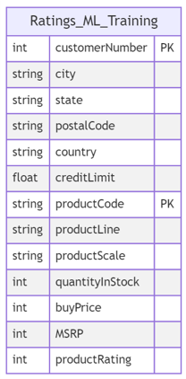
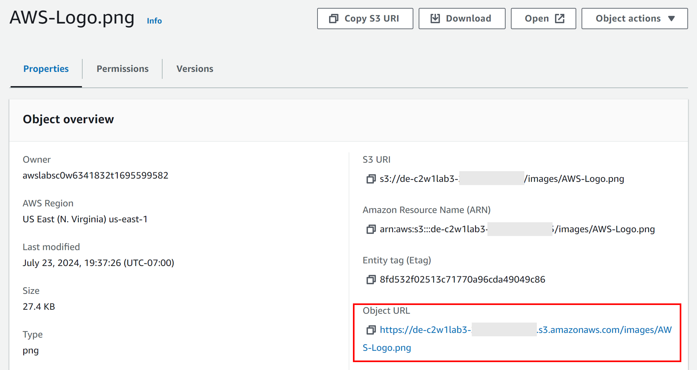

# Interacting With Amazon S3 Object Storage

In this lab, you'll work with AWS Object Storage and Amazon S3. You will create an S3 bucket, query data from the bucket, and work with object versioning in S3. You will load into the S3 bucket structured data from a CSV file, semi-structured data from a JSON file, and unstructured data from an image file. You will also interact with the S3 bucket through the AWS management console and programmatically using `boto3` (the AWS Software Development Kit (SDK) for Python). 

**Note**: The lab contains links to external resources. You can always skim through these resources during the lab session, but you're not expected to open and read each link during the lab session. If you'd like to deepen your understanding, you can check the linked resources after you're done with the lab.

# Table of Contents
- [ 1 - Import Packages](#1)
- [ 2 - Explore the Dataset](#2)
- [ 3 - Create an S3 Bucket](#3)
  - [ Exercise 1](#ex01)
- [ 4 - Upload and Query Data](#4)
  - [ 4.1 - Structured Data](#4.1)
  - [ 4.2 - Semi-Structured Data](#4.2)
    - [ Exercise 2](#ex02)
    - [ Exercise 3](#ex03)
  - [ 4.3 - Unstructured Data](#4.3)
    - [ Exercise 4](#ex04)
- [ 5 - Delete the Bucket](#5)

<a name='1'></a>
## 1 - Import Packages

Let's import the packages required for this lab.


```python
import boto3
import json

from typing import Any, Dict
```

<a name='2'></a>
## 2 - Explore the Dataset

In this lab, you are provided with three data files that you can find in the `data` folder. Here's the structure of the `data` folder:

```bash
.
└── data/
    ├── csv/
         └── ratings_ml_training_dataset.csv
    ├── images/
    |    ├── v1/
    |    |    └── AWS-Logo.png
    |    └── v2/ 
    |    |    └── AWS-Logo.png
    └── json/
         └── delivery-stream-one-record.json
```

You can see that there are three subfolders (csv, images and json). Each subfolder contains a different data format: 
- the csv subfolder contains structured data, stored in a `.csv` file. This data consists of the training dataset that was used in the Week 4 lab of Course 1 to train the recommender system model;
- the json subfolder contains semi-structured data stored in a `.json` file;
- the images subfolder contains unstructured data, that consists of two versions of AWS logo.

You will upload these different types of data in an S3 bucket that you will create in this lab. Here's a quick summary of AWS object storage terminology:
- A [bucket](
https://docs.aws.amazon.com/AmazonS3/latest/userguide/UsingBucket.html) is a container for objects stored in Amazon S3.
- An object is a file and any metadata that describes that file. It has a unique identifier, also known as the object key.
Object storage allows the storage of any object; you can store not only structured but also unstructured and semi-structured data. 

To upload your data to Amazon S3, you need first to create an S3 bucket in one of the AWS Regions. And this is what you're going to do programmatically in the next exercise. But before that, go to the AWS console and search for **S3**. You should see that there are no buckets created yet in your account.

<a name='3'></a>
## 3 - Create an S3 Bucket

<a name='ex01'></a>
### Exercise 1

To create an S3 bucket, you need to specify the bucket name and the region for your bucket. In this lab, the region is set to `us-east-1`. Regarding the name of the bucket, Bucket names should be globally unique to avoid collisions with buckets that other learners could be creating or working with at the same time. To ensure the uniqueness of the bucket name, you will use your Vocareum's AWS Account ID to include it in the bucket name.

Go to the AWS console and click on the upper right part, where your username appears. Copy the **Account ID**. Set the variable `BUCKET_NAME` to `de-c2w1lab3-<AWS-ACCOUNT-ID>` and replace the placeholder `<AWS-ACCOUNT-ID>` with the Account ID that you copied.


```python
BUCKET_NAME = 'de-c2w1lab3-<AWS-ACCOUNT-ID>'
AWS_DEFAULT_REGION = 'us-east-1'
```

To programmatically create the bucket in Python using boto3, you can use the `S3` method [`create_bucket()`](https://boto3.amazonaws.com/v1/documentation/api/latest/reference/services/s3/client/create_bucket.html) which requires a Client object (as explained in the DynamoDB lab).

The following function `create_s3_bucket()` consists of the steps needed to create the S3 bucket (instantiating a Client object and then calling the method `create_bucket()`). The function takes in as input the bucket name and the region.


```python
def create_s3_bucket(bucket_name:str , region: str):
    
    # Create an S3 client
    s3_client = boto3.client('s3', region_name=region)

    # Create the S3 bucket
    try:
        s3_client.create_bucket(Bucket=bucket_name)
        print(f"S3 bucket '{bucket_name}' created successfully in region '{region}'.")
    except Exception as e:
        print(f"An error occurred: {e}")
```


```python
create_s3_bucket(bucket_name=BUCKET_NAME, region=AWS_DEFAULT_REGION)
```

You can check that the bucket has been created using the `aws cli` tool. To list the buckets created in your account, you can use the following command:
`aws s3 ls`

You can run the command in the AWS Cloud9 terminal or you can run it in this notebook but you need to add an exclamation mark `!` at the beginning of the command. This allows you to run shell commands in a code cell.


```python
!aws s3 ls
```

To list the objects stored inside a bucket, you can use the command `aws s3 ls <your-bucket-name>`. If you now run this command, no result will be shown since the bucket is still empty.


```python
!aws s3 ls $BUCKET_NAME
```

You can also inspect the S3 bucket in the AWS Console. Search for **S3**. You will see the bucket with the name you provided. You can check that the bucket is empty by simply clicking on it. 

<a name='4'></a>
## 4 - Upload and Query Data

<a name='4.1'></a>
### 4.1 - Structured Data

In this section of the lab, you will upload structured data to the S3 bucket and then query it. 

**Upload the CSV file**

Check first the file `data/csv/ratings_ml_training_dataset.csv`. Each row in this dataset consists of the details of a product that was purchased by a given user. The row also contains the user details and what ratings they provided to that product (the same dataset was used in the Week 4 lab of Course 1 to train the recommender system). Here's the structure of this table:



To programmatically upload this CSV file to the bucket, you can use the S3 method [upload_file()](https://boto3.amazonaws.com/v1/documentation/api/latest/reference/services/s3/client/upload_file.html). This method expects three arguments: the path of the source file that you want to upload (Filename), the name of the bucket to upload to (Bucket) and the object key or name (Key). The last argument specifies how you want to label the uploaded object or file within the bucket, this name should uniquely identify the uploaded object.

The following function `upload_file_to_s3()` consists of the steps needed to upload the file to the S3 bucket (instantiating a Client object and then calling the method `upload_file()`). The function takes in as input the path to the local file to upload, the bucket name, and the object key.


```python
def upload_file_to_s3(local_file_path: str, bucket_name: str, object_key: str) -> None:
    """Uploads a local file to S3 using boto3

    Args:
        local_file_path (str): Local file path
        BUCKET_NAME (str): Bucket name
        object_key (str): the key name, which should uniquely identifies the uploaded object in the bucket
    """
    # Create an S3 client
    s3_client = boto3.client('s3')

    # Upload the file to S3
    try:
        s3_client.upload_file(local_file_path, bucket_name, object_key)
        print(f"File {local_file_path} uploaded to s3://{bucket_name}/{object_key} successfully.")
    except Exception as e:
        print(f"Error uploading file to S3: {e}")
```


```python
# Define the local file path, and object key
local_file_path = 'data/csv/ratings_ml_training_dataset.csv'
object_key = 'csv/ratings_ml_training_dataset.csv'

# Upload the file to S3
upload_file_to_s3(local_file_path, BUCKET_NAME, object_key)
```

You can verify that the file is in the bucket either by checking the content through the AWS console or programmatically also using `boto3` or even the `aws cli`. Go to the AWS console and check that there's a new folder in your bucket that contains the csv file you just uploaded. 

*Note*: remember from the lecture that object storage has a flat structure. When you use the delimiter `/` in the object name or key, like in this example: `object_key = 'csv/ratings_ml_training_dataset.csv'`, you're including a key name prefix that is used by S3 to group objects inside the bucket. The console uses the terminology `folder` because this grouping of objects can be analogous to a folder in a regular file system. You can learn more about object keys [here](https://docs.aws.amazon.com/AmazonS3/latest/userguide/object-keys.html). 

If you run the next command either in the AWS Cloud9, Jupyter terminal, or the Jupyter notebook cell, you can also check that the file you uploaded is there. Remember that if you run it in a terminal, you have to omit the exclamation mark at the beginning.


```python
!aws s3 ls $BUCKET_NAME/csv/
```

**Query the Data**

Now that the file has been uploaded, let's read its content. You can either download the file again to your local file system and open it, or read its content directly from S3 using the `S3` [select_object_content()](https://boto3.amazonaws.com/v1/documentation/api/latest/reference/services/s3/client/select_object_content.html) method. This method expects two arguments the bucket name and the object key that you want to select from the bucket. You are provided with the following function that calls this method.


```python
def s3_select_object_content(bucket_name: str, object_key: str, **kwargs) -> Dict[Any, Any]:
    """Uses the s3 select utility to get the content of a file.

    Args:
        bucket_name (str): Bucket name
        object_key (str): Object key (name)

    Returns:
        Dict[Any, Any]: Response from S3 select
    """
    
    s3_client = boto3.client('s3')

    response = s3_client.select_object_content(
        Bucket=bucket_name,
        Key=object_key,
        **kwargs
    )
    
    return response
```

When using the `select_object_content()` method, you can filter the returned output by passing a SQL expression. In this way, instead of returning all rows of the CSV file, you can specify for the method which rows you want in the returned output based on the SQL expression. 

In the next cell, you are given an example of how to do that, where only the rows that correspond to `Trains` are returned (the column `productLine` takes `Trains` as value). You can modify the query statement to get more rows or a different result. Execute the following two cells to get the data and see the result. To understand the details of the keyword arguments provided in the cell, you can check the S3 Select [documentation](https://boto3.amazonaws.com/v1/documentation/api/latest/reference/services/s3/client/select_object_content.html) and this [example](https://aws.amazon.com/blogs/storage/querying-data-without-servers-or-databases-using-amazon-s3-select/).


```python
file_s3_key = 'csv/ratings_ml_training_dataset.csv'
kwargs = {'ExpressionType': 'SQL',
          'Expression': """SELECT * FROM s3object AS s WHERE s.\"productline\" = 'Trains' LIMIT 20""",
          'InputSerialization': {'CSV': {"FileHeaderInfo": "Use"}, 'CompressionType': 'NONE'},
          'OutputSerialization': {'CSV': {}},
}

response = s3_select_object_content(bucket_name=BUCKET_NAME, object_key=file_s3_key, **kwargs)
```

Execute the following cell to read the content of the file from the response's payload (i.e., the array of results, you can check the structure of the response in the [documentation](https://boto3.amazonaws.com/v1/documentation/api/latest/reference/services/s3/client/select_object_content.html), by scrolling down to sections: "Response Syntax" and "Response Structure").


```python
for event in response['Payload']:
    if 'Records' in event:
        records = event['Records']['Payload'].decode('utf-8')
        print(records)
    elif 'Stats' in event:
        statsDetails = event['Stats']['Details']
        print("Stats details bytesScanned: ")
        print(statsDetails['BytesScanned'])
        print("Stats details bytesProcessed: ")
        print(statsDetails['BytesProcessed'])
        print("Stats details bytesReturned: ")
        print(statsDetails['BytesReturned'])
```

<a name='4.2'></a>
### 4.2 - Semi-Structured Data

Now, you will work with semi-structured data, in particular with a JSON file. You will upload the file located at `data/json/delivery-stream-one-record.json`. This file consists of the data obtained from the transformations done to the streaming data in the Week 4 lab of Course 1. You can open it to check its structure. 

<a name='ex02'></a>
### Exercise 2

Complete the code below to upload the file located at `data/json/delivery-stream-one-record.json` to the S3 bucket using the same function used for the CSV file above. But now in the S3 bucket, point to a new folder `json`, giving the same name to the file (i.e., the object key should start with "json")


```python
### START CODE HERE ### (~ 3 lines of code)
# Define the local file path, and S3 key
local_file_path_json = 'data/json/delivery-stream-one-record.json' # @REPLACE EQUALS None
object_key_json = 'json/delivery-stream-one-record.json' # @REPLACE EQUALS None

# Upload the file to S3
upload_file_to_s3(local_file_path_json, BUCKET_NAME, object_key_json) # @REPLACE upload_file_to_s3(None, None, None)
### END CODE HERE ###
```

<a name='ex03'></a>
### Exercise 3

Verify again that the file has been uploaded using the `aws cli` tool. Complete the command pointing to the corresponding folder where the JSON file has been uploaded.


```python
### START CODE HERE ### (~ 1 line of code)
!aws s3 ls $BUCKET_NAME/json/ # @REPLACE !aws None None None/None/
### END CODE HERE ###
```

You can also visually check in the AWS console that the JSON file has been created in the bucket. Now, instead of querying the JSON file, you will download it using the `S3` [download_file()](https://boto3.amazonaws.com/v1/documentation/api/latest/reference/services/s3/client/download_file.html) method, which is called in the following provided function.


```python
def download_object_from_s3(bucket_name: str, object_key: str, local_file_path: str) -> None:
    """Downloads object from S3 using boto3

    Args:
        bucket_name (str): Bucket name
        object_key (str): Object key in S3.
        local_file_path (str): Path in the local file system to put the downloaded object.
    """
    # Create an S3 client
    s3_client = boto3.client('s3')
    
    try:
        # Download the file to a local directory
        s3_client.download_file(bucket_name, object_key, local_file_path)
    except Exception as e:
        print(f"Error downloading or printing JSON file: {e}")

```

Run the following cell to create a `downloads` folder in your local file system, and then, call the function `download_object_from_s3` to download the JSON file from your S3 bucket.


```python
!mkdir 'downloads'
local_file_path = './downloads/delivery-stream-one-record.json'

download_object_from_s3(bucket_name=BUCKET_NAME, object_key=object_key_json, local_file_path=local_file_path)
```

Once the file has been downloaded, you can read its content from the local file system:


```python
with open(local_file_path, 'r') as file:    
    json_content = json.loads(file.read())
    print(json_content)
```

Now you can work with this particular object if you need to make any transformation.

<a name='4.3'></a>
### 4.3 - Unstructured Data

Finally, you will work with unstructured data. You will upload an image to the bucket and, this time, download it from a browser (to show you the various ways you can download objects from an S3 bucket). By default, an S3 bucket and its objects are private. To be able to download S3 objects from a browser, you will have to make some modifications to the bucket to make some of its objects available for public reading. 

First, you need to configure the bucket to accept public policies and public Access Control Lists (ACLs). To do so, you will use the method `S3 put_public_access_block`. To understand what this method expects as arguments, check the following [documentation](https://boto3.amazonaws.com/v1/documentation/api/latest/reference/services/s3/client/put_public_access_block.html).

Run the following two cells to change the access configuration of the S3 bucket.


```python
def s3_public_access_setup(bucket_name: str, public_access_block_configuration: Dict[str, Any]) -> None:
    """Sets public access configuration for S3 bucket

    Args:
        bucket_name (str): Bucket name
        public_access_block_configuration (Dict[str, Any]): Configuration for public access
    """
    
    s3_client = boto3.client('s3')
    
    # Update the bucket's public access settings
    s3_client.put_public_access_block(
        Bucket=bucket_name,
        PublicAccessBlockConfiguration=public_access_block_configuration
    )
```


```python
# Define the public access settings  
public_access_configuration = {
    'BlockPublicAcls': False,
    'IgnorePublicAcls': False,
    'BlockPublicPolicy': False,
    'RestrictPublicBuckets': False
}

s3_public_access_setup(bucket_name=BUCKET_NAME, 
                       public_access_block_configuration=public_access_configuration)
```

You just modified the bucket so that it now accepts public access rules to its objects. You'll now attach a policy to the bucket to allow anyone on the internet to have reading access to the objects whose key starts with `images/`. ("A policy is an object in AWS that, when associated with an identity or resource, defines their permissions", [reference](https://docs.aws.amazon.com/IAM/latest/UserGuide/introduction_access-management.html). You will learn more about policies in the next lesson or you can check the documentation [here](https://docs.aws.amazon.com/IAM/latest/UserGuide/access_policies.html)).

To attach the mentioned policy to the S3 bucket, you'll use the `S3` [put_bucket_policy()](https://boto3.amazonaws.com/v1/documentation/api/latest/reference/services/s3/client/put_bucket_policy.html) method, define the details of the policy and pass in the policy to `S3 put_bucket_policy()`. Run the following three cells to attach the appropriate policy to the S3 bucket.


```python
def s3_put_bucket_policy(bucket_name: str, policy: Dict[str, Any]) -> None:
    """Allows to put bucket policies

    Args:
        bucket_name (str): Bucket name
        policy (Dict[str, Any]): Bucket policy
    """
    
    s3_client = boto3.client('s3')
    response = s3_client.put_bucket_policy(Bucket=bucket_name, Policy=json.dumps(policy))
    return response
```


```python
policy = { 
    "Version": "2012-10-17", 
    "Statement": [
        {
            "Effect": "Allow",
            "Principal": "*",
            "Action": "s3:GetObject",
            "Resource": f"arn:aws:s3:::{BUCKET_NAME}/images/*"
        }
    ]
}

```

This policy allows anyone (`"Principal": "*"`) to use the method `S3 GetObject` on `{BUCKET_NAME}/images/`, i.e., to retrieve objects stored in your s3 bucket and whose key/name starts with `images/`. You can learn more about such policy [here](https://docs.aws.amazon.com/IAM/latest/UserGuide/access_policies.html#access_policies-json).


```python
response = s3_put_bucket_policy(bucket_name=BUCKET_NAME, policy=policy) 
print(response)
```

<a name='ex04'></a>
### Exercise 4

Now, let's upload the image located at `data/images/v1/`.


```python
local_file_path_image_v1 = 'data/images/v1/AWS-Logo.png'
object_key_image = 'images/AWS-Logo.png'

upload_file_to_s3(local_file_path_image_v1, BUCKET_NAME, object_key_image)
```

Check that the image has been uploaded. Complete the command below. Remember to point to the correct folder in S3 to list only the file you just uploaded.


```python
### START CODE HERE ### (~ 1 line of code)
!aws s3 ls $BUCKET_NAME/images/ # @REPLACE !aws None None None/None/
### END CODE HERE ###
```

Go to the AWS console, and search for **S3**. In your bucket, click on images and click on the name of the image you just uploaded. You can see an option called `Object URL`. If you copy it and paste it into a new browser's tab, you should be able to download the file.



Let's see how the Bucket Versioning works. You need first to enable this feature in your bucket by calling the method `S3` [put_bucket_versioning()](https://boto3.amazonaws.com/v1/documentation/api/latest/reference/services/s3/client/put_bucket_versioning.html) and switching on versioning.


```python
def configure_bucket_versioning(bucket_name: str, versioning_config: Dict[str, str]) -> Dict[Any, Any]:
    
    s3_client = boto3.client('s3')

    # Enable bucket versioning
    response = s3_client.put_bucket_versioning(
        Bucket=bucket_name,
        VersioningConfiguration=versioning_config
    )

    return response

```


```python
versioning_config = {'Status': 'Enabled'}

response = configure_bucket_versioning(bucket_name=BUCKET_NAME, 
                                       versioning_config=versioning_config)
print(response)
```

Let's now upload the second version of the AWS logo located at `data/images/v2/AWS-Logo.png` and use the same object key or name you used for the previous image:


```python
local_file_path_image_v2 = 'data/images/v2/AWS-Logo.png'
object_key_image = 'images/AWS-Logo.png'

upload_file_to_s3(local_file_path_image_v2, BUCKET_NAME, object_key_image)
```

So far, you have listed the content of the bucket using the `aws cli` tool. You can also list the content in Python using `S3` [list_objects_v2()](https://boto3.amazonaws.com/v1/documentation/api/latest/reference/services/s3/client/list_objects_v2.html).


```python
def list_objects_in_folder(bucket_name: str, prefix_key: str):
    # Create an S3 client
    s3_client = boto3.client('s3')

    # Use list_objects_v2 to list objects in the specified folder
    response = s3_client.list_objects_v2(
        Bucket=bucket_name,
        Prefix=prefix_key
    )

    # Check if objects were found
    if 'Contents' in response:
        # Print each object's key
        print("Objects with a key that starts with '{}':".format(prefix_key))
        for obj in response['Contents']:
            print(obj['Key'])
    else:
        print("No objects found in folder '{}'.".format(prefix_key))
```


```python
list_objects_in_folder(bucket_name=BUCKET_NAME, prefix_key='images')
```

This method only shows you the files whose key starts with a particular prefix, but you cannot see anything about their versions. For that, let's use the [`S3 list_object_versions()`](https://boto3.amazonaws.com/v1/documentation/api/latest/reference/services/s3/client/list_object_versions.html) method instead.


```python
def list_object_versions(bucket_name: str, prefix_key: str) -> None:
    # Create an S3 client
    s3_client = boto3.client('s3')

    # List object versions
    response = s3_client.list_object_versions(Bucket=bucket_name, Prefix=prefix_key)

    # Process the response to get object versions
    for version in response.get('Versions', []):
        print("Object Key:", version['Key'])
        print("Object Version Id:", version['VersionId'])
        print("Is Latest:", version['IsLatest'])
        print("Last Modified:", version['LastModified'])
        print()

list_object_versions(bucket_name=BUCKET_NAME, prefix_key='images/')
```

Now, go back to the S3 bucket in the AWS console and search for the file you just uploaded. Get its Object URL to download the new version of the file.

<a name='4'></a>
## 4 - Delete the Bucket

To delete the bucket, you need to make sure it is empty before the deletion process. And for that, there are two methods that you can use: `S3` [delete_object()](https://boto3.amazonaws.com/v1/documentation/api/latest/reference/services/s3/client/delete_object.html) and `S3` [delete_bucket()`](https://boto3.amazonaws.com/v1/documentation/api/latest/reference/services/s3/client/delete_bucket.html).

In the next cell, you are provided with a function that makes use of `S3 delete_object()` and `S3 delete_bucket()`. This function takes as an input the boolean parameter`delete_objects`; this boolean parameter is used to indicate if the bucket is empty or not. If the bucket contains objects, then the function first deletes the objects and then the bucket. Otherwise, the function directly deletes the bucket. Note that you need to delete all object versions. The deletion of versions is necessary only if you have enabled Bucket Versioning. Note that the function also removes delete markers. These are placeholders that are created after you delete objects in a versioning-enabled bucket. You can learn more about them [here](https://www.learnaws.org/2022/10/04/aws-s3-delete-marker/#what-is-an-aws-s3-delete-marker).

**Note:** It is important to take into account that when you are working with S3 buckets in real life and production environments, you SHOULD NOT delete them or delete the objects within them unless you are completely sure about what you are doing. Make sure that the bucket/objects are not used anymore by any upstream or downstream process. This is something you should do with caution and after talking with bucket/object owners, stakeholders, and other process owners who may depend on the information hosted in that bucket.


```python
def s3_delete_bucket(bucket_name: str, delete_objects: bool) -> Dict[Any, Any]:
    s3_client = boto3.client('s3')
    
    if delete_objects:
        # List all versions of all objects in the bucket
        response = s3_client.list_object_versions(Bucket=bucket_name)
        
        # Delete all object versions
        for version in response.get('Versions', []):
            key = version['Key']
            version_id = version['VersionId']
            s3_client.delete_object(Bucket=bucket_name, Key=key, VersionId=version_id)
        
        # Delete all delete markers
        for delete_marker in response.get('DeleteMarkers', []):
            key = delete_marker['Key']
            version_id = delete_marker['VersionId']
            s3_client.delete_object(Bucket=bucket_name, Key=key, VersionId=version_id)        
    
    # Delete the bucket
    response = s3_client.delete_bucket(
        Bucket=bucket_name
    )

    return response

response = s3_delete_bucket(bucket_name=BUCKET_NAME, delete_objects=True)
print(response)
```

Finally, check that the bucket no longer exists.


```python
!aws s3 ls
```

Well done! You learned how to work with Amazon S3, such as how to create S3 buckets, upload files to S3 buckets, and understand some of its features like versioning.


```python

```
