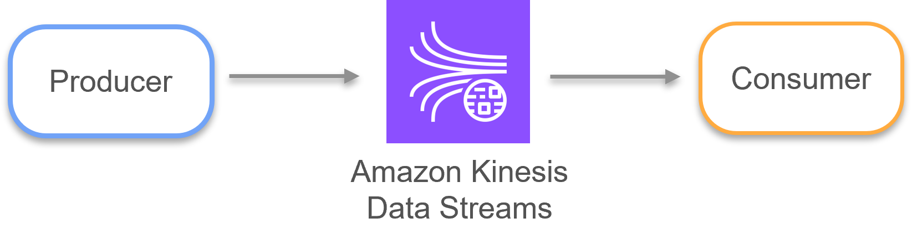
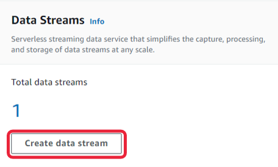
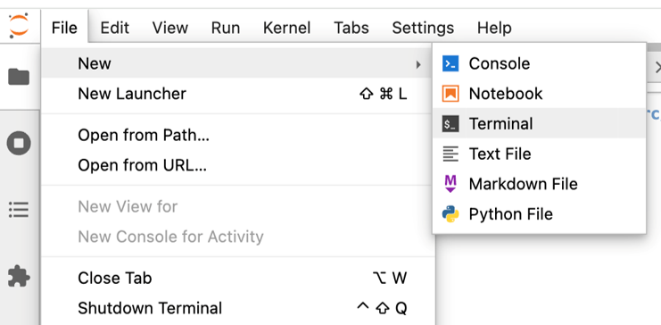
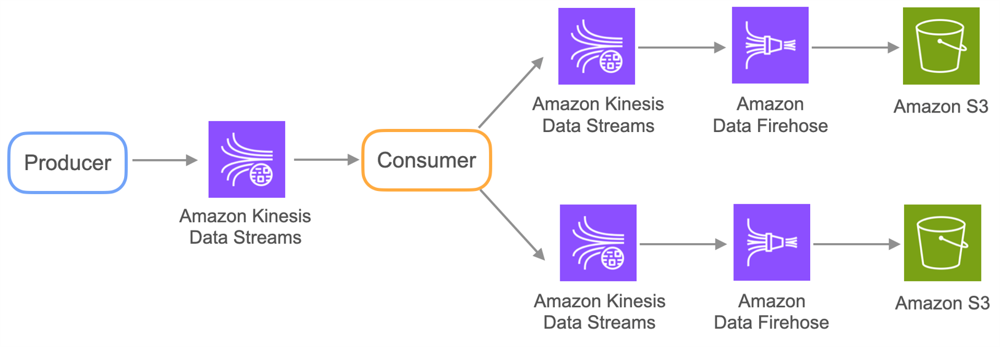
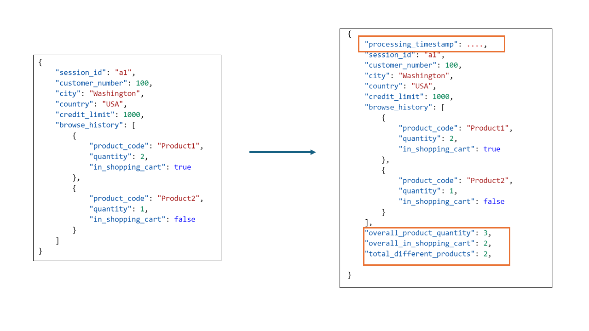

# Week 2 Lab: Streaming Ingestion

In this lab, you will interact with Amazon Kinesis Data Streams and gain a better understanding of how the streaming ingestion process is performed. The lab consists of two parts:
1. In the first part, you will work with a Kinesis Data Stream acting as a router between a simple producer and a simple consumer. Using the producer application, you will manually generate data and write it to the Kinesis Data Stream. After that, you will consume the generated data from that stream.
2. In the second part, you will perform a streaming ETL process: you will consume data from a Kinesis Data Stream that is fed by a producer. You will apply some simple transformations to this data, and then put the transformed data into one of two other data streams. From each of these two new data streams, data will be taken by a Kinesis Firehose and delivered to their respective S3 buckets.

If you get stuck on any of the lab steps, you can check the solution notebook *C2_W2_Lab_1_Streaming_Ingestion_Solution.ipynb* and script *src/etl/consumer_Solution.py* that you can download by running the following command in your Cloud9 environment: 

```bash
aws s3 cp --recursive s3://dlai-data-engineering/labs/c2w2lab1-409527-solution/ ./
```

Let's start with the lab.

# Table of Contents
- [Introduction](#0)
- [ 1 - Understanding the Components of an Event-Streaming Platform](#1)
- [ 2 - Implementing a Streaming ETL Process](#2)
  - [ 2.1 - Creating the Infrastructure for the Streaming ETL Process](#2.1)
  - [ 2.2 - Implementing the Streaming ETL](#2.2)

## Introduction to Lab

In the lab of Week 4 of Course 1, you interacted with a Kinesis Data Stream that streams online user activities as events or records. You then processed these records to compute the product recommendations and used a Data Firehose instance to deliver the records to an S3 bucket in your pipeline. In that lab, we did not show you how you can stream the recommendations back to the web. So in the second part of this lab, you will again interact with the same Kinesis Data Stream as your source system, ingest from it the online user activity, perform some computations on this data and finally create your own Kinesis Data Streams to continue streaming the transformed data inside your data pipeline. In this lab, to keep the transformation step simple, you will not compute the product recommendations from the ingested data, you will instead apply some simple transformations to the ingested data. But before you perform those steps (second part of the lab), you will first go through the first part of the lab to gain a better understanding of the components of a streaming platform.  

<a name='1'></a>
## 1 - Understanding the Components of an Event-Streaming Platform

An event-driven architecture consists of a producer, a router (buffer/message broker) and a consumer. In this first part of the lab, you will work with these three components:

<div style="text-align:center"></div>

- router: you will create a Kinesis Data Stream that will act as a router between a producer and a consumer;
- producer: in the folder `src/cli`, you can find the Python script: `producer_from_cli.py`. This script contains code that writes one record to a Kinesis Data Stream. You will call this script from a command line interface (CLI) and pass in two arguments: the name of the Kinesis Data Stream and a JSON string representing the message record.
- consumer: in the same folder `src/cli`, you can find the Python script: `consumer_from_cli.py` which you will also call from the command line interface (CLI). It takes in one argument which is the name of the Kinesis Data Stream from which the consumer will read the message records.

1.1. To create a Kinesis Data Stream, go to the AWS Console, search for **Kinesis**, and click on **Create data stream**. Name it `de-c2w2lab1-kinesis-data-stream-cli` and leave the rest as default. Click on **Create data stream** button. Once it is in `Active` status you can continue with the next steps.



1.2. You need to activate the Jupyterlab environment for the `boto3` package. To do this, run the following command in either AWS Cloud9 or Jupyter Notebook terminal:

```bash
source jupyterlab-venv/bin/activate
```
*Note*: To open the Jupyter Notebook terminal, click on File -> New -> Terminal



1.3. In the same terminal, run the following commands to navigate to the folder `src/cli` and execute the Python script `consumer_from_cli.py`. The consumer script expects one argument (the name of the data stream) which is specified using the `--stream` flag followed by the data stream name:

```bash
cd src/cli/
python consumer_from_cli.py --stream de-c2w2lab1-kinesis-data-stream-cli
```

The consumer will start iterating through all the shards of the data stream, reading all the records from each shard and printing some information about each record in the terminal. However, nothing will now appear even if you wait for 1 or 2 minutes. This is because you are consuming from a data stream that is currently empty. Let's now send some records to the data stream. Do not exit this terminal, keep the consumer script running, and create a second terminal for the next step.


1.4. In the second terminal, run the following commands to activate the `jupyterlab-venv`, navigate to the folder `src/cli/` and execute the python script `producer_from_cli.py`. The producer script expects two arguments: the data stream name which you can specify using the `--stream` flag, and the JSON string representing the message record which is specified using the `--json_string` flag.  To check the structure of the expected record, you can see an example of a JSON string in `data/example_record.json` (the same example is used in the provided command below). You will refer to this JSON structure as the payload's structure.

```bash
source jupyterlab-venv/bin/activate
cd src/cli/
python producer_from_cli.py --stream de-c2w2lab1-kinesis-data-stream-cli --json_string '{"session_id": "a1", "customer_number": 100, "city": "Washington", "country": "USA", "credit_limit": 1000, "browse_history": [ {"product_code": "Product1", "quantity": 2, "in_shopping_cart": true}, {"product_code": "Product2", "quantity": 1, "in_shopping_cart": false}]}'
```

Now, if you go to the first terminal (the one executing the consumer script), you should see that the consumer has read the record that you just sent to the data stream. Great! The consumer is ingesting streaming data!

1.5. From the second terminal running the producer script, try now to send 4 or 5 more records to the data stream using the same structure for the `--json_string` as shown in step 1.4. Change the payload attributes to make sure you are sending different records. Remember to check the consumed records in the consumer terminal.

Once you finish experimenting with the kinesis data stream, you can stop the process that is running in the consumer terminal by typing `CTRL+C` or `CMD+C`.

<a name='2'></a>
## 2 - Implementing a Streaming ETL Process

<a name='2.1'></a>
### 2.1 - Creating the Infrastructure for the Streaming ETL Process

**Introduction**

Now that you have an understanding of the components of an event-streaming platform, let's get back to our original e-commerce scenario. You are provided with a Kinesis Data Stream which is now your source system (assume it was set up by the software engineer). The producer that feeds into the data stream is also provided to you, and you are on the consumer side. You will need to ingest data from the data stream, perform a simple transformation on the ingested data and then send the transformed data to one of two Kinesis Data Streams. For you to explore the results, each of those data streams will then be delivered through a Kinesis Firehose to their respective S3 bucket.

<div style="text-align:center"></div>

You will start with creating the necessary resources using `boto3` (Two Kinesis Data Streams, two Kinesis Firehose instances, and two S3 buckets). Let's first understand why you need to create more than one data streams inside your data pipeline.

**Creating the Infrastructure**

Assume you were asked to filter the customers based on their countries. This is because your company noticed that customers showed different purchase behaviors based on their countries. So if they are located in the USA, their online activities need to be processed by a certain recommendation engine. Otherwise, their online activities need to be processed by another recommendation engine. To do so, you need to send the records of USA customers to a different data stream from those of other countries, and then you need to send data from each data stream to a different bucket to be processed differently by downstream users. This means that you have to create a Kinesis Data Stream, a Kinesis Firehose, and an S3 bucket for USA customers. And then the same set of resources for International customers.

How would you know the location of customers? The data that you will ingest corresponds to the users' browsing history on the e-commerce web page. This is the same data you worked with in the lab of Week 4 of Course 1 (the same structure you produced manually in the first part of this lab) and it contains the city and country of each customer: 

```json
{
    "session_id": "a1",
    "customer_number": 100,
    "city": "Washington",
    "country": "USA",
    "credit_limit": 1000,
    "browse_history": [
        {
            "product_code": "Product1",
            "quantity": 2,
            "in_shopping_cart": true
        },
        {
            "product_code": "Product2",
            "quantity": 1,
            "in_shopping_cart": false
        }
    ]
}
```

Follow the instructions to create the necessary resources according to the business requirements.

2.1.1. Let's first define two variables that you will use during the creation process. Go to the AWS console and click on the upper right part, where your username appears. Copy the **Account ID**. In the code below, set the variable `ACCOUNT_ID` to your account ID by replacing `<AWS-ACCOUNT-ID>` placeholder with the Account ID that you copied. Regarding the region, you will work with `us-east-1` as the default region as pointed out in the second variable. 


```python
ACCOUNT_ID = '<AWS-ACCOUNT-ID>'
AWS_DEFAULT_REGION = 'us-east-1'
```

2.1.2. Now you want to create the two buckets which follow this naming convention:
- USA: `de-c2w2lab1-<ACCOUNT-ID>-usa`
- International: `de-c2w2lab1-<ACCOUNT-ID>-international`

To create the two buckets, you will use the function `create_s3_bucket()` provided in the next cell, which uses `boto3` capabilities. Call the function twice to create the USA and international buckets. Make sure to set the two bucket_name parameters to the values of the USA_BUCKET and INTERNATIONAL_BUCKET variables, and to use `AWS_DEFAULT_REGION` in both cases.


```python
import boto3

USA_BUCKET = f'de-c2w2lab1-{ACCOUNT_ID}-usa'
INTERNATIONAL_BUCKET = f'de-c2w2lab1-{ACCOUNT_ID}-int'


def create_s3_bucket(bucket_name: str, region: str) -> None:
   # Call the boto3 client with the `'s3'` resource and region. 
    s3_client = boto3.client('s3', region_name=region)
    
    # Create the S3 bucket
    try:
        s3_client.create_bucket(Bucket=bucket_name)
        print(f"S3 bucket '{bucket_name}' created successfully in region '{region}'.")
    except Exception as e:
        print(f"An error occurred: {e}")

### START CODE HERE ### (~ 2 lines of code)
# Create the USA bucket
create_s3_bucket(bucket_name=USA_BUCKET, region=AWS_DEFAULT_REGION) # @REPLACE None(bucket_name=None, region=None)
    
# Create the international bucket
create_s3_bucket(bucket_name=INTERNATIONAL_BUCKET, region=AWS_DEFAULT_REGION) # @REPLACE None(bucket_name=None, region=None)
### END CODE HERE ###'
```

2.1.3. Remember from Week 1 that you can use the `aws` command to check if the buckets exist.


```python
!aws s3 ls
```

2.1.4. Now, let's create the two Kinesis Data Streams. To do so, you will use the function `create_kinesis_data_stream()` provided in the following cell. Call it to create the USA and International data streams. Both of them should have a shard count of 2, meaning 2 partitions per stream, and should be named with the following convention:
   - USA: `de-c2w2lab1-usa-data-stream`
   - International: `de-c2w2lab1-international-data-stream`


```python
USA_DATA_STREAM = 'de-c2w2lab1-usa-data-stream'
INTERNATIONAL_DATA_STREAM = 'de-c2w2lab1-international-data-stream'

def create_kinesis_data_stream(stream_name: str, shard_count: int = 2) -> None:
    # Call the boto3 client with the `kinesis` resource.  Store the object in `client`.
    client = boto3.client("kinesis")

    # Check if the stream already exists
    if stream_name in client.list_streams()["StreamNames"]:
        print(f"Kinesis data stream {stream_name} already exists")
        return
    
    # Use the `create_stream()` method from the client and pass the data stream name and the shard count.
    response = client.create_stream(StreamName=stream_name, ShardCount=shard_count)
    print("Kinesis data stream created:", response)

### START CODE HERE ### (~ 2 lines of code)
# Create the USA data stream
create_kinesis_data_stream(stream_name=USA_DATA_STREAM, shard_count=2) # @REPLACE None(stream_name=None, shard_count=None)

# Create the International data stream
create_kinesis_data_stream(stream_name=INTERNATIONAL_DATA_STREAM, shard_count=2) # @REPLACE None(stream_name=None, shard_count=None)
### END CODE HERE ###
```

Using `boto3`, you can also check the status of the resources. Use the provided function `is_stream_ready()` to see if your data streams are ready to be used.

*Note*: If you get `false` in the output here, wait for a few seconds and try to re-run the cell again.


```python
def is_stream_ready(stream_name: str) -> None:
    client = boto3.client("kinesis")
    response = client.describe_stream(StreamName=stream_name)
    return response["StreamDescription"]["StreamStatus"] == "ACTIVE"

# Check if the streams are ready
print(is_stream_ready(stream_name=USA_DATA_STREAM))
print(is_stream_ready(stream_name=INTERNATIONAL_DATA_STREAM))
```

2.1.5. You will finally create the two Kinesis Firehose instances for the two locations, `usa` and `international`. To do so, you will call the following function: `create_kinesis_firehose()` that is provided in the next cell. This function makes use of the `boto3` client method [create_delivery_stream()](https://boto3.amazonaws.com/v1/documentation/api/latest/reference/services/firehose/client/create_delivery_stream.html). If you check the arguments passed into this method, you will notice that the source and destination for the Kinesis Firehose are configured (source: Kinesis Data Stream and destination: S3 bucket). Once these resources are configured, Kinesis Firehose will be able to automatically read from the Kinesis Data Stream and automatically write to the S3 bucket. The role name passed into the configuration of the source and destination, represents the role that will be attached to the Kinesis Firehose to allow it to read from a Kinesis Data Stream and write to an S3 bucket (note that `arn` means Amazon resource name and it is used to uniquely identify AWS resources, you can learn more about it [here](https://docs.aws.amazon.com/IAM/latest/UserGuide/reference-arns.html#arn-syntax-kinesis-streams)). 

In the following cell, you will need to call the function `create_kinesis_firehose()` twice for the `usa` and `international` cases. You need to update the `stream_name` and `bucket_name` parameters to the respective values for USA and international in each of the function calls. The function takes in other arguments that are provided to you such as log groups, log streams, and the name of the role that will be attached to Kinesis Firehose:

- Firehose IAM role: `de-c2w2lab1-firehose-role` (Same role name for both locations, which allows the firehose instance to read from a Kinesis Data Stream and write to an S3 bucket).
- CloudWatch Log Groups: `de-c2w2lab1-firehose-<LOCATION>-log-group`.
- CloudWatch Log Streams: `de-c2w2lab1-<LOCATION>-firehose-log-stream`.

For the last two bullet points, the `<LOCATION>` placeholder will be replaced with `usa` or `international` when passing them to the `create_kinesis_firehose()` function.


```python
def create_kinesis_firehose( firehose_name: str, stream_name: str, bucket_name: str, role_name: str, log_group: str, log_stream:str, account_id: int, region: str):
    # Call the boto3 client with the firehose resource. Assign it to the client variable.
    client = boto3.client("firehose")

    # Check if firehose stream already exists
    if firehose_name in client.list_delivery_streams()["DeliveryStreamNames"]:
        print(f"Kinesis firehose stream {firehose_name} already exists.")
        return
    
    # Use the create_delivery_stream() method of the client object.
    response = client.create_delivery_stream(
        # Pass the firehose name.
        DeliveryStreamName=firehose_name,
        # Specify that the delivery stream uses a Kinesis data stream as a source.
        DeliveryStreamType='KinesisStreamAsSource',
        # Configure the S3 as the destination.
        S3DestinationConfiguration={
            "RoleARN": f"arn:aws:iam::{account_id}:role/{role_name}",
            "BucketARN": f"arn:aws:s3:::{bucket_name}",
            "Prefix": "firehose/",
            "ErrorOutputPrefix": "errors/",
            "BufferingHints": {"SizeInMBs": 1, "IntervalInSeconds": 60},
            "CompressionFormat": "UNCOMPRESSED",  
            "CloudWatchLoggingOptions": {
                "Enabled": True,
                "LogGroupName": log_group, 
                "LogStreamName": log_stream
            },
            "EncryptionConfiguration": {"NoEncryptionConfig": "NoEncryption"},
        },
        # Configure the Kinesis Stream as the Source.
        KinesisStreamSourceConfiguration={
            "KinesisStreamARN": f"arn:aws:kinesis:{region}:{account_id}:stream/{stream_name}",
            "RoleARN": f"arn:aws:iam::{account_id}:role/{role_name}",
        },
    )
    
    print("Kinesis Firehose created:", response)

### START CODE HERE ### (~ 18 lines of code)
# Create the delivery stream for USA orders.
create_kinesis_firehose(firehose_name='de-c2w2lab1-firehose-usa', # @KEEP
                        
                        stream_name=USA_DATA_STREAM, # @REPLACE stream_name=None,
                        bucket_name=USA_BUCKET, # @REPLACE bucket_name=None,
                        role_name='de-c2w2lab1-firehose-role', # @KEEP
                        
                        log_group='de-c2w2lab1-firehose-usa-log-group', # @KEEP
                        
                        log_stream='de-c2w2lab1-usa-firehose-log-stream', # @KEEP
                        
                        account_id=ACCOUNT_ID, # @KEEP
                        
                        region=AWS_DEFAULT_REGION # @KEEP
                        
                       )

# Create the delivery stream for International orders.
create_kinesis_firehose(firehose_name='de-c2w2lab1-firehose-international', # @KEEP
                        
                        stream_name=INTERNATIONAL_DATA_STREAM, # @REPLACE stream_name=None,
                        bucket_name=INTERNATIONAL_BUCKET, # @REPLACE bucket_name=None,
                        role_name='de-c2w2lab1-firehose-role', # @KEEP
                        
                        log_group='de-c2w2lab1-firehose-international-log-group', # @KEEP
                        
                        log_stream='de-c2w2lab1-international-firehose-log-stream', # @KEEP
                        
                        account_id=ACCOUNT_ID, # @KEEP
                        
                        region=AWS_DEFAULT_REGION # @KEEP
                        
                       )
### END CODE HERE ###
```

<a name='2.2'></a>
### 2.2 - Implementing the Streaming ETL

Now that your resources are created, it is time for you to consume the data. For a better learning experience, the producer generates data dynamically with an average mean time between records of 10 seconds, so take that into account when you are consuming your data and want to visualize it. During this consumption, you will perform some simple transformations over the records before sending them to the new data streams created with `boto3`. The transformation will consist of adding 4 additional attributes as shown here, which will be explained in the next steps.



2.2.1. Go to the `src/etl` folder. Open the script called `consumer.py`. This file is similar to the one you used in the first part of the lab but has some additions. Search for the `poll_shards()` function. This is the place where data is read from the Kinesis Data Stream and also where you will perform some transformations on each record. 

2.2.2. Search for the loop `for record in records_response["Records"]`. The next line `user_session = json.loads(record["Data"].decode("utf-8"))` loads the record and converts it into a dictionary object `user_session` that you can modify. The code that is below this statement is where you need to work in the following steps.

2.2.3. The first transformation consists of adding the processing timestamp. Add a new attribute to the `user_session` dictionary: `"processing_timestamp"` and assign its value to the current timestamp. Use the `datetime` package for that purpose (`datetime.datetime.now()`).

2.2.4. You are also asked to add 3 metrics as attributes to the Python dictionary: the total number of products in the shopping cart, the overall product quantity and the number of different products in the browsing history. First, before the loop `for product in user_session["browse_history"]`, create two variables `overall_product_quantity` and `overall_in_shopping_cart`. Set them to 0. This loop goes through each of the elements of the browse history list. 

2.2.5. Count the total number of product quantities in the browse history. For that, you have to access the `"quantity"` key of each product and add it to the `overall_product_quantity` variable. Make sure to convert the value to an integer before adding it (use function `int()`). This value arrives as a string due to the decoding process performed when converting the record into a Python dictionary.

2.2.6. Count the number of products in the shopping cart. For that, create a condition over the `"in_shopping_cart"` key of each `product` to count only those that are in the shopping cart. Then, accumulate the `"quantity"` value in the `overall_in_shopping_cart` variable. Again, don't forget to convert the "quantity" value to an integer before adding it to the `overall_in_shopping_cart value`.

2.2.7. Outside the loop `for product in user_session["browse_history"]` add the computed values to the `user_session` dictionary: use the keys `"overall_product_quantity"` and `"overall_in_shopping_cart"` for that purpose. Also, create a new key `"total_different_products"` to which you will assign the number of the different products in the browsing history by computing the length of the user session's browse history list.

2.2.8. As the last step, you will create a filter to send the record to the USA or the International data stream. In the same `poll_shards()` function, you can see that it has `kinesis_dest_stream_names` as an input parameter, which is a dictionary with two keys:
 - `"USA"`: The value contains the name of the data stream where USA records will be placed.
 - `"International"`: The value contains the name of the data stream where International records will be placed.
    
In that function, just below where you were creating your metrics, you will find a call to the `kinesis.put_record()` method. To specify the `StreamName` parameter for this method, create an inline filter that evaluates the `"country"` key from the user_session dictionary and depending on the value, specifies the name of destination data stream using the `kinesis_dest_stream_names` dictionary.

*Note*: The function makes use of an [inline if-else statement](https://www.geeksforgeeks.org/different-ways-of-using-inline-if-in-python/#basic-inline-using-if-else):
```{python}
StreamName = kinesis_dest_stream_names["USA"] if None["None"] == "USA" else None["International"]
```
This syntax means: assign `kinesis_dest_stream_names["USA"]` to StreamName if the condition `None["None"] == "USA"` is true. Otherwise assign `None["International"]` to StreamName. Of course, in this exercise, you will need to replace `None` with the appropriate keywords.

Save changes in the `src/etl/consumer.py` file.

2.2.9. After those changes, in the Cloud9 or Jupyter terminal go to the `src/etl` folder and execute the consumer with the following command:

```bash
source jupyterlab-venv/bin/activate
cd src/etl
python consumer.py --source_stream de-c2w2lab1-kinesis-data-stream --dest_streams '{"USA": "de-c2w2lab1-usa-data-stream", "International": "de-c2w2lab1-international-data-stream"}'
```

By running this command, the producer will send records to the Kinesis Data Stream. This consumer script will read those records, transform them and then send them to the appropriate Kinesis streams. The Kinesis Firehose will finally automatically deliver the data to the S3 buckets. 

*Note*: This command will run continuously, so as long as you don't exit the terminal, records will continue to be streamed.

2.2.10. To check the usa or the international destination stream, use another Cloud9 or Jupyter notebook terminal, activate the `jupyterlab-venv` environment, and use the consumer of the first part of the lab located at `src/cli/consumer_from_cli.py` to read from either the USA or International data stream to inspect visually your transformed data.

```bash
source jupyterlab-venv/bin/activate
cd src/cli/
python consumer_from_cli.py --stream de-c2w2lab1-usa-data-stream

```
Finally, you can inspect from the AWS console each of the S3 buckets to see when the data was saved. This process can take around 5-7 minutes to start seeing any file in the S3 bucket after the transformations are sent to the data streams. 

**Congratulations on completing this lab!** You now have experience with streaming ingestion using Kinesis Data Streams.


