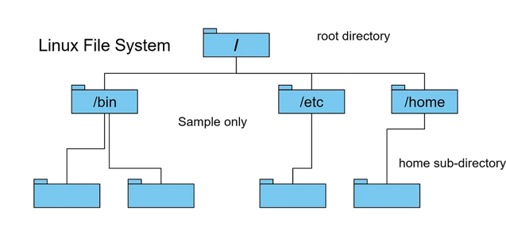
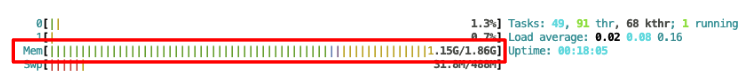
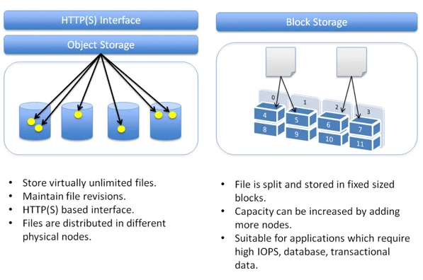

# Week 1 Lab: Comparing Cloud Data Storage Options

In this lab, you will explore the advantages and drawbacks of various storage options in the Cloud: object, file, memory, and block storage. These considerations are vital for Data Engineers to make informed decisions tailored to their project needs, optimizing performance, scalability, and cost-effectiveness.

*Note*: Object storage (Amazon S3) was covered in Course 2 Week 1 Lab 3 "Introduction to Object Storage - Amazon S3". You may want to review its content, however, that's not compulsory to understand the material of this lab.

If you get stuck with completing the code in the exercises, you can download the 
solution file C3_W1_Lab_1_Storage_Types_Solution.ipynb` by running the following command 
in your Cloud9 environment
```bash
aws s3 cp --recursive s3://dlai-data-engineering/labs/c3w1lab1-198543-solution/ ./
```

# Table of Contents

- [ 1 - Object Storage](#1)
  - [ 1.1 - Configure S3 Bucket and Upload Data](#1.1)
    - [ Exercise 1](#ex01)
    - [ Exercise 2](#ex02)
    - [ Exercise 3](#ex03)
  - [ 1.2 - Modify and Reupload Data](#1.2)
    - [ Exercise 4](#ex04)
    - [ Exercise 5](#ex05)
    - [ Exercise 6](#ex06)
    - [ Exercise 7](#ex07)
    - [ Exercise 8](#ex08)
- [ 2 - File Storage](#2)
  - [ 2.1 - Key Components of File Storage System](#2.1)
  - [ 2.2 - Features of File Storage System](#2.2)
- [ 3 - Memory Storage](#3)
  - [ 3.1 - Caching and Volatility](#3.1)
  - [ 3.2 - Memory Storage Capacity](#3.2)
- [ 4 - Block Storage](#4)

First, let's import the required packages.


```python
import os
import gc
import boto3
import botocore
import timeit
import pandas as pd

from cache_pandas import timed_lru_cache
from botocore.errorfactory import ClientError
from src.block_storage_client import BlockStorageClient
from io import StringIO
from typing import Any, Dict
```

<a name='1'></a>
## 1 - Object Storage

**Object storage systems** are a type of data storage architecture that stores data as objects rather than in a traditional file hierarchy.

In object storage systems, data is stored as discrete units called **objects**. Each object consists of the actual data (payload or content) along with metadata attributes that describe the object. Metadata typically includes information such as object name, unique identifier (key), size, content type, creation/modification timestamps, and custom user-defined metadata.

Unlike file storage systems, object storage systems do not use a hierarchical directory structure. Instead, objects are stored in a flat namespace, identified by unique keys or identifiers. This flat architecture allows for easier scalability and distribution of data across multiple storage nodes. Object storage contains immutable objects of various sizes and types. Unlike files on a local disk, objects cannot be modified in place.

Between other features of object storage systems you can find:

- Durability and Redundancy: Object storage systems typically employ data redundancy and replication techniques to ensure data durability and availability. Objects are often replicated across multiple storage nodes or data centers to protect against hardware failures, data corruption, and other types of data loss.

- Access Methods: Objects are accessed using standardized application programming interfaces (APIs) such as Amazon S3 (Simple Storage Service) API. These APIs provide a set of operations for storing, retrieving, updating, and deleting objects, as well as managing object metadata and access control.

- Data Access Patterns: Object storage systems are well-suited for storing unstructured data and large volumes of data, such as multimedia files, backups, archives, log files, and data lakes. They are commonly used in cloud storage services, content delivery networks (CDNs), and big data analytics platforms.


<a name='1.1'></a>
### 1.1 - Configure S3 Bucket and Upload Data

For the Object Storage system part, you will use the file that is locally stored at `./data/employees.csv`. You will upload the file to an S3 Bucket, which is the Object Storage Service available in AWS and you will work with the versioning of the file. 

First, you need to set some Python constants for the data bucket. To do so, go to the AWS console and click on the upper right part, where your username appears. Copy the **Account ID**. In the code below, set the variable `BUCKET_NAME` to your account ID by replacing `<AWS-ACCOUNT-ID>` placeholder with the Account ID that you copied. Regarding the region, you will work with `us-east-1` as the default region as pointed out in the following variable. The Account ID should contain only numbers without hyphens between them (e.g. 123412341234, not 1234-1234-1234).


```python
BUCKET_NAME = 'de-c3w1lab1-<AWS-ACCOUNT-ID>-us-east-1-data-bucket'
AWS_DEFAULT_REGION = 'us-east-1'
```

Enable versioning in your S3 bucket by running the `configure_bucket_versioning()` function:


```python
def configure_bucket_versioning(bucket_name: str, versioning_config: Dict[str, str]) -> Dict[Any, Any]:
    s3_client = boto3.client('s3')

    response = s3_client.put_bucket_versioning(
        Bucket=bucket_name,
        VersioningConfiguration=versioning_config
    )

    return response

versioning_config = {'Status': 'Enabled'}

response = configure_bucket_versioning(bucket_name=BUCKET_NAME, 
                                       versioning_config=versioning_config)
print(response)
```

Now use the following AWS CLI command to check that your bucket has the versioning feature enabled. You can run it in the following cell or in the Cloud9/Jupyter terminal.


```python
!aws s3api get-bucket-versioning --bucket $BUCKET_NAME
```

Before uploading any files, remember that you can use the AWS CLI tool to check the content of your bucket (it is empty at the moment).


```python
!aws s3 ls $BUCKET_NAME
```

<a name='ex01'></a>
### Exercise 1

In the following cell, complete the function `upload_file_to_s3` to upload a file from your local file system storage to the S3 object storage.

1. Create a `boto3` client for S3 (recall from previous labs that you can do this by calling the `boto3.client()` method with `'s3'` as the parameter).
2. Use the `upload_file()` method of your S3 client and pass the Filename, Bucket and Key parameters according to the function blueprint. You can always check the [documentation](https://boto3.amazonaws.com/v1/documentation/api/latest/reference/services/s3/client/upload_file.html) for more information about those parameters.


```python
def upload_file_to_s3(local_file_path: str, bucket_name: str, s3_key: str) -> None:
    """Uploads a local file to S3 using boto3

    Args:
        local_file_path (str): Local file path
        BUCKET_NAME (str): Bucket name
        s3_key (str): Key (Path) in S3 to save the file
    """

    ### START CODE HERE ### (~ 3 lines of code)
    # Create an S3 client
    s3_client = boto3.client('s3') # @REPLACE EQUALS None.None('None')
    
    try: # @KEEP
        
        # Upload the file to S3
        s3_client.upload_file(Filename=local_file_path, Bucket=bucket_name, Key=s3_key) # @REPLACE s3_client.None(Filename=None, Bucket=None, Key=None)
        
        ### END CODE HERE ###
        
        print(f"File at {local_file_path} has been uploaded to s3://{bucket_name}/{s3_key} successfully.")
    except Exception as err:
        print(f"Error uploading file to S3: {err}")

```

<a name='ex02'></a>
### Exercise 2

Upload the local file at `./data/employees.csv` into the bucket you created earlier with the following S3 key: `data/csv/employees.csv`. Pass the corresponding parameters to the function `upload_file_to_s3()`. Once uploaded, you should get a message telling you that the file was uploaded successfully.


```python
### START CODE HERE ### (~ 3 lines of code)

# Define the local file path, and S3 key
local_file_path = './data/employees.csv' # @REPLACE EQUALS 'None'
s3_key = 'data/csv/employees.csv' # @REPLACE EQUALS 'None'

# Upload the file to S3
upload_file_to_s3(local_file_path=local_file_path, bucket_name=BUCKET_NAME, s3_key=s3_key) # @REPLACE None(local_file_path=None, bucket_name=None, s3_key=None)
### END CODE HERE ###
```

Now that the file has been uploaded, you can check if a particular key exists. Remember that in an Object storage system, every object has an associated unique key that acts as the unique identifier for that object. This key may resemble the directory and subdirectory hierarchy that you are used to seeing, but those folders and subfolders do not actually exist. To check if a particular key exists, you'll create the `key_exists_in_s3()` function that makes usa of the [`head_object` method](https://boto3.amazonaws.com/v1/documentation/api/latest/reference/services/s3/client/head_object.html) from the boto3 client; this method allows you to retrieve the object metadata based on the object's key without returning the complete object. If the key exists (i.e., there is an object related to that key) you will be able to see the associated metadata; if the key cannot be found, that means that there is no object associated with that key and an error will be returned.

<a name='ex03'></a>
### Exercise 3

1. Create again a `boto3` client for S3.
2. Check the existence of the file with the `head_object()` method passing it the Bucket name and Key parameters.
3. Return the `response` variable.

You should receive a message telling you that the object with the key you inputted exists.


```python
def key_exists_in_s3(bucket_name: str, s3_key: str) -> Dict[Any, Any]:
    """Checks if an specific key exists in an S3 bucket

    Args:        
        BUCKET_NAME (str): Bucket name
        s3_key (str): Key (Path) in S3 to save the file
    """
    
    ### START CODE HERE ### (~ 5 lines of code)
    
    # Create an S3 client
    s3_client = boto3.client('s3') # @REPLACE EQUALS None.None('None')
     
    try: # @KEEP
        
        # Use `head_object()` method passing Bucket name and Key parameters.
        response = s3_client.head_object(Bucket=bucket_name, Key=s3_key) # @REPLACE EQUALS s3_client.None(Bucket=None, Key=None)
        print(f"File at s3://{bucket_name}/{s3_key} exists!") # @KEEP
        
        return response # @REPLACE return None
        
        ### END CODE HERE ###
        
    except botocore.exceptions.ClientError as err:
        print(f"Error message: {err}")
        
        if err.response['Error']['Message'] == 'Not Found':
            print(f"The key {s3_key} does not exist.")                        
            return err.response

s3_key_to_check = 'data/csv/employees.csv'

response = key_exists_in_s3(bucket_name=BUCKET_NAME, s3_key=s3_key_to_check)
```

Check the response and you will see a key named `'VersionId'` with an identifier of the current version of the Object you just queried, alongside other information about the size of the object and the date of modification.


```python
response
```

You were searching for the complete key of the file and were able to retrieve the metadata of an existing object. Let's try to see if the object `data/csv` exists. You may think that this is a file path with subfolders (as you are used to using when working with file systems, as we will check later), but in Object storage, all objects are stored at the same level and the Key is only a unique identifier for each object. Run the following cells, you are expected to find errors:


```python
s3_key_to_check_incorrect = 'data/csv'

response_failed = key_exists_in_s3(bucket_name=BUCKET_NAME, s3_key=s3_key_to_check_incorrect)
```


```python
response_failed
```

<a name='1.2'></a>
### 1.2 - Modify and Reupload Data

Now, let's read the file you just uploaded, perform some modifications to it, and re-upload the modified file. 

<a name='ex04'></a>
### Exercise 4

Complete the `read_csv_from_s3` function to read a CSV file directly from your S3 bucket. 

1. Create the `boto3` client for S3.
2. Call the `get_object()` method of the client and pass the bucket name and object key.
3. Use the `read()` method of the `response['Body']` object and then chain the `decode('utf-8')` method. The `read()` method reads the raw bytes of the file stored in the S3 object's body. When you retrieve an object from S3 using `get_object()`, it returns a response object that contains the file's contents in its body. The `decode('utf-8')` method converts the raw bytes into a UTF-8 encoded string. This step is necessary because the `read()` method returns the file's content as bytes, and to work with text data (such as a CSV file), you need to decode these bytes into a string using an appropriate character encoding, which is UTF-8 in this case.
4. Use `pd.read_csv()` to read the object at `csv_content`. This `csv_content` object should be enclosed first by the `StringIO` class. The `StringIO` class from the `io` module allows you to treat a string as a file-like object. `StringIO(csv_content)` creates a file-like object from the CSV content string decoded in the previous step. The `pd.read_csv()` function from pandas expects a file-like object (such as a file handle or a `StringIO` object) as input, so using `StringIO` allows you to pass the CSV content directly to `read_csv()`.


```python
def read_csv_from_s3(bucket_name: str, s3_key: str) -> pd.DataFrame:
    """Reads csv file stored in an S3 bucket

    Args:        
        BUCKET_NAME (str): Bucket name
        s3_key (str): Key (Path) in S3 of the file
    """

    ### START CODE HERE ### (~ 5 lines of code)
    
    # Create an S3 client
    s3_client = boto3.client('s3') # @REPLACE EQUALS None.None('None')

    try: # @KEEP

        
        # Get object from the bucket using `get_object()` method
        response = s3_client.get_object(Bucket=bucket_name, Key=s3_key) # @REPLACE EQUALS s3_client.None(Bucket=None, Key=None)

        # Read raw bytes from the S3 object, convert it to string, and save it into the `csv_content` variable
        csv_content = response['Body'].read().decode('utf-8') # @REPLACE EQUALS None['None'].None().None('None')

        # Use pandas `read_csv()` method to read the data into the dataframe
        df = pd.read_csv(StringIO(csv_content)) # @REPLACE EQUALS None.None(None(None))
        
        ### END CODE HERE ###
        return df
        
    except Exception as err:
        print(f"Error message: {err}") 
```

<a name='ex05'></a>
### Exercise 5

Use the `read_csv_from_s3()` function to read the object located in the bucket you previously created, with the S3 key `'data/csv/employees.csv'`. 


```python
### START CODE HERE ### (~ 2 lines of code)
csv_s3_key = 'data/csv/employees.csv' # @REPLACE EQUALS 'None'

df = read_csv_from_s3(bucket_name=BUCKET_NAME, s3_key=csv_s3_key) # @REPLACE EQUALS None(bucket_name=None, s3_key=None)
### END CODE HERE ###

df.head()
```

Explore the dataset with the `shape` attribute.


```python
df.shape
```

Check the content of the data for the `'Brooks Ltd'` company and select the employees with a Salary higher than 120,000. You will expect not more that a hundred rows that match that condition:


```python
df[(df['Company']=='Brooks Ltd') & (df['Salary']>120000)]
```

Let's suppose that for `'Brooks Ltd'` company the maximum salary that an employee can earn is 120,000. Then, modify the content of the dataframe according to that condition:


```python
df.loc[(df['Company']=='Brooks Ltd') & (df['Salary']>120000), 'Salary'] = 120000
```

Check the modification of the data:


```python
df[(df['Company']=='Brooks Ltd') & (df['Salary']==120000)]
```

Now, let's upload again the file pointing to the same S3 key. For that, you will use the `upload_pandas_to_s3` to convert the DataFrame object to CSV and then upload it again to the bucket.

You are already provided with a code snippet:

* `csv_buffer = StringIO()`: This line creates an in-memory buffer using the `StringIO` class from the `io` module. In this case, it creates an empty buffer where we'll write the CSV data.
* `df.to_csv(csv_buffer, index=False)`: This line writes the contents of the DataFrame `df` to the `csv_buffer` in CSV format. The `to_csv()` method of pandas DataFrame converts the DataFrame into a CSV-formatted string and writes it to the provided file-like object (csv_buffer in this case).

<a name='ex06'></a>
### Exercise 6

1. Create the `boto3` client to S3.
2. Call the [`put_object()` method](https://boto3.amazonaws.com/v1/documentation/api/latest/reference/services/s3/client/put_object.html) from your S3 client and pass the parameters Bucket, Key and Body. For the body, make sure to pass `csv_buffer.getvalue()`.  In this case, `Body` is set to the contents of the `csv_buffer` obtained using the `getvalue()` method. The `getvalue()` method retrieves the contents of the `csv_buffer` as a string, which is necessary because the `Body` parameter expects the object content as a binary string or bytes-like object.
3. Return the response to the client's call.


```python
def upload_pandas_to_s3(df: pd.DataFrame, bucket_name: str, s3_key: str) -> Dict[Any, Any]:
    """ Uploads a pandas dataframe as a csv file to an S3 bucket

    Args:        
        df: (pd.DataFrame): Pandas dataframe to store
        BUCKET_NAME (str): Bucket name
        s3_key (str): Key (Path) in S3 of the file
    """
    
    csv_buffer = StringIO()
    df.to_csv(csv_buffer, index=False)
    
    ### START CODE HERE ### (~ 4 lines of code)
    
    # Create an S3 client
    s3_client = boto3.client('s3') # @REPLACE EQUALS None.None('None')

    try: # @KEEP

        # Put object into the S3 bucket
        response = s3_client.put_object(Bucket=bucket_name, Key=s3_key, Body=csv_buffer.getvalue()) # @REPLACE EQUALS s3_client.None(Bucket=None, Key=None, Body=None.None())

        # Return the response
        return response # @REPLACE return None
        
        ### END CODE HERE ###
    
    except Exception as err:
        print(f"Error message: {err}")
        return err.response
```

<a name='ex07'></a>
### Exercise 7

Use function `upload_pandas_to_s3()` to upload the pandas dataframe `df` to the same Key used before. Check the response from your function.


```python
### START CODE HERE ### (~ 2 lines of code)
s3_key = 'data/csv/employees.csv' # @REPLACE EQUALS 'None'

response_upload_pandas = upload_pandas_to_s3(df=df, bucket_name=BUCKET_NAME, s3_key=s3_key) # @REPLACE EQUALS None(df=None, bucket_name=None, s3_key=None)
### END CODE HERE ###

response_upload_pandas
```

Given that you are uploading a different object to the same Key in S3, that means that you would be overwriting directly that object; but given that you have enabled the versioning in our object storage you are actually creating a new version of that object. Let's list the versions of the Objects which have a key that starts with `data/csv/employees.csv`:


```python
def list_object_versions(bucket_name: str, s3_key: str) -> None:
    """ List versions of S3 objects that start with a particular key

    Args:                
        BUCKET_NAME (str): Bucket name
        s3_key (str): Prefix of the Key (Path) in S3 of the object
    
    """
    
    # Create an S3 client
    s3_client = boto3.client('s3')

    # List object versions
    response = s3_client.list_object_versions(Bucket=bucket_name, Prefix=s3_key)

    # Process the response to get object versions
    for version in response.get('Versions', []):
        print("Object Key:", version['Key'])
        print("Object Version Id:", version['VersionId'])
        print("Is Latest:", version['IsLatest'])
        print("Last Modified:", version['LastModified'])
        print()

list_object_versions(bucket_name=BUCKET_NAME, s3_key=s3_key)
```

Now, let's append more data to the dataframe you have been working with. You can check that the data has been added to the `df` dataframe by inspecting its shape or by inspecting the last rows of it. Execute the following cell to do it.


```python
data = {
    'ID': [1000001, 1000002, 1000003, 1000004, 1000005],
    'Name': ['Kelly Murphy', 'Monica Fernandez', 'Andrew Lang', 'John Mccoy', 'Rachel Brown'],
    'Company': ['Brooks Ltd', 'Brooks Ltd', 'Brooks Ltd', 'Nichols-Webb', 'Nichols-Webb'],
    'Address': ['0344 Berger Camp\nAnthonybury, SC 57484', '12609 Curtis Place Apt. 977\nSimmonsmouth, TN', 'USCGC Johnson\nFPO AE 37537', 'PSC 7850, Box 1744\nAPO AA 32566', '09861 Jessica Drive\nSheamouth, KS 42050'],
    'City': ['South Kara', 'Johnsonmouth', 'Beckermouth', 'Millerton', 'West Kristenside'],
    'Email': ['kmurphy@example.com', 'mon.fer@example.net', 'andrew.lang@example.org', 'j.mccoy@example.com', 'ra.brown@example.com'],
    'Salary': [70000, 120000, 89000, 65000, 105000]
}

df_new = pd.DataFrame(data)

df_updated = pd.concat([df, df_new], ignore_index=True)

df_updated.shape
```


```python
df_updated.tail(10)
```

Upload the new `df_updated` with more rows to the S3 bucket, using the same key and check again the available versions:


```python
s3_key = 'data/csv/employees.csv'

response = upload_pandas_to_s3(df=df_updated, bucket_name=BUCKET_NAME, s3_key=s3_key)

list_object_versions(bucket_name=BUCKET_NAME, s3_key=s3_key)
```

You can see that there are now 3 different versions, each one identified by its ID and a Last-Modified date. With that example, you can see that if you modify or append data to an object stored in an Object Storage, you will have different versions of the same object, associated with the same object key. In the case that you want to retrieve an older version, you can do it by specifying the version ID you want to retrieve in the `get_object()` method of the `boto3` client that you used in the `read_csv_from_s3()` function. 

<a name='ex08'></a>
### Exercise 8

Complete the `read_csv_version_from_s3()` function to read a particular version of the object. Use the [`get_object()` method](https://boto3.amazonaws.com/v1/documentation/api/latest/reference/services/s3/client/get_object.html) of the `boto3` client with the Bucket, Key, and VersionId parameters.


```python
def read_csv_version_from_s3(bucket_name: str, s3_key: str, version_id: str) -> pd.DataFrame:
    """Reads a particular version of a csv file stored in an S3 bucket

    Args:        
        BUCKET_NAME (str): Bucket name
        s3_key (str): Key (Path) in S3 of the file
        version_id (str): Object's Version ID
    """
    # Create an S3 client    
    s3_client = boto3.client('s3')

    try:
        
        ### START CODE HERE ### (~ 1 line of code)
        response = s3_client.get_object(Bucket=bucket_name, Key=s3_key, VersionId=version_id) # @REPLACE EQUALS s3_client.None(Bucket=None, Key=None, VersionId=None)
        ### END CODE HERE ###
        
        csv_content = response['Body'].read().decode('utf-8')
        df = pd.read_csv(StringIO(csv_content))
                
        return df
        
    except Exception as err:
        print(f"Error message: {err}") 
```

Use the `read_csv_version_from_s3` function to read the first version of your object. Pass the S3 key and the Version ID, replacing the placeholder `<VERSION-ID>` with the object version ID for the first version of the object you obtained earlier. Inspect the dataframe and the number of rows of the read object to check that it is actually the first version of the object.


```python
s3_key = 'data/csv/employees.csv'
version_id = '<VERSION-ID>'

df_version_1 = read_csv_version_from_s3(bucket_name=BUCKET_NAME, s3_key=s3_key, version_id=version_id)
```


```python
df_version_1.shape
```


```python
df_version_1.describe()
```


```python
df_version_1[(df_version_1['Company']=='Brooks Ltd') & (df_version_1['Salary']>120000)]
```

With that, you have seen how Object Storage systems work, by using a Key and metadata to identify a particular object and by uploading a completely new version of the object if you perform any kind of modification or appending data to it.

<a name='2'></a>
## 2 - File Storage

A **File Storage System**, also known as a file system, is a method used by operating systems to manage and store data on storage devices such as hard disk drives (HDDs), solid-state drives (SSDs), and network-attached storage (NAS) devices. It provides a hierarchical structure for organizing files and directories, and it includes mechanisms for accessing, reading, writing, and modifying files.

<a name='2.1'></a>
### 2.1 - Key Components of File Storage System

Here are the key components of File Storage Systems

- File: A named collection of data stored on a storage device. Files can contain various types of data, such as text, documents, images, videos, and programs.

- Directory (or Folder): A container used to organize files into a hierarchical structure. Directories can contain files and other directories, allowing for the creation of a tree-like directory structure.

- File System Metadata: Information about files and directories stored by the file system, including attributes such as file name, size, type, permissions, creation/modification timestamps, and file location.

- File System Operations: Actions performed on files and directories, such as creating, reading, writing, deleting, renaming, moving, copying, and accessing files. These operations are typically performed using file system APIs or command-line utilities.

- File System Drivers: Software components responsible for interacting with storage devices and translating file system operations into low-level disk operations. These drivers enable the operating system to access and manipulate files stored on different types of storage media

In a File Storage System, the folder hierarchy organizes files and directories into a hierarchical structure, like a tree structure:



In the previous image you can see the tree-like structure for a Linux file system, where you can find these components:

- Root Directory: The root directory is at the top of the hierarchy, denoted by a forward slash ("/") in Unix-based systems or a drive letter (e.g., "C:") in Windows-based systems. The root directory contains all other directories and files.

- Directories (Folders): Directories, also known as folders, are containers used to organize files and other directories. They can contain files and subdirectories. Each directory has a unique name within its parent directory.

- Subdirectories: Subdirectories are directories contained within other directories. They can further organize files and directories into nested structures. A subdirectory's path consists of its name preceded by the paths of its parent directories, separated by slashes.

- Files: Files are objects that contain data, such as text, images, or programs. They are stored within directories and can have unique names within their parent directories.

- Path: A path is a string that specifies the location of a file or directory within the hierarchy. It consists of a sequence of directory names separated by slashes `/`. The path to a file or directory uniquely identifies its location within the folder hierarchy.

You could be more accustomed to using File Storage Systems as it is the default storage system in an Operating System. 

<a name='2.2'></a>
### 2.2 - Features of File Storage System

Let's see some of the features of File Storage System.

2.2.1.  In your Cloud9 or Jupyter terminal run the following command: 

```bash
ls -alh
```

This will show you several lines, but let's focus only on the one associated with the `data` directory, which should look similar to this:

```bash
...
drwxr-xr-x.  2 ec2-user ec2-user   27 Apr  3 23:11 data
...
```

There, you will see some metadata about this particular folder, such as the date of creation, the owner of the folder and the permissions. If you are not familiar with Unix-like systems, here is a brief explanation of this output:

- File Permissions (`-alh`): The first column shows the file permissions. It consists of ten characters and is divided into four parts:
    * The first character indicates the type of file (e.g., `-` for a regular file, `d` for a directory, `l` for a symbolic link).
    * The next three characters represent the owner's permissions: read (r), write (w), and execute (x), respectively. If a hyphen (-) appears, it means that that particular permission is not set.
    * The next three characters represent the group's permissions: read (r), write (w), and execute (x), respectively. If a hyphen (-) appears, it means that that particular permission is not set.
    * The final three characters represent others' permissions: read (r), write (w), and execute (x), respectively. If a hyphen (-) appears, it means that that particular permission is not set.

- Number of Links: The second column shows the number of hard links to the file or directory.

- Owner: The third column shows the owner of the file or directory.

- Group: The fourth column shows the group associated with the file or directory.

- File Size: The fifth column shows the size of the file or directory. The `-h` option of the command you just typed in the terminal makes the file sizes human-readable by using units like KB, MB, GB, etc., instead of just bytes.

- Modification Time: The sixth column shows the date and time when the file or directory was last modified.

- File/Directory Name: The final column shows the name of the file or directory.

Given that, in a File Storage System you can easily identify the hierarchy of directories/subdirectories vs regular files, which do not exist in Object Storage, as you saw in the previous section where you do not have directories/subdirectories but only a Key to identify each object. 

2.2.2. Check the content of the `data` folder:

```bash
cd data
ls -alh
```

You will see an output similar to this one:

```bash
drwxr-xr-x. 2 ec2-user ec2-user   27 Apr  3 23:11 .
drwxr-xr-x. 6 ec2-user ec2-user  110 Apr  3 23:11 ..
-rw-r--r--. 1 ec2-user ec2-user 124M Apr  3 23:13 employees.csv
-rw-r--r--. 1 ec2-user ec2-user  636 Apr  3 23:13 employees_sample.csv
```

You can see that the `employees.csv` and `employees_sample.csv` objects are just regular files as the first character of the first column is just a hyphen. You can also see that only the owner of the file can write it, while other users would only be able to read it. You can see that there is no metadata associated with a possible version of that file.

2.2.3. Now, let's freely modify the file `employees_sample.csv`. In Cloud9, open the file `./data/employees_sample.csv` file. Change any row value you like, and save the file (`Cmd + S` or `Ctrl + S`)..

2.2.4. In the terminal, write again the command: 

```bash
ls -alh
```

The output should be quite similar to the previous one that you obtained, only with a new value for the Modification Date column (and possible change of the file size). Again, there is no information about any version as the file is directly modified on the disk. 

2.2.5. Open the file in Cloud9 again and append the following new line at the end of the file, then save the file (`Cmd + S` or `Ctrl + S`):

```bash
6,Rachel Brown,Nichols-Webb,"09861 Jessica Drive\nSheamouth, KS 42050",West Kristenside,ra.brown@example.com,105000
```

The `ls -alh` command will show a change in the Modification Date and file size only.

2.2.6. Finally, in a File Storage System you can easily modify the permissions of any file. For example, if you want to avoid any user modifying the file, including the owner of the `employees_sample.csv` file you can use the following command:

```bash
chmod -w employees_sample.csv
```

2.2.7. Run the `ls` command again: 

```bash
ls -alh
```

The output will be similar to this one:

```bash
...
-r--r--r--. 1 ec2-user ec2-user  636 Apr  3 23:34 employees_sample.csv
```

Note the difference in the permissions. If you open the file and try to modify it, such as deleting the last row that you inserted, you will get an error when you try to save the file.

2.2.8. To make the file modifiable again, you can use the command: 

```bash
chmod +w employees_sample.csv
```

Check that you can edit the file now.

<a name='3'></a>
## 3 - Memory Storage

**Memory-based Storage Systems**, also known as in-memory databases or caching systems, store data primarily in RAM (Random Access Memory) instead of on disk. These systems are designed to provide fast and efficient access to data by keeping it in memory, which allows for much quicker read and write operations compared to traditional disk-based storage systems.

- Speed: Since data is stored in memory, which has much faster access times compared to disk storage, operations such as reads, writes, and queries can be performed very quickly. This makes memory-based systems ideal for applications that require low-latency access to data, such as real-time analytics, caching, and high-performance transaction processing.

- Caching: One common use case for memory-based storage systems is caching frequently accessed data to improve the performance of applications. By storing frequently accessed data in memory, applications can avoid repeatedly fetching data from slower disk-based storage systems, resulting in faster response times and reduced load on backend databases.

- Data Structures: Memory-based storage systems often use specialized data structures optimized for fast access and manipulation of data in memory. Examples include hash tables, trees, and linked lists. These data structures are designed to minimize the overhead of memory management and provide efficient access to stored data.

- Volatility: Unlike disk-based storage, which retains data even when the power is turned off, memory-based storage systems are volatile, meaning that data is lost when the system is powered down or restarted. To mitigate this, some memory-based systems offer mechanisms for persistence, such as periodic snapshots or replication to disk-based storage for durability.

- Scalability: Memory-based storage systems can often scale horizontally by adding more nodes to distribute the data across multiple servers. This allows them to handle large volumes of data and high request rates, making them suitable for use in distributed environments and cloud computing platforms.

- Use Cases: Memory-based storage systems are commonly used in various applications, including web servers, content delivery networks (CDNs), session stores, real-time analytics platforms, and high-frequency trading systems. Any application that requires fast access to data or benefits from caching frequently accessed data can benefit from using memory-based storage.

Overall, memory-based storage systems offer significant performance advantages over disk-based storage systems, making them well-suited for applications that demand low-latency access to data and high throughput. However, they may also have limitations in terms of data durability and storage capacity compared to disk-based alternatives, so their use should be carefully considered based on the specific requirements of the application.

Although in this lab you are not going to work directly with an in-memory database, the idea is to give you some insight into certain features of those systems.

<a name='3.1'></a>
### 3.1 - Caching and Volatility

As an example of the caching feature of memory storage, you will explore the `timed_lru_cache` decorator from the `cache-pandas` package. It allows you to store in memory the resulting dataframe from a function. You will compare the time it takes to read the `data/employees.csv` file the first time with the time it takes to read the same file after it is stored in memory. Here is a function `read_csv_to_memory` that uses the `timed_lru_cache` decorator. Run the following cell to see how long it takes to read the file the first time:


```python
@timed_lru_cache(seconds=100, maxsize=None)
def read_csv_to_memory(path: str) -> pd.DataFrame:
    """Read CSV function with a cache decorator."""
    return pd.read_csv(path)

start = timeit.default_timer()
df = read_csv_to_memory('data/employees.csv')
end = timeit.default_timer()
print(f'Elapsed time: {end - start} seconds')
```

Read the same file using the `read_csv_to_memory` function and store it into the `df_cache` dataframe. You'll notice that it's much quicker to read the file when it's stored in memory.


```python
start = timeit.default_timer()
df_cache = read_csv_to_memory('data/employees.csv')
end = timeit.default_timer()
print(f'Elapsed time: {end - start} seconds')
```

Wait two minutes, the cache should have cleared, then run the function again with the cell after the line. You'll notice that it takes longer to read the file again once memory from the cache has been cleared:


```python
start = timeit.default_timer()
df_after = read_csv_to_memory('data/employees.csv')
end = timeit.default_timer()
print(f'Elapsed time: {end - start} seconds')
```

<a name='3.2'></a>
### 3.2 - Memory Storage Capacity

When caching data in memory storage, you should monitor your memory storage capacity so that you don't exceed it. You can check how the memory usage changes using the terminal command `htop`.



As you continue with the next few steps to store new data in memory and clear memory from the cache, you can revisit this terminal to see how the memory usage changes. Press the `Q` key in the terminal to exit this view.

3.2.1. First, you are going to define a function to check on the available memory storage. 


```python
def get_memory_usage():
    """
    Get total memory and memory usage
    """
    with open('/proc/meminfo', 'r') as mem:
        ret = {}
        tmp = 0
        for i in mem:
            sline = i.split()
            if str(sline[0]) == 'MemTotal:':
                ret['total'] = int(sline[1])
            elif str(sline[0]) in ('MemFree:', 'Buffers:', 'Cached:'):
                tmp += int(sline[1])
        ret['free'] = tmp
        ret['used'] = int(ret['total']) - int(ret['free'])
        ret['percentage'] = int(ret['used'])/int(ret['total'])
    return ret

print(get_memory_usage())
```

3.2.2. Now delete the dataframes running the following cell:


```python
del df
del df_cache
del df_after
del df_new
del df_updated
del df_version_1
```

3.2.3. Check the memory usage again:


```python
print(get_memory_usage())
```

Understanding memory storage, its capacity, and how to optimize memory usage is critical for maximizing performance. Monitoring tools can provide insights into memory usage patterns, helping you identify memory-intensive processes or leaks. Optimization strategies include efficient memory management techniques, caching mechanisms and resource management. By implementing these strategies, you can improve overall pipeline performance, minimize resource wastage, and ensure a smooth computing experience.

<a name='4'></a>
## 4 - Block Storage

**Block storage** is a type of data storage method commonly used in computing systems, particularly in enterprise environments and cloud computing infrastructures. In block storage, data is stored in fixed-sized units called blocks, each with a unique identifier, which are typically managed by a storage area network (SAN) or server-based operating systems. Additionally, Hard Disk Drives (HDD) and Solid State Drives (SSD) that are attached to a computer physically or via a network are examples of block storage devices.

One of the key features of block storage is direct access to individual blocks of data. This means that applications can read from or write to specific blocks without having to access the entire file or dataset. This direct access enables faster data retrieval and manipulation, making block storage particularly suitable for applications that require high-performance storage and computing. Examples include databases, virtual machine storage, and enterprise storage systems.



While block storage offers high performance through direct data access, it introduces complexity in terms of deployment, management, and maintenance, often requiring specialized expertise and inciting higher expenses. Additionally, block storage lacks inherent awareness of file structures, necessitating additional overhead for data organization within applications or file systems.

To simulate a block storage system, you have a simplified block storage server in an EC2 instance. Using a Python class called `BlockStorageClient` you will be able to connect to the server and send and receive files. When you send a file, the file will be divided into similar size blocks and each one will be sent to the server. For this exercise, you will upload the files located in the `data` folder to the server and then check that they were uploaded.

3.1. In the AWS console go to **CloudFormation**. You will see two stacks deployed, one associated with your Cloud9 environment (name with prefix `aws-cloud9`) and another named with an alphanumeric ID. Click on the alphanumeric ID stack and navigate to the **Outputs** tab. Copy the value of the `BlockInstanceDNS` key (**without the colon and port at the end of it**). Replace the placeholder `<SERVER-IP>` in the following cell with the value you just copied to instantiate the `BlockStorageClient`.


```python
server_ip = '<SERVER-IP>'
server_port = 9090
client = BlockStorageClient(server_ip, server_port)
```

Run this cell just once to connect to the server. 

*Note*: If the connection is refused, go to the Cloud9 or Jupyter terminal and run the script to restart the server. Then try to connect again in a few minutes.

```bash
source scripts/restart_server.sh
```


```python
client.connect()
```

3.2. Upload the first file to the block storage server using the `send_file` function.


```python
client.send_file('data/employees.csv')
```

3.3. In the Cloud9 or Jupyter terminal, move to the `src/client_blocks` folder and list the files and folders. You'll see how the `data/employee.csv` file is divided into blocks of similar sizes.

```bach
cd src/client_blocks/employees
ls -alh
```

3.4. Upload the second file to the server


```python
client.send_file('data/employees_sample.csv')
```

3.5. You can list the files in the block storage server using the `list_files` function.


```python
file_list = client.list_files()
print(file_list)
```

3.6. Now, retrieve one of the files from the server, using the `receive_file` function. Then check that the file has been received in the `client_files` folder, along with the blocks in `client_blocks` folder.


```python
client.receive_file("employees.csv")
```

3.7. Finally, after you are done with the requests to the server, close the connection with the server:


```python
client.close()
```

This is just a simulation of using block storage over the network, there are enterprise-ready and cloud solutions that improve the speed and reliability of file transfer making it seem seamless to the users as they can connect from any operating system and use the solution as an external storage.

In conclusion, the choice between object, file, memory, and block storage hinges on weighing their respective advantages and disadvantages to best suit the needs of Data Engineering projects:

- Object storage shines with its scalability, cost-effectiveness, and simplicity, making it ideal for scenarios requiring vast amounts of unstructured data such as backups, archives, and content delivery networks.
- File storage offers ease of access and organization, making it suitable for shared file systems and applications reliant on hierarchical data structures like file servers.
- Memory storage, with its lightning-fast access speeds, is indispensable for real-time data processing and caching tasks, particularly in-memory databases and high-performance computing environments.
- Block storage, providing direct access to data blocks, excels in performance-critical applications such as databases, virtualization platforms, and enterprise storage systems.

Data Engineers must carefully assess the specific requirements of their projects to determine the most suitable storage solution, leveraging the unique strengths of each type to optimize performance, scalability, and cost efficiency.


