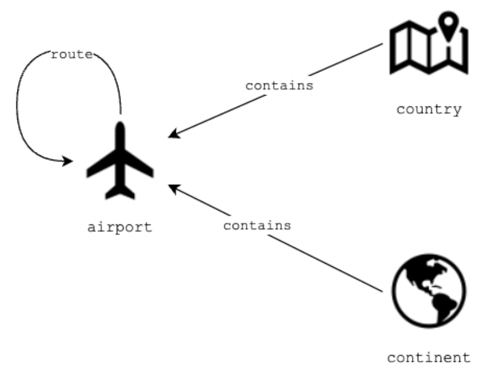

# Graph Databases and Vector Search with Neo4j

In this lab, you will use the Cypher query language to query highly connected data in the graph database Neo4j. Relationships between data entities can be just as important as the data itself, and graph databases are designed to answer questions about the relationships. You will also leverage the graph database to perform vector search: a method of information retrieval where data points are represented as vectors. One can perform a similarity search between data points by comparing their vector representations. 

# Table of Contents

- [ 1 - Introduction and Setup](#1)
  - [ 1.1 - Introduction](#1.1)
  - [ 1.2 - Development Environment](#1.2)
- [ 2 - Basic Operations with Graph Database](#2)
  - [ 2.1 - Introduction to Cypher](#2.1)
  - [ 2.2 - Getting Node Information with Match Statements](#2.2)
    - [ Exercise 1](#ex01)
    - [ Exercise 2](#ex02)
  - [ 2.3 - Exploring Relationships](#2.3)
    - [ Exercise 3](#ex03)
    - [ Exercise 4](#ex04)
  - [ 2.4 - Getting Properties](#2.4)
    - [ Exercise 5](#ex05)
    - [ Exercise 6](#ex06)
  - [ 2.5 - Filtering Statements](#2.5)
    - [ Exercise 7](#ex07)
  - [ 2.6 - Create Statements](#2.6)
    - [ Exercise 8](#ex08)
  - [ 2.7 - Update Operations](#2.7)
    - [ Exercise 9](#ex09)
    - [ Exercise 10](#ex10)
  - [ 2.8 - Delete Statements](#2.8)
    - [ Exercise 11](#ex11)
    - [ Exercise 12](#ex12)
    - [ Exercise 13](#ex13)
- [ 3 - Advanced Queries](#3)
  - [ Exercise 14](#ex14)
  - [ Exercise 15](#ex15)
  - [ Exercise 16](#ex16)
- [ 4 - Upload Files for Grading](#4)
- [ 5 - Vector Search](#5)
  - [ Exercise 17](#ex17)

<a name='1'></a>
## 1 - Introduction and Setup

<a name='1.1'></a>
### 1.1 - Introduction

You are employed by AeroTrack Insights, an organization committed to compiling data on airline routes and devising strategies for enhancing travel efficiency. Your current task involves working with the newly implemented graph database called 'Air Routes', which comprehensively represents a significant portion of the global airline route network. This database encompasses data about airports across several countries and provinces, spanning all continents. Additionally, it includes details regarding the routes connecting these airports, countries, and continents. To begin extracting valuable insights from this database, it is imperative to acquaint yourself with graph databases and the range of queries they enable. 

Relationships between different entities are shown in the following diagram:



<a name='1.2'></a>
### 1.2 - Development Environment

1.2.1. Import some packages that you will use during this lab.


```python
import os 
import json
import subprocess

from dotenv import load_dotenv
from neo4j import GraphDatabase

LAB_PREFIX='de-c3w1a1'
```

1.2.2. Although you are provided with this notebook to perform your queries and the exercises, you are also encouraged to explore the Neo4j graphical interface and execute the same queries there to better visualize the results. To access the graphical interface, go to your AWS management console and search for **CloudFormation**. You will see two stacks deployed, one associated with your Cloud9 environment (name with prefix `aws-cloud9`) and another named with an alphanumeric ID. Click on the alphanumeric ID stack, and navigate to the **Outputs** tab. Copy the value of the `Neo4jDNSUI` key (including the port at the end of it). Paste it to a new browser window, and use the following credentials to access the database::

* username: `neo4j`
* password: `adminneo4j`

In that graphical interface, you can see the results not only as plain text but also visualize them as graphs. If you want to visualize the result of the queries that you are going to create during this lab, you can always go to this graphical interface and execute them again.

1.2.3. Open the `./src/env` file and replace the placeholder `<Neo4j-DNS-Connection>` with the `Neo4jDNSConnection` value from the CloudFormation Outputs. **Please do not include the colon and the port number there!** As you can see, the port number is set in that file separately. Save changes and run the following cell:


```python
load_dotenv('./src/env', override=True)
```


    True


<a name='2'></a>
## 2 - Basic Operations with Graph Database

<a name='2.1'></a>
### 2.1 - Introduction to Cypher

Cypher is a declarative query language designed for expressing queries across graph databases. It provides a concise and intuitive syntax for performing operations such as creating, updating, retrieving, and deleting data within graph structures. It reuses syntax from SQL and mixes it with ASCII elements to represent graph elements. OpenCypher, on the other hand, is an open standard for graph query languages inspired by Cypher. It aims to standardize the Cypher query language across different graph database implementations. Alongside Cypher, Gremlin and SPARQLВ are the most popular Graph Query Languages.

When using Cypher to query your graph database, you need to understand the difference between nodes, relationships, and paths. Let's take a closer look at these components.

#### Nodes

A node is used to capture a data item, usually an entity, like a customer, an order, a product, etc.

- `()`:  This represents a *node*. You did not specify a specific type of node or any properties of that node. It's not relevant to the query.
- `(n)`:  This represents a *node* referred to by the variable **n**. You can refer to this variable in other parts of your query.
- `(n:Airport)`: Nodes can have different types (i.e. they can belong to different classes/categories). You can add a *label* to your node to specify its type. Here you are assigning the variable **n** the nodes with the type **Airport**.
- `(n:Airport {code: 'BOS', desc: 'Boston Logan'})`: A node can have properties, which you can specify with `{}`. Here you are assigning the variable **n** the nodes of type **Airport** that have specific values for the **code** and **desc** properties.
- `n.code`: You can access a specific property using this syntax, in this case, the **code** from the node denoted by **n**.

#### Relationships/Edges

A relationship or edge is used to describe a connection between two nodes.

- `[r]`: This represents a *relationship* referred to by the variable **r**. You can refer to this variable in other parts of your query. 
- `[r:Route]`: Relationships can have different types (i.e. they can belong to different classes/categories). You can add a *label* to your *relationship* to specify its type. Here you are assigning the variable **r** the relationships with the type **Route**.
- `[:Route]`: A *relationship* with the *label* **Route** not referred to by any variable.
- `[r:Route {dist:809}]`: Relationships can have properties, which you can specify with `{}`. Here you are assigning the variable **r** the *relationships* of type **Route** that have specific values for the **dist** property.
- `[r:Route*..4]`: This syntax is used to match a pattern where the relationship **r** with the label **route** can be repeated between 1 to 4 times. In other words, it matches paths where the **route** relationship occurs consecutively at least once and at most four times.

#### Paths
A path is used to capture the graph structure.

- `(a:Airport)-[:Route]-(b:Airport)`: This represents a *path* that describes that node **a** and node **b** are connected by a **Route** relationship.
- `(a:Airport)-[:Route]->(b:Airport)`: A path can be directed. In this case, this represents a path that describes a directed relationship from node **a** to node **b**, but not the other way around. 
- `(a:Airport)<-[:Route]-(b:Airport)`: A path that describes a directed relationship from node **b** to node **a**, but not the other way around. 
- `(a:Airport)-[:Route]-(b:Airport)-[:Route]-(c:Airport)`: A path can chain multiple relationships and any of them can be directional.

You will see more about nodes, relationships and paths in the next exercises while exploring the syntax of the language. 

The **variables** will appear by naming parts of the patterns or a query to reference them. You will see the examples below.


#### Pattern Matching Syntax

In the following table you can find the characters that represent each component in the Cypher language:

|   Cypher Pattern|Description|
|:--|:--|
|`( )`|A node|
|`[ ]`|An edge|
|`-->`|Follow outgoing edges from a node|
|`<--`|Follow incoming edges to a node|
|`--`|Follow edges in either direction|
|`-[]->`|Include the outgoing edges in the query (for example, to check a label or property)|
|`<-[]-`|Include the incoming edges in the query (for example, to check a label or property)|
|`-[]-` |Include edges in either direction in the query|
|`-[]->( )`|The node on the other end of an outgoing edge|
|`<-[]-()`|The node on the other end of an incoming edge|


To find more information about Cypher/OpenCypher, you can visit these resources:
- [Cypher Manual](https://neo4j.com/docs/cypher-manual/current/introduction/)
- [LearnXinYminutes Cypher](https://learnxinyminutes.com/docs/cypher/)

Let's explore and understand the dataset while having some practice with Cypher. 

<a name='2.2'></a>
### 2.2 - Getting Node Information with Match Statements

Start by defining a function to execute queries in the graph database and retrieve the result.


```python
URI = f"neo4j://{os.getenv('NEO4JHOST')}:{os.getenv('PORT')}"
#В Add your database credentials in the format: (username, password)
AUTH = (os.getenv('USERNAME'), os.getenv('PASSWORD'))

def execute_query(query:str, db_uri:str = URI, auth: tuple[str, str] = AUTH) -> str:
    """Connects to a Neo4j database and sends a query

    Args:
        query (str): Query to be performed in Ne4j graph DB
        db_uri (str): Database URI
        auth (tuple): Tuple of strings with user and password for the DB

    Returns:
        str: Query results
    """

    with GraphDatabase.driver(db_uri, auth=auth) as driver:
        driver.verify_connectivity()
        records, summary, keys = driver.execute_query(query,database_="neo4j",)
        
        return json.dumps([r.data() for r in records], indent=2)
```

Match statements in Cypher are used to retrieve data from the graph by specifying patterns of nodes and relationships. These patterns define the structure of the data you want to retrieve or manipulate. The `MATCH` statement is used to specify patterns of nodes and relationships to match in the graph. It is the primary way to retrieve data from the graph. The `RETURN` keyword is used to specify what data to include in the query result. It specifies the properties of nodes and relationships to return, as well as any computed values. The `LIMIT` keyword limits the number of returned values. Run each of the following cells to better understand how `MATCH` statements work.

**Match all nodes**: Let's get some nodes, limited only to 20 values. Note that you are using `(n)` to get a *node* referred to the variable **n**, as mentioned in an earlier section.


```python
query = "MATCH (n) RETURN n LIMIT 20"
records = execute_query(query)
print(records)
```

    [
      {
        "n": {
          "code": "EU",
          "id": 3742,
          "type": "continent",
          "desc": "Europe"
        }
      },
      {
        "n": {
          "code": "AF",
          "id": 3743,
          "type": "continent",
          "desc": "Africa"
        }
      },
      {
        "n": {
          "code": "NA",
          "id": 3744,
          "type": "continent",
          "desc": "North America"
        }
      },
      {
        "n": {
          "code": "SA",
          "id": 3745,
          "type": "continent",
          "desc": "South America"
        }
      },
      {
        "n": {
          "code": "AS",
          "id": 3746,
          "type": "continent",
          "desc": "Asia"
        }
      },
      {
        "n": {
          "code": "OC",
          "id": 3747,
          "type": "continent",
          "desc": "Oceania"
        }
      },
      {
        "n": {
          "code": "AN",
          "id": 3748,
          "type": "continent",
          "desc": "Antarctica"
        }
      },
      {
        "n": {
          "country": "US",
          "longest": 12400,
          "code": "ANC",
          "city": "Anchorage",
          "lon": -149.996002197266,
          "type": "airport",
          "elev": 151,
          "icao": "PANC",
          "id": 2,
          "runways": 3,
          "region": "US-AK",
          "lat": 61.1744003295898,
          "desc": "Anchorage Ted Stevens"
        }
      },
      {
        "n": {
          "country": "US",
          "longest": 12250,
          "code": "AUS",
          "city": "Austin",
          "lon": -97.6698989868164,
          "type": "airport",
          "elev": 542,
          "icao": "KAUS",
          "id": 3,
          "runways": 2,
          "region": "US-TX",
          "lat": 30.1944999694824,
          "desc": "Austin Bergstrom International Airport"
        }
      },
      {
        "n": {
          "country": "US",
          "longest": 11030,
          "code": "BNA",
          "city": "Nashville",
          "lon": -86.6781997680664,
          "type": "airport",
          "elev": 599,
          "icao": "KBNA",
          "id": 4,
          "runways": 4,
          "region": "US-TN",
          "lat": 36.1245002746582,
          "desc": "Nashville International Airport"
        }
      },
      {
        "n": {
          "country": "US",
          "longest": 10083,
          "code": "BOS",
          "city": "Boston",
          "lon": -71.00520325,
          "type": "airport",
          "elev": 19,
          "icao": "KBOS",
          "id": 5,
          "region": "US-MA",
          "runways": 6,
          "lat": 42.36429977,
          "desc": "Boston Logan"
        }
      },
      {
        "n": {
          "country": "US",
          "longest": 10502,
          "code": "BWI",
          "city": "Baltimore",
          "lon": -76.66829681,
          "type": "airport",
          "elev": 143,
          "icao": "KBWI",
          "id": 6,
          "runways": 3,
          "region": "US-MD",
          "lat": 39.17539978,
          "desc": "Baltimore/Washington International Airport"
        }
      },
      {
        "n": {
          "country": "US",
          "longest": 7169,
          "code": "DCA",
          "city": "Washington D.C.",
          "lon": -77.0376968383789,
          "type": "airport",
          "elev": 14,
          "icao": "KDCA",
          "id": 7,
          "region": "US-DC",
          "runways": 3,
          "lat": 38.8521003723145,
          "desc": "Ronald Reagan Washington National Airport"
        }
      },
      {
        "n": {
          "country": "US",
          "longest": 13401,
          "code": "DFW",
          "city": "Dallas",
          "lon": -97.0380020141602,
          "type": "airport",
          "elev": 607,
          "icao": "KDFW",
          "id": 8,
          "runways": 7,
          "region": "US-TX",
          "lat": 32.896800994873,
          "desc": "Dallas/Fort Worth International Airport"
        }
      },
      {
        "n": {
          "country": "US",
          "longest": 9000,
          "code": "FLL",
          "city": "Fort Lauderdale",
          "lon": -80.152702331543,
          "type": "airport",
          "elev": 64,
          "icao": "KFLL",
          "id": 9,
          "region": "US-FL",
          "runways": 2,
          "lat": 26.0725994110107,
          "desc": "Fort Lauderdale/Hollywood International Airport"
        }
      },
      {
        "n": {
          "country": "US",
          "longest": 11500,
          "code": "IAD",
          "city": "Washington D.C.",
          "lon": -77.45580292,
          "type": "airport",
          "elev": 313,
          "icao": "KIAD",
          "id": 10,
          "region": "US-VA",
          "runways": 4,
          "lat": 38.94449997,
          "desc": "Washington Dulles International Airport"
        }
      },
      {
        "n": {
          "country": "US",
          "longest": 12001,
          "code": "IAH",
          "city": "Houston",
          "lon": -95.3414001464844,
          "type": "airport",
          "elev": 96,
          "icao": "KIAH",
          "id": 11,
          "runways": 5,
          "region": "US-TX",
          "lat": 29.9843997955322,
          "desc": "George Bush Intercontinental"
        }
      },
      {
        "n": {
          "country": "US",
          "longest": 14511,
          "code": "JFK",
          "city": "New York",
          "lon": -73.77890015,
          "type": "airport",
          "elev": 12,
          "icao": "KJFK",
          "id": 12,
          "runways": 4,
          "region": "US-NY",
          "lat": 40.63980103,
          "desc": "New York John F. Kennedy International Airport"
        }
      },
      {
        "n": {
          "country": "US",
          "longest": 12091,
          "code": "LAX",
          "city": "Los Angeles",
          "lon": -118.4079971,
          "type": "airport",
          "elev": 127,
          "icao": "KLAX",
          "id": 13,
          "runways": 4,
          "region": "US-CA",
          "lat": 33.94250107,
          "desc": "Los Angeles International Airport"
        }
      },
      {
        "n": {
          "country": "US",
          "longest": 7003,
          "code": "LGA",
          "city": "New York",
          "lon": -73.87259674,
          "type": "airport",
          "elev": 20,
          "icao": "KLGA",
          "id": 14,
          "runways": 2,
          "region": "US-NY",
          "lat": 40.77719879,
          "desc": "New York La Guardia"
        }
      }
    ]


**Count all nodes**: As mentioned before, the `RETURN` keyword allows to return not only nodes or relationships, but also computed values. Here, you will count all the nodes available in the dataset with the `count()` function. Also, note that you can use aliases for your results with the `AS` keyword.


```python
query = "MATCH (n) RETURN count(n) AS count"
records = execute_query(query)
print(records)
```

    [
      {
        "count": 3748
      }
    ]


Now, let's query which types of nodes represent the air routes network. Nodes can have labels, which allow you to identify the type or category of each node. 

<a name='ex01'></a>
### Exercise 1

**Get node labels and count the number of nodes per label**. This involves using the `labels()` function, which retrieves the labels for a given node `n`, and the `count(*)` function, which counts the number of nodes. Use the `DISTINCT` keyword straight after the `RETURN` keyword to get only the unique labels.


```python
### START CODE HERE ### (1 line of code)
query = "MATCH (n) RETURN DISTINCT labels(n), count(*)"
### END CODE HERE ###
records = execute_query(query)
print(records)
```

    [
      {
        "labels(n)": [
          "Continent"
        ],
        "count(*)": 7
      },
      {
        "labels(n)": [
          "Airport"
        ],
        "count(*)": 3504
      },
      {
        "labels(n)": [
          "Country"
        ],
        "count(*)": 237
      }
    ]


##### __Expected Output__ 

```json
[
  {
    "labels(n)": [
      "Continent"
    ],
    "count(*)": 7
  },
  {
    "labels(n)": [
      "Airport"
    ],
    "count(*)": 3504
  },
  {
    "labels(n)": [
      "Country"
    ],
    "count(*)": 237
  }
]
```

**Match nodes by label**: You can add the type or category of a node by passing a label. Here you will get only the nodes labelled as `Airport`.


```python
query = "MATCH (a:Airport) RETURN a LIMIT 10"
records = execute_query(query)
print(records)
```

    [
      {
        "a": {
          "country": "US",
          "longest": 12400,
          "code": "ANC",
          "city": "Anchorage",
          "lon": -149.996002197266,
          "type": "airport",
          "elev": 151,
          "icao": "PANC",
          "id": 2,
          "runways": 3,
          "region": "US-AK",
          "lat": 61.1744003295898,
          "desc": "Anchorage Ted Stevens"
        }
      },
      {
        "a": {
          "country": "US",
          "longest": 12250,
          "code": "AUS",
          "city": "Austin",
          "lon": -97.6698989868164,
          "type": "airport",
          "elev": 542,
          "icao": "KAUS",
          "id": 3,
          "runways": 2,
          "region": "US-TX",
          "lat": 30.1944999694824,
          "desc": "Austin Bergstrom International Airport"
        }
      },
      {
        "a": {
          "country": "US",
          "longest": 11030,
          "code": "BNA",
          "city": "Nashville",
          "lon": -86.6781997680664,
          "type": "airport",
          "elev": 599,
          "icao": "KBNA",
          "id": 4,
          "runways": 4,
          "region": "US-TN",
          "lat": 36.1245002746582,
          "desc": "Nashville International Airport"
        }
      },
      {
        "a": {
          "country": "US",
          "longest": 10083,
          "code": "BOS",
          "city": "Boston",
          "lon": -71.00520325,
          "type": "airport",
          "elev": 19,
          "icao": "KBOS",
          "id": 5,
          "region": "US-MA",
          "runways": 6,
          "lat": 42.36429977,
          "desc": "Boston Logan"
        }
      },
      {
        "a": {
          "country": "US",
          "longest": 10502,
          "code": "BWI",
          "city": "Baltimore",
          "lon": -76.66829681,
          "type": "airport",
          "elev": 143,
          "icao": "KBWI",
          "id": 6,
          "runways": 3,
          "region": "US-MD",
          "lat": 39.17539978,
          "desc": "Baltimore/Washington International Airport"
        }
      },
      {
        "a": {
          "country": "US",
          "longest": 7169,
          "code": "DCA",
          "city": "Washington D.C.",
          "lon": -77.0376968383789,
          "type": "airport",
          "elev": 14,
          "icao": "KDCA",
          "id": 7,
          "region": "US-DC",
          "runways": 3,
          "lat": 38.8521003723145,
          "desc": "Ronald Reagan Washington National Airport"
        }
      },
      {
        "a": {
          "country": "US",
          "longest": 13401,
          "code": "DFW",
          "city": "Dallas",
          "lon": -97.0380020141602,
          "type": "airport",
          "elev": 607,
          "icao": "KDFW",
          "id": 8,
          "runways": 7,
          "region": "US-TX",
          "lat": 32.896800994873,
          "desc": "Dallas/Fort Worth International Airport"
        }
      },
      {
        "a": {
          "country": "US",
          "longest": 9000,
          "code": "FLL",
          "city": "Fort Lauderdale",
          "lon": -80.152702331543,
          "type": "airport",
          "elev": 64,
          "icao": "KFLL",
          "id": 9,
          "region": "US-FL",
          "runways": 2,
          "lat": 26.0725994110107,
          "desc": "Fort Lauderdale/Hollywood International Airport"
        }
      },
      {
        "a": {
          "country": "US",
          "longest": 11500,
          "code": "IAD",
          "city": "Washington D.C.",
          "lon": -77.45580292,
          "type": "airport",
          "elev": 313,
          "icao": "KIAD",
          "id": 10,
          "region": "US-VA",
          "runways": 4,
          "lat": 38.94449997,
          "desc": "Washington Dulles International Airport"
        }
      },
      {
        "a": {
          "country": "US",
          "longest": 12001,
          "code": "IAH",
          "city": "Houston",
          "lon": -95.3414001464844,
          "type": "airport",
          "elev": 96,
          "icao": "KIAH",
          "id": 11,
          "runways": 5,
          "region": "US-TX",
          "lat": 29.9843997955322,
          "desc": "George Bush Intercontinental"
        }
      }
    ]


<a name='ex02'></a>
### Exercise 2

Complete the code to explore the nodes with the label `Country`. Limit your result to 10 values.


```python
### START CODE HERE ### (2 lines of code)
query = "MATCH (c:Country) RETURN c LIMIT 10"
records = execute_query(query)
### END CODE HERE ###

print(records)
```

    [
      {
        "c": {
          "code": "AF",
          "id": 3505,
          "type": "country",
          "desc": "Afghanistan"
        }
      },
      {
        "c": {
          "code": "AL",
          "id": 3506,
          "type": "country",
          "desc": "Albania"
        }
      },
      {
        "c": {
          "code": "DZ",
          "id": 3507,
          "type": "country",
          "desc": "Algeria"
        }
      },
      {
        "c": {
          "code": "AS",
          "id": 3508,
          "type": "country",
          "desc": "American Samoa"
        }
      },
      {
        "c": {
          "code": "AD",
          "id": 3509,
          "type": "country",
          "desc": "Andorra"
        }
      },
      {
        "c": {
          "code": "AO",
          "id": 3510,
          "type": "country",
          "desc": "Angola"
        }
      },
      {
        "c": {
          "code": "AI",
          "id": 3511,
          "type": "country",
          "desc": "Anguilla"
        }
      },
      {
        "c": {
          "code": "AG",
          "id": 3512,
          "type": "country",
          "desc": "Antigua and Barbuda"
        }
      },
      {
        "c": {
          "code": "AR",
          "id": 3513,
          "type": "country",
          "desc": "Argentina"
        }
      },
      {
        "c": {
          "code": "AM",
          "id": 3514,
          "type": "country",
          "desc": "Armenia"
        }
      }
    ]


##### __Expected Output__ 

*Note*: Not all of the output is shown and the order of the nodes can be different.

```json
[
  {
    "c": {
      "code": "AF",
      "id": 3505,
      "type": "country",
      "desc": "Afghanistan"
    }
  },
  {
    "c": {
      "code": "AL",
      "id": 3506,
      "type": "country",
      "desc": "Albania"
    }
  },
...
]
```

<a name='2.3'></a>
### 2.3 - Exploring Relationships

Now explore the **relationships between the nodes**. Execute the following query to return ten rows of a generic path using the path syntax. 


```python
query = "MATCH (n)-[r:Route]-() RETURN n, r LIMIT 10"
records = execute_query(query)
print(records)
```

    [
      {
        "n": {
          "country": "US",
          "longest": 13000,
          "code": "ORD",
          "city": "Chicago",
          "lon": -87.90480042,
          "type": "airport",
          "elev": 672,
          "icao": "KORD",
          "id": 18,
          "runways": 7,
          "region": "US-IL",
          "lat": 41.97859955,
          "desc": "Chicago O'Hare International Airport"
        },
        "r": [
          {
            "country": "US",
            "longest": 13000,
            "code": "ORD",
            "city": "Chicago",
            "lon": -87.90480042,
            "type": "airport",
            "elev": 672,
            "icao": "KORD",
            "id": 18,
            "runways": 7,
            "region": "US-IL",
            "lat": 41.97859955,
            "desc": "Chicago O'Hare International Airport"
          },
          "Route",
          {
            "country": "MX",
            "longest": 13123,
            "code": "GDL",
            "city": "Guadalajara",
            "lon": -103.310997009277,
            "type": "airport",
            "elev": 5016,
            "icao": "MMGL",
            "id": 389,
            "region": "MX-JAL",
            "runways": 2,
            "lat": 20.5217990875244,
            "desc": "Don Miguel Hidalgo Y Costilla International Airport"
          }
        ]
      },
      {
        "n": {
          "country": "MX",
          "longest": 13123,
          "code": "GDL",
          "city": "Guadalajara",
          "lon": -103.310997009277,
          "type": "airport",
          "elev": 5016,
          "icao": "MMGL",
          "id": 389,
          "region": "MX-JAL",
          "runways": 2,
          "lat": 20.5217990875244,
          "desc": "Don Miguel Hidalgo Y Costilla International Airport"
        },
        "r": [
          {
            "country": "US",
            "longest": 13000,
            "code": "ORD",
            "city": "Chicago",
            "lon": -87.90480042,
            "type": "airport",
            "elev": 672,
            "icao": "KORD",
            "id": 18,
            "runways": 7,
            "region": "US-IL",
            "lat": 41.97859955,
            "desc": "Chicago O'Hare International Airport"
          },
          "Route",
          {
            "country": "MX",
            "longest": 13123,
            "code": "GDL",
            "city": "Guadalajara",
            "lon": -103.310997009277,
            "type": "airport",
            "elev": 5016,
            "icao": "MMGL",
            "id": 389,
            "region": "MX-JAL",
            "runways": 2,
            "lat": 20.5217990875244,
            "desc": "Don Miguel Hidalgo Y Costilla International Airport"
          }
        ]
      },
      {
        "n": {
          "country": "US",
          "longest": 13000,
          "code": "ORD",
          "city": "Chicago",
          "lon": -87.90480042,
          "type": "airport",
          "elev": 672,
          "icao": "KORD",
          "id": 18,
          "runways": 7,
          "region": "US-IL",
          "lat": 41.97859955,
          "desc": "Chicago O'Hare International Airport"
        },
        "r": [
          {
            "country": "US",
            "longest": 13000,
            "code": "ORD",
            "city": "Chicago",
            "lon": -87.90480042,
            "type": "airport",
            "elev": 672,
            "icao": "KORD",
            "id": 18,
            "runways": 7,
            "region": "US-IL",
            "lat": 41.97859955,
            "desc": "Chicago O'Hare International Airport"
          },
          "Route",
          {
            "country": "US",
            "longest": 10501,
            "code": "GJT",
            "city": "Grand Junction",
            "lon": -108.527000427,
            "type": "airport",
            "elev": 4858,
            "icao": "KGJT",
            "id": 391,
            "runways": 2,
            "region": "US-CO",
            "lat": 39.1223983765,
            "desc": "Grand Junction Regional Airport"
          }
        ]
      },
      {
        "n": {
          "country": "US",
          "longest": 10501,
          "code": "GJT",
          "city": "Grand Junction",
          "lon": -108.527000427,
          "type": "airport",
          "elev": 4858,
          "icao": "KGJT",
          "id": 391,
          "runways": 2,
          "region": "US-CO",
          "lat": 39.1223983765,
          "desc": "Grand Junction Regional Airport"
        },
        "r": [
          {
            "country": "US",
            "longest": 13000,
            "code": "ORD",
            "city": "Chicago",
            "lon": -87.90480042,
            "type": "airport",
            "elev": 672,
            "icao": "KORD",
            "id": 18,
            "runways": 7,
            "region": "US-IL",
            "lat": 41.97859955,
            "desc": "Chicago O'Hare International Airport"
          },
          "Route",
          {
            "country": "US",
            "longest": 10501,
            "code": "GJT",
            "city": "Grand Junction",
            "lon": -108.527000427,
            "type": "airport",
            "elev": 4858,
            "icao": "KGJT",
            "id": 391,
            "runways": 2,
            "region": "US-CO",
            "lat": 39.1223983765,
            "desc": "Grand Junction Regional Airport"
          }
        ]
      },
      {
        "n": {
          "country": "US",
          "longest": 13000,
          "code": "ORD",
          "city": "Chicago",
          "lon": -87.90480042,
          "type": "airport",
          "elev": 672,
          "icao": "KORD",
          "id": 18,
          "runways": 7,
          "region": "US-IL",
          "lat": 41.97859955,
          "desc": "Chicago O'Hare International Airport"
        },
        "r": [
          {
            "country": "US",
            "longest": 13000,
            "code": "ORD",
            "city": "Chicago",
            "lon": -87.90480042,
            "type": "airport",
            "elev": 672,
            "icao": "KORD",
            "id": 18,
            "runways": 7,
            "region": "US-IL",
            "lat": 41.97859955,
            "desc": "Chicago O'Hare International Airport"
          },
          "Route",
          {
            "country": "US",
            "longest": 10000,
            "code": "GRR",
            "city": "Grand Rapids",
            "lon": -85.52279663,
            "type": "airport",
            "elev": 794,
            "icao": "KGRR",
            "id": 395,
            "runways": 3,
            "region": "US-MI",
            "lat": 42.88079834,
            "desc": "Gerald R. Ford International Airport"
          }
        ]
      },
      {
        "n": {
          "country": "US",
          "longest": 10000,
          "code": "GRR",
          "city": "Grand Rapids",
          "lon": -85.52279663,
          "type": "airport",
          "elev": 794,
          "icao": "KGRR",
          "id": 395,
          "runways": 3,
          "region": "US-MI",
          "lat": 42.88079834,
          "desc": "Gerald R. Ford International Airport"
        },
        "r": [
          {
            "country": "US",
            "longest": 13000,
            "code": "ORD",
            "city": "Chicago",
            "lon": -87.90480042,
            "type": "airport",
            "elev": 672,
            "icao": "KORD",
            "id": 18,
            "runways": 7,
            "region": "US-IL",
            "lat": 41.97859955,
            "desc": "Chicago O'Hare International Airport"
          },
          "Route",
          {
            "country": "US",
            "longest": 10000,
            "code": "GRR",
            "city": "Grand Rapids",
            "lon": -85.52279663,
            "type": "airport",
            "elev": 794,
            "icao": "KGRR",
            "id": 395,
            "runways": 3,
            "region": "US-MI",
            "lat": 42.88079834,
            "desc": "Gerald R. Ford International Airport"
          }
        ]
      },
      {
        "n": {
          "country": "US",
          "longest": 13000,
          "code": "ORD",
          "city": "Chicago",
          "lon": -87.90480042,
          "type": "airport",
          "elev": 672,
          "icao": "KORD",
          "id": 18,
          "runways": 7,
          "region": "US-IL",
          "lat": 41.97859955,
          "desc": "Chicago O'Hare International Airport"
        },
        "r": [
          {
            "country": "US",
            "longest": 13000,
            "code": "ORD",
            "city": "Chicago",
            "lon": -87.90480042,
            "type": "airport",
            "elev": 672,
            "icao": "KORD",
            "id": 18,
            "runways": 7,
            "region": "US-IL",
            "lat": 41.97859955,
            "desc": "Chicago O'Hare International Airport"
          },
          "Route",
          {
            "country": "US",
            "longest": 10001,
            "code": "GSO",
            "city": "Greensboro",
            "lon": -79.9373016357422,
            "type": "airport",
            "elev": 925,
            "icao": "KGSO",
            "id": 396,
            "runways": 3,
            "region": "US-NC",
            "lat": 36.0978012084961,
            "desc": "Piedmont Triad International Airport"
          }
        ]
      },
      {
        "n": {
          "country": "US",
          "longest": 10001,
          "code": "GSO",
          "city": "Greensboro",
          "lon": -79.9373016357422,
          "type": "airport",
          "elev": 925,
          "icao": "KGSO",
          "id": 396,
          "runways": 3,
          "region": "US-NC",
          "lat": 36.0978012084961,
          "desc": "Piedmont Triad International Airport"
        },
        "r": [
          {
            "country": "US",
            "longest": 13000,
            "code": "ORD",
            "city": "Chicago",
            "lon": -87.90480042,
            "type": "airport",
            "elev": 672,
            "icao": "KORD",
            "id": 18,
            "runways": 7,
            "region": "US-IL",
            "lat": 41.97859955,
            "desc": "Chicago O'Hare International Airport"
          },
          "Route",
          {
            "country": "US",
            "longest": 10001,
            "code": "GSO",
            "city": "Greensboro",
            "lon": -79.9373016357422,
            "type": "airport",
            "elev": 925,
            "icao": "KGSO",
            "id": 396,
            "runways": 3,
            "region": "US-NC",
            "lat": 36.0978012084961,
            "desc": "Piedmont Triad International Airport"
          }
        ]
      },
      {
        "n": {
          "country": "US",
          "longest": 13000,
          "code": "ORD",
          "city": "Chicago",
          "lon": -87.90480042,
          "type": "airport",
          "elev": 672,
          "icao": "KORD",
          "id": 18,
          "runways": 7,
          "region": "US-IL",
          "lat": 41.97859955,
          "desc": "Chicago O'Hare International Airport"
        },
        "r": [
          {
            "country": "US",
            "longest": 13000,
            "code": "ORD",
            "city": "Chicago",
            "lon": -87.90480042,
            "type": "airport",
            "elev": 672,
            "icao": "KORD",
            "id": 18,
            "runways": 7,
            "region": "US-IL",
            "lat": 41.97859955,
            "desc": "Chicago O'Hare International Airport"
          },
          "Route",
          {
            "country": "US",
            "longest": 11000,
            "code": "GSP",
            "city": "Greenville",
            "lon": -82.2189025879,
            "type": "airport",
            "elev": 964,
            "icao": "KGSP",
            "id": 397,
            "runways": 1,
            "region": "US-SC",
            "lat": 34.8956985474,
            "desc": "Greenville Spartanburg International Airport"
          }
        ]
      },
      {
        "n": {
          "country": "US",
          "longest": 11000,
          "code": "GSP",
          "city": "Greenville",
          "lon": -82.2189025879,
          "type": "airport",
          "elev": 964,
          "icao": "KGSP",
          "id": 397,
          "runways": 1,
          "region": "US-SC",
          "lat": 34.8956985474,
          "desc": "Greenville Spartanburg International Airport"
        },
        "r": [
          {
            "country": "US",
            "longest": 13000,
            "code": "ORD",
            "city": "Chicago",
            "lon": -87.90480042,
            "type": "airport",
            "elev": 672,
            "icao": "KORD",
            "id": 18,
            "runways": 7,
            "region": "US-IL",
            "lat": 41.97859955,
            "desc": "Chicago O'Hare International Airport"
          },
          "Route",
          {
            "country": "US",
            "longest": 11000,
            "code": "GSP",
            "city": "Greenville",
            "lon": -82.2189025879,
            "type": "airport",
            "elev": 964,
            "icao": "KGSP",
            "id": 397,
            "runways": 1,
            "region": "US-SC",
            "lat": 34.8956985474,
            "desc": "Greenville Spartanburg International Airport"
          }
        ]
      }
    ]


Remember that relationships are defined by using square brackets such as `[r:route]`. In this case, you will see that you are searching for all nodes `()` that are related. To find all the relationships that are directed, you can use the syntax provided in the **Paths** description (see [2.1](#2.1)) in which by using `->` you can indicate a directed relationship.

<a name='ex03'></a>
### Exercise 3

Write a query to **count all relationships**. As you want to count the relationships `r`, complete the code with the `count(r)` function. Name the result as `relationships_count`.


```python
### START CODE HERE ### (1 line of code)
query = "MATCH ()-[r]->() RETURN COUNT(r) AS relationships_count"
### END CODE HERE ###
records = execute_query(query)
print(records)
```

    [
      {
        "relationships_count": 57645
      }
    ]


##### __Expected Output__ 

```json
[
  {
    "relationships_count": 57645
  }
]
```

<a name='ex04'></a>
### Exercise 4

Create a query that returns the **count of relationships per type**. Use the function `TYPE()` passing the relationship `r` and `count(*)` for that purpose. You should add the `DISTINCT` keyword straight after the `RETURN` keyword. 


```python
### START CODE HERE ### (1 line of code)
query = "MATCH ()-[r]-() RETURN DISTINCT TYPE(r), count(*)"
### END CODE HERE ###
records = execute_query(query)
print(records)
```

    [
      {
        "TYPE(r)": "Route",
        "count(*)": 101274
      },
      {
        "TYPE(r)": "Contains",
        "count(*)": 14016
      }
    ]


##### __Expected Output__ 

```json
[
  {
    "TYPE(r)": "Route",
    "count(*)": 101274
  },
  {
    "TYPE(r)": "Contains",
    "count(*)": 14016
  }
]
```

**Match nodes according to relationships (undirected)**: You are going to search the paths that connect two airports. In this case, there is no direction in the relationship as you can travel from one airport to another and vice versa. This is indicated by using a simple hyphen (`-`) between the nodes and the relationship.


```python
query = """
        MATCH (a:Airport)-[:Route]-(b:Airport)
        RETURN a,b
        LIMIT 10
        """
records = execute_query(query)
print(records)
```

    [
      {
        "a": {
          "country": "US",
          "longest": 12400,
          "code": "ANC",
          "city": "Anchorage",
          "lon": -149.996002197266,
          "type": "airport",
          "elev": 151,
          "icao": "PANC",
          "id": 2,
          "runways": 3,
          "region": "US-AK",
          "lat": 61.1744003295898,
          "desc": "Anchorage Ted Stevens"
        },
        "b": {
          "country": "US",
          "longest": 11489,
          "code": "PHX",
          "city": "Phoenix",
          "lon": -112.012001037598,
          "type": "airport",
          "elev": 1135,
          "icao": "KPHX",
          "id": 20,
          "runways": 3,
          "region": "US-AZ",
          "lat": 33.4342994689941,
          "desc": "Phoenix Sky Harbor International Airport"
        }
      },
      {
        "a": {
          "country": "US",
          "longest": 12400,
          "code": "ANC",
          "city": "Anchorage",
          "lon": -149.996002197266,
          "type": "airport",
          "elev": 151,
          "icao": "PANC",
          "id": 2,
          "runways": 3,
          "region": "US-AK",
          "lat": 61.1744003295898,
          "desc": "Anchorage Ted Stevens"
        },
        "b": {
          "country": "RU",
          "longest": 11155,
          "code": "PKC",
          "city": "Petropavlovsk-Kamchatsky",
          "lon": 158.453994750977,
          "type": "airport",
          "elev": 131,
          "icao": "UHPP",
          "id": 2658,
          "region": "RU-KAM",
          "runways": 3,
          "lat": 53.1679000854492,
          "desc": "Yelizovo Airport"
        }
      },
      {
        "a": {
          "country": "US",
          "longest": 12400,
          "code": "ANC",
          "city": "Anchorage",
          "lon": -149.996002197266,
          "type": "airport",
          "elev": 151,
          "icao": "PANC",
          "id": 2,
          "runways": 3,
          "region": "US-AK",
          "lat": 61.1744003295898,
          "desc": "Anchorage Ted Stevens"
        },
        "b": {
          "country": "US",
          "longest": 12091,
          "code": "LAX",
          "city": "Los Angeles",
          "lon": -118.4079971,
          "type": "airport",
          "elev": 127,
          "icao": "KLAX",
          "id": 13,
          "runways": 4,
          "region": "US-CA",
          "lat": 33.94250107,
          "desc": "Los Angeles International Airport"
        }
      },
      {
        "a": {
          "country": "US",
          "longest": 12400,
          "code": "ANC",
          "city": "Anchorage",
          "lon": -149.996002197266,
          "type": "airport",
          "elev": 151,
          "icao": "PANC",
          "id": 2,
          "runways": 3,
          "region": "US-AK",
          "lat": 61.1744003295898,
          "desc": "Anchorage Ted Stevens"
        },
        "b": {
          "country": "US",
          "longest": 13000,
          "code": "ORD",
          "city": "Chicago",
          "lon": -87.90480042,
          "type": "airport",
          "elev": 672,
          "icao": "KORD",
          "id": 18,
          "runways": 7,
          "region": "US-IL",
          "lat": 41.97859955,
          "desc": "Chicago O'Hare International Airport"
        }
      },
      {
        "a": {
          "country": "US",
          "longest": 12400,
          "code": "ANC",
          "city": "Anchorage",
          "lon": -149.996002197266,
          "type": "airport",
          "elev": 151,
          "icao": "PANC",
          "id": 2,
          "runways": 3,
          "region": "US-AK",
          "lat": 61.1744003295898,
          "desc": "Anchorage Ted Stevens"
        },
        "b": {
          "country": "US",
          "longest": 16000,
          "code": "DEN",
          "city": "Denver",
          "lon": -104.672996520996,
          "type": "airport",
          "elev": 5433,
          "icao": "KDEN",
          "id": 31,
          "runways": 6,
          "region": "US-CO",
          "lat": 39.8616981506348,
          "desc": "Denver International Airport"
        }
      },
      {
        "a": {
          "country": "US",
          "longest": 12400,
          "code": "ANC",
          "city": "Anchorage",
          "lon": -149.996002197266,
          "type": "airport",
          "elev": 151,
          "icao": "PANC",
          "id": 2,
          "runways": 3,
          "region": "US-AK",
          "lat": 61.1744003295898,
          "desc": "Anchorage Ted Stevens"
        },
        "b": {
          "country": "US",
          "longest": 11870,
          "code": "SFO",
          "city": "San Francisco",
          "lon": -122.375,
          "type": "airport",
          "elev": 13,
          "icao": "KSFO",
          "id": 23,
          "runways": 4,
          "region": "US-CA",
          "lat": 37.6189994812012,
          "desc": "San Francisco International Airport"
        }
      },
      {
        "a": {
          "country": "US",
          "longest": 12400,
          "code": "ANC",
          "city": "Anchorage",
          "lon": -149.996002197266,
          "type": "airport",
          "elev": 151,
          "icao": "PANC",
          "id": 2,
          "runways": 3,
          "region": "US-AK",
          "lat": 61.1744003295898,
          "desc": "Anchorage Ted Stevens"
        },
        "b": {
          "country": "US",
          "longest": 13401,
          "code": "DFW",
          "city": "Dallas",
          "lon": -97.0380020141602,
          "type": "airport",
          "elev": 607,
          "icao": "KDFW",
          "id": 8,
          "runways": 7,
          "region": "US-TX",
          "lat": 32.896800994873,
          "desc": "Dallas/Fort Worth International Airport"
        }
      },
      {
        "a": {
          "country": "US",
          "longest": 12400,
          "code": "ANC",
          "city": "Anchorage",
          "lon": -149.996002197266,
          "type": "airport",
          "elev": 151,
          "icao": "PANC",
          "id": 2,
          "runways": 3,
          "region": "US-AK",
          "lat": 61.1744003295898,
          "desc": "Anchorage Ted Stevens"
        },
        "b": {
          "country": "US",
          "longest": 14512,
          "code": "LAS",
          "city": "Las Vegas",
          "lon": -115.1520004,
          "type": "airport",
          "elev": 2181,
          "icao": "KLAS",
          "id": 30,
          "runways": 4,
          "region": "US-NV",
          "lat": 36.08010101,
          "desc": "Las Vegas Mc Carran"
        }
      },
      {
        "a": {
          "country": "US",
          "longest": 12400,
          "code": "ANC",
          "city": "Anchorage",
          "lon": -149.996002197266,
          "type": "airport",
          "elev": 151,
          "icao": "PANC",
          "id": 2,
          "runways": 3,
          "region": "US-AK",
          "lat": 61.1744003295898,
          "desc": "Anchorage Ted Stevens"
        },
        "b": {
          "country": "US",
          "longest": 11800,
          "code": "FAI",
          "city": "Fairbanks",
          "lon": -147.8560028,
          "type": "airport",
          "elev": 439,
          "icao": "PAFA",
          "id": 159,
          "runways": 4,
          "region": "US-AK",
          "lat": 64.81510162,
          "desc": "Fairbanks International Airport"
        }
      },
      {
        "a": {
          "country": "US",
          "longest": 12400,
          "code": "ANC",
          "city": "Anchorage",
          "lon": -149.996002197266,
          "type": "airport",
          "elev": 151,
          "icao": "PANC",
          "id": 2,
          "runways": 3,
          "region": "US-AK",
          "lat": 61.1744003295898,
          "desc": "Anchorage Ted Stevens"
        },
        "b": {
          "country": "US",
          "longest": 11000,
          "code": "PDX",
          "city": "Portland",
          "lon": -122.5979996,
          "type": "airport",
          "elev": 31,
          "icao": "KPDX",
          "id": 149,
          "runways": 3,
          "region": "US-OR",
          "lat": 45.58869934,
          "desc": "Portland International Airport"
        }
      }
    ]


**Match nodes according to relationships (directed)**: now you're going to search the paths that represent directed relationships. In your dataset, Countries and Continents contain Airports, which indicates a directed relationship as the inverse relationship is not true (for example, Airports do not contain Continents). For that, you will use the syntax `()-[r:Contains]->()` where the `->` indicates the direction of the relation and `Contains` is the label of the relationship. When returning a path, you assign the entire pattern to a variable, as seen below where you'll assign the path to a variable `p`.


```python
query = "MATCH p=()-[r:Contains]->() RETURN p LIMIT 10"
records = execute_query(query)
print(records)
```

    [
      {
        "p": [
          {
            "code": "US",
            "id": 3730,
            "type": "country",
            "desc": "United States"
          },
          "Contains",
          {
            "country": "US",
            "longest": 12390,
            "code": "ATL",
            "city": "Atlanta",
            "lon": -84.4281005859375,
            "type": "airport",
            "elev": 1026,
            "icao": "KATL",
            "id": 1,
            "runways": 5,
            "region": "US-GA",
            "lat": 33.6366996765137,
            "desc": "Hartsfield - Jackson Atlanta International Airport"
          }
        ]
      },
      {
        "p": [
          {
            "code": "US",
            "id": 3730,
            "type": "country",
            "desc": "United States"
          },
          "Contains",
          {
            "country": "US",
            "longest": 12400,
            "code": "ANC",
            "city": "Anchorage",
            "lon": -149.996002197266,
            "type": "airport",
            "elev": 151,
            "icao": "PANC",
            "id": 2,
            "runways": 3,
            "region": "US-AK",
            "lat": 61.1744003295898,
            "desc": "Anchorage Ted Stevens"
          }
        ]
      },
      {
        "p": [
          {
            "code": "US",
            "id": 3730,
            "type": "country",
            "desc": "United States"
          },
          "Contains",
          {
            "country": "US",
            "longest": 12250,
            "code": "AUS",
            "city": "Austin",
            "lon": -97.6698989868164,
            "type": "airport",
            "elev": 542,
            "icao": "KAUS",
            "id": 3,
            "runways": 2,
            "region": "US-TX",
            "lat": 30.1944999694824,
            "desc": "Austin Bergstrom International Airport"
          }
        ]
      },
      {
        "p": [
          {
            "code": "US",
            "id": 3730,
            "type": "country",
            "desc": "United States"
          },
          "Contains",
          {
            "country": "US",
            "longest": 11030,
            "code": "BNA",
            "city": "Nashville",
            "lon": -86.6781997680664,
            "type": "airport",
            "elev": 599,
            "icao": "KBNA",
            "id": 4,
            "runways": 4,
            "region": "US-TN",
            "lat": 36.1245002746582,
            "desc": "Nashville International Airport"
          }
        ]
      },
      {
        "p": [
          {
            "code": "US",
            "id": 3730,
            "type": "country",
            "desc": "United States"
          },
          "Contains",
          {
            "country": "US",
            "longest": 10083,
            "code": "BOS",
            "city": "Boston",
            "lon": -71.00520325,
            "type": "airport",
            "elev": 19,
            "icao": "KBOS",
            "id": 5,
            "region": "US-MA",
            "runways": 6,
            "lat": 42.36429977,
            "desc": "Boston Logan"
          }
        ]
      },
      {
        "p": [
          {
            "code": "US",
            "id": 3730,
            "type": "country",
            "desc": "United States"
          },
          "Contains",
          {
            "country": "US",
            "longest": 10502,
            "code": "BWI",
            "city": "Baltimore",
            "lon": -76.66829681,
            "type": "airport",
            "elev": 143,
            "icao": "KBWI",
            "id": 6,
            "runways": 3,
            "region": "US-MD",
            "lat": 39.17539978,
            "desc": "Baltimore/Washington International Airport"
          }
        ]
      },
      {
        "p": [
          {
            "code": "US",
            "id": 3730,
            "type": "country",
            "desc": "United States"
          },
          "Contains",
          {
            "country": "US",
            "longest": 7169,
            "code": "DCA",
            "city": "Washington D.C.",
            "lon": -77.0376968383789,
            "type": "airport",
            "elev": 14,
            "icao": "KDCA",
            "id": 7,
            "region": "US-DC",
            "runways": 3,
            "lat": 38.8521003723145,
            "desc": "Ronald Reagan Washington National Airport"
          }
        ]
      },
      {
        "p": [
          {
            "code": "US",
            "id": 3730,
            "type": "country",
            "desc": "United States"
          },
          "Contains",
          {
            "country": "US",
            "longest": 13401,
            "code": "DFW",
            "city": "Dallas",
            "lon": -97.0380020141602,
            "type": "airport",
            "elev": 607,
            "icao": "KDFW",
            "id": 8,
            "runways": 7,
            "region": "US-TX",
            "lat": 32.896800994873,
            "desc": "Dallas/Fort Worth International Airport"
          }
        ]
      },
      {
        "p": [
          {
            "code": "US",
            "id": 3730,
            "type": "country",
            "desc": "United States"
          },
          "Contains",
          {
            "country": "US",
            "longest": 9000,
            "code": "FLL",
            "city": "Fort Lauderdale",
            "lon": -80.152702331543,
            "type": "airport",
            "elev": 64,
            "icao": "KFLL",
            "id": 9,
            "region": "US-FL",
            "runways": 2,
            "lat": 26.0725994110107,
            "desc": "Fort Lauderdale/Hollywood International Airport"
          }
        ]
      },
      {
        "p": [
          {
            "code": "US",
            "id": 3730,
            "type": "country",
            "desc": "United States"
          },
          "Contains",
          {
            "country": "US",
            "longest": 11500,
            "code": "IAD",
            "city": "Washington D.C.",
            "lon": -77.45580292,
            "type": "airport",
            "elev": 313,
            "icao": "KIAD",
            "id": 10,
            "region": "US-VA",
            "runways": 4,
            "lat": 38.94449997,
            "desc": "Washington Dulles International Airport"
          }
        ]
      }
    ]


<a name='2.4'></a>
### 2.4 - Getting Properties

Apart from a label, nodes can have some other properties.

<a name='ex05'></a>
### Exercise 5

Complete the code to **get properties of the nodes**. Use the `properties()` function passing the node variable `a` to get the properties of nodes with the label `Airport`. Limit your result to only 1 node.


```python
### START CODE HERE ### (1 line of code)
query = "MATCH (a:Airport) RETURN properties(a) LIMIT 1"
### END CODE HERE ###
records = execute_query(query)
print(records)
```

    [
      {
        "properties(a)": {
          "region": "US-AK",
          "lon": -149.996002197266,
          "desc": "Anchorage Ted Stevens",
          "elev": 151,
          "code": "ANC",
          "type": "airport",
          "longest": 12400,
          "country": "US",
          "city": "Anchorage",
          "id": 2,
          "runways": 3,
          "icao": "PANC",
          "lat": 61.1744003295898
        }
      }
    ]


##### __Expected Output__ 

```json
[
  {
    "properties(a)": {
      "region": "US-AK",
      "lon": -149.996002197266,
      "desc": "Anchorage Ted Stevens",
      "elev": 151,
      "code": "ANC",
      "type": "airport",
      "longest": 12400,
      "country": "US",
      "city": "Anchorage",
      "id": 2,
      "runways": 3,
      "icao": "PANC",
      "lat": 61.1744003295898
    }
  }
]
```

Not only can nodes have properties, but relationships can have properties, too!

<a name='ex06'></a>
### Exercise 6

Complete the query to **get properties of the relationship** with type `Route`. Use the `properties()` function passing the relationship `r`. Limit your results to just 1 value.


```python
### START CODE HERE ### (1 line of code)
query = "MATCH ()-[r:Route]-() RETURN properties(r) LIMIT 1"
### END CODE HERE ###
records = execute_query(query)
print(records)
```

    [
      {
        "properties(r)": {
          "dist": 1732
        }
      }
    ]


##### __Expected Output__ 

```json
[
  {
    "properties(r)": {
      "dist": 1732
    }
  }
]
```

**Match nodes by label and property**:  You can use the properties to filter your results and extract only the nodes with a particular value of a certain property.


```python
query = "MATCH (a:Airport {code : 'BOS'}) RETURN a"
records = execute_query(query)
print(records)
```

    [
      {
        "a": {
          "country": "US",
          "longest": 10083,
          "code": "BOS",
          "city": "Boston",
          "lon": -71.00520325,
          "type": "airport",
          "elev": 19,
          "icao": "KBOS",
          "id": 5,
          "region": "US-MA",
          "runways": 6,
          "lat": 42.36429977,
          "desc": "Boston Logan"
        }
      }
    ]


**Match all relationships and aggregate a property**: Properties of relationships can be used to perform aggregations. For example, let's get the average distance of all routes.


```python
query = "MATCH ()-[r:Route]->() RETURN avg(r.dist)"
records = execute_query(query)
print(records)
```

    [
      {
        "avg(r.dist)": 1212.918261350391
      }
    ]


<a name='2.5'></a>
### 2.5 - Filtering Statements

**Match nodes with a `WHERE` clause**: The `WHERE` statement is used to filter the results based on conditions. It allows you to specify conditions that nodes, relationships, or properties must meet to be included in the result. The syntax looks like

```cypher
MATCH <PATTERN>
WHERE <NODE-OR-RELATION>.<PROPERTY> = <VALUE>
RETURN <PATTERN>
```
    

<a name='ex07'></a>
### Exercise 7

Extract the origin airport from routes with a distance larger than 1000 miles from the destination airport. These nodes can be filtered out using the route `r` property `.dist`. Return the nodes `a` limiting the result to only 5 values.


```python
### START CODE HERE ### (1 line of code)
query = "MATCH (a:Airport)-[r:Route]->(b:Airport) WHERE r.dist > 1000 RETURN a LIMIT 5"
### END CODE HERE ###

records = execute_query(query)
print(records)
```

    [
      {
        "a": {
          "country": "US",
          "longest": 11489,
          "code": "PHX",
          "city": "Phoenix",
          "lon": -112.012001037598,
          "type": "airport",
          "elev": 1135,
          "icao": "KPHX",
          "id": 20,
          "runways": 3,
          "region": "US-AZ",
          "lat": 33.4342994689941,
          "desc": "Phoenix Sky Harbor International Airport"
        }
      },
      {
        "a": {
          "country": "RU",
          "longest": 11155,
          "code": "PKC",
          "city": "Petropavlovsk-Kamchatsky",
          "lon": 158.453994750977,
          "type": "airport",
          "elev": 131,
          "icao": "UHPP",
          "id": 2658,
          "region": "RU-KAM",
          "runways": 3,
          "lat": 53.1679000854492,
          "desc": "Yelizovo Airport"
        }
      },
      {
        "a": {
          "country": "US",
          "longest": 12091,
          "code": "LAX",
          "city": "Los Angeles",
          "lon": -118.4079971,
          "type": "airport",
          "elev": 127,
          "icao": "KLAX",
          "id": 13,
          "runways": 4,
          "region": "US-CA",
          "lat": 33.94250107,
          "desc": "Los Angeles International Airport"
        }
      },
      {
        "a": {
          "country": "US",
          "longest": 13000,
          "code": "ORD",
          "city": "Chicago",
          "lon": -87.90480042,
          "type": "airport",
          "elev": 672,
          "icao": "KORD",
          "id": 18,
          "runways": 7,
          "region": "US-IL",
          "lat": 41.97859955,
          "desc": "Chicago O'Hare International Airport"
        }
      },
      {
        "a": {
          "country": "US",
          "longest": 16000,
          "code": "DEN",
          "city": "Denver",
          "lon": -104.672996520996,
          "type": "airport",
          "elev": 5433,
          "icao": "KDEN",
          "id": 31,
          "runways": 6,
          "region": "US-CO",
          "lat": 39.8616981506348,
          "desc": "Denver International Airport"
        }
      }
    ]


##### __Expected Output__ 

*Note*: Not all of the output is shown and the order of the nodes can be different.

```json
[
  {
    "a": {
      "country": "US",
      "longest": 11489,
      "code": "PHX",
      "city": "Phoenix",
      "lon": -112.012001037598,
      "type": "airport",
      "elev": 1135,
      "icao": "KPHX",
      "id": 20,
      "runways": 3,
      "region": "US-AZ",
      "lat": 33.4342994689941,
      "desc": "Phoenix Sky Harbor International Airport"
    }
  },
...
]
```

<a name='2.6'></a>
### 2.6 - Create Statements

Let's perform some **creation operations**. The `CREATE` statement is used to create new nodes and relationships in the graph. It allows you to specify the structure and properties of the new elements. To create a new node with some properties and return the node you can use a syntax like:

```cypher
CREATE (<VARIABLE>:<LABEL> {<PROPERTY> : <VALUE>, ..., <PROPERTY> : <VALUE>})
RETURN <VARIABLE>
```

In the next two cells you will add the following two airports:

1. **Airport 1:**
  * Country: "US"
  * Longest: 1008
  * Code: "CLR"
  * City: "Calipatria"
  * Longitud: -115.521389
  * Type: "airport"
  * Elevation: -182
  * ICAO Code: "KCLR"
  * ID: 3800
  * Region: "US-CA"
  * Runaways: 1
  * Latitude: 33.131389
  * Description: "Cliff Hatfield Memorial Airport"


2. **Airport 2:**
  * Country: "US"
  * Longest: 803
  * Code: "BWC"
  * City: "Brawley"
  * Longitud: -115.516944
  * Type: "airport"
  * Elevation: -100
  * ICAO Code: "KBWC"
  * ID: 3801
  * Region: "US-CA"
  * Runaways: 1
  * Latitude: 32.993056
  * Description: "Brawley Municipal Airport"


```python
query = "CREATE (a:Airport {country : 'US', longest : 1008, code: 'CLR', city: 'Calipatria', lon: -115.521389, type: 'airport', elev: -182, icao: 'KCLR', id: 3800, region: 'US-CA', runaways: 1, lat: 33.131389, desc: 'Cliff Hatfield Memorial Airport' }) RETURN a"
records = execute_query(query)
print(records)
```

    [
      {
        "a": {
          "country": "US",
          "code": "CLR",
          "longest": 1008,
          "city": "Calipatria",
          "lon": -115.521389,
          "type": "airport",
          "elev": -182,
          "runaways": 1,
          "icao": "KCLR",
          "id": 3800,
          "region": "US-CA",
          "lat": 33.131389,
          "desc": "Cliff Hatfield Memorial Airport"
        }
      }
    ]


```python
query = "CREATE (a:Airport {country : 'US', longest : 803, code: 'BWC', city: 'Brawley', lon: -115.516944, type: 'airport', elev: -100, icao: 'KBWC', id: 3801, region: 'US-CA', runaways: 1, lat: 32.993056, desc: 'Brawley Municipal Airport' }) RETURN a"
records = execute_query(query)
print(records)
```

    [
      {
        "a": {
          "country": "US",
          "code": "BWC",
          "longest": 803,
          "city": "Brawley",
          "lon": -115.516944,
          "type": "airport",
          "elev": -100,
          "runaways": 1,
          "icao": "KBWC",
          "id": 3801,
          "region": "US-CA",
          "lat": 32.993056,
          "desc": "Brawley Municipal Airport"
        }
      }
    ]


To create a new relationship between the nodes, you can use `MATCH` statement to search the nodes you want to join according to a property and then the `CREATE` statement to introduce the relationship, such as:

```cypher
MATCH (<NODE1>:<TYPE> {<PROPERTY>: <VALUE>}), (<NODE2>:<TYPE> {<PROPERTY>: <VALUE2>})
CREATE (<NODE1>)-[:<RELATIONSHIP> {<PROPERTY>: <VALUE>}]->(<NODE2>)
```

Take into account that at creation time, relationships between nodes must be directed in Cypher. Despite that, you can always query it as an undirected relationship. 

<a name='ex08'></a>
### Exercise 8

Use the two nodes that you just created using the nodes' `code` properties `'CLR'` and `'BWC'`. Set the distance property `dist` as 12 (there are around 12 miles between the two airports). Return the created relationship.


```python
### START CODE HERE ### (1 line of code)
query = "MATCH (a:Airport {code: 'CLR'}), (b:Airport {code: 'BWC'}) CREATE (a)-[r:Route {dist: 12}]->(b) RETURN r"
### END CODE HERE ### 
records = execute_query(query)
print(records)
```

    [
      {
        "r": [
          {},
          "Route",
          {}
        ]
      }
    ]


##### __Expected Output__ 

```json
[
  {
    "r": [
      {},
      "Route",
      {}
    ]
  }
]
```

Now that you created the nodes and the relationship, query the path with all the destinations associated with the `'CLR'` origin airport.


```python
query = """
        MATCH p=(a:Airport {code: 'CLR'})-[r]->(n)        
        RETURN p
        """
records = execute_query(query)
print(records)
```

    [
      {
        "p": [
          {
            "country": "US",
            "longest": 1008,
            "code": "CLR",
            "city": "Calipatria",
            "lon": -115.521389,
            "type": "airport",
            "elev": -182,
            "runaways": 1,
            "icao": "KCLR",
            "id": 3800,
            "region": "US-CA",
            "lat": 33.131389,
            "desc": "Cliff Hatfield Memorial Airport"
          },
          "Route",
          {
            "country": "US",
            "longest": 803,
            "code": "BWC",
            "city": "Brawley",
            "lon": -115.516944,
            "type": "airport",
            "elev": -100,
            "runaways": 1,
            "icao": "KBWC",
            "id": 3801,
            "region": "US-CA",
            "lat": 32.993056,
            "desc": "Brawley Municipal Airport"
          }
        ]
      }
    ]


##### __Expected Output__ 

```json
[
  {
    "p": [
      {
        "country": "US",
        "longest": 1008,
        "code": "CLR",
        "city": "Calipatria",
        "lon": -115.521389,
        "type": "airport",
        "elev": -182,
        "runaways": 1,
        "icao": "KCLR",
        "id": 3800,
        "region": "US-CA",
        "lat": 33.131389,
        "desc": "Cliff Hatfield Memorial Airport"
      },
      "Route",
      {
        "country": "US",
        "longest": 803,
        "code": "BWC",
        "city": "Brawley",
        "lon": -115.516944,
        "type": "airport",
        "elev": -100,
        "runaways": 1,
        "icao": "KBWC",
        "id": 3801,
        "region": "US-CA",
        "lat": 32.993056,
        "desc": "Brawley Municipal Airport"
      }
    ]
  }
]
```

<a name='2.7'></a>
### 2.7 - Update Operations

You can use `MATCH`, `WHERE` and `SET` statements to update node properties, using a syntax like:

```cypher
MATCH (<NODE>:<TYPE>)
WHERE <NODE>.<CONDITIONAL-PROPERTY> = <CONDITIONAL-VALUE>
SET <NODE>.<PROPERTY-TO-UPDATE> = <NEW-VALUE>
```

With `MATCH` and `WHERE` you will select and filter a node according to a particular condition, while the `SET` statement is used to update the values. 

<a name='ex09'></a>
### Exercise 9

Complete the query to update the airport with code `'BWC'`. Its elevation (property `elev`) is actually -128 ft instead of the -100 ft value that has been inserted previously.


```python
### START CODE HERE ### (1 line of code)
query = "MATCH (a:Airport) WHERE a.code = 'BWC' SET a.elev = -128 RETURN a"
### END CODE HERE ###
records = execute_query(query)
print(records)
```

    [
      {
        "a": {
          "country": "US",
          "longest": 803,
          "code": "BWC",
          "city": "Brawley",
          "lon": -115.516944,
          "type": "airport",
          "elev": -128,
          "runaways": 1,
          "icao": "KBWC",
          "id": 3801,
          "region": "US-CA",
          "lat": 32.993056,
          "desc": "Brawley Municipal Airport"
        }
      }
    ]


##### __Expected Output__ 

```json
[
  {
    "a": {
      "country": "US",
      "longest": 803,
      "code": "BWC",
      "city": "Brawley",
      "lon": -115.516944,
      "type": "airport",
      "elev": -128,
      "runaways": 1,
      "icao": "KBWC",
      "id": 3801,
      "region": "US-CA",
      "lat": 32.993056,
      "desc": "Brawley Municipal Airport"
    }
  }
]
```

<a name='ex10'></a>
### Exercise 10

Now, query the airport with code `'BWC'` and return the elevation to check that the value has been updated.


```python
### START CODE HERE ### (1 line of code)
query = "MATCH (a:Airport {code: 'BWC'}) RETURN a.elev"
### END CODE HERE ### 
records = execute_query(query)
print(records)
```

    [
      {
        "a.elev": -128
      }
    ]


##### __Expected Output__ 

```json
[
  {
    "a.elev": -128
  }
]
```

<a name='2.8'></a>
### 2.8 - Delete Statements

As an important part of the CRUD operations, the `DELETE` statement is used to delete nodes and relationships from the graph. It allows you to specify the elements to delete based on patterns or conditions. 

With the deletion of a specific node, you should also delete the associated relationships. Here's the syntax for deletion:

```cypher
MATCH (<NODE>:<TYPE>)-[r]-()
WHERE <NODE>.<PROPERTY> = <VALUE>
DELETE r, <NODE>

```

In the next exercises, you will delete the last two nodes that you inserted.

<a name='ex11'></a>
### Exercise 11

Delete the airport node with the code `'CLR'` and the relationship associated with it.


```python
### START CODE HERE ### (1 line of code)
query = "MATCH (a:Airport)-[r]-() WHERE a.code = 'CLR' DELETE a, r"
### END CODE HERE ### 
records = execute_query(query)
print(records)
```

    []


##### __Expected Output__ 

```json
[]
```

<a name='ex12'></a>
### Exercise 12

Delete the second airport node with the code `'BWC'`.


```python
### START CODE HERE ### (1 line of code)
query = "MATCH (a:Airport) WHERE a.code = 'BWC' DELETE a"
### END CODE HERE ### 
records = execute_query(query)
print(records)
```

    []


##### __Expected Output__ 

```json
[]
```

<a name='ex13'></a>
### Exercise 13

Complete the query to search for the two deleted nodes (codes `'CLR'` and `'BWC'`). The expected output is an empty list.


```python
### START CODE HERE ### (1 line of code)
query = "MATCH (a:Airport {code: 'CLR'}), (b:Airport {code: 'BWC'}) RETURN a, b"
### END CODE HERE ### 
records = execute_query(query)
print(records)
```

    []


##### __Expected Output__ 

```json
[]
```

<a name='3'></a>
## 3 - Advanced Queries

In the previous section, you have learned the basic syntax for the CRUD operations in Cypher. In the following exercises, you will create some more advanced queries to search for complex paths and patterns in your data.

<a name='ex14'></a>
### Exercise 14

Find **the number of all direct routes** from LaGuardia Airport in New York (code `'LGA'`). You will need to use the syntax for a path between two nodes and the function `count()` applied to the `r`. Add the `DISTINCT` keyword before that. Name your result as `count_routes`.


```python
### START CODE HERE ### (1 line of code)
query = "MATCH (origin:Airport {code: 'LGA'})-[r:Route]->(dest:Airport) RETURN DISTINCT COUNT(*) AS count_routes"
### END CODE HERE ###
records = execute_query(query)
print(records)
```

    [
      {
        "count_routes": 81
      }
    ]


##### __Expected Output__ 

```json
[
  {
    "count_routes": 81
  }
]
```

In the next exercise, you will use **WITH** clause which allows you to chain query parts together, carrying over variables or introducing new ones for further operations. As it has been noted above, variables do not get passed to the subsequent parts of the query, unless they are included in the WITH clause. This feature is particularly useful for performing aggregations, filtering results, or managing complex queries by breaking them down into simpler, manageable parts.

<a name='ex15'></a>
### Exercise 15

Show 10 airports located in the United States (`country` property equal to `US`) that only have one route. You will need to use the function `count()` and `WHERE` statement based on the result of that. The WITH clause will be used to count the routes for each airport and carry over the results for filtering.


```python
### START CODE HERE ### (1 line of code)
query = "MATCH (a:Airport)-[r:Route]->(b:Airport) WITH a, COUNT(r) AS count_routes WHERE count_routes=1 and a.country = 'US' RETURN a LIMIT 10"
### END CODE HERE ###
records = execute_query(query)
print(records)
```

    [
      {
        "a": {
          "country": "US",
          "longest": 6601,
          "code": "TXK",
          "city": "Texarkana",
          "lon": -93.9909973144531,
          "type": "airport",
          "elev": 390,
          "icao": "KTXK",
          "id": 300,
          "runways": 2,
          "region": "US-AR",
          "lat": 33.4537010192871,
          "desc": "Texarkana Regional Webb Field"
        }
      },
      {
        "a": {
          "country": "US",
          "longest": 7202,
          "code": "ABI",
          "city": "Abilene",
          "lon": -99.6819000244,
          "type": "airport",
          "elev": 1791,
          "icao": "KABI",
          "id": 356,
          "runways": 3,
          "region": "US-TX",
          "lat": 32.4113006592,
          "desc": "Abilene Regional Airport"
        }
      },
      {
        "a": {
          "country": "US",
          "longest": 6596,
          "code": "ACT",
          "city": "Waco",
          "lon": -97.2304992675781,
          "type": "airport",
          "elev": 516,
          "icao": "KACT",
          "id": 357,
          "region": "US-TX",
          "runways": 2,
          "lat": 31.6112995147705,
          "desc": "Waco Regional Airport"
        }
      },
      {
        "a": {
          "country": "US",
          "longest": 6750,
          "code": "BPT",
          "city": "Beaumont/Port Arthur",
          "lon": -94.0206985473633,
          "type": "airport",
          "elev": 15,
          "icao": "KBPT",
          "id": 361,
          "runways": 2,
          "region": "US-TX",
          "lat": 29.9507999420166,
          "desc": "Southeast Texas Regional Airport"
        }
      },
      {
        "a": {
          "country": "US",
          "longest": 7300,
          "code": "GCK",
          "city": "Garden City",
          "lon": -100.723999023,
          "type": "airport",
          "elev": 2891,
          "icao": "KGCK",
          "id": 388,
          "runways": 2,
          "region": "US-KS",
          "lat": 37.9275016785,
          "desc": "Garden City Regional Airport"
        }
      },
      {
        "a": {
          "country": "US",
          "longest": 10000,
          "code": "GGG",
          "city": "Longview",
          "lon": -94.7115020751953,
          "type": "airport",
          "elev": 365,
          "icao": "KGGG",
          "id": 390,
          "runways": 2,
          "region": "US-TX",
          "lat": 32.3839988708496,
          "desc": "East Texas Regional Airport"
        }
      },
      {
        "a": {
          "country": "US",
          "longest": 6502,
          "code": "JLN",
          "city": "Joplin",
          "lon": -94.4982986450195,
          "type": "airport",
          "elev": 981,
          "icao": "KJLN",
          "id": 399,
          "runways": 3,
          "region": "US-MO",
          "lat": 37.151798248291,
          "desc": "Joplin Regional Airport"
        }
      },
      {
        "a": {
          "country": "US",
          "longest": 8599,
          "code": "LAW",
          "city": "Lawton",
          "lon": -98.4166030884,
          "type": "airport",
          "elev": 1110,
          "icao": "KLAW",
          "id": 400,
          "runways": 1,
          "region": "US-OK",
          "lat": 34.5676994324,
          "desc": "Lawton Fort Sill Regional Airport"
        }
      },
      {
        "a": {
          "country": "US",
          "longest": 7003,
          "code": "SJT",
          "city": "San Angelo",
          "lon": -100.496002197266,
          "type": "airport",
          "elev": 1919,
          "icao": "KSJT",
          "id": 423,
          "runways": 3,
          "region": "US-TX",
          "lat": 31.3577003479004,
          "desc": "San Angelo Regional Mathis Field"
        }
      },
      {
        "a": {
          "country": "US",
          "longest": 13101,
          "code": "SPS",
          "city": "Wichita Falls",
          "lon": -98.49189758,
          "type": "airport",
          "elev": 1019,
          "icao": "KSPS",
          "id": 426,
          "runways": 4,
          "region": "US-TX",
          "lat": 33.98880005,
          "desc": "Sheppard Air Force Base-Wichita Falls Municipal Airport"
        }
      }
    ]


##### __Expected Output__ 

*Note*: Not all of the output is shown and the order of the nodes can be different.

```json
[
  {
    "a": {
      "country": "US",
      "longest": 6601,
      "code": "TXK",
      "city": "Texarkana",
      "lon": -93.9909973144531,
      "type": "airport",
      "elev": 390,
      "icao": "KTXK",
      "id": 300,
      "runways": 2,
      "region": "US-AR",
      "lat": 33.4537010192871,
      "desc": "Texarkana Regional Webb Field"
    }
  },
...
]
```

<a name='ex16'></a>
### Exercise 16

Find the possible routes that use only one intermediary airport starting from Columbia Regional Airport (`'COU'`) and ending in Miami International Airport (`'MIA'`). Remember the syntax to define how many relationships are needed in a path.

The syntax `[:Route*..2]` is used to capture paths with up to 2 relationships, meaning direct flights and those with one intermediary airport.


```python
### START CODE HERE ### (1 line of code)
query = "MATCH paths=(origin:Airport {code: 'COU'})-[:Route*..2]->(dest:Airport{code: 'MIA'}) RETURN paths"
### END CODE HERE ###
records = execute_query(query)
print(records)
```

    [
      {
        "paths": [
          {
            "country": "US",
            "longest": 6501,
            "code": "COU",
            "city": "Columbia",
            "lon": -92.219596862793,
            "type": "airport",
            "elev": 889,
            "icao": "KCOU",
            "id": 377,
            "runways": 2,
            "region": "US-MO",
            "lat": 38.8180999755859,
            "desc": "Columbia Regional Airport"
          },
          "Route",
          {
            "country": "US",
            "longest": 13000,
            "code": "ORD",
            "city": "Chicago",
            "lon": -87.90480042,
            "type": "airport",
            "elev": 672,
            "icao": "KORD",
            "id": 18,
            "runways": 7,
            "region": "US-IL",
            "lat": 41.97859955,
            "desc": "Chicago O'Hare International Airport"
          },
          "Route",
          {
            "country": "US",
            "longest": 13016,
            "code": "MIA",
            "city": "Miami",
            "lon": -80.2906036376953,
            "type": "airport",
            "elev": 8,
            "icao": "KMIA",
            "id": 16,
            "runways": 4,
            "region": "US-FL",
            "lat": 25.7931995391846,
            "desc": "Miami International Airport"
          }
        ]
      },
      {
        "paths": [
          {
            "country": "US",
            "longest": 6501,
            "code": "COU",
            "city": "Columbia",
            "lon": -92.219596862793,
            "type": "airport",
            "elev": 889,
            "icao": "KCOU",
            "id": 377,
            "runways": 2,
            "region": "US-MO",
            "lat": 38.8180999755859,
            "desc": "Columbia Regional Airport"
          },
          "Route",
          {
            "country": "US",
            "longest": 16000,
            "code": "DEN",
            "city": "Denver",
            "lon": -104.672996520996,
            "type": "airport",
            "elev": 5433,
            "icao": "KDEN",
            "id": 31,
            "runways": 6,
            "region": "US-CO",
            "lat": 39.8616981506348,
            "desc": "Denver International Airport"
          },
          "Route",
          {
            "country": "US",
            "longest": 13016,
            "code": "MIA",
            "city": "Miami",
            "lon": -80.2906036376953,
            "type": "airport",
            "elev": 8,
            "icao": "KMIA",
            "id": 16,
            "runways": 4,
            "region": "US-FL",
            "lat": 25.7931995391846,
            "desc": "Miami International Airport"
          }
        ]
      },
      {
        "paths": [
          {
            "country": "US",
            "longest": 6501,
            "code": "COU",
            "city": "Columbia",
            "lon": -92.219596862793,
            "type": "airport",
            "elev": 889,
            "icao": "KCOU",
            "id": 377,
            "runways": 2,
            "region": "US-MO",
            "lat": 38.8180999755859,
            "desc": "Columbia Regional Airport"
          },
          "Route",
          {
            "country": "US",
            "longest": 13401,
            "code": "DFW",
            "city": "Dallas",
            "lon": -97.0380020141602,
            "type": "airport",
            "elev": 607,
            "icao": "KDFW",
            "id": 8,
            "runways": 7,
            "region": "US-TX",
            "lat": 32.896800994873,
            "desc": "Dallas/Fort Worth International Airport"
          },
          "Route",
          {
            "country": "US",
            "longest": 13016,
            "code": "MIA",
            "city": "Miami",
            "lon": -80.2906036376953,
            "type": "airport",
            "elev": 8,
            "icao": "KMIA",
            "id": 16,
            "runways": 4,
            "region": "US-FL",
            "lat": 25.7931995391846,
            "desc": "Miami International Airport"
          }
        ]
      }
    ]


##### __Expected Output__ 

*Note*: Not all of the output is shown and the order of the nodes can be different.

```json
[
{
    "paths": [
      {
        "country": "US",
        "longest": 6501,
        "code": "COU",
        "city": "Columbia",
        "lon": -92.219596862793,
        "type": "airport",
        "elev": 889,
        "icao": "KCOU",
        "id": 377,
        "runways": 2,
        "region": "US-MO",
        "lat": 38.8180999755859,
        "desc": "Columbia Regional Airport"
      },
      "Route",
      {
        "country": "US",
        "longest": 13000,
        "code": "ORD",
        "city": "Chicago",
        "lon": -87.90480042,
        "type": "airport",
        "elev": 672,
        "icao": "KORD",
        "id": 18,
        "runways": 7,
        "region": "US-IL",
        "lat": 41.97859955,
        "desc": "Chicago O'Hare International Airport"
      },
      "Route",
      {
        "country": "US",
        "longest": 13016,
        "code": "MIA",
        "city": "Miami",
        "lon": -80.2906036376953,
        "type": "airport",
        "elev": 8,
        "icao": "KMIA",
        "id": 16,
        "runways": 4,
        "region": "US-FL",
        "lat": 25.7931995391846,
        "desc": "Miami International Airport"
      }
    ]
  },
...
]
```

Finally, using the [shortestPath()](https://neo4j.com/docs/cypher-manual/current/appendix/tutorials/shortestpath-planning/)  function, you can find the shortest path between the airport Guillermo LeГіn Valencia (`'PPN'`) in Colombia and Newman Airport (`'ZNE'`) in Australia.


```python
query ="MATCH p=shortestPath((origin:Airport {code: 'PPN'})-[:Route*1..20]->(dest:Airport{code: 'ZNE'})) RETURN p"
records = execute_query(query)
print(records)
```

    [
      {
        "p": [
          {
            "country": "CO",
            "longest": 6266,
            "code": "PPN",
            "city": "Popay\ufffd\ufffdn",
            "lon": -76.6093,
            "type": "airport",
            "elev": 5687,
            "icao": "SKPP",
            "id": 2560,
            "region": "CO-CAU",
            "runways": 1,
            "lat": 2.4544,
            "desc": "Guillermo Le\ufffd\ufffdn Valencia Airport"
          },
          "Route",
          {
            "country": "CO",
            "longest": 12467,
            "code": "BOG",
            "city": "Bogota",
            "lon": -74.1469,
            "type": "airport",
            "elev": 8361,
            "icao": "SKBO",
            "id": 360,
            "runways": 2,
            "region": "CO-CUN",
            "lat": 4.70159,
            "desc": "El Dorado International Airport"
          },
          "Route",
          {
            "country": "UK",
            "longest": 12799,
            "code": "LHR",
            "city": "London",
            "lon": -0.461941003799,
            "type": "airport",
            "elev": 83,
            "icao": "EGLL",
            "id": 49,
            "runways": 2,
            "region": "GB-ENG",
            "lat": 51.4706001282,
            "desc": "London Heathrow"
          },
          "Route",
          {
            "country": "AU",
            "longest": 11299,
            "code": "PER",
            "city": "Perth",
            "lon": 115.967002868652,
            "type": "airport",
            "elev": 67,
            "icao": "YPPH",
            "id": 62,
            "runways": 2,
            "region": "AU-WA",
            "lat": -31.940299987793,
            "desc": "Perth International Airport"
          },
          "Route",
          {
            "country": "AU",
            "longest": 6798,
            "code": "ZNE",
            "city": "Newman",
            "lon": 119.803001404,
            "type": "airport",
            "elev": 1724,
            "icao": "YNWN",
            "id": 1350,
            "region": "AU-WA",
            "runways": 1,
            "lat": -23.4178009033,
            "desc": "Newman Airport"
          }
        ]
      }
    ]


The previous query will return the shortest path assuming all routes are the same, but the air routes graph does contain the distance for each route as a property. So you can refer to the air routes graph as a weighted graph, where each edge (i.e. route) between nodes has a weight which is denoted by the distance of that route. To perform a more accurate search in a weighted graph you should use an algorithm such as the Dijkstra Shortest Path Algorithm. This is one of the procedures that has already been implemented in Neo4j and in most Graph Databases. This algorithm is out of the scope of this lab, but if you are interested, you can read about it [here](https://neo4j.com/docs/graph-data-science/current/algorithms/dijkstra-single-source/).

<a name='4'></a>
## 4 - Upload Files for Grading

Upload the notebook into S3 bucket for grading purposes.

*Note*: you may need to click **Save** button before the upload.


```python
# Retrieve the AWS account ID
result = subprocess.run(['aws', 'sts', 'get-caller-identity', '--query', 'Account', '--output', 'text'], capture_output=True, text=True)
AWS_ACCOUNT_ID = result.stdout.strip()

SUBMISSION_BUCKET = f"{LAB_PREFIX}-{AWS_ACCOUNT_ID}-us-east-1-submission"

!aws s3 cp ./C3_W1_Assignment.ipynb s3://$SUBMISSION_BUCKET/C3_W1_Assignment_Learner.ipynb
```

    upload: ./C3_W1_Assignment.ipynb to s3://de-c3w1a1-654654313022-us-east-1-submission/C3_W1_Assignment_Learner.ipynb


<a name='5'></a>
## 5 - Vector Search

*Note:* This section and Exercise 17 are optional (ungraded).

Vector search is a powerful technique in information retrieval, it relies on data representations as vectors in a high-dimensional space. These vectors capture the semantic relationships and similarities between the data points. By leveraging embeddings, which are dense vector representations learned from data, vector search enables efficient and accurate retrieval of relevant information. Neo4j can integrate vector search capabilities by storing embeddings as properties of graph nodes or relationships. This integration empowers Neo4j to perform advanced similarity searches, recommendation systems, and other Machine Learning tasks within the context of graph data structures, enhancing its utility in various domains such as recommendation engines, fraud detection, and knowledge graphs.

First, you already have some embeddings in a CSV file that is already hosted in the Neo4j server. To check the file, use the following query to get the first record:


```python
query ="""LOAD CSV WITH HEADERS FROM 'file:///air-routes-latest-nodes-with-embeddings.csv' AS row
RETURN row LIMIT 1"""
records = execute_query(query)
print(records)
```

    [
      {
        "row": {
          "id": "1",
          "label": "airport",
          "embedding": "0.2265625;0.20214844;0.18066406;0.02746582;-0.40039062;-0.24414062;-0.12792969;0.0002861023;0.26367188;0.05029297;0.41796875;-0.03955078;0.23046875;-0.010559082;-0.21386719;-0.4921875;-0.087890625;0.8515625;-0.484375;0.055419922;0.05517578;0.4296875;-0.083496094;0.98828125;-0.31640625;0.546875;-0.10986328;0.45898438;0.43164062;-0.091796875;-0.15820312;0.44921875;0.43164062;0.015625;0.18847656;0.90625;0.12451172;0.13867188;-0.66015625;-0.23925781;-0.31640625;-0.083496094;-0.65625;-0.16503906;0.75;0.068359375;-0.18066406;0.041259766;0.8828125;-0.32226562;0.027709961;-0.123535156;-0.09326172;0.42382812;-0.10595703;-0.32226562;-0.67578125;0.33203125;0.1484375;-0.24511719;-0.08300781;-0.3671875;-0.3046875;-1.109375;0.078125;-0.056640625;0.041015625;0.08544922;0.29101562;0.19628906;-0.72265625;0.38476562;0.66796875;0.6328125;0.64453125;0.16015625;-0.35351562;0.27539062;0.45117188;0.44726562;-0.28125;-0.34765625;0.29882812;-0.33984375;0.17480469;-0.119140625;-0.088378906;0.033935547;0.00013923645;0.828125;-0.5625;-0.24023438;-0.38867188;-0.30078125;0.15429688;-0.076171875;-0.5625;-1.0546875;-0.54296875;-0.1953125;0.15039062;-0.625;-0.11230469;-0.33203125;-0.28320312;0.18164062;-0.43164062;-0.59765625;-0.328125;0.62890625;0.30273438;0.07421875;-0.62890625;-0.48242188;-0.33984375;-0.28320312;0.53125;0.171875;0.11425781;-0.091796875;0.18847656;0.22753906;-0.19824219;0.06933594;0.5625;-0.28320312;0.31835938;-0.23828125;0.5390625;-0.08544922;0.66796875;0.23925781;-0.83984375;0.32226562;0.09472656;0.10595703;-0.17578125;0.12597656;-0.03857422;0.35546875;0.48242188;0.55859375;0.96484375;-0.05493164;0.3046875;-0.119628906;-0.09765625;0.2265625;-0.45898438;0.38085938;0.4375;0.056640625;-0.040039062;-0.44921875;-0.15136719;0.45117188;-0.008850098;-0.74609375;-0.5546875;0.28125;0.1875;0.53515625;-0.34375;0.28125;-0.375;-0.0703125;0.16601562;0.075683594;0.40429688;0.62109375;0.22363281;0.27734375;-0.49414062;0.21484375;0.33789062;0.33203125;0.43554688;-0.1328125;0.0017623901;-0.10253906;0.022705078;0.12109375;0.140625;0.13183594;0.15332031;0.91015625;-0.546875;0.421875;-0.171875;-0.24121094;0.096191406;-0.515625;0.10253906;-0.9140625;0.15820312;-0.010375977;0.55078125;0.33007812;-0.032958984;0.765625;-0.09765625;-0.51171875;0.06347656;0.31640625;-0.33789062;0.11328125;-0.015991211;0.50390625;0.60546875;0.23339844;-0.03466797;0.05493164;-0.30859375;0.37695312;-0.3203125;0.045654297;0.43359375;-0.11816406;0.15722656;-0.32617188;-0.19238281;0.20117188;-0.375;0.109375;-0.16894531;-0.16992188;-0.12792969;0.00050354004;-0.12597656;0.17675781;-0.5234375;0.12890625;0.15039062;-0.22070312;-0.26171875;0.7890625;-0.13183594;-0.55078125;-0.35546875;0.031982422;-0.5078125;0.119140625;-0.36523438;-0.30859375;-0.42578125;-0.30664062;0.42773438;-0.115722656;-0.30664062;0.19726562;0.072753906;0.33203125;0.025390625;0.72265625;0.04663086;-0.100097656;1.078125;0.3828125;0.32421875;-0.28320312;0.13769531;-0.43359375;-0.22265625;-0.025512695;-0.55078125;-0.29492188;0.1640625;0.13574219;-0.16308594;-0.51953125;9.9658966e-05;0.13574219;-0.70703125;-0.7421875;0.13378906;-0.36914062;-0.45507812;-0.27734375;-0.40625;-0.30078125;0.67578125;-0.11328125;-0.21777344;-0.46679688;-0.19238281;-0.6875;-0.18945312;0.140625;-0.6953125;0.12988281;-0.22265625;-0.38476562;0.17578125;-0.57421875;0.39257812;-0.19921875;-0.16894531;-0.296875;-0.17285156;-0.4140625;-0.03955078;-0.20410156;-0.17773438;0.022094727;-0.43554688;0.09667969;-0.36914062;0.21679688;-0.044189453;-0.07763672;-0.20898438;0.26953125;0.73046875;0.26757812;-0.3125;-0.48632812;-0.28710938;-0.3828125;-0.44335938;0.12988281;-0.048583984;-0.22265625;0.265625;-0.52734375;0.33789062;0.36914062;0.38671875;-0.103515625;-0.13574219;0.78125;-0.014343262;-0.13183594;0.18847656;0.15429688;-0.17675781;-0.35742188;-0.049560547;0.46289062;0.14160156;-0.18359375;-0.1796875;0.12597656;0.1796875;0.12695312;-0.001953125;0.10498047;0.053710938;0.17871094;-0.018188477;-0.44335938;0.5078125;0.6484375;-0.022949219;-0.0546875;0.55078125;-0.35546875;-0.106933594;-0.65234375;0.22070312;-0.21972656;0.140625;0.0052490234;-0.51953125;-0.29101562;0.13769531;0.4765625;-0.44335938;0.092285156;0.75;-0.18359375;-0.28320312;-0.42382812;-0.28710938;-0.0037994385;0.6328125;0.62890625;-0.51953125;-0.31445312;0.56640625;0.15039062;0.37890625;-0.890625;-0.21582031;-0.045898438;0.26367188;-0.08496094;-0.6484375;1.3984375;-0.15820312;0.29492188;-0.06225586;-0.010131836;-0.10839844;-0.44140625;-0.15039062;0.16796875;0.12011719;-0.08251953;-0.115234375;-0.35742188;0.234375;0.76953125;-0.53515625;-0.22460938;0.26171875;0.080566406;0.640625;-0.040283203;-0.033691406;0.34375;-0.17089844;0.029907227;0.18945312;0.25390625;-0.30273438;-0.40429688;0.3046875;-0.46679688;-0.17382812;-0.047607422;-0.16796875;-0.40429688;0.1796875;0.3671875;0.46484375;0.2265625;0.119628906;-0.23632812;-0.63671875;-0.25390625;-0.38085938;0.25585938;-0.13378906;-0.35742188;0.3125;0.19140625;0.96484375;-0.25195312;-0.049316406;0.11816406;-0.029907227;0.06689453;0.32226562;-0.28320312;-0.32617188;0.09667969;0.46679688;-0.24316406;0.46875;0.06738281;0.16015625;0.071777344;0.109375;-0.09814453;0.31640625;1.7734375;0.15136719;0.29492188;0.008728027;0.5;-0.026855469;-0.30859375;-0.13378906;-0.31640625;0.07910156;0.29492188;-0.79296875;0.53515625;-0.2890625;-0.06982422;0.58984375;-0.12207031;-0.14648438;0.78515625;0.17773438;0.57421875;0.34765625;0.35742188;0.3359375;-0.05834961;-0.013061523;0.12695312;-0.5078125;-0.064941406;0.6640625;-0.25195312;-0.26367188;-0.06738281;-0.15332031;-0.64453125;-0.39453125;-0.16503906;-0.32617188;0.5859375;0.41992188;-0.57421875;-0.0001411438;-0.15820312;-0.30078125;-0.35742188;-0.22460938;0.5390625;-0.42382812;-0.029418945;-0.828125;0.34765625;0.18164062;-0.3671875;-0.15234375;-0.203125;0.34765625;-0.23046875;0.36132812;-0.1953125;-0.080078125;0.58984375;1.3671875;0.45898438;-0.47265625;-0.27539062;-0.55078125;-0.38671875;-0.22363281;-0.049804688;-0.64453125;0.08251953;-0.063964844;-0.110839844;-0.30859375;-0.8515625;-0.013427734;-0.26757812;-0.15136719;1.125;-0.23339844;-0.6484375;-0.04296875;-0.33007812;-0.30859375;-0.4140625;-0.3125;-0.4921875;0.34179688;0.26757812;0.296875;0.18066406;0.09667969;0.19726562;0.36523438;-0.58203125;0.10253906;-0.24316406;0.35351562;-0.048583984;0.25;0.24414062;-0.12011719;0.15917969;-0.03515625;0.04345703;-0.3125;0.19824219;-0.2109375;-0.048583984;-0.18457031;0.71484375;-0.13183594;0.15039062;-1.09375;0.06347656;-0.18457031;0.24023438;-0.007507324;-0.5;-0.30273438;-0.5703125;0.40429688;-0.119140625;-0.3828125;0.51953125;-0.2421875;-0.21386719;-0.0390625;-0.859375;-0.057617188;0.5625;-0.2578125;0.5546875;-0.37304688;-0.42773438;0.025024414;-0.16601562;-0.45507812;0.17578125;0.39453125;0.08300781;0.036132812;0.15234375;-1.140625;-0.1640625;-0.26171875;0.37695312;-0.99609375;-0.62890625;-0.140625;0.52734375;-0.40429688;0.41601562;-0.10986328;-0.17285156;-0.17675781;0.2890625;-0.22851562;-0.17089844;0.50390625;0.390625;-0.71875;-0.13769531;0.48242188;-0.5625;0.19433594;-0.25;0.609375;0.14746094;0.31445312;0.5234375;0.047851562;0.796875;0.07763672;-0.053955078;0.017211914;-0.48632812;-0.06225586;0.057617188;-0.18652344;-0.13964844;-0.19042969;-0.64453125;0.5;-0.17871094;-0.20800781;-0.21875;-0.15917969;-0.12402344;0.084472656;-1.0703125;0.41015625;-0.10888672;-0.16308594;0.29492188;-0.71484375;0.61328125;0.421875;-0.0038909912;-0.32421875;-0.93359375;-0.072265625;0.29882812;-0.10644531;0.29296875;-0.13085938;-0.02722168;0.79296875;0.20605469;0.4140625;0.0009765625;0.54296875;-0.22558594;0.48828125;0.37695312;-0.021362305;0.28515625;-0.29101562;0.18847656;-0.25195312;-0.25976562;-0.5546875;-0.7578125;-0.36328125;0.796875;-0.33203125;-0.28710938;0.23242188;0.008544922;-0.16699219;-0.34179688;-0.44726562;-0.70703125;-0.25195312;0.38085938;-0.12695312;0.123535156;0.18261719;0.10839844;-0.22851562;0.05444336;1.15625;-0.21289062;0.04272461;0.1328125;-0.43945312;0.25;-0.49609375;-0.6484375;-0.55859375;0.578125;-0.171875;0.27539062;-0.18847656;0.40429688;0.15429688;0.63671875;-0.70703125;-0.234375;0.17773438;0.42578125;-0.09814453;0.45703125;-0.17871094;-0.091308594;-0.09667969;0.62109375;0.234375;0.045898438;0.40234375;-0.048095703;0.041503906;-0.40039062;-0.10107422;0.47851562;-0.23339844;-0.21972656;-0.6171875;0.044189453;-0.030273438;-0.828125;-0.4140625;-0.119140625;0.625;-0.03112793;0.22363281;0.3203125;-0.04248047;-0.78125;-0.6328125;0.296875;0.17578125;0.024169922;-0.21679688;-0.265625;-0.1953125;0.70703125;-0.24902344;0.1875;-0.61328125;-0.16796875;0.22070312;-0.009216309;-0.38867188;0.40429688;0.1796875;0.40820312;0.3046875;0.4140625;0.09423828;-0.17382812;-0.20117188;0.0044555664;0.203125;0.16503906;0.013183594;0.17578125;-0.28320312;0.0115356445;-0.43164062;0.0067443848;0.77734375;-0.037353516;-0.18457031;-0.234375;-0.031982422;-0.29492188;0.44335938;0.13769531;-0.40625;-0.029174805;-0.13476562;0.55859375;-0.67578125;-0.1875;-0.06689453;0.33398438;-0.11376953;0.048828125;0.037597656;0.15917969;-0.546875;0.4765625;0.14160156;-0.13574219;0.48632812;-0.056396484;-0.33984375;-0.62109375;0.69140625;0.15429688;0.14941406;-0.38476562;0.5859375;-0.18945312;0.13476562;-0.0018692017;-0.68359375;0.17089844;0.21972656;-0.7265625;-0.44335938;0.81640625;-0.17285156;0.057128906;-0.3828125;0.20117188;0.011413574;0.36132812;0.13671875;0.0018997192;0.076171875;-0.005493164;0.45703125;0.38476562;-0.20996094;0.640625;0.052734375;0.017822266;0.5390625;0.24609375;0.13476562;0.22363281;0.40625;0.5;-0.06591797;-0.5703125;-0.81640625;-0.00390625;-0.07421875;-0.048583984;0.118652344;-0.15625;0.37695312;0.088378906;-0.73046875;-0.13769531;0.70703125;-0.14746094;-0.04345703;0.096191406;0.0021514893;-0.24707031;-0.46484375;-0.23828125;-0.8828125;0.640625;-0.17480469;0.23046875;-0.28320312;0.44921875;-0.6875;-0.63671875;0.40234375;0.26367188;0.18359375;0.22558594;-0.20605469;0.14941406;-0.640625;0.58203125;-0.390625;0.10107422;0.66796875;0.15039062;1.1640625;0.609375;0.390625;0.7109375;0.1171875;0.26367188;0.5234375;-0.5;-0.390625;0.13574219;0.31054688;-0.36914062;-0.087890625;-0.390625;0.026855469;0.2734375;0.15917969;-0.038085938;0.09863281;-0.13671875;0.41601562;-0.578125;0.13671875;-0.1015625;0.55078125;-0.03466797;0.625;0.095214844;0.29492188;0.10888672;-0.18847656;-0.106933594;-0.35742188;0.2421875;0.26953125;-0.25390625;-0.23828125;0.5859375;-0.16308594;-0.05078125;-0.012573242;0.056884766;-0.39257812;0.019165039;-0.13964844;0.022338867;0.06640625;0.16699219;0.47265625;-0.31640625;-0.034423828;0.13964844;-0.56640625;0.053955078;-0.17285156;0.22753906;0.98046875;-0.17285156;0.0039367676;0.26367188;-0.484375;-0.0004196167;-0.16210938;-0.45898438;0.171875;-0.20410156;0.3984375;-0.52734375;0.33984375;0.32617188;0.080566406;0.39257812;-0.53125;-5.6266785e-05;0.18359375;0.30273438;-0.37890625;0.17675781;-0.41992188;-0.31835938;0.1875;-0.22851562;0.18847656;1.03125;0.15136719;-0.17578125;0.12109375;-0.22558594;-0.828125;-0.29882812;0.17675781;0.37109375;0.34375;-0.07421875;0.08251953;0.4609375;0.0095825195;-0.81640625;-0.30078125;-0.19042969;-0.3828125;0.92578125;0.3515625;0.46679688;-0.056884766;0.04736328;-0.51171875;-0.13964844;-0.088378906;0.73046875;0.20800781;0.6484375;0.033691406;0.07519531;0.6953125;-0.49609375;-0.45898438;0.38671875;0.55859375;-0.14746094;-0.095703125;0.24609375;-0.43359375;0.421875;-0.3125;-0.29492188;0.056640625;0.29882812;0.2265625;-0.016357422;0.296875;0.072265625;-0.21191406;-0.076171875;-0.29296875;0.17382812;0.040039062;0.26367188;-0.33984375;-0.5703125;0.21191406;-0.703125;0.009887695;-0.17675781;-0.6171875;0.63671875;-0.08251953;-0.13085938;-0.27734375;-0.38085938;-0.22070312;0.11279297;-0.17382812;0.8203125;0.037597656;0.75390625;0.091308594;0.12060547;0.025268555;0.22460938;-0.20214844;-0.2578125;0.045410156;0.16601562;0.10986328;-0.019165039;0.59765625;-0.2890625;0.0012969971;0.27929688;-0.50390625;-0.13476562;0.359375;1.3515625;-0.4453125;-0.043945312;-0.625;0.21289062;0.1015625;-0.0087890625;0.13476562;0.15820312;0.20996094;-0.12451172;0.28320312;-0.18652344;0.04296875;-0.14746094;-0.12695312;-0.075683594;-0.25976562;-0.265625;0.15332031;0.578125;0.048339844;0.58203125;-0.053710938;-0.33984375;-0.72265625;-0.31054688;-0.076660156;0.43164062;-0.125;-0.19726562;0.3828125;-0.23535156;-0.45703125;0.5859375;-0.22460938;0.30664062;-0.22558594;-0.13574219;-0.15039062;0.41601562;0.044189453;-0.27734375;0.16796875;0.7421875;-0.328125;-0.047851562;0.06591797;0.15625;-0.48828125;-0.75;-0.19335938;0.359375;-0.016845703;-0.0016937256;-0.53515625;-1.015625;-0.19140625;-0.44140625;0.5703125;-0.48828125;0.096191406;0.640625;-0.5703125;0.19433594;0.5625;0.041015625;-0.23144531;-0.080566406;-0.3515625;-0.38085938;-0.2890625;0.5625;-0.6328125;0.23242188;-0.47460938;0.29882812;0.53515625;0.28710938;-0.43554688;-0.1640625;0.42578125;-0.1953125;0.013061523;-0.765625;-0.18652344;0.024658203;-0.35351562;-1.0390625;0.34179688;0.087402344;0.072265625;-0.26953125;0.23925781;0.22363281;1.1484375;-0.38085938;-0.26757812;0.26171875;0.24121094;-0.004058838;-0.018676758;0.119628906;0.23730469;0.05859375;-0.17578125;0.23144531;0.30664062;-0.17578125;0.08642578;-0.140625;-0.38671875;0.15234375;-0.0037384033;0.30078125;0.09423828;-0.20605469;-0.0012207031;-0.3984375;0.46289062;-0.23339844;0.29492188;0.006134033;0.31445312;0.33984375;-0.68359375;0.53125;-0.46484375;0.79296875;0.009155273;-0.011169434;-0.54296875;-0.20898438;0.15429688;0.122558594;-0.2578125;-0.34960938;0.21777344;-0.16308594;0.49804688;0.41992188;0.38671875;-0.08203125;0.10498047;-0.123046875;-0.2578125;0.18359375;-0.026245117;-0.012451172;0.26171875;-0.36523438;-0.27539062;0.37304688;-0.20898438;-0.012390137;0.106933594;-0.15136719;-0.12060547;0.13964844;0.39648438;0.578125;0.16015625;0.08154297;0.48242188;0.23632812;-0.75390625;-0.34375;0.38085938;-0.41796875;-0.21386719;0.81640625;-0.08886719;0.036132812;-0.48242188;-0.390625;-0.06347656;0.47070312;-0.96875;0.11230469;-0.39257812;-0.54296875;-0.18945312;0.34179688;-0.13867188;-0.22753906;-0.60546875;-0.87109375;-0.10058594;-0.043945312;-0.6953125;-0.5625;-0.6171875;0.37695312;-0.10595703;-0.15917969;0.25585938;-0.09814453;0.58203125;-0.3828125;-0.123046875;-0.37304688;0.040527344;0.16503906;-0.49414062;0.16992188;0.14941406;0.01953125;0.14160156;-0.875;-0.43164062;0.15625;0.052490234;0.6640625;0.1640625;-0.31445312;-0.08203125;-0.087402344;-0.5390625;0.06738281;-0.42578125;0.67578125;0.23925781;0.44726562;-0.05517578;0.091308594;0.51953125;0.37695312;-0.20214844;-0.421875;0.46484375;0.115234375;-0.55078125;0.13671875;-0.34570312;0.08251953;-0.14648438;-0.47070312;0.076171875;-1.3359375;0.29492188;0.51953125;-0.296875;-0.6015625;-0.10595703;0.04711914;0.39453125;0.22949219;-0.45898438;0.27929688;-0.46679688;0.21972656;-0.5703125;-0.13476562;-0.048583984;0.26367188;-0.3125;0.21777344;-0.61328125;-0.12890625;-0.76953125;0.036865234;-0.22167969;-0.8359375;0.30664062;0.70703125;0.08105469;-0.18554688;0.14257812;0.23632812;0.375;0.359375;0.07763672;-0.011230469;0.06982422;0.03466797;0.017211914;0.328125;-0.44726562;0.33984375;-0.22070312;-0.079589844;0.47460938;0.875;0.17382812;0.18066406;-0.47460938;-0.24511719;0.3828125;0.015625;-0.08935547;0.3515625;0.107421875;0.071777344;0.35546875;0.07373047;0.45117188;-0.39453125;0.022705078;0.671875;-0.50390625;0.4140625;0.75390625;-0.21679688;-0.42773438;-0.064453125;0.25;-0.84765625;-0.07080078;-0.16601562;-0.29101562;0.20898438;0.14453125;0.099609375;0.059570312;0.82421875;-0.31640625;-0.23046875;0.7265625;0.3671875;0.16015625;0.859375;0.28710938;0.125;-0.034423828;-0.07763672;-0.064941406;-0.20996094;0.71484375;0.10253906;-0.12207031;0.5078125;-0.021850586;-0.25390625;-0.053466797;-0.010253906;0.38867188;-0.049560547;0.1875;0.4375;0.21386719;-1.0390625;0.05517578;-0.21875;-0.10888672;-0.103027344;-0.546875;0.13769531;0.71875;-0.20214844;0.0027923584;0.78125;-0.08691406;-0.022094727;0.3515625;-0.24902344;-0.0061950684;0.44921875;0.076660156;-0.59375;-0.13574219;-0.08984375;-0.43164062;0.2265625;-0.16308594;-0.49804688;-0.053710938;-0.072265625;-0.026855469;-0.044433594;0.18457031;0.10205078;0.3984375;-0.17285156;-0.17578125;0.38476562;-0.890625;-0.06640625;0.056884766;-0.30273438;-0.41210938;0.1328125;-0.115234375;-0.45117188;0.16015625;-0.66015625;0.14550781;0.08300781;-0.36914062;0.21875;0.15136719;0.12890625;-0.5078125;0.09277344;0.12402344;0.053710938;0.10595703;-0.15039062;0.7734375;-0.34375;-0.052490234;0.8046875;-0.13574219;-1.125;-0.045410156;0.4765625;0.16015625;-0.24707031;0.93359375;-0.068847656;0.04272461;0.26171875;-0.17578125;-0.203125;-0.10888672;-0.0009994507;-0.014831543;0.31640625;0.0115356445;-0.13085938;0.453125;-0.14257812;0.66796875;0.83203125;0.734375;0.20703125;-0.44921875;0.07080078;-0.008544922;-0.34960938;-0.092285156;-0.22460938;-0.029052734;0.09667969;0.15234375;-0.578125;0.34960938;-0.43164062;-0.56640625;0.34960938;-0.41210938;-0.00982666;0.67578125;-0.3125;0.16308594;-0.1171875;0.21777344;-0.08105469;0.028320312;0.41601562;0.21582031;0.18554688;-0.0068969727;-0.014770508;0.20898438;-0.74609375;0.4296875;0.28710938;-0.047607422;0.265625;-0.4921875;0.31835938;0.28515625;0.27539062;-0.10546875;-0.20214844;0.31054688;0.34765625;0.7421875;-0.11621094;0.09033203;-0.13964844;-0.3125;-0.076660156;0.3125;0.39453125;-3.4570694e-05;-0.080078125;-0.15527344;0.103515625;-0.75;-0.45898438;0.18945312;0.5390625"
        }
      }
    ]


Now you will proceed to load all the embeddings. You use `MATCH` to find the node and then add the embedding as a property using the `SET` keyword (this is an Update operation!). You can check the embedding file schema by using the following query:


```python
query ="""LOAD CSV WITH HEADERS FROM 'file:///air-routes-latest-nodes-with-embeddings.csv' AS row
WITH * WHERE row.label = "airport"
MATCH (a:Airport {id: toInteger(row.id)})
SET a.embedding = toFloatList(split(row.embedding,';'))
RETURN count(a);"""
result = execute_query(query)
```

<a name='ex17'></a>
### Exercise 17

1. Go to the Neo4j user interface that you opened in another window in section step [1.2.2.](#1.2). Copy the command from below into the Neo4j command line.


```cypher
CREATE VECTOR INDEX `air-route-embeddings` FOR (n: None) ON (n.None) OPTIONS {indexConfig: {
 `vector.dimensions`: 1536,
 `vector.similarity_function`: 'cosine'
}}
```
CREATE VECTOR INDEX `air-route-embeddings` FOR (n: Airport) ON (n.embedding) OPTIONS {indexConfig: {
 `vector.dimensions`: 1536,
 `vector.similarity_function`: 'cosine'
}}
2. You'll need to complete the code by replacing all of the `None` placeholders. Remember, you are trying to create a vector index for the `Airport` nodes on the `embedding` property. You should use the `'cosine'` similarity function when setting up the configurations. You can read more about the vector index and similarity functions in the documentation [here](https://neo4j.com/docs/cypher-manual/current/indexes/semantic-indexes/vector-indexes/).

3. Once you have completed the code you can click run. Then wait until you see the message *Add 1 index, completed after x ms.*


Now that you have the embeddings and a vector index created on top of them, you can start doing a vector search on the graph. This is an example of a query using the vector index to find 5 nodes with similar embeddings and a score of the similarity between them; in this case you want to find airports similar to the one with code `'ANC'`.


```python
vector_query = """MATCH (a:Airport {code: 'ANC'}) 
CALL db.index.vector.queryNodes('air-route-embeddings', 5, a.embedding)
YIELD node AS similar_airport, score
MATCH (similar_airport)
RETURN similar_airport.code, similar_airport.country, similar_airport.desc, similar_airport.region, score"""
records = execute_query(vector_query)
print(records)
```

    [
      {
        "similar_airport.code": "ANC",
        "similar_airport.country": "US",
        "similar_airport.desc": "Anchorage Ted Stevens",
        "similar_airport.region": "US-AK",
        "score": 1.0
      },
      {
        "similar_airport.code": "AUK",
        "similar_airport.country": "US",
        "similar_airport.desc": "Alakanuk Airport",
        "similar_airport.region": "US-AK",
        "score": 0.9300153255462646
      },
      {
        "similar_airport.code": "ARC",
        "similar_airport.country": "US",
        "similar_airport.desc": "Arctic Village Airport",
        "similar_airport.region": "US-AK",
        "score": 0.9191299676895142
      },
      {
        "similar_airport.code": "ENA",
        "similar_airport.country": "US",
        "similar_airport.desc": "Kenai Municipal Airport",
        "similar_airport.region": "US-AK",
        "score": 0.910853385925293
      },
      {
        "similar_airport.code": "AKI",
        "similar_airport.country": "US",
        "similar_airport.desc": "Akiak Airport",
        "similar_airport.region": "US-AK",
        "score": 0.8991647362709045
      }
    ]


##### __Expected Output__ 

*Note*: Not all of the output is shown and the order of the records can be different.

```json
[
  {
    "similar_airport.code": "ANC",
    "similar_airport.country": "US",
    "similar_airport.desc": "Anchorage Ted Stevens",
    "similar_airport.region": "US-AK",
    "score": 1.0
  },
  {
    "similar_airport.code": "AUK",
    "similar_airport.country": "US",
    "similar_airport.desc": "Alakanuk Airport",
    "similar_airport.region": "US-AK",
    "score": 0.9300153255462646
  },
...
]
```

As you can appreciate the top result is the same node you were using to search for similar ones, the airport is Anchorage Ted Stevens and it is located in Alaska. The next 4 results are airports with similar embeddings, in this case, they are also airports in Alaska; as the airports share similar properties is no wonder why they are the most similar to the one in Anchorage.

Now run a vector search to find 10 airports similar to LaGuardia Airport in New York, retrieve their code, country, description and region.


```python
vector_query = """MATCH (a:Airport {code: 'LGA'}) 
CALL db.index.vector.queryNodes('air-route-embeddings', 10, a.embedding)
YIELD node AS similar_airport, score
MATCH (similar_airport)
RETURN similar_airport.code, similar_airport.country, similar_airport.desc, similar_airport.region, score"""
records = execute_query(vector_query)
print(records)
```

    [
      {
        "similar_airport.code": "LGA",
        "similar_airport.country": "US",
        "similar_airport.desc": "New York La Guardia",
        "similar_airport.region": "US-NY",
        "score": 0.9999998807907104
      },
      {
        "similar_airport.code": "ISP",
        "similar_airport.country": "US",
        "similar_airport.desc": "Long Island Mac Arthur Airport",
        "similar_airport.region": "US-NY",
        "score": 0.8915630578994751
      },
      {
        "similar_airport.code": "JFK",
        "similar_airport.country": "US",
        "similar_airport.desc": "New York John F. Kennedy International Airport",
        "similar_airport.region": "US-NY",
        "score": 0.8816975355148315
      },
      {
        "similar_airport.code": "ALB",
        "similar_airport.country": "US",
        "similar_airport.desc": "Albany International Airport",
        "similar_airport.region": "US-NY",
        "score": 0.8634106516838074
      },
      {
        "similar_airport.code": "NAS",
        "similar_airport.country": "BS",
        "similar_airport.desc": "Nassau, Lynden Pindling International Airport",
        "similar_airport.region": "BS-NP",
        "score": 0.8599789142608643
      },
      {
        "similar_airport.code": "MHK",
        "similar_airport.country": "US",
        "similar_airport.desc": "Manhattan Regional Airport",
        "similar_airport.region": "US-KS",
        "score": 0.8585841655731201
      },
      {
        "similar_airport.code": "EWR",
        "similar_airport.country": "US",
        "similar_airport.desc": "Newark, Liberty",
        "similar_airport.region": "US-NY",
        "score": 0.8547182679176331
      },
      {
        "similar_airport.code": "MSS",
        "similar_airport.country": "US",
        "similar_airport.desc": "Massena International Richards Field",
        "similar_airport.region": "US-NY",
        "score": 0.8518706560134888
      },
      {
        "similar_airport.code": "HPN",
        "similar_airport.country": "US",
        "similar_airport.desc": "Westchester County",
        "similar_airport.region": "US-NY",
        "score": 0.850613534450531
      },
      {
        "similar_airport.code": "NYU",
        "similar_airport.country": "MM",
        "similar_airport.desc": "Bagan Airport",
        "similar_airport.region": "MM-04",
        "score": 0.8485230207443237
      }
    ]


##### __Expected Output__ 

*Note*: Not all of the output is shown and the order of the records can be different.

```json
[
  {
    "similar_airport.code": "LGA",
    "similar_airport.country": "US",
    "similar_airport.desc": "New York La Guardia",
    "similar_airport.region": "US-NY",
    "score": 0.9999998807907104
  },
  {
    "similar_airport.code": "ISP",
    "similar_airport.country": "US",
    "similar_airport.desc": "Long Island Mac Arthur Airport",
    "similar_airport.region": "US-NY",
    "score": 0.8915630578994751
  },
...
]
```

This lab has demonstrated the significant advantages of leveraging graph databases and vector search techniques. By representing data as interconnected nodes and relationships, graph databases inherently capture complex relationships and dependencies, enabling more nuanced and insightful analysis compared to traditional relational databases. When combined with vector search capabilities, you can also extend the functionality of graph representation to incorporate semantic similarity searches, recommendation systems, and other advanced analytics tasks. You can find different Graph Database alternatives in the market apart from Neo4j. For example in AWS, Amazon Neptune is a fully managed graph database service that enables building graph-based applications in the cloud. One of Neptune's advantages is that it incorporates a variety of well-known graph query languages such as OpenCypher.

In case if you want to go back to the exercises before this optional section, you may want to cleanup the embeddings. To do that, go to the Neo4j user interface that you opened in another window in section step [1.2.2.](#1.2). Copy the command from below into the Neo4j command line to remove the index.

```cypher
DROP INDEX `air-route-embeddings` 
```

Then run the following cell to perform the cleanup of the embeddings:


```python
cleanup_query = """MATCH (a:Airport)
WHERE a.embedding IS NOT NULL
REMOVE a.embedding
RETURN count(a)"""
records = execute_query(cleanup_query)
print(records)
```

    [
      {
        "count(a)": 3503
      }
    ]


```python

```
