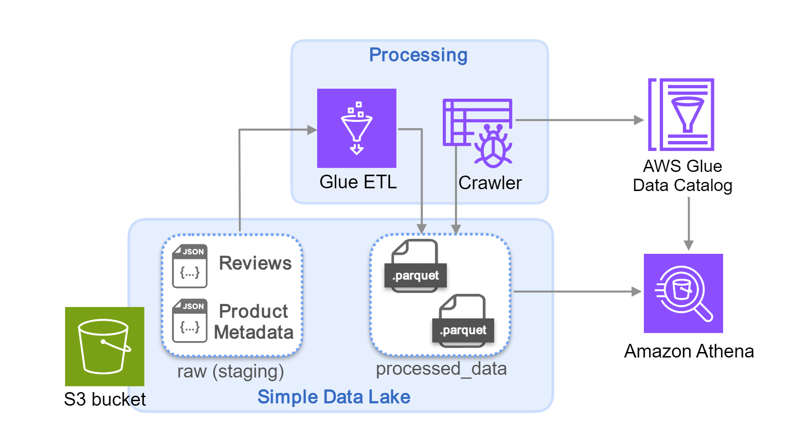
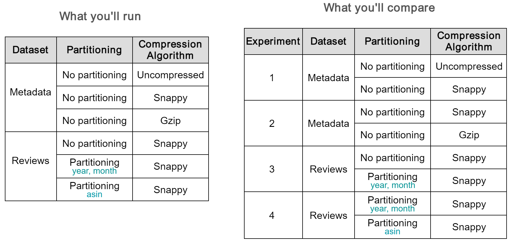

# Week 2 Lab: Simple Data Lake with AWS Glue

In this lab, you will work with a simple data lake that uses Amazon S3 as its primary storage. The data lake bucket contains raw JSON files that you will transform using AWS Glue ETL, and then store the processed data in the same bucket. You will finally use AWS Glue crawler to populate the Glue data catalog with metadata about your processed data, and then use Amazon Athena to query your data using SQL statements. In the optional part of the lab, you will explore the effects of compression and partitioning when storing your data in S3.

If you get stuck while completing the coding exercises, you can download the solution files by running the following command in your Cloud9 environment:

```bash
aws s3 cp --recursive s3://dlai-data-engineering/labs/c3w2lab1-706170-solution/ ./
```

# Table of Contents

- [ 1 - Introduction](#1)
- [ 2 - Raw Data Exploration](#2)
  - [ Exercise 1](#ex01)
  - [ Exercise 2](#ex02)
- [ 3 - Raw Data Processing](#3)
  - [ Exercise 3](#ex03)
  - [ Exercise 4](#ex04)
- [ 4 - Transformation with AWS Glue ETL](#4)
  - [ 4.1 - Preparing the Scripts](#4.1)
    - [ Exercise 5](#ex05)
    - [ Exercise 6](#ex06)
  - [ 4.2 - Creating and Running the Glue Jobs](#4.2)
- [ 5 - Data Catalog with Glue Crawler](#5)
  - [ Exercise 7](#ex07)
- [ 6 - Data Querying with Athena](#6)
- [ 7 - Optional Experiments: Partitioning and Compression Features of Parquet Format](#7)
  - [ 7.1 - Experiments with the Glue Jobs](#7.1)
  - [ 7.2 - Experiment Results](#7.2)
- [ 8 - Clean up](#8)

First, import some relevant libraries for this lab:


```python
import datetime as dt
import gzip
import json
from typing import Dict

import awswrangler as wr
import boto3
import pandas as pd
import smart_open
import warnings
```

<a name='1'></a>
## 1 - Introduction

Assume you work as a Data Engineer at a retailer specializing in scale models of classic cars and other transportation. The data analysts are interested in conducting trend analysis for the top products reviewed in Amazon, to inform new product development. Recently, your team acquired Amazon toy review data and product info, and stored them in a data lake bucket. You are asked to clean the data and ensure its accessibility, so that the data analysts can retrieve the data with SQL-based queries. For the initial testing phase, the team has opted to use AWS Glue ETL for the initial data cleaning, and Amazon Athena to query the data. 

In this lab, you will use [Terraform](https://www.terraform.io/) to define the Glue ETL jobs. You will run these jobs to process the raw datasets and store the results as Parquet files in the same bucket. Using `boto3`, you will create a crawler that you will run over the processed data. The crawler will populate two catalog tables, each linked to a Parquet file. Finally you will query the data using Amazon Athena.



<a name='2'></a>
## 2 - Raw Data Exploration

The dataset consists of two JSON compressed files, one for reviews and one for metadata of the products. Here is an example of one review JSON object:

```json
{
  "reviewerID": "A2SUAM1J3GNN3B",
  "asin": "0000013714",
  "reviewerName": "J. McDonald",
  "helpful": [2, 3],
  "reviewText": "I bought this for my husband who plays the piano.  He is having a wonderful time playing these old hymns.  The music  is at times hard to read because we think the book was published for singing from more than playing from.  Great purchase though!",
  "overall": 5.0,
  "summary": "Heavenly Highway Hymns",
  "unixReviewTime": 1252800000,
  "reviewTime": "09 13, 2009"
}
```

Here is the description of the fields:

- `reviewerID` - ID of the reviewer, e.g. A2SUAM1J3GNN3B
- `asin` - ID of the product, e.g. 0000013714
- `reviewerName` - name of the reviewer
- `helpful` - helpfulness rating of the review, e.g. 2/3
- `reviewText` - text of the review
- `overall` - rating of the product
- `summary` - summary of the review
- `unixReviewTime` - time of the review (unix time)
- `reviewTime` - time of the review (raw)

An here's an example of one product metadata JSON object:

```json
{
  "asin": "0641843224",
  "description": "Set your phasers to stun and prepare for a warp speed ride through the most memorable vocabulary from the sci-fi/fantasy genre.",
  "title": "McNeill Designs YBS Sci-fi/Fantasy Add-on Deck", 
  "price": 5.19,  
  "imUrl": "http://ecx.images-amazon.com/images/I/418t9AN9hiL._SY300_.jpg", 
  "related": 
  {
    "also_bought": ["B000EVLZ9U", "0641843208", "0641843216", "0641843267", "1450751210", "0641843232", "B00ALQFYGI", "B004G7B3NQ", "B002PDM288", "B009ZNJZV8", "B009YG928W", "B0063NC3N0"], 
    "also_viewed": ["B000EVLZ9U", "1450751210", "0641843208", "0641843267", "0641843232", "0641843216", "B003EIK136", "B004G7B3NQ", "B003N2Q5JC"], 
    "bought_together": ["B000EVLZ9U"]
  },
  "salesRank": {"Toys & Games": 154868}, 
  "brand": "McNeill Designs", 
  "categories": [["Toys & Games", "Games", "Card Games"]]
}
```

With the following fields:

- `asin` - ID of the product, e.g. 0000031852
- `description` - Description of the product
- `title` - name of the product
- `price` - price in US dollars (at time of crawl)
- `imUrl` - url of the product image
- `related` - related products (`also_bought`, `also_viewed`, `bought_together`)
- `salesRank` - sales rank information
- `brand` - brand name
- `categories` - list of categories the product belongs to

To get the name of the data lake bucket, go to the AWS console and click on the upper right part, where your username appears. Copy the **Account ID**. In the code below, set the variable `BUCKET_NAME` by replacing `<AWS-ACCOUNT-ID>` placeholder with the Account ID that you copied. The Account ID should contain only numbers without hyphens between them (e.g. 123412341234, not 1234-1234-1234 and the bucket name should have the same format as `de-c3w2lab1-123412341234-us-east-1-data-lake`).


```python
BUCKET_NAME = 'de-c3w2lab1-<AWS-ACCOUNT-ID>-us-east-1-data-lake'
```

The data lake bucket contains the raw JSON files. The bucket also contains samples of each dataset, which are of smaller size of the original data, that you will next interact with to explore the content of the data. The next cell consists of a function that you will use to load the data samples into a Pandas DataFrame so you can explore them. Run the following cell to define the function.


```python
def read_data_sample(bucket_name: str, s3_file_key: str) -> pd.DataFrame:
    """Reads review sample dataset

    Args:
        bucket_name (str): Bucket name
        s3_file_key (str): Dataset s3 key location

    Returns:
        pd.DataFrame: Read dataframe
    """
    s3_client = boto3.client('s3')
    source_uri = f's3://{bucket_name}/{s3_file_key}'
    json_list = []
    for json_line in smart_open.open(source_uri, transport_params={'client': s3_client}):
        json_list.append(json.loads(json_line))
    df = pd.DataFrame(json_list)
    return df

```

<a name='ex01'></a>
### Exercise 1

Complete the code to call the `read_data_sample()` function passing the `BUCKET_NAME` and the file key parameter as `'staging/reviews_Toys_and_Games_sample.json.gz'`. Then, take a look at the first 5 rows of this sample reviews dataset.


```python
### START CODE HERE ### (1 line of code)
review_sample_df = read_data_sample(bucket_name=BUCKET_NAME, s3_file_key='staging/reviews_Toys_and_Games_sample.json.gz')
### END CODE HERE ###

review_sample_df.head(5)
```


<div>
<style scoped>
    .dataframe tbody tr th:only-of-type {
        vertical-align: middle;
    }

    .dataframe tbody tr th {
        vertical-align: top;
    }

    .dataframe thead th {
        text-align: right;
    }
</style>
<table border="1" class="dataframe">
  <thead>
    <tr style="text-align: right;">
      <th></th>
      <th>reviewerID</th>
      <th>asin</th>
      <th>reviewerName</th>
      <th>helpful</th>
      <th>reviewText</th>
      <th>overall</th>
      <th>summary</th>
      <th>unixReviewTime</th>
      <th>reviewTime</th>
    </tr>
  </thead>
  <tbody>
    <tr>
      <th>0</th>
      <td>AMEVO2LY6VEJA</td>
      <td>0000191639</td>
      <td>Nicole Soeder</td>
      <td>[0, 0]</td>
      <td>Great product, thank you! Our son loved the pu...</td>
      <td>5.0</td>
      <td>Puzzles</td>
      <td>1388016000</td>
      <td>12 26, 2013</td>
    </tr>
    <tr>
      <th>1</th>
      <td>A3C9CSW3TJITGT</td>
      <td>0005069491</td>
      <td>Renee</td>
      <td>[0, 0]</td>
      <td>I love these felt nursery rhyme characters and...</td>
      <td>4.0</td>
      <td>Charming characters but busy work required</td>
      <td>1377561600</td>
      <td>08 27, 2013</td>
    </tr>
    <tr>
      <th>2</th>
      <td>A31POTIYCKSZ9G</td>
      <td>0076561046</td>
      <td>So CA Teacher</td>
      <td>[0, 0]</td>
      <td>I see no directions for its use. Therefore I h...</td>
      <td>3.0</td>
      <td>No directions for use...</td>
      <td>1404864000</td>
      <td>07 9, 2014</td>
    </tr>
    <tr>
      <th>3</th>
      <td>A2GGHHME9B6W4O</td>
      <td>0131358936</td>
      <td>Dalilah G.</td>
      <td>[0, 0]</td>
      <td>This is a great tool for any teacher using the...</td>
      <td>5.0</td>
      <td>Great CD-ROM</td>
      <td>1382400000</td>
      <td>10 22, 2013</td>
    </tr>
    <tr>
      <th>4</th>
      <td>A1FSLDH43ORWZP</td>
      <td>0133642984</td>
      <td>Dayna English</td>
      <td>[0, 0]</td>
      <td>Although not as streamlined as the Algebra I m...</td>
      <td>5.0</td>
      <td>Algebra II -- presentation materials</td>
      <td>1374278400</td>
      <td>07 20, 2013</td>
    </tr>
  </tbody>
</table>
</div>


Let's take a look at the data type of each of the columns of the dataset, and pay closer attention to the `unixReviewTime` and `helpful` columns.


```python
review_sample_df.dtypes
```


    reviewerID         object
    asin               object
    reviewerName       object
    helpful            object
    reviewText         object
    overall           float64
    summary            object
    unixReviewTime      int64
    reviewTime         object
    dtype: object


You can see that the `unixReviewTime` value is currently an integer that represents a Unix timestamp defined in terms of the number of seconds since January 1st, 1970 at UTC. Each `helpful` column consists of two numbers: the number of users who found the review helpful and the total number of users who rated the helpfulness of this review. Later in Exercise 3, you will transform this raw data to make it more useful for further analysis.

Let's check out the metadata dataset. 

<a name='ex02'></a>
### Exercise 2

Execute the `read_data_sample()` function with the same bucket name, but now set the file key parameter as `'staging/meta_Toys_and_Games_sample.json.gz'`. Then take a look at the first 5 rows of this sample metadata dataset.


```python
### START CODE HERE ### (1 line of code)
metadata_sample_df = read_data_sample(bucket_name=BUCKET_NAME, s3_file_key='staging/meta_Toys_and_Games_sample.json.gz')
### END CODE HERE ###

metadata_sample_df.head(5)
```


<div>
<style scoped>
    .dataframe tbody tr th:only-of-type {
        vertical-align: middle;
    }

    .dataframe tbody tr th {
        vertical-align: top;
    }

    .dataframe thead th {
        text-align: right;
    }
</style>
<table border="1" class="dataframe">
  <thead>
    <tr style="text-align: right;">
      <th></th>
      <th>asin</th>
      <th>description</th>
      <th>title</th>
      <th>price</th>
      <th>salesRank</th>
      <th>imUrl</th>
      <th>brand</th>
      <th>categories</th>
      <th>related</th>
    </tr>
  </thead>
  <tbody>
    <tr>
      <th>0</th>
      <td>0000191639</td>
      <td>Three Dr. Suess' Puzzles: Green Eggs and Ham, ...</td>
      <td>Dr. Suess 19163 Dr. Seuss Puzzle 3 Pack Bundle</td>
      <td>37.12</td>
      <td>{'Toys &amp; Games': 612379}</td>
      <td>http://ecx.images-amazon.com/images/I/414PLROX...</td>
      <td>Dr. Seuss</td>
      <td>[[Toys &amp; Games, Puzzles, Jigsaw Puzzles]]</td>
      <td>NaN</td>
    </tr>
    <tr>
      <th>1</th>
      <td>0005069491</td>
      <td>NaN</td>
      <td>Nursery Rhymes Felt Book</td>
      <td>NaN</td>
      <td>{'Toys &amp; Games': 576683}</td>
      <td>http://ecx.images-amazon.com/images/I/51z4JDBC...</td>
      <td>NaN</td>
      <td>[[Toys &amp; Games]]</td>
      <td>NaN</td>
    </tr>
    <tr>
      <th>2</th>
      <td>0076561046</td>
      <td>Learn Fractions Decimals Percents using flash ...</td>
      <td>Fraction Decimal Percent Card Deck</td>
      <td>NaN</td>
      <td>{'Toys &amp; Games': 564211}</td>
      <td>http://ecx.images-amazon.com/images/I/51ObabPu...</td>
      <td>NaN</td>
      <td>[[Toys &amp; Games, Learning &amp; Education, Flash Ca...</td>
      <td>{'also_viewed': ['0075728680']}</td>
    </tr>
    <tr>
      <th>3</th>
      <td>0131358936</td>
      <td>New, Sealed. Fast Shipping with tracking, buy ...</td>
      <td>NaN</td>
      <td>36.22</td>
      <td>{'Software': 8080}</td>
      <td>http://ecx.images-amazon.com/images/I/51%2B7Ej...</td>
      <td>NaN</td>
      <td>[[Toys &amp; Games, Learning &amp; Education, Mathemat...</td>
      <td>{'also_bought': ['0321845536', '0078787572'], ...</td>
    </tr>
    <tr>
      <th>4</th>
      <td>0133642984</td>
      <td>NaN</td>
      <td>Algebra 2 California Teacher Center</td>
      <td>731.93</td>
      <td>{'Toys &amp; Games': 1150291}</td>
      <td>http://ecx.images-amazon.com/images/I/51VK%2BL...</td>
      <td>Prentice Hall</td>
      <td>[[Toys &amp; Games, Learning &amp; Education, Mathemat...</td>
      <td>NaN</td>
    </tr>
  </tbody>
</table>
</div>


Then, take a look at the column's data types.


```python
metadata_sample_df.dtypes
```


    asin            object
    description     object
    title           object
    price          float64
    salesRank       object
    imUrl           object
    brand           object
    categories      object
    related         object
    dtype: object


To make this data more useful for analysis, later in Exercise 4 you will perform some transformations to the data. For example, you will extract the sales rank and category from the `salesRank` column and save them into two separate columns.

<a name='3'></a>
## 3 - Raw Data Processing

In this section, you will complete two processing functions that you will later incorporate into the Glue job scripts.

<a name='ex03'></a>
### Exercise 3

In this exercise, you will perform some transformations on the reviews dataset to make the data from the `unixReviewTime` and `helpful` columns more useful for analysis. 

Complete the `process_review()` function with the following transformations:

1. Convert the `unixReviewTime` column to date with the `pd.to_datetime()` function. Remember that this timestamp is defined in seconds (use `s` for the `unit` parameter). Save the result in the column `reviewTime`.
2. Extract the year and month from the `reviewTime`, and save those values in new columns named `year` and `month`. You can apply `.dt.year` and `.dt.month` methods to `raw_df['reviewTime']` to do that. You will later use these columns to partition the processed data in the `S3` bucket.
3. Create a new DataFrame named `df_helpful` based on converting the `helpful` column from the `raw_df` into a list with the `to_list()` method. Set the column names as `helpful` and `totalHelpful`. 
4. With the `pd.concat()` function, concatenate the `raw_df` dataframe with `df_helpful`. From the `raw_df` drop the `helpful` column using the `raw_df.drop()` function, set `axis=1`.

Then, perform the transformations and check the result.


```python
def process_review(raw_df: pd.DataFrame) -> pd.DataFrame:    
    """Transformations steps for Reviews dataset

    Args:
        raw_df (DataFrame): Raw data loaded in dataframe

    Returns:
        DataFrame: Returned transformed dataframe
    """

    ### START CODE HERE ### (5 lines of code)
    raw_df['reviewTime'] = pd.to_datetime(raw_df['unixReviewTime'], unit='s')
    raw_df['year'] = raw_df['reviewTime'].dt.year
    raw_df['month'] = raw_df['reviewTime'].dt.month
    
    df_helpful = pd.DataFrame(raw_df['helpful'].to_list(), columns=['helpful', 'totalHelpful'])
    target_df = pd.concat([raw_df.drop(columns=['helpful']), df_helpful], axis=1)
    ### END CODE HERE ###
    
    return target_df

transformed_review_sample_df = process_review(raw_df=review_sample_df)
transformed_review_sample_df.head()
```


<div>
<style scoped>
    .dataframe tbody tr th:only-of-type {
        vertical-align: middle;
    }

    .dataframe tbody tr th {
        vertical-align: top;
    }

    .dataframe thead th {
        text-align: right;
    }
</style>
<table border="1" class="dataframe">
  <thead>
    <tr style="text-align: right;">
      <th></th>
      <th>reviewerID</th>
      <th>asin</th>
      <th>reviewerName</th>
      <th>reviewText</th>
      <th>overall</th>
      <th>summary</th>
      <th>unixReviewTime</th>
      <th>reviewTime</th>
      <th>year</th>
      <th>month</th>
      <th>helpful</th>
      <th>totalHelpful</th>
    </tr>
  </thead>
  <tbody>
    <tr>
      <th>0</th>
      <td>AMEVO2LY6VEJA</td>
      <td>0000191639</td>
      <td>Nicole Soeder</td>
      <td>Great product, thank you! Our son loved the pu...</td>
      <td>5.0</td>
      <td>Puzzles</td>
      <td>1388016000</td>
      <td>2013-12-26</td>
      <td>2013</td>
      <td>12</td>
      <td>0</td>
      <td>0</td>
    </tr>
    <tr>
      <th>1</th>
      <td>A3C9CSW3TJITGT</td>
      <td>0005069491</td>
      <td>Renee</td>
      <td>I love these felt nursery rhyme characters and...</td>
      <td>4.0</td>
      <td>Charming characters but busy work required</td>
      <td>1377561600</td>
      <td>2013-08-27</td>
      <td>2013</td>
      <td>8</td>
      <td>0</td>
      <td>0</td>
    </tr>
    <tr>
      <th>2</th>
      <td>A31POTIYCKSZ9G</td>
      <td>0076561046</td>
      <td>So CA Teacher</td>
      <td>I see no directions for its use. Therefore I h...</td>
      <td>3.0</td>
      <td>No directions for use...</td>
      <td>1404864000</td>
      <td>2014-07-09</td>
      <td>2014</td>
      <td>7</td>
      <td>0</td>
      <td>0</td>
    </tr>
    <tr>
      <th>3</th>
      <td>A2GGHHME9B6W4O</td>
      <td>0131358936</td>
      <td>Dalilah G.</td>
      <td>This is a great tool for any teacher using the...</td>
      <td>5.0</td>
      <td>Great CD-ROM</td>
      <td>1382400000</td>
      <td>2013-10-22</td>
      <td>2013</td>
      <td>10</td>
      <td>0</td>
      <td>0</td>
    </tr>
    <tr>
      <th>4</th>
      <td>A1FSLDH43ORWZP</td>
      <td>0133642984</td>
      <td>Dayna English</td>
      <td>Although not as streamlined as the Algebra I m...</td>
      <td>5.0</td>
      <td>Algebra II -- presentation materials</td>
      <td>1374278400</td>
      <td>2013-07-20</td>
      <td>2013</td>
      <td>7</td>
      <td>0</td>
      <td>0</td>
    </tr>
  </tbody>
</table>
</div>


<a name='ex04'></a>
### Exercise 4

In this exercise, you will perform some transformations on the reviews metadata dataset to make the data from the `salesRank` column more useful for analysis. You will also remove some of the null values and replace others with an empty string.

Complete the function provided in the next cell with the following steps: 

1. Remove any records that have null values for the `salesRank` column. You can use the `dropna()` method with the parameter `how="any"`. Save the resulting dataframe in the `tmp_df` variable.
2. Create a dataframe named `df_rank`. This dataframe should contain two columns named `'sales_category'` and `'sales_rank'` that come from extracting the key and value respectively from the `'salesRank'` column.
3. Concatenate the `tmp_df` and `df_rank` dataframes and save the result in a new dataframe named `target_df`. You can use function `pd.concat()` to do that.
4. Use the parameter `cols` to select the desired columns in the dataframe `target_df`.
5. From `target_df`, remove any records that have null values for the `asin`, `price` and `sales_rank` columns. Again, use the `dropna()` method with the parameter `how="any"`.
6. Fill the null value of the rest of the dataframe with an empty string `""`. You can use `fillna()` function to do that.

Then, perform the transformations and check the result.


```python
def process_metadata(raw_df: pd.DataFrame, cols: list[str]) -> pd.DataFrame:
    """Function in charge of the transformation of the raw data of the
    Reviews Metadata.

    Args:
        raw_df (DataFrame): Raw data loaded in dataframe
        cols (list): List of columns to select

    Returns:
        DataFrame: Returned transformed dataframe
    """

    ### START CODE HERE ### (6 lines of code)
    tmp_df = raw_df.dropna(subset=["salesRank"], how="any")
    
    df_rank = pd.DataFrame([{"sales_category": key, "sales_rank": value} for d in tmp_df["salesRank"].tolist() for key, value in d.items()])
    
    target_df = pd.concat([tmp_df, df_rank], axis=1)
    target_df = target_df[cols]
    target_df = target_df.dropna(subset=["asin", "price", "sales_rank"], how="any")
    target_df = target_df.fillna("")
    ### END CODE HERE ###
    
    return target_df

processed_metadata_df = process_metadata(raw_df=metadata_sample_df, 
                                         cols=['asin', 'description', 'title', 'price', 'brand','sales_category','sales_rank']
                                         )
processed_metadata_df.head()

```


<div>
<style scoped>
    .dataframe tbody tr th:only-of-type {
        vertical-align: middle;
    }

    .dataframe tbody tr th {
        vertical-align: top;
    }

    .dataframe thead th {
        text-align: right;
    }
</style>
<table border="1" class="dataframe">
  <thead>
    <tr style="text-align: right;">
      <th></th>
      <th>asin</th>
      <th>description</th>
      <th>title</th>
      <th>price</th>
      <th>brand</th>
      <th>sales_category</th>
      <th>sales_rank</th>
    </tr>
  </thead>
  <tbody>
    <tr>
      <th>0</th>
      <td>0000191639</td>
      <td>Three Dr. Suess' Puzzles: Green Eggs and Ham, ...</td>
      <td>Dr. Suess 19163 Dr. Seuss Puzzle 3 Pack Bundle</td>
      <td>37.12</td>
      <td>Dr. Seuss</td>
      <td>Toys &amp; Games</td>
      <td>612379.0</td>
    </tr>
    <tr>
      <th>3</th>
      <td>0131358936</td>
      <td>New, Sealed. Fast Shipping with tracking, buy ...</td>
      <td></td>
      <td>36.22</td>
      <td></td>
      <td>Software</td>
      <td>8080.0</td>
    </tr>
    <tr>
      <th>4</th>
      <td>0133642984</td>
      <td></td>
      <td>Algebra 2 California Teacher Center</td>
      <td>731.93</td>
      <td>Prentice Hall</td>
      <td>Toys &amp; Games</td>
      <td>1150291.0</td>
    </tr>
    <tr>
      <th>6</th>
      <td>0375829695</td>
      <td>A collection of six 48-piece (that is,slightly...</td>
      <td>Dr. Seuss Jigsaw Puzzle Book: With Six 48-Piec...</td>
      <td>24.82</td>
      <td>Dr. Seuss</td>
      <td>Home &amp;amp; Kitchen</td>
      <td>590975.0</td>
    </tr>
    <tr>
      <th>10</th>
      <td>0439400066</td>
      <td>Send your mind into overdrive with this mind-b...</td>
      <td>3D Puzzle Buster</td>
      <td>99.15</td>
      <td></td>
      <td>Toys &amp; Games</td>
      <td>1616332.0</td>
    </tr>
  </tbody>
</table>
</div>


You have explored and performed some transformations on the reviews and metadata sample datasets, and you are now ready to perform those transformations over the complete dataset. This process will be done with AWS Glue.

<a name='4'></a>
## 4 - Transformation with AWS Glue ETL

AWS Glue ETL (Extract, Transform, Load) is a serverless service that simplifies data integration and processing. You briefly used Glue in the labs of course 1. In this lab, you will interact more closely with this service, and in course 4, you will learn more details about its underlying distributed framework (Apache Spark). 

AWS Glue requires a Spark script to perform a job, this script can be coded in Python or Scala. Here you are provided with Python scripts. In these scripts, you will extract the raw data from the provided bucket, transform the data and then save it in the **parquet** format. Parquet is a columnar storage file format commonly used in big data processing frameworks like Apache Hadoop and Apache Spark. Parquet format has several features such as the support of compression algorithms and support of schema evolution. If you want to know more about this format, you can read [this article](https://airbyte.com/data-engineering-resources/parquet-data-format).

<a name='4.1'></a>
### 4.1 - Preparing the Scripts

<a name='ex05'></a>
### Exercise 5

You will now complete the script to transform the Amazon Reviews.

1. Open the file `terraform/assets/de-c3w2-reviews-transform-job.py`. The script reads the data from the JSON file, performs basic transformations, and saves the result in a parquet file.

2. Before completing the incomplete `transform()` function, read through the entire code and comments to get an overview of how the three steps - Extract, Transform, and Load - are implemented.

3. Complete the `transform()` function by copying part of the code you completed in [Exercise 3](#ex03).

4. Save changes to the file.

<a name='ex06'></a>
### Exercise 6

You will now complete the script to transform the Amazon Product Metadata.

1. Open the file `terraform/assets/de-c3w2-metadata-transform-job.py`.

2. Before completing the incomplete `transform()` function, read through the entire code and comments to get an overview of how the three steps - Extract, Transform, and Load - are implemented. 

3. Complete the `transform()` function by copying part of the code that you completed in [Exercise 4](#ex04). 

4. Save changes to the file.

<a name='4.2'></a>
### 4.2 - Creating and Running the Glue Jobs

After completing the scripts, you will now create the resources needed to run the Glue jobs using Terraform. Once you create the resources, you will run the AWS Glue Jobs to ingest the raw data from the source bucket and transform it. You are provided with the Terraform configuration files to create the Glue jobs, your task is to deploy the jobs. For a detailed overview of the provided terraform files, make sure to watch the lab walkthrough video.

4.2.1. Open the `./terraform/glue.tf` file. You will see two different Glue jobs: one for the reviews and another for the product metadata. For now, leave the file as is. Note the use of the `Snappy` compression algorithm for both jobs and the choice of partitioning columns: `year` and `month` for the reviews, and `sales_category` for the product metadata. In the optional part of the lab at the end, you will make changes to the compression algorithm and partitioning columns to perform various experiments.

4.2.2. In the Cloud9 or Jupyter terminal, navigate to the `terraform` folder, initialize Terraform and then deploy the resources by running the following commands:

```bash
cd terraform
terraform init
terraform plan
terraform apply
```

*Note*: After the `terraform apply` command, you will need to type `yes` and press `Enter` to confirm that you want Terraform to apply the changes.

The output will include the name of each of the glue jobs and the IAM role used, as follows:

```bash
glue_role = "Cloud9-de-c3w2lab1-glue-role"
metadata_glue_job = "de-c3w2lab1-metadata-etl-job"
reviews_glue_job = "de-c3w2lab1-reviews-etl-job"
```

These outputs will be used later in the lab, you can save them locally. Note that you will only need the values of the job names (i.e., `de-c3w2lab1-metadata-etl-job` and `de-c3w2lab1-reviews-etl-job`) for the next step. The key names (`metadata_glue_job` and `reviews_glue_job`) are provided for reference but are not used in the commands.

4.2.3. Run each job with the command below, replacing the placeholder `<GLUE-JOB-NAME>` with the job name from the Terraform output (`de-c3w2lab1-reviews-etl-job` or `de-c3w2lab1-metadata-etl-job`):

```bash
aws glue start-job-run --job-name <GLUE-JOB-NAME> | jq -r '.JobRunId' 

4.2.4. You can check the status of each Glue job in the console, or from the terminal by running the following command. Make sure to exchange the `<GLUE-JOB-NAME>` with the job name, and `<JOB-RUN-ID>` with the output from the previous step:

```bash
aws glue get-job-run --job-name <GLUE-JOB-NAME> --run-id <JOB-RUN-ID> --output text --query "JobRun.JobRunState"
```

When each job has a `SUCCEEDED` status, you can continue with the rest of the lab. Take into account that each run of `de-c3w2lab1-metadata-etl-job` can take around 3 minutes while each run of `de-c3w2lab1-reviews-etl-job` can take between 7 to 8 minutes.
- The processed metadata will be stored at: `s3://<BUCKET_NAME>/processed_data/snappy/partition_by_sales_category/toys_metadata/`.
- The processed reviews will be stored at:
`s3://<BUCKET_NAME>/processed_data/snappy/partition_by_year_month/toys_reviews/`.

<a name='5'></a>
## 5 - Data Catalog with Glue Crawler

AWS Glue Crawler is a powerful automated tool offered by AWS Glue for discovering and cataloging metadata about data sources, which enables services like Glue and Athena to query data directly from different sources. By simply pointing the crawler to your data source, whether it's a database or a data lake, it will automatically scan and extract the schema information, data types, and other relevant metadata. This metadata is then organized and stored in a database table in the AWS Glue Data Catalog, providing a centralized repository for understanding and managing your data assets. In this lab, you will create a crawler that will be in charge of populating the Glue Data Catalog with the newly transformed data in S3, you will be able to query the data directly from S3 using Athena in the final part.

Start by checking the databases in the data catalog using AWS SDK for pandas (`awswrangler`):


```python
databases = wr.catalog.databases()
print(databases)
```

    Empty DataFrame
    Columns: [Database, Description]
    Index: []


The Data catalog is empty, let's create a new catalog database labeled as `de-c3w2lab1-aws-reviews` in which the crawler will store the metadata of the processed data.


```python
DATABASE_NAME = "de-c3w2lab1-aws-reviews"
```


```python
if DATABASE_NAME not in databases.values:
    wr.catalog.create_database(DATABASE_NAME)
    print(wr.catalog.databases())
else:
    print(f"Database {DATABASE_NAME} already exists")
```

                      Database Description
    0  de-c3w2lab1-aws-reviews            


<a name='ex07'></a>
### Exercise 7

Complete the code to create a Glue crawler utilizing the `boto3` library:

1. Define the Role parameter with the Glue Job role that you obtained from the `terraform` output (step 4.2.2).
2. Add a description to the crawler (e.g. 'Amazon Reviews for toys').
3. Define the S3 targets with the  paths in your data lake bucket for the `toys_reviews` table (partitioned by year and month and with `snappy` compression) and the `toys_metadata` table (partitioned by sales category with `snappy` compression). You just need to replace `None` with the `BUCKET_NAME` variable.


```python
glue_client = boto3.client('glue',region_name="us-east-1")
configuration= {"Version": 1.0,"Grouping": {"TableGroupingPolicy": "CombineCompatibleSchemas" }}

response = glue_client.create_crawler(
    Name='de-c3w2lab1-crawler',
    ### START CODE HERE ### (12 lines of code)
    Role= 'Cloud9-de-c3w2lab1-glue-role',
    DatabaseName=DATABASE_NAME, 
    Description= 'Amazon Reviews for toys',
    Targets={ 
        'S3Targets': [ 
            { 
                'Path': f's3://{BUCKET_NAME}/processed_data/snappy/partition_by_year_month/toys_reviews/',
            },
            { 
                'Path': f's3://{BUCKET_NAME}/processed_data/snappy/partition_by_sales_category/toys_metadata/',
            } 
        ]} 
    
    ### END CODE HERE ###
)
```

Let's check that the crawler was indeed created, using the `list_crawlers` method of the `boto3` Glue Client. If the creation was successful, you should see the new crawler in the list. 


```python
response = glue_client.list_crawlers()
print(response['CrawlerNames'])
```

    ['de-c3w2lab1-crawler']


Start the crawler:


```python
response = glue_client.start_crawler(
    Name='de-c3w2lab1-crawler'
)
print(response)
```

    {'ResponseMetadata': {'RequestId': '9d0bd560-a2cb-44b9-bdcd-b6be98730cc8', 'HTTPStatusCode': 200, 'HTTPHeaders': {'date': 'Fri, 27 Sep 2024 03:29:25 GMT', 'content-type': 'application/x-amz-json-1.1', 'content-length': '2', 'connection': 'keep-alive', 'x-amzn-requestid': '9d0bd560-a2cb-44b9-bdcd-b6be98730cc8'}, 'RetryAttempts': 0}}


The crawler will start looking for data sources in the S3 targets that we have defined, it should take around **3 minutes** for the first run. 

After around 3 minutes, check that the two tables were created for each processed dataset using the following command:


```python
wr.catalog.tables(database=DATABASE_NAME)
```


<div>
<style scoped>
    .dataframe tbody tr th:only-of-type {
        vertical-align: middle;
    }

    .dataframe tbody tr th {
        vertical-align: top;
    }

    .dataframe thead th {
        text-align: right;
    }
</style>
<table border="1" class="dataframe">
  <thead>
    <tr style="text-align: right;">
      <th></th>
      <th>Database</th>
      <th>Table</th>
      <th>Description</th>
      <th>TableType</th>
      <th>Columns</th>
      <th>Partitions</th>
    </tr>
  </thead>
  <tbody>
    <tr>
      <th>0</th>
      <td>de-c3w2lab1-aws-reviews</td>
      <td>toys_metadata</td>
      <td></td>
      <td>EXTERNAL_TABLE</td>
      <td>asin, description, title, price, brand, sales_...</td>
      <td>sales_category</td>
    </tr>
    <tr>
      <th>1</th>
      <td>de-c3w2lab1-aws-reviews</td>
      <td>toys_reviews</td>
      <td></td>
      <td>EXTERNAL_TABLE</td>
      <td>reviewerid, asin, reviewername, reviewtext, ov...</td>
      <td>year, month</td>
    </tr>
  </tbody>
</table>
</div>


Before proceeding to the last section of the lab where you will use Amazon Athena, make sure that two catalog tables were created.

<a name='6'></a>
## 6 - Data Querying with Athena

Amazon Athena is a serverless, interactive query service provided by AWS, allowing you to analyze data in Amazon S3 using standard SQL. It enables you to quickly and easily query vast amounts of data stored in various formats such as CSV, JSON, Parquet, and more, without needing to set up and manage complex infrastructure. Athena leverages the AWS Glue Data Catalog to access the stored metadata associated with the S3 data. By utilizing this metadata, Athena seamlessly executes queries on the underlying data, streamlining the analytical process and enabling efficient data exploration and analysis.

You will now test some of the queries that the data analyst will run. You will use the `awswrangler` library to run these queries.

*Note*: `awswrangler` uses the `pyarrow` library that has some functions that returns a `FutureWarning` due to deprecation, this doesn't affect what you are trying to do so you will filter out those warnings).


```python
warnings.simplefilter('ignore', FutureWarning)
```

Run this test query to retrieve a sample of 5 records from the toys_reviews table.


```python
sql = "SELECT * FROM toys_reviews LIMIT 5"
df = wr.athena.read_sql_query(sql, database=DATABASE_NAME, s3_output=f's3://{BUCKET_NAME}/athena_output/')
df.head()
```


<div>
<style scoped>
    .dataframe tbody tr th:only-of-type {
        vertical-align: middle;
    }

    .dataframe tbody tr th {
        vertical-align: top;
    }

    .dataframe thead th {
        text-align: right;
    }
</style>
<table border="1" class="dataframe">
  <thead>
    <tr style="text-align: right;">
      <th></th>
      <th>reviewerid</th>
      <th>asin</th>
      <th>reviewername</th>
      <th>reviewtext</th>
      <th>overall</th>
      <th>summary</th>
      <th>unixreviewtime</th>
      <th>reviewtime</th>
      <th>helpful</th>
      <th>totalhelpful</th>
      <th>year</th>
      <th>month</th>
    </tr>
  </thead>
  <tbody>
    <tr>
      <th>0</th>
      <td>A29XEJMCNHZBPN</td>
      <td>B00851EHAA</td>
      <td>Christie L. Taylor "twinsplusone"</td>
      <td>I highly recommend these crayons for young chi...</td>
      <td>5.0</td>
      <td>Great tool for little hands</td>
      <td>1236211200</td>
      <td>2009-03-05</td>
      <td>2</td>
      <td>2</td>
      <td>2009</td>
      <td>3</td>
    </tr>
    <tr>
      <th>1</th>
      <td>A2MXOBL8ULZPX7</td>
      <td>B00851EHAA</td>
      <td>Sass</td>
      <td>Go these for my 1 1/2 year old son.  We origin...</td>
      <td>5.0</td>
      <td>Strongest Crayons out there!!!</td>
      <td>1237766400</td>
      <td>2009-03-23</td>
      <td>1</td>
      <td>1</td>
      <td>2009</td>
      <td>3</td>
    </tr>
    <tr>
      <th>2</th>
      <td>A3ICAEUGQ539UP</td>
      <td>B00851EHAA</td>
      <td>AC "acw3"</td>
      <td>My little girl loves her crayons.  Toddlers lo...</td>
      <td>5.0</td>
      <td>Yeah, hard as a rock and no more roll</td>
      <td>1236124800</td>
      <td>2009-03-04</td>
      <td>2</td>
      <td>2</td>
      <td>2009</td>
      <td>3</td>
    </tr>
    <tr>
      <th>3</th>
      <td>A112C5GG7T054E</td>
      <td>B0089TVY0O</td>
      <td>Amyee Pearson</td>
      <td>This is a nice set but its not 30 inches it's ...</td>
      <td>3.0</td>
      <td>should have asked some questions.</td>
      <td>1238198400</td>
      <td>2009-03-28</td>
      <td>10</td>
      <td>21</td>
      <td>2009</td>
      <td>3</td>
    </tr>
    <tr>
      <th>4</th>
      <td>AXGY9UUV0CSQ</td>
      <td>B008C0KXYS</td>
      <td>A. P. Shands</td>
      <td>This product is a great value as far as polyhe...</td>
      <td>4.0</td>
      <td>Very good product, but somewhat quirky...</td>
      <td>1237248000</td>
      <td>2009-03-17</td>
      <td>2</td>
      <td>2</td>
      <td>2009</td>
      <td>3</td>
    </tr>
  </tbody>
</table>
</div>


Next, run this test query to find the top 5 products with the most reviews, return the name of the product and the count of reviews. Ignore the products with an empty title in the metadata table.


```python
sql = """
SELECT met.title, count(distinct toy.reviewerid) as review_count
FROM toys_metadata met 
LEFT JOIN toys_reviews toy
ON met.asin = toy.asin
WHERE met.title <> ''
GROUP BY met.title
ORDER BY count(distinct toy.reviewerid) DESC
LIMIT 5"""
df = wr.athena.read_sql_query(sql, database=DATABASE_NAME, s3_output=f's3://{BUCKET_NAME}/athena_output/')
df.head()
```


<div>
<style scoped>
    .dataframe tbody tr th:only-of-type {
        vertical-align: middle;
    }

    .dataframe tbody tr th {
        vertical-align: top;
    }

    .dataframe thead th {
        text-align: right;
    }
</style>
<table border="1" class="dataframe">
  <thead>
    <tr style="text-align: right;">
      <th></th>
      <th>title</th>
      <th>review_count</th>
    </tr>
  </thead>
  <tbody>
    <tr>
      <th>0</th>
      <td>Cards Against Humanity</td>
      <td>10281</td>
    </tr>
    <tr>
      <th>1</th>
      <td>Syma S107/S107G R/C Helicopter *Colors Vary</td>
      <td>2938</td>
    </tr>
    <tr>
      <th>2</th>
      <td>Syma S107G 3.5 Channel RC Heli with Gyro - Yellow</td>
      <td>2247</td>
    </tr>
    <tr>
      <th>3</th>
      <td>Cards Against Humanity: First Expansion</td>
      <td>2159</td>
    </tr>
    <tr>
      <th>4</th>
      <td>Syma S107/S107G R/C Helicopter | Red</td>
      <td>2062</td>
    </tr>
  </tbody>
</table>
</div>


Now run the next test query to find the top 10 products in terms of average rating, but the products should have at least 1000 reviews. Return the title, sales category and the average rating.


```python
sql = """
SELECT met.title, met.sales_category, avg(toy.overall) as review_avg
FROM toys_metadata met 
LEFT JOIN toys_reviews toy
ON met.asin = toy.asin
GROUP BY met.title, met.sales_category
HAVING count(distinct toy.reviewerid) > 1000
ORDER BY avg(toy.overall) DESC
LIMIT 10"""
df = wr.athena.read_sql_query(sql, database=DATABASE_NAME, s3_output=f's3://{BUCKET_NAME}/athena_output/')
df.head()
```


<div>
<style scoped>
    .dataframe tbody tr th:only-of-type {
        vertical-align: middle;
    }

    .dataframe tbody tr th {
        vertical-align: top;
    }

    .dataframe thead th {
        text-align: right;
    }
</style>
<table border="1" class="dataframe">
  <thead>
    <tr style="text-align: right;">
      <th></th>
      <th>title</th>
      <th>sales_category</th>
      <th>review_avg</th>
    </tr>
  </thead>
  <tbody>
    <tr>
      <th>0</th>
      <td>Cards Against Humanity: Third Expansion</td>
      <td>Toys &amp; Games</td>
      <td>4.898524</td>
    </tr>
    <tr>
      <th>1</th>
      <td>Cards Against Humanity</td>
      <td>Toys &amp; Games</td>
      <td>4.883669</td>
    </tr>
    <tr>
      <th>2</th>
      <td>Snap Circuits Jr. SC-100 Kit</td>
      <td>Toys &amp; Games</td>
      <td>4.849903</td>
    </tr>
    <tr>
      <th>3</th>
      <td>Cards Against Humanity: Second Expansion</td>
      <td>Toys &amp; Games</td>
      <td>4.848140</td>
    </tr>
    <tr>
      <th>4</th>
      <td>Cards Against Humanity: First Expansion</td>
      <td>Toys &amp; Games</td>
      <td>4.831403</td>
    </tr>
  </tbody>
</table>
</div>


Next, run this query to determine the average rating for each brand and the number of products they have in the database. Only show the top 10 brands with the highest product counts in the database.


```python
sql = """
SELECT met.brand, count(distinct met.asin) as product_count, avg(toy.overall) as review_avg
FROM toys_metadata met 
LEFT JOIN toys_reviews toy
ON met.asin = toy.asin
WHERE met.brand <> ''
GROUP BY met.brand
ORDER BY count(distinct toy.asin) DESC
LIMIT 10"""
df = wr.athena.read_sql_query(sql, database=DATABASE_NAME, s3_output=f's3://{BUCKET_NAME}/athena_output/')
df.head()
```


<div>
<style scoped>
    .dataframe tbody tr th:only-of-type {
        vertical-align: middle;
    }

    .dataframe tbody tr th {
        vertical-align: top;
    }

    .dataframe thead th {
        text-align: right;
    }
</style>
<table border="1" class="dataframe">
  <thead>
    <tr style="text-align: right;">
      <th></th>
      <th>brand</th>
      <th>product_count</th>
      <th>review_avg</th>
    </tr>
  </thead>
  <tbody>
    <tr>
      <th>0</th>
      <td>Mattel</td>
      <td>6171</td>
      <td>4.180501</td>
    </tr>
    <tr>
      <th>1</th>
      <td>Yu-Gi-Oh!</td>
      <td>4825</td>
      <td>4.407995</td>
    </tr>
    <tr>
      <th>2</th>
      <td>LEGO</td>
      <td>3726</td>
      <td>4.535898</td>
    </tr>
    <tr>
      <th>3</th>
      <td>Disney</td>
      <td>3617</td>
      <td>4.072743</td>
    </tr>
    <tr>
      <th>4</th>
      <td>Hasbro</td>
      <td>3533</td>
      <td>4.084331</td>
    </tr>
  </tbody>
</table>
</div>


For the last test query, you want to look at 25 random reviews that gave a rating of 5 to a toy car product. Return the product title, description, the review text and overall score. Ignore products that have an empty title, use the LIKE operator to search reviews with toy car in their text.


```python
sql = """
SELECT met.title, met.description, toy.reviewtext, toy.overall
FROM toys_reviews toy
LEFT JOIN toys_metadata met
ON toy.asin = met.asin
WHERE toy.reviewtext like '%toy car%' and toy.overall = 5.0 and met.title <> '' 
LIMIT 25"""
df = wr.athena.read_sql_query(sql, database=DATABASE_NAME, s3_output=f's3://{BUCKET_NAME}/athena_output/')
df.head()
```


<div>
<style scoped>
    .dataframe tbody tr th:only-of-type {
        vertical-align: middle;
    }

    .dataframe tbody tr th {
        vertical-align: top;
    }

    .dataframe thead th {
        text-align: right;
    }
</style>
<table border="1" class="dataframe">
  <thead>
    <tr style="text-align: right;">
      <th></th>
      <th>title</th>
      <th>description</th>
      <th>reviewtext</th>
      <th>overall</th>
    </tr>
  </thead>
  <tbody>
    <tr>
      <th>0</th>
      <td>Fisher-Price Super Friends Batmobile</td>
      <td>Turbo charged and ready to go-just like Batman...</td>
      <td>This is a Great toy car - the sounds and auto ...</td>
      <td>5.0</td>
    </tr>
    <tr>
      <th>1</th>
      <td>#2005-163 Lotus Sport Elise FTE Wheels Collect...</td>
      <td>LOTUS SPORT ELISE Hot Wheels 2005 Purple Lotus...</td>
      <td>My son owns a 2005 Lotus Elise. I was looking ...</td>
      <td>5.0</td>
    </tr>
    <tr>
      <th>2</th>
      <td>Darda Fireball Climb</td>
      <td>Discover the magic of Darda race sets. A simpl...</td>
      <td>I had a darda track when I was a kid and I lov...</td>
      <td>5.0</td>
    </tr>
    <tr>
      <th>3</th>
      <td>Fisher Price Little People Fun Park</td>
      <td>Complete with its signature sturdy figures and...</td>
      <td>I bought this when my daughter was about 17 mo...</td>
      <td>5.0</td>
    </tr>
    <tr>
      <th>4</th>
      <td>Little Tikes Hide &amp;amp; Slide Climber</td>
      <td>If your child (or your budget, or your yard) i...</td>
      <td>My daughter received this just before her firs...</td>
      <td>5.0</td>
    </tr>
  </tbody>
</table>
</div>


**Note**:
The next section is optional. If you'd like to try it, first ensure you submit the lab for grading, and then proceed with the experiments. Otherwise, feel free to skip to [the last section](#8). For a summary of the optional section, you can watch the lab walkthrough video.


<a name='7'></a>
## 7 - Optional Experiments: Partitioning and Compression Features of Parquet Format

**Compression**

The Parquet format, commonly used in data lake architectures, supports various [compression codecs](https://parquet.apache.org/docs/file-format/data-pages/compression/) such as Snappy, Gzip, and LZO. These codecs play a crucial role in reducing the storage space needed by Parquet files. However, they come with a trade-off: while they reduce storage costs and optimize resource utilization, they can also impact processing speeds during data ingestion, transformation, and querying. To test this with a practical example, you will store the same transformed data using three different compression options: `UNCOMPRESSED`, `SNAPPY` and `GZIP`: 

- `UNCOMPRESSED`: Data is left uncompressed.
- `SNAPPY`: Snappy is a fast compression/decompression library that works well with Parquet files. It provides good compression ratios and is optimized for speed. Snappy compression is often a good choice for balancing compression efficiency and query performance.
- `GZIP`: Gzip is a widely used compression algorithm that provides high compression ratios. However, it tends to be slower in both compression and decompression compared to Snappy. Gzip compression can achieve higher levels of compression but may result in slower query performance.

**Partitioning**

Partitioning in Parquet is a technique used to better organize data within Parquet files based on partition keys. By partitioning data, Parquet optimizes query performance by reducing the amount of data that needs to be scanned during query execution. 

**Experiments**

To explore the compression features, you will process the product metadata 3 times; in each time, you will choose a different option for the compression algorithm with no partitioning as shown in the left table here. Then you will compare for this data, "uncompressed versus Snappy" and then "Snappy versus Gzip". 

To explore the partitioning features, you will process the review dataset 3 times; in each time, you will choose a different option for the partitioning column, with Snappy for compression. Then you will compare for this data, "partitioning versus no partitioning" and then "partitioning by year and month" versus "partitioning by the product id (asin)".



<a name='7.1'></a>
### 7.1 - Experiments with the Glue Jobs

Open the file `./terraform/glue.tf` where you will be specifying the parameters for each of the experiments. Remember to save changes by pressing `Ctrl+S` or `Cmd+S` before redeploying each job.

<a name='exp01'></a>
### Metadata - No Partitioning, Uncompressed

Search for the `resource "aws_glue_job" "metadata_etl_job"` terraform resource. In the `default_arguments` parameter, set the following:
- `--compression` to `"uncompressed"` indicating that the parquet files will be saved without any compression,
- `--partition_cols` to `jsonencode([])`, which will be an empty list in the partition columns, no partitioning will be performed. 

Save the changes and follow steps 4.2.2 - 4.2.4. Run only the metadata Glue job. The results of this experiment will be stored at `s3://<BUCKET_NAME>/processed_data/uncompressed/no_partition/toys_metadata/`.

<a name='exp02'></a>
### Metadata - No Partitioning, Snappy

Search for the `resource "aws_glue_job" "metadata_etl_job"` terraform resource. In the `default_arguments` parameter, set 
- `--compression` to `"snappy"` indicating that the parquet files will be compressed using the `SNAPPY` algorithm,
- `--partition_cols` to `jsonencode([])`. 

Again, save the changes and follow steps 4.2.2 - 4.2.4. Run only the metadata Glue job. The results of this experiment will be stored at `s3://<BUCKET_NAME>/processed_data/snappy/no_partition/toys_metadata/`.

<a name='exp03'></a>
### Metadata - No partitioning, Gzip

Search for the `resource "aws_glue_job" "metadata_etl_job"` terraform resource. In the `default_arguments` parameter, set 
- `--compression` to `"gzip"` indicating that the parquet files will be compressed using the `GZIP` algorithm,
- `--partition_cols` to `jsonencode([])`. 

Again, save the changes and follow steps 4.2.2 - 4.2.4. Run only the metadata Glue job. The results of this experiment will be stored at `s3://<BUCKET_NAME>/processed_data/gzip/no_partition/toys_metadata/`.

<a name='exp04'></a>
### Reviews - No partitioning, Snappy

Search for the `resource "aws_glue_job" "reviews_etl_job"` terraform resource. In the `default_arguments` parameter, set 
- `--compression` to `"snappy"`; this will indicate the job that the parquet files will be compressed using the `SNAPPY` algorithm,
- `--partition_cols` to `jsonencode([])`.

Run only the review Glue job. After running the Glue Job, the results of this experiment will be stored at `s3://<BUCKET_NAME>/processed_data/snappy/no_partition/toys_reviews/`.

<a name='exp05'></a>
### Reviews - Partitioning by year and month, Snappy

Here you don't need to run any glue jobs. You've already run this Glue job with Snappy as the compression algorithm and using the year and month columns as the partitioning key. The results are stored at `s3://<BUCKET_NAME>/processed_data/snappy/partition_by_year_month/toys_reviews/`.
The parquet files are partitioned by the value of the two columns, year and month. The first partition is done by `year`and then, each `year` is partitioned into sub-partitions according to the `month`. 


<a name='exp06'></a>
### Reviews - Partitioning by asin, Snappy

Search for the `resource "aws_glue_job" "reviews_etl_job"` terraform resource. In the `default_arguments` parameter, set 
- `--compression` to `"snappy"`; 
- `--partition_cols` to `jsonencode(["asin"])`. 

Create and run only the review Glue Job. Take into account that this experiment is expected to fail due to a **timeout** (It will run for 15 minutes and then stop).

<a name='7.2'></a>
### 7.2 - Experiment Results

Now that your jobs have succeeded, and the processed data of each experiment has been stored in its corresponding locations, in this section you'll analyze the results.

**Compressed vs Uncompressed data**

First, let's compare between uncompressed and compressed data with no partitions using Metadata. Run the following commands to take a look to the size of the stored files. Remember that you can also run these commands in the Cloud9 terminal.

Read the file sizes of Metadata - No partitioning, Uncompressed:


```python
!aws s3 ls --summarize --human-readable --recursive s3://{BUCKET_NAME}/processed_data/uncompressed/no_partition/toys_metadata/
```

    
    Total Objects: 0
       Total Size: 0 Bytes


Read the file sizes of Metadata - No partitioning, Snappy:


```python
!aws s3 ls --summarize --human-readable --recursive s3://{BUCKET_NAME}/processed_data/snappy/no_partition/toys_metadata/
```

    
    Total Objects: 0
       Total Size: 0 Bytes


You'll notice that uncompressed files are bigger in size than the compressed ones, by almost a factor of 2. Also, even though you didn't specify a partition key, there are several files instead of only one. Some processing frameworks such as Apache Spark and AWS Glue will by default try to partition your data automatically.

**Snappy vs Gzip**

Now, let's take a look at the results from applying two different compression algorithms.Run the following commands.

Read the file sizes of Metadata - No partitioning, Snappy:


```python
!aws s3 ls --summarize --human-readable --recursive s3://{BUCKET_NAME}/processed_data/snappy/no_partition/toys_metadata/
```

    
    Total Objects: 0
       Total Size: 0 Bytes


Read the file sizes of Metadata - No partitioning, Gzip:


```python
!aws s3 ls --summarize --human-readable --recursive s3://{BUCKET_NAME}/processed_data/gzip/no_partition/toys_metadata/
```

    
    Total Objects: 0
       Total Size: 0 Bytes


By comparing the compression algorithms, you can see how `GZIP` has a better compression rate than `SNAPPY`. However, this higher compression rate comes at the cost of being less efficient at querying the data when using `GZIP`.

**Partition keys**

Finally, let's compare the usage of partition keys with the reviews dataset.

**No partition keys vs using partition keys**- Let's look again at the results of Reviews - Partitioning by year and month versus no_partition:


```python
!aws s3 ls --summarize --human-readable --recursive s3://{BUCKET_NAME}/processed_data/snappy/no_partition/toys_reviews/
```

    
    Total Objects: 0
       Total Size: 0 Bytes


```python
!aws s3 ls --summarize --human-readable --recursive s3://{BUCKET_NAME}/processed_data/snappy/partition_by_year_month/toys_reviews/
```

    2024-09-27 03:23:12    8.6 KiB processed_data/snappy/partition_by_year_month/toys_reviews/year=1999/month=10/run-1727407341959-part-block-0-0-r-00000-snappy.parquet
    2024-09-27 03:23:12   15.1 KiB processed_data/snappy/partition_by_year_month/toys_reviews/year=1999/month=12/run-1727407341959-part-block-0-0-r-00000-snappy.parquet
    2024-09-27 03:23:11    7.2 KiB processed_data/snappy/partition_by_year_month/toys_reviews/year=1999/month=7/run-1727407341959-part-block-0-0-r-00000-snappy.parquet
    2024-09-27 03:23:12    7.0 KiB processed_data/snappy/partition_by_year_month/toys_reviews/year=2000/month=1/run-1727407341959-part-block-0-0-r-00000-snappy.parquet
    2024-09-27 03:23:13   70.9 KiB processed_data/snappy/partition_by_year_month/toys_reviews/year=2000/month=10/run-1727407341959-part-block-0-0-r-00000-snappy.parquet
    2024-09-27 03:23:13   95.2 KiB processed_data/snappy/partition_by_year_month/toys_reviews/year=2000/month=11/run-1727407341959-part-block-0-0-r-00000-snappy.parquet
    2024-09-27 03:23:12    4.6 KiB processed_data/snappy/partition_by_year_month/toys_reviews/year=2000/month=11/run-1727407341959-part-block-0-0-r-00001-snappy.parquet
    2024-09-27 03:23:13  131.1 KiB processed_data/snappy/partition_by_year_month/toys_reviews/year=2000/month=12/run-1727407341959-part-block-0-0-r-00000-snappy.parquet
    2024-09-27 03:23:12    6.8 KiB processed_data/snappy/partition_by_year_month/toys_reviews/year=2000/month=12/run-1727407341959-part-block-0-0-r-00001-snappy.parquet
    2024-09-27 03:23:12    3.1 KiB processed_data/snappy/partition_by_year_month/toys_reviews/year=2000/month=2/run-1727407341959-part-block-0-0-r-00000-snappy.parquet
    2024-09-27 03:23:12    9.3 KiB processed_data/snappy/partition_by_year_month/toys_reviews/year=2000/month=3/run-1727407341959-part-block-0-0-r-00000-snappy.parquet
    2024-09-27 03:23:12    5.4 KiB processed_data/snappy/partition_by_year_month/toys_reviews/year=2000/month=4/run-1727407341959-part-block-0-0-r-00000-snappy.parquet
    2024-09-27 03:23:12    9.6 KiB processed_data/snappy/partition_by_year_month/toys_reviews/year=2000/month=5/run-1727407341959-part-block-0-0-r-00000-snappy.parquet
    2024-09-27 03:23:12    8.5 KiB processed_data/snappy/partition_by_year_month/toys_reviews/year=2000/month=6/run-1727407341959-part-block-0-0-r-00000-snappy.parquet
    2024-09-27 03:23:12   27.6 KiB processed_data/snappy/partition_by_year_month/toys_reviews/year=2000/month=7/run-1727407341959-part-block-0-0-r-00000-snappy.parquet
    2024-09-27 03:23:12   53.7 KiB processed_data/snappy/partition_by_year_month/toys_reviews/year=2000/month=8/run-1727407341959-part-block-0-0-r-00000-snappy.parquet
    2024-09-27 03:23:11   15.2 KiB processed_data/snappy/partition_by_year_month/toys_reviews/year=2000/month=8/run-1727407341959-part-block-0-0-r-00001-snappy.parquet
    2024-09-27 03:23:12   54.0 KiB processed_data/snappy/partition_by_year_month/toys_reviews/year=2000/month=9/run-1727407341959-part-block-0-0-r-00000-snappy.parquet
    2024-09-27 03:23:13  104.1 KiB processed_data/snappy/partition_by_year_month/toys_reviews/year=2001/month=1/run-1727407341959-part-block-0-0-r-00000-snappy.parquet
    2024-09-27 03:23:12    4.6 KiB processed_data/snappy/partition_by_year_month/toys_reviews/year=2001/month=1/run-1727407341959-part-block-0-0-r-00001-snappy.parquet
    2024-09-27 03:23:11    4.1 KiB processed_data/snappy/partition_by_year_month/toys_reviews/year=2001/month=1/run-1727407341959-part-block-0-0-r-00003-snappy.parquet
    2024-09-27 03:23:14  136.0 KiB processed_data/snappy/partition_by_year_month/toys_reviews/year=2001/month=10/run-1727407341959-part-block-0-0-r-00000-snappy.parquet
    2024-09-27 03:23:12    6.8 KiB processed_data/snappy/partition_by_year_month/toys_reviews/year=2001/month=10/run-1727407341959-part-block-0-0-r-00001-snappy.parquet
    2024-09-27 03:23:12    4.3 KiB processed_data/snappy/partition_by_year_month/toys_reviews/year=2001/month=10/run-1727407341959-part-block-0-0-r-00003-snappy.parquet
    2024-09-27 03:23:14  266.2 KiB processed_data/snappy/partition_by_year_month/toys_reviews/year=2001/month=11/run-1727407341959-part-block-0-0-r-00000-snappy.parquet
    2024-09-27 03:23:12    5.9 KiB processed_data/snappy/partition_by_year_month/toys_reviews/year=2001/month=11/run-1727407341959-part-block-0-0-r-00001-snappy.parquet
    2024-09-27 03:23:14  264.6 KiB processed_data/snappy/partition_by_year_month/toys_reviews/year=2001/month=12/run-1727407341959-part-block-0-0-r-00000-snappy.parquet
    2024-09-27 03:23:12    6.7 KiB processed_data/snappy/partition_by_year_month/toys_reviews/year=2001/month=12/run-1727407341959-part-block-0-0-r-00001-snappy.parquet
    2024-09-27 03:23:13   84.5 KiB processed_data/snappy/partition_by_year_month/toys_reviews/year=2001/month=2/run-1727407341959-part-block-0-0-r-00000-snappy.parquet
    2024-09-27 03:23:13   60.7 KiB processed_data/snappy/partition_by_year_month/toys_reviews/year=2001/month=3/run-1727407341959-part-block-0-0-r-00000-snappy.parquet
    2024-09-27 03:23:13   67.1 KiB processed_data/snappy/partition_by_year_month/toys_reviews/year=2001/month=4/run-1727407341959-part-block-0-0-r-00000-snappy.parquet
    2024-09-27 03:23:13   66.5 KiB processed_data/snappy/partition_by_year_month/toys_reviews/year=2001/month=5/run-1727407341959-part-block-0-0-r-00000-snappy.parquet
    2024-09-27 03:23:13   66.6 KiB processed_data/snappy/partition_by_year_month/toys_reviews/year=2001/month=6/run-1727407341959-part-block-0-0-r-00000-snappy.parquet
    2024-09-27 03:23:12   12.6 KiB processed_data/snappy/partition_by_year_month/toys_reviews/year=2001/month=6/run-1727407341959-part-block-0-0-r-00001-snappy.parquet
    2024-09-27 03:23:14   97.0 KiB processed_data/snappy/partition_by_year_month/toys_reviews/year=2001/month=7/run-1727407341959-part-block-0-0-r-00000-snappy.parquet
    2024-09-27 03:23:12   16.7 KiB processed_data/snappy/partition_by_year_month/toys_reviews/year=2001/month=7/run-1727407341959-part-block-0-0-r-00001-snappy.parquet
    2024-09-27 03:23:14  126.9 KiB processed_data/snappy/partition_by_year_month/toys_reviews/year=2001/month=8/run-1727407341959-part-block-0-0-r-00000-snappy.parquet
    2024-09-27 03:23:12    4.3 KiB processed_data/snappy/partition_by_year_month/toys_reviews/year=2001/month=8/run-1727407341959-part-block-0-0-r-00001-snappy.parquet
    2024-09-27 03:23:14  112.1 KiB processed_data/snappy/partition_by_year_month/toys_reviews/year=2001/month=9/run-1727407341959-part-block-0-0-r-00000-snappy.parquet
    2024-09-27 03:23:14  274.3 KiB processed_data/snappy/partition_by_year_month/toys_reviews/year=2002/month=1/run-1727407341959-part-block-0-0-r-00000-snappy.parquet
    2024-09-27 03:23:12    5.5 KiB processed_data/snappy/partition_by_year_month/toys_reviews/year=2002/month=1/run-1727407341959-part-block-0-0-r-00001-snappy.parquet
    2024-09-27 03:23:12   17.8 KiB processed_data/snappy/partition_by_year_month/toys_reviews/year=2002/month=1/run-1727407341959-part-block-0-0-r-00003-snappy.parquet
    2024-09-27 03:23:16  297.4 KiB processed_data/snappy/partition_by_year_month/toys_reviews/year=2002/month=10/run-1727407341959-part-block-0-0-r-00000-snappy.parquet
    2024-09-27 03:23:13    7.8 KiB processed_data/snappy/partition_by_year_month/toys_reviews/year=2002/month=10/run-1727407341959-part-block-0-0-r-00001-snappy.parquet
    2024-09-27 03:23:16  389.6 KiB processed_data/snappy/partition_by_year_month/toys_reviews/year=2002/month=11/run-1727407341959-part-block-0-0-r-00000-snappy.parquet
    2024-09-27 03:23:13    7.6 KiB processed_data/snappy/partition_by_year_month/toys_reviews/year=2002/month=11/run-1727407341959-part-block-0-0-r-00001-snappy.parquet
    2024-09-27 03:23:12    8.1 KiB processed_data/snappy/partition_by_year_month/toys_reviews/year=2002/month=11/run-1727407341959-part-block-0-0-r-00003-snappy.parquet
    2024-09-27 03:23:16  518.5 KiB processed_data/snappy/partition_by_year_month/toys_reviews/year=2002/month=12/run-1727407341959-part-block-0-0-r-00000-snappy.parquet
    2024-09-27 03:23:13   10.3 KiB processed_data/snappy/partition_by_year_month/toys_reviews/year=2002/month=12/run-1727407341959-part-block-0-0-r-00001-snappy.parquet
    2024-09-27 03:23:15  173.1 KiB processed_data/snappy/partition_by_year_month/toys_reviews/year=2002/month=2/run-1727407341959-part-block-0-0-r-00000-snappy.parquet
    2024-09-27 03:23:12    7.0 KiB processed_data/snappy/partition_by_year_month/toys_reviews/year=2002/month=2/run-1727407341959-part-block-0-0-r-00001-snappy.parquet
    2024-09-27 03:23:15  167.9 KiB processed_data/snappy/partition_by_year_month/toys_reviews/year=2002/month=3/run-1727407341959-part-block-0-0-r-00000-snappy.parquet
    2024-09-27 03:23:12    6.6 KiB processed_data/snappy/partition_by_year_month/toys_reviews/year=2002/month=3/run-1727407341959-part-block-0-0-r-00001-snappy.parquet
    2024-09-27 03:23:15  189.1 KiB processed_data/snappy/partition_by_year_month/toys_reviews/year=2002/month=4/run-1727407341959-part-block-0-0-r-00000-snappy.parquet
    2024-09-27 03:23:12    8.7 KiB processed_data/snappy/partition_by_year_month/toys_reviews/year=2002/month=4/run-1727407341959-part-block-0-0-r-00001-snappy.parquet
    2024-09-27 03:23:15  190.1 KiB processed_data/snappy/partition_by_year_month/toys_reviews/year=2002/month=5/run-1727407341959-part-block-0-0-r-00000-snappy.parquet
    2024-09-27 03:23:12    4.0 KiB processed_data/snappy/partition_by_year_month/toys_reviews/year=2002/month=5/run-1727407341959-part-block-0-0-r-00001-snappy.parquet
    2024-09-27 03:23:15  192.7 KiB processed_data/snappy/partition_by_year_month/toys_reviews/year=2002/month=6/run-1727407341959-part-block-0-0-r-00000-snappy.parquet
    2024-09-27 03:23:12    4.5 KiB processed_data/snappy/partition_by_year_month/toys_reviews/year=2002/month=6/run-1727407341959-part-block-0-0-r-00003-snappy.parquet
    2024-09-27 03:23:15  211.5 KiB processed_data/snappy/partition_by_year_month/toys_reviews/year=2002/month=7/run-1727407341959-part-block-0-0-r-00000-snappy.parquet
    2024-09-27 03:23:13    4.2 KiB processed_data/snappy/partition_by_year_month/toys_reviews/year=2002/month=7/run-1727407341959-part-block-0-0-r-00001-snappy.parquet
    2024-09-27 03:23:16  211.2 KiB processed_data/snappy/partition_by_year_month/toys_reviews/year=2002/month=8/run-1727407341959-part-block-0-0-r-00000-snappy.parquet
    2024-09-27 03:23:13    5.1 KiB processed_data/snappy/partition_by_year_month/toys_reviews/year=2002/month=8/run-1727407341959-part-block-0-0-r-00001-snappy.parquet
    2024-09-27 03:23:16  199.6 KiB processed_data/snappy/partition_by_year_month/toys_reviews/year=2002/month=9/run-1727407341959-part-block-0-0-r-00000-snappy.parquet
    2024-09-27 03:23:16  453.5 KiB processed_data/snappy/partition_by_year_month/toys_reviews/year=2003/month=1/run-1727407341959-part-block-0-0-r-00000-snappy.parquet
    2024-09-27 03:23:13    8.2 KiB processed_data/snappy/partition_by_year_month/toys_reviews/year=2003/month=1/run-1727407341959-part-block-0-0-r-00001-snappy.parquet
    2024-09-27 03:23:18  356.2 KiB processed_data/snappy/partition_by_year_month/toys_reviews/year=2003/month=10/run-1727407341959-part-block-0-0-r-00000-snappy.parquet
    2024-09-27 03:23:13   11.9 KiB processed_data/snappy/partition_by_year_month/toys_reviews/year=2003/month=10/run-1727407341959-part-block-0-0-r-00001-snappy.parquet
    2024-09-27 03:23:18  564.0 KiB processed_data/snappy/partition_by_year_month/toys_reviews/year=2003/month=11/run-1727407341959-part-block-0-0-r-00000-snappy.parquet
    2024-09-27 03:23:13    7.3 KiB processed_data/snappy/partition_by_year_month/toys_reviews/year=2003/month=11/run-1727407341959-part-block-0-0-r-00001-snappy.parquet
    2024-09-27 03:23:11    5.7 KiB processed_data/snappy/partition_by_year_month/toys_reviews/year=2003/month=11/run-1727407341959-part-block-0-0-r-00002-snappy.parquet
    2024-09-27 03:23:12    6.6 KiB processed_data/snappy/partition_by_year_month/toys_reviews/year=2003/month=11/run-1727407341959-part-block-0-0-r-00003-snappy.parquet
    2024-09-27 03:23:18  679.7 KiB processed_data/snappy/partition_by_year_month/toys_reviews/year=2003/month=12/run-1727407341959-part-block-0-0-r-00000-snappy.parquet
    2024-09-27 03:23:13    9.2 KiB processed_data/snappy/partition_by_year_month/toys_reviews/year=2003/month=12/run-1727407341959-part-block-0-0-r-00001-snappy.parquet
    2024-09-27 03:23:17  253.3 KiB processed_data/snappy/partition_by_year_month/toys_reviews/year=2003/month=2/run-1727407341959-part-block-0-0-r-00000-snappy.parquet
    2024-09-27 03:23:13    6.1 KiB processed_data/snappy/partition_by_year_month/toys_reviews/year=2003/month=2/run-1727407341959-part-block-0-0-r-00001-snappy.parquet
    2024-09-27 03:23:17  247.7 KiB processed_data/snappy/partition_by_year_month/toys_reviews/year=2003/month=3/run-1727407341959-part-block-0-0-r-00000-snappy.parquet
    2024-09-27 03:23:13    8.0 KiB processed_data/snappy/partition_by_year_month/toys_reviews/year=2003/month=3/run-1727407341959-part-block-0-0-r-00001-snappy.parquet
    2024-09-27 03:23:17  247.7 KiB processed_data/snappy/partition_by_year_month/toys_reviews/year=2003/month=4/run-1727407341959-part-block-0-0-r-00000-snappy.parquet
    2024-09-27 03:23:17  227.5 KiB processed_data/snappy/partition_by_year_month/toys_reviews/year=2003/month=5/run-1727407341959-part-block-0-0-r-00000-snappy.parquet
    2024-09-27 03:23:12    3.8 KiB processed_data/snappy/partition_by_year_month/toys_reviews/year=2003/month=5/run-1727407341959-part-block-0-0-r-00003-snappy.parquet
    2024-09-27 03:23:17  274.4 KiB processed_data/snappy/partition_by_year_month/toys_reviews/year=2003/month=6/run-1727407341959-part-block-0-0-r-00000-snappy.parquet
    2024-09-27 03:23:13    4.9 KiB processed_data/snappy/partition_by_year_month/toys_reviews/year=2003/month=6/run-1727407341959-part-block-0-0-r-00001-snappy.parquet
    2024-09-27 03:23:18  274.3 KiB processed_data/snappy/partition_by_year_month/toys_reviews/year=2003/month=7/run-1727407341959-part-block-0-0-r-00000-snappy.parquet
    2024-09-27 03:23:18  280.1 KiB processed_data/snappy/partition_by_year_month/toys_reviews/year=2003/month=8/run-1727407341959-part-block-0-0-r-00000-snappy.parquet
    2024-09-27 03:23:13   11.5 KiB processed_data/snappy/partition_by_year_month/toys_reviews/year=2003/month=8/run-1727407341959-part-block-0-0-r-00001-snappy.parquet
    2024-09-27 03:23:18  286.4 KiB processed_data/snappy/partition_by_year_month/toys_reviews/year=2003/month=9/run-1727407341959-part-block-0-0-r-00000-snappy.parquet
    2024-09-27 03:23:13   10.5 KiB processed_data/snappy/partition_by_year_month/toys_reviews/year=2003/month=9/run-1727407341959-part-block-0-0-r-00001-snappy.parquet
    2024-09-27 03:23:12    3.6 KiB processed_data/snappy/partition_by_year_month/toys_reviews/year=2003/month=9/run-1727407341959-part-block-0-0-r-00003-snappy.parquet
    2024-09-27 03:23:19  552.5 KiB processed_data/snappy/partition_by_year_month/toys_reviews/year=2004/month=1/run-1727407341959-part-block-0-0-r-00000-snappy.parquet
    2024-09-27 03:23:14    5.2 KiB processed_data/snappy/partition_by_year_month/toys_reviews/year=2004/month=1/run-1727407341959-part-block-0-0-r-00001-snappy.parquet
    2024-09-27 03:23:12    4.2 KiB processed_data/snappy/partition_by_year_month/toys_reviews/year=2004/month=1/run-1727407341959-part-block-0-0-r-00002-snappy.parquet
    2024-09-27 03:23:20  686.4 KiB processed_data/snappy/partition_by_year_month/toys_reviews/year=2004/month=10/run-1727407341959-part-block-0-0-r-00000-snappy.parquet
    2024-09-27 03:23:14    5.8 KiB processed_data/snappy/partition_by_year_month/toys_reviews/year=2004/month=10/run-1727407341959-part-block-0-0-r-00001-snappy.parquet
    2024-09-27 03:23:12    5.6 KiB processed_data/snappy/partition_by_year_month/toys_reviews/year=2004/month=10/run-1727407341959-part-block-0-0-r-00003-snappy.parquet
    2024-09-27 03:23:20  906.9 KiB processed_data/snappy/partition_by_year_month/toys_reviews/year=2004/month=11/run-1727407341959-part-block-0-0-r-00000-snappy.parquet
    2024-09-27 03:23:14    8.9 KiB processed_data/snappy/partition_by_year_month/toys_reviews/year=2004/month=11/run-1727407341959-part-block-0-0-r-00001-snappy.parquet
    2024-09-27 03:23:12    7.0 KiB processed_data/snappy/partition_by_year_month/toys_reviews/year=2004/month=11/run-1727407341959-part-block-0-0-r-00002-snappy.parquet
    2024-09-27 03:23:21    1.5 MiB processed_data/snappy/partition_by_year_month/toys_reviews/year=2004/month=12/run-1727407341959-part-block-0-0-r-00000-snappy.parquet
    2024-09-27 03:23:14    7.6 KiB processed_data/snappy/partition_by_year_month/toys_reviews/year=2004/month=12/run-1727407341959-part-block-0-0-r-00001-snappy.parquet
    2024-09-27 03:23:12    6.7 KiB processed_data/snappy/partition_by_year_month/toys_reviews/year=2004/month=12/run-1727407341959-part-block-0-0-r-00003-snappy.parquet
    2024-09-27 03:23:19  360.5 KiB processed_data/snappy/partition_by_year_month/toys_reviews/year=2004/month=2/run-1727407341959-part-block-0-0-r-00000-snappy.parquet
    2024-09-27 03:23:14    7.3 KiB processed_data/snappy/partition_by_year_month/toys_reviews/year=2004/month=2/run-1727407341959-part-block-0-0-r-00001-snappy.parquet
    2024-09-27 03:23:19  383.1 KiB processed_data/snappy/partition_by_year_month/toys_reviews/year=2004/month=3/run-1727407341959-part-block-0-0-r-00000-snappy.parquet
    2024-09-27 03:23:14    5.9 KiB processed_data/snappy/partition_by_year_month/toys_reviews/year=2004/month=3/run-1727407341959-part-block-0-0-r-00001-snappy.parquet
    2024-09-27 03:23:12    9.1 KiB processed_data/snappy/partition_by_year_month/toys_reviews/year=2004/month=3/run-1727407341959-part-block-0-0-r-00002-snappy.parquet
    2024-09-27 03:23:19  377.9 KiB processed_data/snappy/partition_by_year_month/toys_reviews/year=2004/month=4/run-1727407341959-part-block-0-0-r-00000-snappy.parquet
    2024-09-27 03:23:14    3.8 KiB processed_data/snappy/partition_by_year_month/toys_reviews/year=2004/month=4/run-1727407341959-part-block-0-0-r-00001-snappy.parquet
    2024-09-27 03:23:19  341.5 KiB processed_data/snappy/partition_by_year_month/toys_reviews/year=2004/month=5/run-1727407341959-part-block-0-0-r-00000-snappy.parquet
    2024-09-27 03:23:14   14.6 KiB processed_data/snappy/partition_by_year_month/toys_reviews/year=2004/month=5/run-1727407341959-part-block-0-0-r-00001-snappy.parquet
    2024-09-27 03:23:20  348.6 KiB processed_data/snappy/partition_by_year_month/toys_reviews/year=2004/month=6/run-1727407341959-part-block-0-0-r-00000-snappy.parquet
    2024-09-27 03:23:14    3.4 KiB processed_data/snappy/partition_by_year_month/toys_reviews/year=2004/month=6/run-1727407341959-part-block-0-0-r-00001-snappy.parquet
    2024-09-27 03:23:12    4.7 KiB processed_data/snappy/partition_by_year_month/toys_reviews/year=2004/month=6/run-1727407341959-part-block-0-0-r-00003-snappy.parquet
    2024-09-27 03:23:20  429.2 KiB processed_data/snappy/partition_by_year_month/toys_reviews/year=2004/month=7/run-1727407341959-part-block-0-0-r-00000-snappy.parquet
    2024-09-27 03:23:14    5.6 KiB processed_data/snappy/partition_by_year_month/toys_reviews/year=2004/month=7/run-1727407341959-part-block-0-0-r-00001-snappy.parquet
    2024-09-27 03:23:12    5.3 KiB processed_data/snappy/partition_by_year_month/toys_reviews/year=2004/month=7/run-1727407341959-part-block-0-0-r-00002-snappy.parquet
    2024-09-27 03:23:20  523.7 KiB processed_data/snappy/partition_by_year_month/toys_reviews/year=2004/month=8/run-1727407341959-part-block-0-0-r-00000-snappy.parquet
    2024-09-27 03:23:20  485.0 KiB processed_data/snappy/partition_by_year_month/toys_reviews/year=2004/month=9/run-1727407341959-part-block-0-0-r-00000-snappy.parquet
    2024-09-27 03:23:14    4.6 KiB processed_data/snappy/partition_by_year_month/toys_reviews/year=2004/month=9/run-1727407341959-part-block-0-0-r-00001-snappy.parquet
    2024-09-27 03:23:21    1.1 MiB processed_data/snappy/partition_by_year_month/toys_reviews/year=2005/month=1/run-1727407341959-part-block-0-0-r-00000-snappy.parquet
    2024-09-27 03:23:14    7.8 KiB processed_data/snappy/partition_by_year_month/toys_reviews/year=2005/month=1/run-1727407341959-part-block-0-0-r-00001-snappy.parquet
    2024-09-27 03:23:23    1.1 MiB processed_data/snappy/partition_by_year_month/toys_reviews/year=2005/month=10/run-1727407341959-part-block-0-0-r-00000-snappy.parquet
    2024-09-27 03:23:15    9.6 KiB processed_data/snappy/partition_by_year_month/toys_reviews/year=2005/month=10/run-1727407341959-part-block-0-0-r-00001-snappy.parquet
    2024-09-27 03:23:12    5.3 KiB processed_data/snappy/partition_by_year_month/toys_reviews/year=2005/month=10/run-1727407341959-part-block-0-0-r-00002-snappy.parquet
    2024-09-27 03:23:23    1.1 MiB processed_data/snappy/partition_by_year_month/toys_reviews/year=2005/month=11/run-1727407341959-part-block-0-0-r-00000-snappy.parquet
    2024-09-27 03:23:15   11.3 KiB processed_data/snappy/partition_by_year_month/toys_reviews/year=2005/month=11/run-1727407341959-part-block-0-0-r-00001-snappy.parquet
    2024-09-27 03:23:12    4.9 KiB processed_data/snappy/partition_by_year_month/toys_reviews/year=2005/month=11/run-1727407341959-part-block-0-0-r-00002-snappy.parquet
    2024-09-27 03:23:12    3.5 KiB processed_data/snappy/partition_by_year_month/toys_reviews/year=2005/month=11/run-1727407341959-part-block-0-0-r-00003-snappy.parquet
    2024-09-27 03:23:24    1.7 MiB processed_data/snappy/partition_by_year_month/toys_reviews/year=2005/month=12/run-1727407341959-part-block-0-0-r-00000-snappy.parquet
    2024-09-27 03:23:15   15.4 KiB processed_data/snappy/partition_by_year_month/toys_reviews/year=2005/month=12/run-1727407341959-part-block-0-0-r-00001-snappy.parquet
    2024-09-27 03:23:12    4.8 KiB processed_data/snappy/partition_by_year_month/toys_reviews/year=2005/month=12/run-1727407341959-part-block-0-0-r-00002-snappy.parquet
    2024-09-27 03:23:12    4.0 KiB processed_data/snappy/partition_by_year_month/toys_reviews/year=2005/month=12/run-1727407341959-part-block-0-0-r-00003-snappy.parquet
    2024-09-27 03:23:21  678.5 KiB processed_data/snappy/partition_by_year_month/toys_reviews/year=2005/month=2/run-1727407341959-part-block-0-0-r-00000-snappy.parquet
    2024-09-27 03:23:14    8.8 KiB processed_data/snappy/partition_by_year_month/toys_reviews/year=2005/month=2/run-1727407341959-part-block-0-0-r-00001-snappy.parquet
    2024-09-27 03:23:12    4.7 KiB processed_data/snappy/partition_by_year_month/toys_reviews/year=2005/month=2/run-1727407341959-part-block-0-0-r-00002-snappy.parquet
    2024-09-27 03:23:22  699.5 KiB processed_data/snappy/partition_by_year_month/toys_reviews/year=2005/month=3/run-1727407341959-part-block-0-0-r-00000-snappy.parquet
    2024-09-27 03:23:14    7.4 KiB processed_data/snappy/partition_by_year_month/toys_reviews/year=2005/month=3/run-1727407341959-part-block-0-0-r-00001-snappy.parquet
    2024-09-27 03:23:12    3.1 KiB processed_data/snappy/partition_by_year_month/toys_reviews/year=2005/month=3/run-1727407341959-part-block-0-0-r-00002-snappy.parquet
    2024-09-27 03:23:22  726.8 KiB processed_data/snappy/partition_by_year_month/toys_reviews/year=2005/month=4/run-1727407341959-part-block-0-0-r-00000-snappy.parquet
    2024-09-27 03:23:14    3.6 KiB processed_data/snappy/partition_by_year_month/toys_reviews/year=2005/month=4/run-1727407341959-part-block-0-0-r-00001-snappy.parquet
    2024-09-27 03:23:12   12.6 KiB processed_data/snappy/partition_by_year_month/toys_reviews/year=2005/month=4/run-1727407341959-part-block-0-0-r-00003-snappy.parquet
    2024-09-27 03:23:22  785.6 KiB processed_data/snappy/partition_by_year_month/toys_reviews/year=2005/month=5/run-1727407341959-part-block-0-0-r-00000-snappy.parquet
    2024-09-27 03:23:15    9.7 KiB processed_data/snappy/partition_by_year_month/toys_reviews/year=2005/month=5/run-1727407341959-part-block-0-0-r-00001-snappy.parquet
    2024-09-27 03:23:12    4.7 KiB processed_data/snappy/partition_by_year_month/toys_reviews/year=2005/month=5/run-1727407341959-part-block-0-0-r-00002-snappy.parquet
    2024-09-27 03:23:22  712.2 KiB processed_data/snappy/partition_by_year_month/toys_reviews/year=2005/month=6/run-1727407341959-part-block-0-0-r-00000-snappy.parquet
    2024-09-27 03:23:15    5.3 KiB processed_data/snappy/partition_by_year_month/toys_reviews/year=2005/month=6/run-1727407341959-part-block-0-0-r-00001-snappy.parquet
    2024-09-27 03:23:22  860.5 KiB processed_data/snappy/partition_by_year_month/toys_reviews/year=2005/month=7/run-1727407341959-part-block-0-0-r-00000-snappy.parquet
    2024-09-27 03:23:15    5.8 KiB processed_data/snappy/partition_by_year_month/toys_reviews/year=2005/month=7/run-1727407341959-part-block-0-0-r-00001-snappy.parquet
    2024-09-27 03:23:12    7.0 KiB processed_data/snappy/partition_by_year_month/toys_reviews/year=2005/month=7/run-1727407341959-part-block-0-0-r-00002-snappy.parquet
    2024-09-27 03:23:12    5.3 KiB processed_data/snappy/partition_by_year_month/toys_reviews/year=2005/month=7/run-1727407341959-part-block-0-0-r-00003-snappy.parquet
    2024-09-27 03:23:23    1.1 MiB processed_data/snappy/partition_by_year_month/toys_reviews/year=2005/month=8/run-1727407341959-part-block-0-0-r-00000-snappy.parquet
    2024-09-27 03:23:15    7.3 KiB processed_data/snappy/partition_by_year_month/toys_reviews/year=2005/month=8/run-1727407341959-part-block-0-0-r-00001-snappy.parquet
    2024-09-27 03:23:23  924.8 KiB processed_data/snappy/partition_by_year_month/toys_reviews/year=2005/month=9/run-1727407341959-part-block-0-0-r-00000-snappy.parquet
    2024-09-27 03:23:15    6.4 KiB processed_data/snappy/partition_by_year_month/toys_reviews/year=2005/month=9/run-1727407341959-part-block-0-0-r-00001-snappy.parquet
    2024-09-27 03:23:12    3.3 KiB processed_data/snappy/partition_by_year_month/toys_reviews/year=2005/month=9/run-1727407341959-part-block-0-0-r-00003-snappy.parquet
    2024-09-27 03:23:24    1.4 MiB processed_data/snappy/partition_by_year_month/toys_reviews/year=2006/month=1/run-1727407341959-part-block-0-0-r-00000-snappy.parquet
    2024-09-27 03:23:15   11.1 KiB processed_data/snappy/partition_by_year_month/toys_reviews/year=2006/month=1/run-1727407341959-part-block-0-0-r-00001-snappy.parquet
    2024-09-27 03:23:12    4.2 KiB processed_data/snappy/partition_by_year_month/toys_reviews/year=2006/month=1/run-1727407341959-part-block-0-0-r-00002-snappy.parquet
    2024-09-27 03:23:12    3.4 KiB processed_data/snappy/partition_by_year_month/toys_reviews/year=2006/month=1/run-1727407341959-part-block-0-0-r-00003-snappy.parquet
    2024-09-27 03:23:26  389.7 KiB processed_data/snappy/partition_by_year_month/toys_reviews/year=2006/month=10/run-1727407341959-part-block-0-0-r-00000-snappy.parquet
    2024-09-27 03:23:16    8.8 KiB processed_data/snappy/partition_by_year_month/toys_reviews/year=2006/month=10/run-1727407341959-part-block-0-0-r-00001-snappy.parquet
    2024-09-27 03:23:13    6.2 KiB processed_data/snappy/partition_by_year_month/toys_reviews/year=2006/month=10/run-1727407341959-part-block-0-0-r-00003-snappy.parquet
    2024-09-27 03:23:27  743.7 KiB processed_data/snappy/partition_by_year_month/toys_reviews/year=2006/month=11/run-1727407341959-part-block-0-0-r-00000-snappy.parquet
    2024-09-27 03:23:16   14.1 KiB processed_data/snappy/partition_by_year_month/toys_reviews/year=2006/month=11/run-1727407341959-part-block-0-0-r-00001-snappy.parquet
    2024-09-27 03:23:13   11.5 KiB processed_data/snappy/partition_by_year_month/toys_reviews/year=2006/month=11/run-1727407341959-part-block-0-0-r-00002-snappy.parquet
    2024-09-27 03:23:13    3.9 KiB processed_data/snappy/partition_by_year_month/toys_reviews/year=2006/month=11/run-1727407341959-part-block-0-0-r-00003-snappy.parquet
    2024-09-27 03:23:27    1.3 MiB processed_data/snappy/partition_by_year_month/toys_reviews/year=2006/month=12/run-1727407341959-part-block-0-0-r-00000-snappy.parquet
    2024-09-27 03:23:16   20.3 KiB processed_data/snappy/partition_by_year_month/toys_reviews/year=2006/month=12/run-1727407341959-part-block-0-0-r-00001-snappy.parquet
    2024-09-27 03:23:13    8.8 KiB processed_data/snappy/partition_by_year_month/toys_reviews/year=2006/month=12/run-1727407341959-part-block-0-0-r-00002-snappy.parquet
    2024-09-27 03:23:13    5.7 KiB processed_data/snappy/partition_by_year_month/toys_reviews/year=2006/month=12/run-1727407341959-part-block-0-0-r-00003-snappy.parquet
    2024-09-27 03:23:24  908.1 KiB processed_data/snappy/partition_by_year_month/toys_reviews/year=2006/month=2/run-1727407341959-part-block-0-0-r-00000-snappy.parquet
    2024-09-27 03:23:15    8.9 KiB processed_data/snappy/partition_by_year_month/toys_reviews/year=2006/month=2/run-1727407341959-part-block-0-0-r-00001-snappy.parquet
    2024-09-27 03:23:12    6.5 KiB processed_data/snappy/partition_by_year_month/toys_reviews/year=2006/month=2/run-1727407341959-part-block-0-0-r-00002-snappy.parquet
    2024-09-27 03:23:12    7.9 KiB processed_data/snappy/partition_by_year_month/toys_reviews/year=2006/month=2/run-1727407341959-part-block-0-0-r-00003-snappy.parquet
    2024-09-27 03:23:25    1.0 MiB processed_data/snappy/partition_by_year_month/toys_reviews/year=2006/month=3/run-1727407341959-part-block-0-0-r-00000-snappy.parquet
    2024-09-27 03:23:15    7.3 KiB processed_data/snappy/partition_by_year_month/toys_reviews/year=2006/month=3/run-1727407341959-part-block-0-0-r-00001-snappy.parquet
    2024-09-27 03:23:12    3.3 KiB processed_data/snappy/partition_by_year_month/toys_reviews/year=2006/month=3/run-1727407341959-part-block-0-0-r-00003-snappy.parquet
    2024-09-27 03:23:25  664.8 KiB processed_data/snappy/partition_by_year_month/toys_reviews/year=2006/month=4/run-1727407341959-part-block-0-0-r-00000-snappy.parquet
    2024-09-27 03:23:15    6.7 KiB processed_data/snappy/partition_by_year_month/toys_reviews/year=2006/month=4/run-1727407341959-part-block-0-0-r-00001-snappy.parquet
    2024-09-27 03:23:12   10.7 KiB processed_data/snappy/partition_by_year_month/toys_reviews/year=2006/month=4/run-1727407341959-part-block-0-0-r-00003-snappy.parquet
    2024-09-27 03:23:25  665.2 KiB processed_data/snappy/partition_by_year_month/toys_reviews/year=2006/month=5/run-1727407341959-part-block-0-0-r-00000-snappy.parquet
    2024-09-27 03:23:15    4.3 KiB processed_data/snappy/partition_by_year_month/toys_reviews/year=2006/month=5/run-1727407341959-part-block-0-0-r-00001-snappy.parquet
    2024-09-27 03:23:12    7.9 KiB processed_data/snappy/partition_by_year_month/toys_reviews/year=2006/month=5/run-1727407341959-part-block-0-0-r-00002-snappy.parquet
    2024-09-27 03:23:25  683.2 KiB processed_data/snappy/partition_by_year_month/toys_reviews/year=2006/month=6/run-1727407341959-part-block-0-0-r-00000-snappy.parquet
    2024-09-27 03:23:15    7.5 KiB processed_data/snappy/partition_by_year_month/toys_reviews/year=2006/month=6/run-1727407341959-part-block-0-0-r-00001-snappy.parquet
    2024-09-27 03:23:26  494.6 KiB processed_data/snappy/partition_by_year_month/toys_reviews/year=2006/month=7/run-1727407341959-part-block-0-0-r-00000-snappy.parquet
    2024-09-27 03:23:15    7.1 KiB processed_data/snappy/partition_by_year_month/toys_reviews/year=2006/month=7/run-1727407341959-part-block-0-0-r-00001-snappy.parquet
    2024-09-27 03:23:12    4.9 KiB processed_data/snappy/partition_by_year_month/toys_reviews/year=2006/month=7/run-1727407341959-part-block-0-0-r-00002-snappy.parquet
    2024-09-27 03:23:13    5.4 KiB processed_data/snappy/partition_by_year_month/toys_reviews/year=2006/month=7/run-1727407341959-part-block-0-0-r-00003-snappy.parquet
    2024-09-27 03:23:26  418.8 KiB processed_data/snappy/partition_by_year_month/toys_reviews/year=2006/month=8/run-1727407341959-part-block-0-0-r-00000-snappy.parquet
    2024-09-27 03:23:16    6.2 KiB processed_data/snappy/partition_by_year_month/toys_reviews/year=2006/month=8/run-1727407341959-part-block-0-0-r-00001-snappy.parquet
    2024-09-27 03:23:12    8.0 KiB processed_data/snappy/partition_by_year_month/toys_reviews/year=2006/month=8/run-1727407341959-part-block-0-0-r-00002-snappy.parquet
    2024-09-27 03:23:26  333.0 KiB processed_data/snappy/partition_by_year_month/toys_reviews/year=2006/month=9/run-1727407341959-part-block-0-0-r-00000-snappy.parquet
    2024-09-27 03:23:16    6.8 KiB processed_data/snappy/partition_by_year_month/toys_reviews/year=2006/month=9/run-1727407341959-part-block-0-0-r-00001-snappy.parquet
    2024-09-27 03:23:27    2.9 MiB processed_data/snappy/partition_by_year_month/toys_reviews/year=2007/month=1/run-1727407341959-part-block-0-0-r-00000-snappy.parquet
    2024-09-27 03:23:16   57.6 KiB processed_data/snappy/partition_by_year_month/toys_reviews/year=2007/month=1/run-1727407341959-part-block-0-0-r-00001-snappy.parquet
    2024-09-27 03:23:13    4.6 KiB processed_data/snappy/partition_by_year_month/toys_reviews/year=2007/month=1/run-1727407341959-part-block-0-0-r-00002-snappy.parquet
    2024-09-27 03:23:13    3.2 KiB processed_data/snappy/partition_by_year_month/toys_reviews/year=2007/month=1/run-1727407341959-part-block-0-0-r-00003-snappy.parquet
    2024-09-27 03:23:29  691.4 KiB processed_data/snappy/partition_by_year_month/toys_reviews/year=2007/month=10/run-1727407341959-part-block-0-0-r-00000-snappy.parquet
    2024-09-27 03:23:17  129.6 KiB processed_data/snappy/partition_by_year_month/toys_reviews/year=2007/month=10/run-1727407341959-part-block-0-0-r-00001-snappy.parquet
    2024-09-27 03:23:13    3.5 KiB processed_data/snappy/partition_by_year_month/toys_reviews/year=2007/month=10/run-1727407341959-part-block-0-0-r-00002-snappy.parquet
    2024-09-27 03:23:13    3.2 KiB processed_data/snappy/partition_by_year_month/toys_reviews/year=2007/month=10/run-1727407341959-part-block-0-0-r-00003-snappy.parquet
    2024-09-27 03:23:29  878.8 KiB processed_data/snappy/partition_by_year_month/toys_reviews/year=2007/month=11/run-1727407341959-part-block-0-0-r-00000-snappy.parquet
    2024-09-27 03:23:17  226.9 KiB processed_data/snappy/partition_by_year_month/toys_reviews/year=2007/month=11/run-1727407341959-part-block-0-0-r-00001-snappy.parquet
    2024-09-27 03:23:13    5.0 KiB processed_data/snappy/partition_by_year_month/toys_reviews/year=2007/month=11/run-1727407341959-part-block-0-0-r-00002-snappy.parquet
    2024-09-27 03:23:30    2.1 MiB processed_data/snappy/partition_by_year_month/toys_reviews/year=2007/month=12/run-1727407341959-part-block-0-0-r-00000-snappy.parquet
    2024-09-27 03:23:17  785.7 KiB processed_data/snappy/partition_by_year_month/toys_reviews/year=2007/month=12/run-1727407341959-part-block-0-0-r-00001-snappy.parquet
    2024-09-27 03:23:13   14.0 KiB processed_data/snappy/partition_by_year_month/toys_reviews/year=2007/month=12/run-1727407341959-part-block-0-0-r-00002-snappy.parquet
    2024-09-27 03:23:13    4.7 KiB processed_data/snappy/partition_by_year_month/toys_reviews/year=2007/month=12/run-1727407341959-part-block-0-0-r-00003-snappy.parquet
    2024-09-27 03:23:28  712.6 KiB processed_data/snappy/partition_by_year_month/toys_reviews/year=2007/month=2/run-1727407341959-part-block-0-0-r-00000-snappy.parquet
    2024-09-27 03:23:16   12.6 KiB processed_data/snappy/partition_by_year_month/toys_reviews/year=2007/month=2/run-1727407341959-part-block-0-0-r-00001-snappy.parquet
    2024-09-27 03:23:13    3.0 KiB processed_data/snappy/partition_by_year_month/toys_reviews/year=2007/month=2/run-1727407341959-part-block-0-0-r-00002-snappy.parquet
    2024-09-27 03:23:13    9.2 KiB processed_data/snappy/partition_by_year_month/toys_reviews/year=2007/month=2/run-1727407341959-part-block-0-0-r-00003-snappy.parquet
    2024-09-27 03:23:28  797.8 KiB processed_data/snappy/partition_by_year_month/toys_reviews/year=2007/month=3/run-1727407341959-part-block-0-0-r-00000-snappy.parquet
    2024-09-27 03:23:16   23.5 KiB processed_data/snappy/partition_by_year_month/toys_reviews/year=2007/month=3/run-1727407341959-part-block-0-0-r-00001-snappy.parquet
    2024-09-27 03:23:13    2.9 KiB processed_data/snappy/partition_by_year_month/toys_reviews/year=2007/month=3/run-1727407341959-part-block-0-0-r-00002-snappy.parquet
    2024-09-27 03:23:13    5.0 KiB processed_data/snappy/partition_by_year_month/toys_reviews/year=2007/month=3/run-1727407341959-part-block-0-0-r-00003-snappy.parquet
    2024-09-27 03:23:28  583.3 KiB processed_data/snappy/partition_by_year_month/toys_reviews/year=2007/month=4/run-1727407341959-part-block-0-0-r-00000-snappy.parquet
    2024-09-27 03:23:16   20.0 KiB processed_data/snappy/partition_by_year_month/toys_reviews/year=2007/month=4/run-1727407341959-part-block-0-0-r-00001-snappy.parquet
    2024-09-27 03:23:13    3.0 KiB processed_data/snappy/partition_by_year_month/toys_reviews/year=2007/month=4/run-1727407341959-part-block-0-0-r-00002-snappy.parquet
    2024-09-27 03:23:13    3.9 KiB processed_data/snappy/partition_by_year_month/toys_reviews/year=2007/month=4/run-1727407341959-part-block-0-0-r-00003-snappy.parquet
    2024-09-27 03:23:28  851.9 KiB processed_data/snappy/partition_by_year_month/toys_reviews/year=2007/month=5/run-1727407341959-part-block-0-0-r-00000-snappy.parquet
    2024-09-27 03:23:16   39.9 KiB processed_data/snappy/partition_by_year_month/toys_reviews/year=2007/month=5/run-1727407341959-part-block-0-0-r-00001-snappy.parquet
    2024-09-27 03:23:13    4.6 KiB processed_data/snappy/partition_by_year_month/toys_reviews/year=2007/month=5/run-1727407341959-part-block-0-0-r-00002-snappy.parquet
    2024-09-27 03:23:13    4.5 KiB processed_data/snappy/partition_by_year_month/toys_reviews/year=2007/month=5/run-1727407341959-part-block-0-0-r-00003-snappy.parquet
    2024-09-27 03:23:28  707.0 KiB processed_data/snappy/partition_by_year_month/toys_reviews/year=2007/month=6/run-1727407341959-part-block-0-0-r-00000-snappy.parquet
    2024-09-27 03:23:16   45.5 KiB processed_data/snappy/partition_by_year_month/toys_reviews/year=2007/month=6/run-1727407341959-part-block-0-0-r-00001-snappy.parquet
    2024-09-27 03:23:13    5.3 KiB processed_data/snappy/partition_by_year_month/toys_reviews/year=2007/month=6/run-1727407341959-part-block-0-0-r-00002-snappy.parquet
    2024-09-27 03:23:13    5.2 KiB processed_data/snappy/partition_by_year_month/toys_reviews/year=2007/month=6/run-1727407341959-part-block-0-0-r-00003-snappy.parquet
    2024-09-27 03:23:29  841.1 KiB processed_data/snappy/partition_by_year_month/toys_reviews/year=2007/month=7/run-1727407341959-part-block-0-0-r-00000-snappy.parquet
    2024-09-27 03:23:16   72.1 KiB processed_data/snappy/partition_by_year_month/toys_reviews/year=2007/month=7/run-1727407341959-part-block-0-0-r-00001-snappy.parquet
    2024-09-27 03:23:13    4.2 KiB processed_data/snappy/partition_by_year_month/toys_reviews/year=2007/month=7/run-1727407341959-part-block-0-0-r-00002-snappy.parquet
    2024-09-27 03:23:13    4.7 KiB processed_data/snappy/partition_by_year_month/toys_reviews/year=2007/month=7/run-1727407341959-part-block-0-0-r-00003-snappy.parquet
    2024-09-27 03:23:29  775.7 KiB processed_data/snappy/partition_by_year_month/toys_reviews/year=2007/month=8/run-1727407341959-part-block-0-0-r-00000-snappy.parquet
    2024-09-27 03:23:16   88.4 KiB processed_data/snappy/partition_by_year_month/toys_reviews/year=2007/month=8/run-1727407341959-part-block-0-0-r-00001-snappy.parquet
    2024-09-27 03:23:13    4.8 KiB processed_data/snappy/partition_by_year_month/toys_reviews/year=2007/month=8/run-1727407341959-part-block-0-0-r-00002-snappy.parquet
    2024-09-27 03:23:13    8.1 KiB processed_data/snappy/partition_by_year_month/toys_reviews/year=2007/month=8/run-1727407341959-part-block-0-0-r-00003-snappy.parquet
    2024-09-27 03:23:29  684.8 KiB processed_data/snappy/partition_by_year_month/toys_reviews/year=2007/month=9/run-1727407341959-part-block-0-0-r-00000-snappy.parquet
    2024-09-27 03:23:16  111.9 KiB processed_data/snappy/partition_by_year_month/toys_reviews/year=2007/month=9/run-1727407341959-part-block-0-0-r-00001-snappy.parquet
    2024-09-27 03:23:13    3.6 KiB processed_data/snappy/partition_by_year_month/toys_reviews/year=2007/month=9/run-1727407341959-part-block-0-0-r-00002-snappy.parquet
    2024-09-27 03:23:30    2.2 MiB processed_data/snappy/partition_by_year_month/toys_reviews/year=2008/month=1/run-1727407341959-part-block-0-0-r-00000-snappy.parquet
    2024-09-27 03:23:17  761.4 KiB processed_data/snappy/partition_by_year_month/toys_reviews/year=2008/month=1/run-1727407341959-part-block-0-0-r-00001-snappy.parquet
    2024-09-27 03:23:13    7.8 KiB processed_data/snappy/partition_by_year_month/toys_reviews/year=2008/month=1/run-1727407341959-part-block-0-0-r-00002-snappy.parquet
    2024-09-27 03:23:13    6.6 KiB processed_data/snappy/partition_by_year_month/toys_reviews/year=2008/month=1/run-1727407341959-part-block-0-0-r-00003-snappy.parquet
    2024-09-27 03:23:32  769.7 KiB processed_data/snappy/partition_by_year_month/toys_reviews/year=2008/month=10/run-1727407341959-part-block-0-0-r-00000-snappy.parquet
    2024-09-27 03:23:19  617.8 KiB processed_data/snappy/partition_by_year_month/toys_reviews/year=2008/month=10/run-1727407341959-part-block-0-0-r-00001-snappy.parquet
    2024-09-27 03:23:14    8.1 KiB processed_data/snappy/partition_by_year_month/toys_reviews/year=2008/month=10/run-1727407341959-part-block-0-0-r-00002-snappy.parquet
    2024-09-27 03:23:14    6.6 KiB processed_data/snappy/partition_by_year_month/toys_reviews/year=2008/month=10/run-1727407341959-part-block-0-0-r-00003-snappy.parquet
    2024-09-27 03:23:32  884.4 KiB processed_data/snappy/partition_by_year_month/toys_reviews/year=2008/month=11/run-1727407341959-part-block-0-0-r-00000-snappy.parquet
    2024-09-27 03:23:19  879.5 KiB processed_data/snappy/partition_by_year_month/toys_reviews/year=2008/month=11/run-1727407341959-part-block-0-0-r-00001-snappy.parquet
    2024-09-27 03:23:14   11.6 KiB processed_data/snappy/partition_by_year_month/toys_reviews/year=2008/month=11/run-1727407341959-part-block-0-0-r-00002-snappy.parquet
    2024-09-27 03:23:14    6.1 KiB processed_data/snappy/partition_by_year_month/toys_reviews/year=2008/month=11/run-1727407341959-part-block-0-0-r-00003-snappy.parquet
    2024-09-27 03:23:32    1.8 MiB processed_data/snappy/partition_by_year_month/toys_reviews/year=2008/month=12/run-1727407341959-part-block-0-0-r-00000-snappy.parquet
    2024-09-27 03:23:19    2.2 MiB processed_data/snappy/partition_by_year_month/toys_reviews/year=2008/month=12/run-1727407341959-part-block-0-0-r-00001-snappy.parquet
    2024-09-27 03:23:14   38.9 KiB processed_data/snappy/partition_by_year_month/toys_reviews/year=2008/month=12/run-1727407341959-part-block-0-0-r-00002-snappy.parquet
    2024-09-27 03:23:14    9.5 KiB processed_data/snappy/partition_by_year_month/toys_reviews/year=2008/month=12/run-1727407341959-part-block-0-0-r-00003-snappy.parquet
    2024-09-27 03:23:30  795.6 KiB processed_data/snappy/partition_by_year_month/toys_reviews/year=2008/month=2/run-1727407341959-part-block-0-0-r-00000-snappy.parquet
    2024-09-27 03:23:17  284.8 KiB processed_data/snappy/partition_by_year_month/toys_reviews/year=2008/month=2/run-1727407341959-part-block-0-0-r-00001-snappy.parquet
    2024-09-27 03:23:13    6.4 KiB processed_data/snappy/partition_by_year_month/toys_reviews/year=2008/month=2/run-1727407341959-part-block-0-0-r-00002-snappy.parquet
    2024-09-27 03:23:13    5.2 KiB processed_data/snappy/partition_by_year_month/toys_reviews/year=2008/month=2/run-1727407341959-part-block-0-0-r-00003-snappy.parquet
    2024-09-27 03:23:30  668.8 KiB processed_data/snappy/partition_by_year_month/toys_reviews/year=2008/month=3/run-1727407341959-part-block-0-0-r-00000-snappy.parquet
    2024-09-27 03:23:18  285.6 KiB processed_data/snappy/partition_by_year_month/toys_reviews/year=2008/month=3/run-1727407341959-part-block-0-0-r-00001-snappy.parquet
    2024-09-27 03:23:13    4.9 KiB processed_data/snappy/partition_by_year_month/toys_reviews/year=2008/month=3/run-1727407341959-part-block-0-0-r-00002-snappy.parquet
    2024-09-27 03:23:14    5.6 KiB processed_data/snappy/partition_by_year_month/toys_reviews/year=2008/month=3/run-1727407341959-part-block-0-0-r-00003-snappy.parquet
    2024-09-27 03:23:30  679.2 KiB processed_data/snappy/partition_by_year_month/toys_reviews/year=2008/month=4/run-1727407341959-part-block-0-0-r-00000-snappy.parquet
    2024-09-27 03:23:18  283.9 KiB processed_data/snappy/partition_by_year_month/toys_reviews/year=2008/month=4/run-1727407341959-part-block-0-0-r-00001-snappy.parquet
    2024-09-27 03:23:13    5.0 KiB processed_data/snappy/partition_by_year_month/toys_reviews/year=2008/month=4/run-1727407341959-part-block-0-0-r-00002-snappy.parquet
    2024-09-27 03:23:14    3.8 KiB processed_data/snappy/partition_by_year_month/toys_reviews/year=2008/month=4/run-1727407341959-part-block-0-0-r-00003-snappy.parquet
    2024-09-27 03:23:31  741.2 KiB processed_data/snappy/partition_by_year_month/toys_reviews/year=2008/month=5/run-1727407341959-part-block-0-0-r-00000-snappy.parquet
    2024-09-27 03:23:18  359.9 KiB processed_data/snappy/partition_by_year_month/toys_reviews/year=2008/month=5/run-1727407341959-part-block-0-0-r-00001-snappy.parquet
    2024-09-27 03:23:13    3.5 KiB processed_data/snappy/partition_by_year_month/toys_reviews/year=2008/month=5/run-1727407341959-part-block-0-0-r-00002-snappy.parquet
    2024-09-27 03:23:14    7.7 KiB processed_data/snappy/partition_by_year_month/toys_reviews/year=2008/month=5/run-1727407341959-part-block-0-0-r-00003-snappy.parquet
    2024-09-27 03:23:31  770.4 KiB processed_data/snappy/partition_by_year_month/toys_reviews/year=2008/month=6/run-1727407341959-part-block-0-0-r-00000-snappy.parquet
    2024-09-27 03:23:18  381.3 KiB processed_data/snappy/partition_by_year_month/toys_reviews/year=2008/month=6/run-1727407341959-part-block-0-0-r-00001-snappy.parquet
    2024-09-27 03:23:13    4.6 KiB processed_data/snappy/partition_by_year_month/toys_reviews/year=2008/month=6/run-1727407341959-part-block-0-0-r-00002-snappy.parquet
    2024-09-27 03:23:14    8.0 KiB processed_data/snappy/partition_by_year_month/toys_reviews/year=2008/month=6/run-1727407341959-part-block-0-0-r-00003-snappy.parquet
    2024-09-27 03:23:31  872.3 KiB processed_data/snappy/partition_by_year_month/toys_reviews/year=2008/month=7/run-1727407341959-part-block-0-0-r-00000-snappy.parquet
    2024-09-27 03:23:18  496.3 KiB processed_data/snappy/partition_by_year_month/toys_reviews/year=2008/month=7/run-1727407341959-part-block-0-0-r-00001-snappy.parquet
    2024-09-27 03:23:14   17.1 KiB processed_data/snappy/partition_by_year_month/toys_reviews/year=2008/month=7/run-1727407341959-part-block-0-0-r-00002-snappy.parquet
    2024-09-27 03:23:14    4.3 KiB processed_data/snappy/partition_by_year_month/toys_reviews/year=2008/month=7/run-1727407341959-part-block-0-0-r-00003-snappy.parquet
    2024-09-27 03:23:31  780.8 KiB processed_data/snappy/partition_by_year_month/toys_reviews/year=2008/month=8/run-1727407341959-part-block-0-0-r-00000-snappy.parquet
    2024-09-27 03:23:18  559.5 KiB processed_data/snappy/partition_by_year_month/toys_reviews/year=2008/month=8/run-1727407341959-part-block-0-0-r-00001-snappy.parquet
    2024-09-27 03:23:14    8.3 KiB processed_data/snappy/partition_by_year_month/toys_reviews/year=2008/month=8/run-1727407341959-part-block-0-0-r-00002-snappy.parquet
    2024-09-27 03:23:14    3.7 KiB processed_data/snappy/partition_by_year_month/toys_reviews/year=2008/month=8/run-1727407341959-part-block-0-0-r-00003-snappy.parquet
    2024-09-27 03:23:32  800.1 KiB processed_data/snappy/partition_by_year_month/toys_reviews/year=2008/month=9/run-1727407341959-part-block-0-0-r-00000-snappy.parquet
    2024-09-27 03:23:19  584.2 KiB processed_data/snappy/partition_by_year_month/toys_reviews/year=2008/month=9/run-1727407341959-part-block-0-0-r-00001-snappy.parquet
    2024-09-27 03:23:14    9.9 KiB processed_data/snappy/partition_by_year_month/toys_reviews/year=2008/month=9/run-1727407341959-part-block-0-0-r-00002-snappy.parquet
    2024-09-27 03:23:14    6.6 KiB processed_data/snappy/partition_by_year_month/toys_reviews/year=2008/month=9/run-1727407341959-part-block-0-0-r-00003-snappy.parquet
    2024-09-27 03:23:33    2.2 MiB processed_data/snappy/partition_by_year_month/toys_reviews/year=2009/month=1/run-1727407341959-part-block-0-0-r-00000-snappy.parquet
    2024-09-27 03:23:20    2.9 MiB processed_data/snappy/partition_by_year_month/toys_reviews/year=2009/month=1/run-1727407341959-part-block-0-0-r-00001-snappy.parquet
    2024-09-27 03:23:14   26.6 KiB processed_data/snappy/partition_by_year_month/toys_reviews/year=2009/month=1/run-1727407341959-part-block-0-0-r-00002-snappy.parquet
    2024-09-27 03:23:14    8.7 KiB processed_data/snappy/partition_by_year_month/toys_reviews/year=2009/month=1/run-1727407341959-part-block-0-0-r-00003-snappy.parquet
    2024-09-27 03:23:34  732.3 KiB processed_data/snappy/partition_by_year_month/toys_reviews/year=2009/month=10/run-1727407341959-part-block-0-0-r-00000-snappy.parquet
    2024-09-27 03:23:22 1014.5 KiB processed_data/snappy/partition_by_year_month/toys_reviews/year=2009/month=10/run-1727407341959-part-block-0-0-r-00001-snappy.parquet
    2024-09-27 03:23:15   15.3 KiB processed_data/snappy/partition_by_year_month/toys_reviews/year=2009/month=10/run-1727407341959-part-block-0-0-r-00002-snappy.parquet
    2024-09-27 03:23:14    9.2 KiB processed_data/snappy/partition_by_year_month/toys_reviews/year=2009/month=10/run-1727407341959-part-block-0-0-r-00003-snappy.parquet
    2024-09-27 03:23:35  860.2 KiB processed_data/snappy/partition_by_year_month/toys_reviews/year=2009/month=11/run-1727407341959-part-block-0-0-r-00000-snappy.parquet
    2024-09-27 03:23:23    1.3 MiB processed_data/snappy/partition_by_year_month/toys_reviews/year=2009/month=11/run-1727407341959-part-block-0-0-r-00001-snappy.parquet
    2024-09-27 03:23:15   18.0 KiB processed_data/snappy/partition_by_year_month/toys_reviews/year=2009/month=11/run-1727407341959-part-block-0-0-r-00002-snappy.parquet
    2024-09-27 03:23:15    5.4 KiB processed_data/snappy/partition_by_year_month/toys_reviews/year=2009/month=11/run-1727407341959-part-block-0-0-r-00003-snappy.parquet
    2024-09-27 03:23:35    1.5 MiB processed_data/snappy/partition_by_year_month/toys_reviews/year=2009/month=12/run-1727407341959-part-block-0-0-r-00000-snappy.parquet
    2024-09-27 03:23:23    3.3 MiB processed_data/snappy/partition_by_year_month/toys_reviews/year=2009/month=12/run-1727407341959-part-block-0-0-r-00001-snappy.parquet
    2024-09-27 03:23:15   20.0 KiB processed_data/snappy/partition_by_year_month/toys_reviews/year=2009/month=12/run-1727407341959-part-block-0-0-r-00002-snappy.parquet
    2024-09-27 03:23:15   13.3 KiB processed_data/snappy/partition_by_year_month/toys_reviews/year=2009/month=12/run-1727407341959-part-block-0-0-r-00003-snappy.parquet
    2024-09-27 03:23:33  819.4 KiB processed_data/snappy/partition_by_year_month/toys_reviews/year=2009/month=2/run-1727407341959-part-block-0-0-r-00000-snappy.parquet
    2024-09-27 03:23:20  843.8 KiB processed_data/snappy/partition_by_year_month/toys_reviews/year=2009/month=2/run-1727407341959-part-block-0-0-r-00001-snappy.parquet
    2024-09-27 03:23:14   11.2 KiB processed_data/snappy/partition_by_year_month/toys_reviews/year=2009/month=2/run-1727407341959-part-block-0-0-r-00002-snappy.parquet
    2024-09-27 03:23:14    7.0 KiB processed_data/snappy/partition_by_year_month/toys_reviews/year=2009/month=2/run-1727407341959-part-block-0-0-r-00003-snappy.parquet
    2024-09-27 03:23:33  723.4 KiB processed_data/snappy/partition_by_year_month/toys_reviews/year=2009/month=3/run-1727407341959-part-block-0-0-r-00000-snappy.parquet
    2024-09-27 03:23:20  806.2 KiB processed_data/snappy/partition_by_year_month/toys_reviews/year=2009/month=3/run-1727407341959-part-block-0-0-r-00001-snappy.parquet
    2024-09-27 03:23:14    5.8 KiB processed_data/snappy/partition_by_year_month/toys_reviews/year=2009/month=3/run-1727407341959-part-block-0-0-r-00002-snappy.parquet
    2024-09-27 03:23:14    6.3 KiB processed_data/snappy/partition_by_year_month/toys_reviews/year=2009/month=3/run-1727407341959-part-block-0-0-r-00003-snappy.parquet
    2024-09-27 03:23:33  687.7 KiB processed_data/snappy/partition_by_year_month/toys_reviews/year=2009/month=4/run-1727407341959-part-block-0-0-r-00000-snappy.parquet
    2024-09-27 03:23:21  802.0 KiB processed_data/snappy/partition_by_year_month/toys_reviews/year=2009/month=4/run-1727407341959-part-block-0-0-r-00001-snappy.parquet
    2024-09-27 03:23:14    9.3 KiB processed_data/snappy/partition_by_year_month/toys_reviews/year=2009/month=4/run-1727407341959-part-block-0-0-r-00002-snappy.parquet
    2024-09-27 03:23:14    6.3 KiB processed_data/snappy/partition_by_year_month/toys_reviews/year=2009/month=4/run-1727407341959-part-block-0-0-r-00003-snappy.parquet
    2024-09-27 03:23:33  701.8 KiB processed_data/snappy/partition_by_year_month/toys_reviews/year=2009/month=5/run-1727407341959-part-block-0-0-r-00000-snappy.parquet
    2024-09-27 03:23:21  807.7 KiB processed_data/snappy/partition_by_year_month/toys_reviews/year=2009/month=5/run-1727407341959-part-block-0-0-r-00001-snappy.parquet
    2024-09-27 03:23:14   11.2 KiB processed_data/snappy/partition_by_year_month/toys_reviews/year=2009/month=5/run-1727407341959-part-block-0-0-r-00002-snappy.parquet
    2024-09-27 03:23:14    6.1 KiB processed_data/snappy/partition_by_year_month/toys_reviews/year=2009/month=5/run-1727407341959-part-block-0-0-r-00003-snappy.parquet
    2024-09-27 03:23:34  764.2 KiB processed_data/snappy/partition_by_year_month/toys_reviews/year=2009/month=6/run-1727407341959-part-block-0-0-r-00000-snappy.parquet
    2024-09-27 03:23:21  888.4 KiB processed_data/snappy/partition_by_year_month/toys_reviews/year=2009/month=6/run-1727407341959-part-block-0-0-r-00001-snappy.parquet
    2024-09-27 03:23:14   10.1 KiB processed_data/snappy/partition_by_year_month/toys_reviews/year=2009/month=6/run-1727407341959-part-block-0-0-r-00002-snappy.parquet
    2024-09-27 03:23:14    5.9 KiB processed_data/snappy/partition_by_year_month/toys_reviews/year=2009/month=6/run-1727407341959-part-block-0-0-r-00003-snappy.parquet
    2024-09-27 03:23:34  659.5 KiB processed_data/snappy/partition_by_year_month/toys_reviews/year=2009/month=7/run-1727407341959-part-block-0-0-r-00000-snappy.parquet
    2024-09-27 03:23:21  788.9 KiB processed_data/snappy/partition_by_year_month/toys_reviews/year=2009/month=7/run-1727407341959-part-block-0-0-r-00001-snappy.parquet
    2024-09-27 03:23:15   12.6 KiB processed_data/snappy/partition_by_year_month/toys_reviews/year=2009/month=7/run-1727407341959-part-block-0-0-r-00002-snappy.parquet
    2024-09-27 03:23:14    7.7 KiB processed_data/snappy/partition_by_year_month/toys_reviews/year=2009/month=7/run-1727407341959-part-block-0-0-r-00003-snappy.parquet
    2024-09-27 03:23:34  696.3 KiB processed_data/snappy/partition_by_year_month/toys_reviews/year=2009/month=8/run-1727407341959-part-block-0-0-r-00000-snappy.parquet
    2024-09-27 03:23:22  913.4 KiB processed_data/snappy/partition_by_year_month/toys_reviews/year=2009/month=8/run-1727407341959-part-block-0-0-r-00001-snappy.parquet
    2024-09-27 03:23:15    8.9 KiB processed_data/snappy/partition_by_year_month/toys_reviews/year=2009/month=8/run-1727407341959-part-block-0-0-r-00002-snappy.parquet
    2024-09-27 03:23:14    6.7 KiB processed_data/snappy/partition_by_year_month/toys_reviews/year=2009/month=8/run-1727407341959-part-block-0-0-r-00003-snappy.parquet
    2024-09-27 03:23:34  756.1 KiB processed_data/snappy/partition_by_year_month/toys_reviews/year=2009/month=9/run-1727407341959-part-block-0-0-r-00000-snappy.parquet
    2024-09-27 03:23:22    1.0 MiB processed_data/snappy/partition_by_year_month/toys_reviews/year=2009/month=9/run-1727407341959-part-block-0-0-r-00001-snappy.parquet
    2024-09-27 03:23:15    7.5 KiB processed_data/snappy/partition_by_year_month/toys_reviews/year=2009/month=9/run-1727407341959-part-block-0-0-r-00002-snappy.parquet
    2024-09-27 03:23:14   10.6 KiB processed_data/snappy/partition_by_year_month/toys_reviews/year=2009/month=9/run-1727407341959-part-block-0-0-r-00003-snappy.parquet
    2024-09-27 03:23:35    1.6 MiB processed_data/snappy/partition_by_year_month/toys_reviews/year=2010/month=1/run-1727407341959-part-block-0-0-r-00000-snappy.parquet
    2024-09-27 03:23:24    3.3 MiB processed_data/snappy/partition_by_year_month/toys_reviews/year=2010/month=1/run-1727407341959-part-block-0-0-r-00001-snappy.parquet
    2024-09-27 03:23:15   22.1 KiB processed_data/snappy/partition_by_year_month/toys_reviews/year=2010/month=1/run-1727407341959-part-block-0-0-r-00002-snappy.parquet
    2024-09-27 03:23:15   10.7 KiB processed_data/snappy/partition_by_year_month/toys_reviews/year=2010/month=1/run-1727407341959-part-block-0-0-r-00003-snappy.parquet
    2024-09-27 03:23:37  836.8 KiB processed_data/snappy/partition_by_year_month/toys_reviews/year=2010/month=10/run-1727407341959-part-block-0-0-r-00000-snappy.parquet
    2024-09-27 03:23:27    1.4 MiB processed_data/snappy/partition_by_year_month/toys_reviews/year=2010/month=10/run-1727407341959-part-block-0-0-r-00001-snappy.parquet
    2024-09-27 03:23:16  570.2 KiB processed_data/snappy/partition_by_year_month/toys_reviews/year=2010/month=10/run-1727407341959-part-block-0-0-r-00002-snappy.parquet
    2024-09-27 03:23:15   10.8 KiB processed_data/snappy/partition_by_year_month/toys_reviews/year=2010/month=10/run-1727407341959-part-block-0-0-r-00003-snappy.parquet
    2024-09-27 03:23:37    1.1 MiB processed_data/snappy/partition_by_year_month/toys_reviews/year=2010/month=11/run-1727407341959-part-block-0-0-r-00000-snappy.parquet
    2024-09-27 03:23:27    1.8 MiB processed_data/snappy/partition_by_year_month/toys_reviews/year=2010/month=11/run-1727407341959-part-block-0-0-r-00001-snappy.parquet
    2024-09-27 03:23:16  805.4 KiB processed_data/snappy/partition_by_year_month/toys_reviews/year=2010/month=11/run-1727407341959-part-block-0-0-r-00002-snappy.parquet
    2024-09-27 03:23:15   24.6 KiB processed_data/snappy/partition_by_year_month/toys_reviews/year=2010/month=11/run-1727407341959-part-block-0-0-r-00003-snappy.parquet
    2024-09-27 03:23:37    2.1 MiB processed_data/snappy/partition_by_year_month/toys_reviews/year=2010/month=12/run-1727407341959-part-block-0-0-r-00000-snappy.parquet
    2024-09-27 03:23:27    4.0 MiB processed_data/snappy/partition_by_year_month/toys_reviews/year=2010/month=12/run-1727407341959-part-block-0-0-r-00001-snappy.parquet
    2024-09-27 03:23:16    2.0 MiB processed_data/snappy/partition_by_year_month/toys_reviews/year=2010/month=12/run-1727407341959-part-block-0-0-r-00002-snappy.parquet
    2024-09-27 03:23:15   33.5 KiB processed_data/snappy/partition_by_year_month/toys_reviews/year=2010/month=12/run-1727407341959-part-block-0-0-r-00003-snappy.parquet
    2024-09-27 03:23:35    1.2 MiB processed_data/snappy/partition_by_year_month/toys_reviews/year=2010/month=2/run-1727407341959-part-block-0-0-r-00000-snappy.parquet
    2024-09-27 03:23:24    2.1 MiB processed_data/snappy/partition_by_year_month/toys_reviews/year=2010/month=2/run-1727407341959-part-block-0-0-r-00001-snappy.parquet
    2024-09-27 03:23:15   29.4 KiB processed_data/snappy/partition_by_year_month/toys_reviews/year=2010/month=2/run-1727407341959-part-block-0-0-r-00002-snappy.parquet
    2024-09-27 03:23:15   12.4 KiB processed_data/snappy/partition_by_year_month/toys_reviews/year=2010/month=2/run-1727407341959-part-block-0-0-r-00003-snappy.parquet
    2024-09-27 03:23:35 1000.4 KiB processed_data/snappy/partition_by_year_month/toys_reviews/year=2010/month=3/run-1727407341959-part-block-0-0-r-00000-snappy.parquet
    2024-09-27 03:23:24    1.3 MiB processed_data/snappy/partition_by_year_month/toys_reviews/year=2010/month=3/run-1727407341959-part-block-0-0-r-00001-snappy.parquet
    2024-09-27 03:23:15   35.3 KiB processed_data/snappy/partition_by_year_month/toys_reviews/year=2010/month=3/run-1727407341959-part-block-0-0-r-00002-snappy.parquet
    2024-09-27 03:23:15   13.7 KiB processed_data/snappy/partition_by_year_month/toys_reviews/year=2010/month=3/run-1727407341959-part-block-0-0-r-00003-snappy.parquet
    2024-09-27 03:23:36  848.8 KiB processed_data/snappy/partition_by_year_month/toys_reviews/year=2010/month=4/run-1727407341959-part-block-0-0-r-00000-snappy.parquet
    2024-09-27 03:23:25    1.1 MiB processed_data/snappy/partition_by_year_month/toys_reviews/year=2010/month=4/run-1727407341959-part-block-0-0-r-00001-snappy.parquet
    2024-09-27 03:23:15   76.0 KiB processed_data/snappy/partition_by_year_month/toys_reviews/year=2010/month=4/run-1727407341959-part-block-0-0-r-00002-snappy.parquet
    2024-09-27 03:23:15    6.9 KiB processed_data/snappy/partition_by_year_month/toys_reviews/year=2010/month=4/run-1727407341959-part-block-0-0-r-00003-snappy.parquet
    2024-09-27 03:23:36  722.8 KiB processed_data/snappy/partition_by_year_month/toys_reviews/year=2010/month=5/run-1727407341959-part-block-0-0-r-00000-snappy.parquet
    2024-09-27 03:23:25    1.1 MiB processed_data/snappy/partition_by_year_month/toys_reviews/year=2010/month=5/run-1727407341959-part-block-0-0-r-00001-snappy.parquet
    2024-09-27 03:23:15   91.1 KiB processed_data/snappy/partition_by_year_month/toys_reviews/year=2010/month=5/run-1727407341959-part-block-0-0-r-00002-snappy.parquet
    2024-09-27 03:23:15    7.0 KiB processed_data/snappy/partition_by_year_month/toys_reviews/year=2010/month=5/run-1727407341959-part-block-0-0-r-00003-snappy.parquet
    2024-09-27 03:23:36  740.1 KiB processed_data/snappy/partition_by_year_month/toys_reviews/year=2010/month=6/run-1727407341959-part-block-0-0-r-00000-snappy.parquet
    2024-09-27 03:23:25    1.1 MiB processed_data/snappy/partition_by_year_month/toys_reviews/year=2010/month=6/run-1727407341959-part-block-0-0-r-00001-snappy.parquet
    2024-09-27 03:23:15  136.2 KiB processed_data/snappy/partition_by_year_month/toys_reviews/year=2010/month=6/run-1727407341959-part-block-0-0-r-00002-snappy.parquet
    2024-09-27 03:23:15    7.3 KiB processed_data/snappy/partition_by_year_month/toys_reviews/year=2010/month=6/run-1727407341959-part-block-0-0-r-00003-snappy.parquet
    2024-09-27 03:23:36  782.3 KiB processed_data/snappy/partition_by_year_month/toys_reviews/year=2010/month=7/run-1727407341959-part-block-0-0-r-00000-snappy.parquet
    2024-09-27 03:23:26    1.5 MiB processed_data/snappy/partition_by_year_month/toys_reviews/year=2010/month=7/run-1727407341959-part-block-0-0-r-00001-snappy.parquet
    2024-09-27 03:23:16  267.3 KiB processed_data/snappy/partition_by_year_month/toys_reviews/year=2010/month=7/run-1727407341959-part-block-0-0-r-00002-snappy.parquet
    2024-09-27 03:23:15   11.8 KiB processed_data/snappy/partition_by_year_month/toys_reviews/year=2010/month=7/run-1727407341959-part-block-0-0-r-00003-snappy.parquet
    2024-09-27 03:23:37  913.4 KiB processed_data/snappy/partition_by_year_month/toys_reviews/year=2010/month=8/run-1727407341959-part-block-0-0-r-00000-snappy.parquet
    2024-09-27 03:23:26    1.4 MiB processed_data/snappy/partition_by_year_month/toys_reviews/year=2010/month=8/run-1727407341959-part-block-0-0-r-00001-snappy.parquet
    2024-09-27 03:23:16  445.6 KiB processed_data/snappy/partition_by_year_month/toys_reviews/year=2010/month=8/run-1727407341959-part-block-0-0-r-00002-snappy.parquet
    2024-09-27 03:23:15    8.3 KiB processed_data/snappy/partition_by_year_month/toys_reviews/year=2010/month=8/run-1727407341959-part-block-0-0-r-00003-snappy.parquet
    2024-09-27 03:23:37  868.4 KiB processed_data/snappy/partition_by_year_month/toys_reviews/year=2010/month=9/run-1727407341959-part-block-0-0-r-00000-snappy.parquet
    2024-09-27 03:23:26    1.4 MiB processed_data/snappy/partition_by_year_month/toys_reviews/year=2010/month=9/run-1727407341959-part-block-0-0-r-00001-snappy.parquet
    2024-09-27 03:23:16  506.6 KiB processed_data/snappy/partition_by_year_month/toys_reviews/year=2010/month=9/run-1727407341959-part-block-0-0-r-00002-snappy.parquet
    2024-09-27 03:23:15   11.9 KiB processed_data/snappy/partition_by_year_month/toys_reviews/year=2010/month=9/run-1727407341959-part-block-0-0-r-00003-snappy.parquet
    2024-09-27 03:23:37    2.2 MiB processed_data/snappy/partition_by_year_month/toys_reviews/year=2011/month=1/run-1727407341959-part-block-0-0-r-00000-snappy.parquet
    2024-09-27 03:23:28    4.1 MiB processed_data/snappy/partition_by_year_month/toys_reviews/year=2011/month=1/run-1727407341959-part-block-0-0-r-00001-snappy.parquet
    2024-09-27 03:23:17    2.0 MiB processed_data/snappy/partition_by_year_month/toys_reviews/year=2011/month=1/run-1727407341959-part-block-0-0-r-00002-snappy.parquet
    2024-09-27 03:23:15   47.5 KiB processed_data/snappy/partition_by_year_month/toys_reviews/year=2011/month=1/run-1727407341959-part-block-0-0-r-00003-snappy.parquet
    2024-09-27 03:23:39  988.2 KiB processed_data/snappy/partition_by_year_month/toys_reviews/year=2011/month=10/run-1727407341959-part-block-0-0-r-00000-snappy.parquet
    2024-09-27 03:23:30    1.5 MiB processed_data/snappy/partition_by_year_month/toys_reviews/year=2011/month=10/run-1727407341959-part-block-0-0-r-00001-snappy.parquet
    2024-09-27 03:23:19    2.1 MiB processed_data/snappy/partition_by_year_month/toys_reviews/year=2011/month=10/run-1727407341959-part-block-0-0-r-00002-snappy.parquet
    2024-09-27 03:23:16   73.5 KiB processed_data/snappy/partition_by_year_month/toys_reviews/year=2011/month=10/run-1727407341959-part-block-0-0-r-00003-snappy.parquet
    2024-09-27 03:23:40    1.2 MiB processed_data/snappy/partition_by_year_month/toys_reviews/year=2011/month=11/run-1727407341959-part-block-0-0-r-00000-snappy.parquet
    2024-09-27 03:23:31    1.7 MiB processed_data/snappy/partition_by_year_month/toys_reviews/year=2011/month=11/run-1727407341959-part-block-0-0-r-00001-snappy.parquet
    2024-09-27 03:23:19    2.3 MiB processed_data/snappy/partition_by_year_month/toys_reviews/year=2011/month=11/run-1727407341959-part-block-0-0-r-00002-snappy.parquet
    2024-09-27 03:23:16   71.7 KiB processed_data/snappy/partition_by_year_month/toys_reviews/year=2011/month=11/run-1727407341959-part-block-0-0-r-00003-snappy.parquet
    2024-09-27 03:23:40    2.3 MiB processed_data/snappy/partition_by_year_month/toys_reviews/year=2011/month=12/run-1727407341959-part-block-0-0-r-00000-snappy.parquet
    2024-09-27 03:23:31    3.5 MiB processed_data/snappy/partition_by_year_month/toys_reviews/year=2011/month=12/run-1727407341959-part-block-0-0-r-00001-snappy.parquet
    2024-09-27 03:23:20    5.6 MiB processed_data/snappy/partition_by_year_month/toys_reviews/year=2011/month=12/run-1727407341959-part-block-0-0-r-00002-snappy.parquet
    2024-09-27 03:23:17  174.3 KiB processed_data/snappy/partition_by_year_month/toys_reviews/year=2011/month=12/run-1727407341959-part-block-0-0-r-00003-snappy.parquet
    2024-09-27 03:23:38    1.0 MiB processed_data/snappy/partition_by_year_month/toys_reviews/year=2011/month=2/run-1727407341959-part-block-0-0-r-00000-snappy.parquet
    2024-09-27 03:23:28    1.8 MiB processed_data/snappy/partition_by_year_month/toys_reviews/year=2011/month=2/run-1727407341959-part-block-0-0-r-00001-snappy.parquet
    2024-09-27 03:23:17    1.0 MiB processed_data/snappy/partition_by_year_month/toys_reviews/year=2011/month=2/run-1727407341959-part-block-0-0-r-00002-snappy.parquet
    2024-09-27 03:23:15   36.5 KiB processed_data/snappy/partition_by_year_month/toys_reviews/year=2011/month=2/run-1727407341959-part-block-0-0-r-00003-snappy.parquet
    2024-09-27 03:23:38    1.1 MiB processed_data/snappy/partition_by_year_month/toys_reviews/year=2011/month=3/run-1727407341959-part-block-0-0-r-00000-snappy.parquet
    2024-09-27 03:23:28    1.7 MiB processed_data/snappy/partition_by_year_month/toys_reviews/year=2011/month=3/run-1727407341959-part-block-0-0-r-00001-snappy.parquet
    2024-09-27 03:23:17    1.0 MiB processed_data/snappy/partition_by_year_month/toys_reviews/year=2011/month=3/run-1727407341959-part-block-0-0-r-00002-snappy.parquet
    2024-09-27 03:23:15   32.1 KiB processed_data/snappy/partition_by_year_month/toys_reviews/year=2011/month=3/run-1727407341959-part-block-0-0-r-00003-snappy.parquet
    2024-09-27 03:23:38    1.0 MiB processed_data/snappy/partition_by_year_month/toys_reviews/year=2011/month=4/run-1727407341959-part-block-0-0-r-00000-snappy.parquet
    2024-09-27 03:23:29    1.5 MiB processed_data/snappy/partition_by_year_month/toys_reviews/year=2011/month=4/run-1727407341959-part-block-0-0-r-00001-snappy.parquet
    2024-09-27 03:23:17 1014.8 KiB processed_data/snappy/partition_by_year_month/toys_reviews/year=2011/month=4/run-1727407341959-part-block-0-0-r-00002-snappy.parquet
    2024-09-27 03:23:16   43.0 KiB processed_data/snappy/partition_by_year_month/toys_reviews/year=2011/month=4/run-1727407341959-part-block-0-0-r-00003-snappy.parquet
    2024-09-27 03:23:38    1.0 MiB processed_data/snappy/partition_by_year_month/toys_reviews/year=2011/month=5/run-1727407341959-part-block-0-0-r-00000-snappy.parquet
    2024-09-27 03:23:29    1.5 MiB processed_data/snappy/partition_by_year_month/toys_reviews/year=2011/month=5/run-1727407341959-part-block-0-0-r-00001-snappy.parquet
    2024-09-27 03:23:18    1.1 MiB processed_data/snappy/partition_by_year_month/toys_reviews/year=2011/month=5/run-1727407341959-part-block-0-0-r-00002-snappy.parquet
    2024-09-27 03:23:16   41.4 KiB processed_data/snappy/partition_by_year_month/toys_reviews/year=2011/month=5/run-1727407341959-part-block-0-0-r-00003-snappy.parquet
    2024-09-27 03:23:39    1.0 MiB processed_data/snappy/partition_by_year_month/toys_reviews/year=2011/month=6/run-1727407341959-part-block-0-0-r-00000-snappy.parquet
    2024-09-27 03:23:29    1.5 MiB processed_data/snappy/partition_by_year_month/toys_reviews/year=2011/month=6/run-1727407341959-part-block-0-0-r-00001-snappy.parquet
    2024-09-27 03:23:18    1.2 MiB processed_data/snappy/partition_by_year_month/toys_reviews/year=2011/month=6/run-1727407341959-part-block-0-0-r-00002-snappy.parquet
    2024-09-27 03:23:16   33.6 KiB processed_data/snappy/partition_by_year_month/toys_reviews/year=2011/month=6/run-1727407341959-part-block-0-0-r-00003-snappy.parquet
    2024-09-27 03:23:39    1.1 MiB processed_data/snappy/partition_by_year_month/toys_reviews/year=2011/month=7/run-1727407341959-part-block-0-0-r-00000-snappy.parquet
    2024-09-27 03:23:29    1.6 MiB processed_data/snappy/partition_by_year_month/toys_reviews/year=2011/month=7/run-1727407341959-part-block-0-0-r-00001-snappy.parquet
    2024-09-27 03:23:18    1.4 MiB processed_data/snappy/partition_by_year_month/toys_reviews/year=2011/month=7/run-1727407341959-part-block-0-0-r-00002-snappy.parquet
    2024-09-27 03:23:16   53.4 KiB processed_data/snappy/partition_by_year_month/toys_reviews/year=2011/month=7/run-1727407341959-part-block-0-0-r-00003-snappy.parquet
    2024-09-27 03:23:39    1.2 MiB processed_data/snappy/partition_by_year_month/toys_reviews/year=2011/month=8/run-1727407341959-part-block-0-0-r-00000-snappy.parquet
    2024-09-27 03:23:30    1.7 MiB processed_data/snappy/partition_by_year_month/toys_reviews/year=2011/month=8/run-1727407341959-part-block-0-0-r-00001-snappy.parquet
    2024-09-27 03:23:18    1.8 MiB processed_data/snappy/partition_by_year_month/toys_reviews/year=2011/month=8/run-1727407341959-part-block-0-0-r-00002-snappy.parquet
    2024-09-27 03:23:16   56.4 KiB processed_data/snappy/partition_by_year_month/toys_reviews/year=2011/month=8/run-1727407341959-part-block-0-0-r-00003-snappy.parquet
    2024-09-27 03:23:39    1.0 MiB processed_data/snappy/partition_by_year_month/toys_reviews/year=2011/month=9/run-1727407341959-part-block-0-0-r-00000-snappy.parquet
    2024-09-27 03:23:30    1.6 MiB processed_data/snappy/partition_by_year_month/toys_reviews/year=2011/month=9/run-1727407341959-part-block-0-0-r-00001-snappy.parquet
    2024-09-27 03:23:19    2.4 MiB processed_data/snappy/partition_by_year_month/toys_reviews/year=2011/month=9/run-1727407341959-part-block-0-0-r-00002-snappy.parquet
    2024-09-27 03:23:16   67.0 KiB processed_data/snappy/partition_by_year_month/toys_reviews/year=2011/month=9/run-1727407341959-part-block-0-0-r-00003-snappy.parquet
    2024-09-27 03:23:40    2.2 MiB processed_data/snappy/partition_by_year_month/toys_reviews/year=2012/month=1/run-1727407341959-part-block-0-0-r-00000-snappy.parquet
    2024-09-27 03:23:31    3.3 MiB processed_data/snappy/partition_by_year_month/toys_reviews/year=2012/month=1/run-1727407341959-part-block-0-0-r-00001-snappy.parquet
    2024-09-27 03:23:20    5.4 MiB processed_data/snappy/partition_by_year_month/toys_reviews/year=2012/month=1/run-1727407341959-part-block-0-0-r-00002-snappy.parquet
    2024-09-27 03:23:17  208.7 KiB processed_data/snappy/partition_by_year_month/toys_reviews/year=2012/month=1/run-1727407341959-part-block-0-0-r-00003-snappy.parquet
    2024-09-27 03:23:42    1.2 MiB processed_data/snappy/partition_by_year_month/toys_reviews/year=2012/month=10/run-1727407341959-part-block-0-0-r-00000-snappy.parquet
    2024-09-27 03:23:34    1.5 MiB processed_data/snappy/partition_by_year_month/toys_reviews/year=2012/month=10/run-1727407341959-part-block-0-0-r-00001-snappy.parquet
    2024-09-27 03:23:23    2.3 MiB processed_data/snappy/partition_by_year_month/toys_reviews/year=2012/month=10/run-1727407341959-part-block-0-0-r-00002-snappy.parquet
    2024-09-27 03:23:18    1.8 MiB processed_data/snappy/partition_by_year_month/toys_reviews/year=2012/month=10/run-1727407341959-part-block-0-0-r-00003-snappy.parquet
    2024-09-27 03:23:42    1.6 MiB processed_data/snappy/partition_by_year_month/toys_reviews/year=2012/month=11/run-1727407341959-part-block-0-0-r-00000-snappy.parquet
    2024-09-27 03:23:34    2.1 MiB processed_data/snappy/partition_by_year_month/toys_reviews/year=2012/month=11/run-1727407341959-part-block-0-0-r-00001-snappy.parquet
    2024-09-27 03:23:23    3.0 MiB processed_data/snappy/partition_by_year_month/toys_reviews/year=2012/month=11/run-1727407341959-part-block-0-0-r-00002-snappy.parquet
    2024-09-27 03:23:19    2.0 MiB processed_data/snappy/partition_by_year_month/toys_reviews/year=2012/month=11/run-1727407341959-part-block-0-0-r-00003-snappy.parquet
    2024-09-27 03:23:42    3.9 MiB processed_data/snappy/partition_by_year_month/toys_reviews/year=2012/month=12/run-1727407341959-part-block-0-0-r-00000-snappy.parquet
    2024-09-27 03:23:34    4.9 MiB processed_data/snappy/partition_by_year_month/toys_reviews/year=2012/month=12/run-1727407341959-part-block-0-0-r-00001-snappy.parquet
    2024-09-27 03:23:24    7.5 MiB processed_data/snappy/partition_by_year_month/toys_reviews/year=2012/month=12/run-1727407341959-part-block-0-0-r-00002-snappy.parquet
    2024-09-27 03:23:19    5.4 MiB processed_data/snappy/partition_by_year_month/toys_reviews/year=2012/month=12/run-1727407341959-part-block-0-0-r-00003-snappy.parquet
    2024-09-27 03:23:40    1.1 MiB processed_data/snappy/partition_by_year_month/toys_reviews/year=2012/month=2/run-1727407341959-part-block-0-0-r-00000-snappy.parquet
    2024-09-27 03:23:32    1.6 MiB processed_data/snappy/partition_by_year_month/toys_reviews/year=2012/month=2/run-1727407341959-part-block-0-0-r-00001-snappy.parquet
    2024-09-27 03:23:21    2.6 MiB processed_data/snappy/partition_by_year_month/toys_reviews/year=2012/month=2/run-1727407341959-part-block-0-0-r-00002-snappy.parquet
    2024-09-27 03:23:17  124.1 KiB processed_data/snappy/partition_by_year_month/toys_reviews/year=2012/month=2/run-1727407341959-part-block-0-0-r-00003-snappy.parquet
    2024-09-27 03:23:41    1.1 MiB processed_data/snappy/partition_by_year_month/toys_reviews/year=2012/month=3/run-1727407341959-part-block-0-0-r-00000-snappy.parquet
    2024-09-27 03:23:32    1.5 MiB processed_data/snappy/partition_by_year_month/toys_reviews/year=2012/month=3/run-1727407341959-part-block-0-0-r-00001-snappy.parquet
    2024-09-27 03:23:21    2.5 MiB processed_data/snappy/partition_by_year_month/toys_reviews/year=2012/month=3/run-1727407341959-part-block-0-0-r-00002-snappy.parquet
    2024-09-27 03:23:17  222.7 KiB processed_data/snappy/partition_by_year_month/toys_reviews/year=2012/month=3/run-1727407341959-part-block-0-0-r-00003-snappy.parquet
    2024-09-27 03:23:41    1.0 MiB processed_data/snappy/partition_by_year_month/toys_reviews/year=2012/month=4/run-1727407341959-part-block-0-0-r-00000-snappy.parquet
    2024-09-27 03:23:32    1.4 MiB processed_data/snappy/partition_by_year_month/toys_reviews/year=2012/month=4/run-1727407341959-part-block-0-0-r-00001-snappy.parquet
    2024-09-27 03:23:21    2.2 MiB processed_data/snappy/partition_by_year_month/toys_reviews/year=2012/month=4/run-1727407341959-part-block-0-0-r-00002-snappy.parquet
    2024-09-27 03:23:17  226.7 KiB processed_data/snappy/partition_by_year_month/toys_reviews/year=2012/month=4/run-1727407341959-part-block-0-0-r-00003-snappy.parquet
    2024-09-27 03:23:41 1008.7 KiB processed_data/snappy/partition_by_year_month/toys_reviews/year=2012/month=5/run-1727407341959-part-block-0-0-r-00000-snappy.parquet
    2024-09-27 03:23:32    1.4 MiB processed_data/snappy/partition_by_year_month/toys_reviews/year=2012/month=5/run-1727407341959-part-block-0-0-r-00001-snappy.parquet
    2024-09-27 03:23:22    2.1 MiB processed_data/snappy/partition_by_year_month/toys_reviews/year=2012/month=5/run-1727407341959-part-block-0-0-r-00002-snappy.parquet
    2024-09-27 03:23:18  345.4 KiB processed_data/snappy/partition_by_year_month/toys_reviews/year=2012/month=5/run-1727407341959-part-block-0-0-r-00003-snappy.parquet
    2024-09-27 03:23:41    1.0 MiB processed_data/snappy/partition_by_year_month/toys_reviews/year=2012/month=6/run-1727407341959-part-block-0-0-r-00000-snappy.parquet
    2024-09-27 03:23:33    1.4 MiB processed_data/snappy/partition_by_year_month/toys_reviews/year=2012/month=6/run-1727407341959-part-block-0-0-r-00001-snappy.parquet
    2024-09-27 03:23:22    2.1 MiB processed_data/snappy/partition_by_year_month/toys_reviews/year=2012/month=6/run-1727407341959-part-block-0-0-r-00002-snappy.parquet
    2024-09-27 03:23:18  449.1 KiB processed_data/snappy/partition_by_year_month/toys_reviews/year=2012/month=6/run-1727407341959-part-block-0-0-r-00003-snappy.parquet
    2024-09-27 03:23:41    1.2 MiB processed_data/snappy/partition_by_year_month/toys_reviews/year=2012/month=7/run-1727407341959-part-block-0-0-r-00000-snappy.parquet
    2024-09-27 03:23:33    1.4 MiB processed_data/snappy/partition_by_year_month/toys_reviews/year=2012/month=7/run-1727407341959-part-block-0-0-r-00001-snappy.parquet
    2024-09-27 03:23:22    2.4 MiB processed_data/snappy/partition_by_year_month/toys_reviews/year=2012/month=7/run-1727407341959-part-block-0-0-r-00002-snappy.parquet
    2024-09-27 03:23:18  798.8 KiB processed_data/snappy/partition_by_year_month/toys_reviews/year=2012/month=7/run-1727407341959-part-block-0-0-r-00003-snappy.parquet
    2024-09-27 03:23:42    1.1 MiB processed_data/snappy/partition_by_year_month/toys_reviews/year=2012/month=8/run-1727407341959-part-block-0-0-r-00000-snappy.parquet
    2024-09-27 03:23:33    1.5 MiB processed_data/snappy/partition_by_year_month/toys_reviews/year=2012/month=8/run-1727407341959-part-block-0-0-r-00001-snappy.parquet
    2024-09-27 03:23:22    2.2 MiB processed_data/snappy/partition_by_year_month/toys_reviews/year=2012/month=8/run-1727407341959-part-block-0-0-r-00002-snappy.parquet
    2024-09-27 03:23:18    1.3 MiB processed_data/snappy/partition_by_year_month/toys_reviews/year=2012/month=8/run-1727407341959-part-block-0-0-r-00003-snappy.parquet
    2024-09-27 03:23:42    1.1 MiB processed_data/snappy/partition_by_year_month/toys_reviews/year=2012/month=9/run-1727407341959-part-block-0-0-r-00000-snappy.parquet
    2024-09-27 03:23:33    1.4 MiB processed_data/snappy/partition_by_year_month/toys_reviews/year=2012/month=9/run-1727407341959-part-block-0-0-r-00001-snappy.parquet
    2024-09-27 03:23:22    2.2 MiB processed_data/snappy/partition_by_year_month/toys_reviews/year=2012/month=9/run-1727407341959-part-block-0-0-r-00002-snappy.parquet
    2024-09-27 03:23:18    1.4 MiB processed_data/snappy/partition_by_year_month/toys_reviews/year=2012/month=9/run-1727407341959-part-block-0-0-r-00003-snappy.parquet
    2024-09-27 03:23:43    4.5 MiB processed_data/snappy/partition_by_year_month/toys_reviews/year=2013/month=1/run-1727407341959-part-block-0-0-r-00000-snappy.parquet
    2024-09-27 03:23:35    5.5 MiB processed_data/snappy/partition_by_year_month/toys_reviews/year=2013/month=1/run-1727407341959-part-block-0-0-r-00001-snappy.parquet
    2024-09-27 03:23:25    8.5 MiB processed_data/snappy/partition_by_year_month/toys_reviews/year=2013/month=1/run-1727407341959-part-block-0-0-r-00002-snappy.parquet
    2024-09-27 03:23:20    6.2 MiB processed_data/snappy/partition_by_year_month/toys_reviews/year=2013/month=1/run-1727407341959-part-block-0-0-r-00003-snappy.parquet
    2024-09-27 03:23:45    2.0 MiB processed_data/snappy/partition_by_year_month/toys_reviews/year=2013/month=10/run-1727407341959-part-block-0-0-r-00000-snappy.parquet
    2024-09-27 03:23:38    2.4 MiB processed_data/snappy/partition_by_year_month/toys_reviews/year=2013/month=10/run-1727407341959-part-block-0-0-r-00001-snappy.parquet
    2024-09-27 03:23:29    3.1 MiB processed_data/snappy/partition_by_year_month/toys_reviews/year=2013/month=10/run-1727407341959-part-block-0-0-r-00002-snappy.parquet
    2024-09-27 03:23:25    5.9 MiB processed_data/snappy/partition_by_year_month/toys_reviews/year=2013/month=10/run-1727407341959-part-block-0-0-r-00003-snappy.parquet
    2024-09-27 03:23:45    2.0 MiB processed_data/snappy/partition_by_year_month/toys_reviews/year=2013/month=11/run-1727407341959-part-block-0-0-r-00000-snappy.parquet
    2024-09-27 03:23:38    2.4 MiB processed_data/snappy/partition_by_year_month/toys_reviews/year=2013/month=11/run-1727407341959-part-block-0-0-r-00001-snappy.parquet
    2024-09-27 03:23:30    3.0 MiB processed_data/snappy/partition_by_year_month/toys_reviews/year=2013/month=11/run-1727407341959-part-block-0-0-r-00002-snappy.parquet
    2024-09-27 03:23:26    6.3 MiB processed_data/snappy/partition_by_year_month/toys_reviews/year=2013/month=11/run-1727407341959-part-block-0-0-r-00003-snappy.parquet
    2024-09-27 03:23:45    3.8 MiB processed_data/snappy/partition_by_year_month/toys_reviews/year=2013/month=12/run-1727407341959-part-block-0-0-r-00000-snappy.parquet
    2024-09-27 03:23:38    4.3 MiB processed_data/snappy/partition_by_year_month/toys_reviews/year=2013/month=12/run-1727407341959-part-block-0-0-r-00001-snappy.parquet
    2024-09-27 03:23:30    5.9 MiB processed_data/snappy/partition_by_year_month/toys_reviews/year=2013/month=12/run-1727407341959-part-block-0-0-r-00002-snappy.parquet
    2024-09-27 03:23:27   12.6 MiB processed_data/snappy/partition_by_year_month/toys_reviews/year=2013/month=12/run-1727407341959-part-block-0-0-r-00003-snappy.parquet
    2024-09-27 03:23:43    2.4 MiB processed_data/snappy/partition_by_year_month/toys_reviews/year=2013/month=2/run-1727407341959-part-block-0-0-r-00000-snappy.parquet
    2024-09-27 03:23:35    3.0 MiB processed_data/snappy/partition_by_year_month/toys_reviews/year=2013/month=2/run-1727407341959-part-block-0-0-r-00001-snappy.parquet
    2024-09-27 03:23:26    4.3 MiB processed_data/snappy/partition_by_year_month/toys_reviews/year=2013/month=2/run-1727407341959-part-block-0-0-r-00002-snappy.parquet
    2024-09-27 03:23:21    3.4 MiB processed_data/snappy/partition_by_year_month/toys_reviews/year=2013/month=2/run-1727407341959-part-block-0-0-r-00003-snappy.parquet
    2024-09-27 03:23:43    2.2 MiB processed_data/snappy/partition_by_year_month/toys_reviews/year=2013/month=3/run-1727407341959-part-block-0-0-r-00000-snappy.parquet
    2024-09-27 03:23:36    2.8 MiB processed_data/snappy/partition_by_year_month/toys_reviews/year=2013/month=3/run-1727407341959-part-block-0-0-r-00001-snappy.parquet
    2024-09-27 03:23:26    4.0 MiB processed_data/snappy/partition_by_year_month/toys_reviews/year=2013/month=3/run-1727407341959-part-block-0-0-r-00002-snappy.parquet
    2024-09-27 03:23:21    3.3 MiB processed_data/snappy/partition_by_year_month/toys_reviews/year=2013/month=3/run-1727407341959-part-block-0-0-r-00003-snappy.parquet
    2024-09-27 03:23:44    2.1 MiB processed_data/snappy/partition_by_year_month/toys_reviews/year=2013/month=4/run-1727407341959-part-block-0-0-r-00000-snappy.parquet
    2024-09-27 03:23:36    2.6 MiB processed_data/snappy/partition_by_year_month/toys_reviews/year=2013/month=4/run-1727407341959-part-block-0-0-r-00001-snappy.parquet
    2024-09-27 03:23:27    3.7 MiB processed_data/snappy/partition_by_year_month/toys_reviews/year=2013/month=4/run-1727407341959-part-block-0-0-r-00002-snappy.parquet
    2024-09-27 03:23:21    3.2 MiB processed_data/snappy/partition_by_year_month/toys_reviews/year=2013/month=4/run-1727407341959-part-block-0-0-r-00003-snappy.parquet
    2024-09-27 03:23:44    2.0 MiB processed_data/snappy/partition_by_year_month/toys_reviews/year=2013/month=5/run-1727407341959-part-block-0-0-r-00000-snappy.parquet
    2024-09-27 03:23:36    2.5 MiB processed_data/snappy/partition_by_year_month/toys_reviews/year=2013/month=5/run-1727407341959-part-block-0-0-r-00001-snappy.parquet
    2024-09-27 03:23:27    3.3 MiB processed_data/snappy/partition_by_year_month/toys_reviews/year=2013/month=5/run-1727407341959-part-block-0-0-r-00002-snappy.parquet
    2024-09-27 03:23:22    3.2 MiB processed_data/snappy/partition_by_year_month/toys_reviews/year=2013/month=5/run-1727407341959-part-block-0-0-r-00003-snappy.parquet
    2024-09-27 03:23:44    1.9 MiB processed_data/snappy/partition_by_year_month/toys_reviews/year=2013/month=6/run-1727407341959-part-block-0-0-r-00000-snappy.parquet
    2024-09-27 03:23:37    2.4 MiB processed_data/snappy/partition_by_year_month/toys_reviews/year=2013/month=6/run-1727407341959-part-block-0-0-r-00001-snappy.parquet
    2024-09-27 03:23:28    3.1 MiB processed_data/snappy/partition_by_year_month/toys_reviews/year=2013/month=6/run-1727407341959-part-block-0-0-r-00002-snappy.parquet
    2024-09-27 03:23:22    3.4 MiB processed_data/snappy/partition_by_year_month/toys_reviews/year=2013/month=6/run-1727407341959-part-block-0-0-r-00003-snappy.parquet
    2024-09-27 03:23:44    2.1 MiB processed_data/snappy/partition_by_year_month/toys_reviews/year=2013/month=7/run-1727407341959-part-block-0-0-r-00000-snappy.parquet
    2024-09-27 03:23:37    2.6 MiB processed_data/snappy/partition_by_year_month/toys_reviews/year=2013/month=7/run-1727407341959-part-block-0-0-r-00001-snappy.parquet
    2024-09-27 03:23:28    3.3 MiB processed_data/snappy/partition_by_year_month/toys_reviews/year=2013/month=7/run-1727407341959-part-block-0-0-r-00002-snappy.parquet
    2024-09-27 03:23:23    4.2 MiB processed_data/snappy/partition_by_year_month/toys_reviews/year=2013/month=7/run-1727407341959-part-block-0-0-r-00003-snappy.parquet
    2024-09-27 03:23:44    2.1 MiB processed_data/snappy/partition_by_year_month/toys_reviews/year=2013/month=8/run-1727407341959-part-block-0-0-r-00000-snappy.parquet
    2024-09-27 03:23:37    2.5 MiB processed_data/snappy/partition_by_year_month/toys_reviews/year=2013/month=8/run-1727407341959-part-block-0-0-r-00001-snappy.parquet
    2024-09-27 03:23:29    3.2 MiB processed_data/snappy/partition_by_year_month/toys_reviews/year=2013/month=8/run-1727407341959-part-block-0-0-r-00002-snappy.parquet
    2024-09-27 03:23:24    5.3 MiB processed_data/snappy/partition_by_year_month/toys_reviews/year=2013/month=8/run-1727407341959-part-block-0-0-r-00003-snappy.parquet
    2024-09-27 03:23:45    1.7 MiB processed_data/snappy/partition_by_year_month/toys_reviews/year=2013/month=9/run-1727407341959-part-block-0-0-r-00000-snappy.parquet
    2024-09-27 03:23:38    2.1 MiB processed_data/snappy/partition_by_year_month/toys_reviews/year=2013/month=9/run-1727407341959-part-block-0-0-r-00001-snappy.parquet
    2024-09-27 03:23:29    2.7 MiB processed_data/snappy/partition_by_year_month/toys_reviews/year=2013/month=9/run-1727407341959-part-block-0-0-r-00002-snappy.parquet
    2024-09-27 03:23:24    5.3 MiB processed_data/snappy/partition_by_year_month/toys_reviews/year=2013/month=9/run-1727407341959-part-block-0-0-r-00003-snappy.parquet
    2024-09-27 03:23:46    4.7 MiB processed_data/snappy/partition_by_year_month/toys_reviews/year=2014/month=1/run-1727407341959-part-block-0-0-r-00000-snappy.parquet
    2024-09-27 03:23:39    5.2 MiB processed_data/snappy/partition_by_year_month/toys_reviews/year=2014/month=1/run-1727407341959-part-block-0-0-r-00001-snappy.parquet
    2024-09-27 03:23:31    7.2 MiB processed_data/snappy/partition_by_year_month/toys_reviews/year=2014/month=1/run-1727407341959-part-block-0-0-r-00002-snappy.parquet
    2024-09-27 03:23:29   15.2 MiB processed_data/snappy/partition_by_year_month/toys_reviews/year=2014/month=1/run-1727407341959-part-block-0-0-r-00003-snappy.parquet
    2024-09-27 03:23:46    2.5 MiB processed_data/snappy/partition_by_year_month/toys_reviews/year=2014/month=2/run-1727407341959-part-block-0-0-r-00000-snappy.parquet
    2024-09-27 03:23:39    2.8 MiB processed_data/snappy/partition_by_year_month/toys_reviews/year=2014/month=2/run-1727407341959-part-block-0-0-r-00001-snappy.parquet
    2024-09-27 03:23:32    3.7 MiB processed_data/snappy/partition_by_year_month/toys_reviews/year=2014/month=2/run-1727407341959-part-block-0-0-r-00002-snappy.parquet
    2024-09-27 03:23:30    8.0 MiB processed_data/snappy/partition_by_year_month/toys_reviews/year=2014/month=2/run-1727407341959-part-block-0-0-r-00003-snappy.parquet
    2024-09-27 03:23:46    2.3 MiB processed_data/snappy/partition_by_year_month/toys_reviews/year=2014/month=3/run-1727407341959-part-block-0-0-r-00000-snappy.parquet
    2024-09-27 03:23:40    2.7 MiB processed_data/snappy/partition_by_year_month/toys_reviews/year=2014/month=3/run-1727407341959-part-block-0-0-r-00001-snappy.parquet
    2024-09-27 03:23:32    3.4 MiB processed_data/snappy/partition_by_year_month/toys_reviews/year=2014/month=3/run-1727407341959-part-block-0-0-r-00002-snappy.parquet
    2024-09-27 03:23:31    7.7 MiB processed_data/snappy/partition_by_year_month/toys_reviews/year=2014/month=3/run-1727407341959-part-block-0-0-r-00003-snappy.parquet
    2024-09-27 03:23:46    1.9 MiB processed_data/snappy/partition_by_year_month/toys_reviews/year=2014/month=4/run-1727407341959-part-block-0-0-r-00000-snappy.parquet
    2024-09-27 03:23:40    2.2 MiB processed_data/snappy/partition_by_year_month/toys_reviews/year=2014/month=4/run-1727407341959-part-block-0-0-r-00001-snappy.parquet
    2024-09-27 03:23:32    2.8 MiB processed_data/snappy/partition_by_year_month/toys_reviews/year=2014/month=4/run-1727407341959-part-block-0-0-r-00002-snappy.parquet
    2024-09-27 03:23:32    6.5 MiB processed_data/snappy/partition_by_year_month/toys_reviews/year=2014/month=4/run-1727407341959-part-block-0-0-r-00003-snappy.parquet
    2024-09-27 03:23:47    1.9 MiB processed_data/snappy/partition_by_year_month/toys_reviews/year=2014/month=5/run-1727407341959-part-block-0-0-r-00000-snappy.parquet
    2024-09-27 03:23:40    2.2 MiB processed_data/snappy/partition_by_year_month/toys_reviews/year=2014/month=5/run-1727407341959-part-block-0-0-r-00001-snappy.parquet
    2024-09-27 03:23:33    2.8 MiB processed_data/snappy/partition_by_year_month/toys_reviews/year=2014/month=5/run-1727407341959-part-block-0-0-r-00002-snappy.parquet
    2024-09-27 03:23:32    6.5 MiB processed_data/snappy/partition_by_year_month/toys_reviews/year=2014/month=5/run-1727407341959-part-block-0-0-r-00003-snappy.parquet
    2024-09-27 03:23:47    1.9 MiB processed_data/snappy/partition_by_year_month/toys_reviews/year=2014/month=6/run-1727407341959-part-block-0-0-r-00000-snappy.parquet
    2024-09-27 03:23:40    2.2 MiB processed_data/snappy/partition_by_year_month/toys_reviews/year=2014/month=6/run-1727407341959-part-block-0-0-r-00001-snappy.parquet
    2024-09-27 03:23:33    2.7 MiB processed_data/snappy/partition_by_year_month/toys_reviews/year=2014/month=6/run-1727407341959-part-block-0-0-r-00002-snappy.parquet
    2024-09-27 03:23:33    6.9 MiB processed_data/snappy/partition_by_year_month/toys_reviews/year=2014/month=6/run-1727407341959-part-block-0-0-r-00003-snappy.parquet
    2024-09-27 03:23:47    1.0 MiB processed_data/snappy/partition_by_year_month/toys_reviews/year=2014/month=7/run-1727407341959-part-block-0-0-r-00000-snappy.parquet
    2024-09-27 03:23:41    1.1 MiB processed_data/snappy/partition_by_year_month/toys_reviews/year=2014/month=7/run-1727407341959-part-block-0-0-r-00001-snappy.parquet
    2024-09-27 03:23:34    1.4 MiB processed_data/snappy/partition_by_year_month/toys_reviews/year=2014/month=7/run-1727407341959-part-block-0-0-r-00002-snappy.parquet
    2024-09-27 03:23:33    4.9 MiB processed_data/snappy/partition_by_year_month/toys_reviews/year=2014/month=7/run-1727407341959-part-block-0-0-r-00003-snappy.parquet
    
    Total Objects: 556
       Total Size: 578.0 MiB


In the partitioned results, you will find a bunch of folders with a structure similar this:

```bash
.  
└── processed_data/
    └── snappy/
        └── partition_by_year_month/
            └── toys_reviews/
                ├── year = <value-1>/
                |   ├── month = <value-x>
                |   |    ├── run-<TIMESTAMP>-part-block-0-0-r-00000-snappy.parquet
                |   |    ├── run-<TIMESTAMP>-part-block-0-0-r-00001-snappy.parquet
                |   |    ...
                |   |    └── run-<TIMESTAMP>-part-block-0-0-r-<PARTITION-ID>-snappy.parquet
                |   ...
                |   ├── month = <value-z>
                |        ├── run-<TIMESTAMP>-part-block-0-0-r-00000-snappy.parquet
                |        ├── run-<TIMESTAMP>-part-block-0-0-r-00001-snappy.parquet
                |        ...
                |        └── run-<TIMESTAMP>-part-block-0-0-r-<PARTITION-ID>-snappy.parquet
                ...                
                └── year = <value-n>/
                    ├── month = <value-x>
                    |    ├── run-<TIMESTAMP>-part-block-0-0-r-00000-snappy.parquet
                    |    ├── run-<TIMESTAMP>-part-block-0-0-r-00001-snappy.parquet
                    |    ...
                    |    └── run-<TIMESTAMP>-part-block-0-0-r-<PARTITION-ID>-snappy.parquet
                    ...
                    ├── month = <value-z>
                         ├── run-<TIMESTAMP>-part-block-0-0-r-00000-snappy.parquet
                         ├── run-<TIMESTAMP>-part-block-0-0-r-00001-snappy.parquet
                         ...
                         └── run-<TIMESTAMP>-part-block-0-0-r-<PARTITION-ID>-snappy.parquet
```

The folders you see have names made up of the partition key (or column name) and the corresponding partition value. Inside each folder, you'll find one or more parquet files with particular IDs. You can see that the total size is quite similar. 

Partition keys must be set in a way that distributes the data as evenly as possible across the partitions, as you will see in the next experiment.

**Setting appropriate partition keys**:
Now, let's take a look at the results of the last Glue job. The job will run for 15 minutes, and then you will get a timeout error if you check the status of the glue job in the console.  


```python
!aws s3 ls --summarize --human-readable --recursive s3://{BUCKET_NAME}/processed_data/snappy/partition_by_year_month/toys_reviews/
```

    2024-09-27 03:23:12    8.6 KiB processed_data/snappy/partition_by_year_month/toys_reviews/year=1999/month=10/run-1727407341959-part-block-0-0-r-00000-snappy.parquet
    2024-09-27 03:23:12   15.1 KiB processed_data/snappy/partition_by_year_month/toys_reviews/year=1999/month=12/run-1727407341959-part-block-0-0-r-00000-snappy.parquet
    2024-09-27 03:23:11    7.2 KiB processed_data/snappy/partition_by_year_month/toys_reviews/year=1999/month=7/run-1727407341959-part-block-0-0-r-00000-snappy.parquet
    2024-09-27 03:23:12    7.0 KiB processed_data/snappy/partition_by_year_month/toys_reviews/year=2000/month=1/run-1727407341959-part-block-0-0-r-00000-snappy.parquet
    2024-09-27 03:23:13   70.9 KiB processed_data/snappy/partition_by_year_month/toys_reviews/year=2000/month=10/run-1727407341959-part-block-0-0-r-00000-snappy.parquet
    2024-09-27 03:23:13   95.2 KiB processed_data/snappy/partition_by_year_month/toys_reviews/year=2000/month=11/run-1727407341959-part-block-0-0-r-00000-snappy.parquet
    2024-09-27 03:23:12    4.6 KiB processed_data/snappy/partition_by_year_month/toys_reviews/year=2000/month=11/run-1727407341959-part-block-0-0-r-00001-snappy.parquet
    2024-09-27 03:23:13  131.1 KiB processed_data/snappy/partition_by_year_month/toys_reviews/year=2000/month=12/run-1727407341959-part-block-0-0-r-00000-snappy.parquet
    2024-09-27 03:23:12    6.8 KiB processed_data/snappy/partition_by_year_month/toys_reviews/year=2000/month=12/run-1727407341959-part-block-0-0-r-00001-snappy.parquet
    2024-09-27 03:23:12    3.1 KiB processed_data/snappy/partition_by_year_month/toys_reviews/year=2000/month=2/run-1727407341959-part-block-0-0-r-00000-snappy.parquet
    2024-09-27 03:23:12    9.3 KiB processed_data/snappy/partition_by_year_month/toys_reviews/year=2000/month=3/run-1727407341959-part-block-0-0-r-00000-snappy.parquet
    2024-09-27 03:23:12    5.4 KiB processed_data/snappy/partition_by_year_month/toys_reviews/year=2000/month=4/run-1727407341959-part-block-0-0-r-00000-snappy.parquet
    2024-09-27 03:23:12    9.6 KiB processed_data/snappy/partition_by_year_month/toys_reviews/year=2000/month=5/run-1727407341959-part-block-0-0-r-00000-snappy.parquet
    2024-09-27 03:23:12    8.5 KiB processed_data/snappy/partition_by_year_month/toys_reviews/year=2000/month=6/run-1727407341959-part-block-0-0-r-00000-snappy.parquet
    2024-09-27 03:23:12   27.6 KiB processed_data/snappy/partition_by_year_month/toys_reviews/year=2000/month=7/run-1727407341959-part-block-0-0-r-00000-snappy.parquet
    2024-09-27 03:23:12   53.7 KiB processed_data/snappy/partition_by_year_month/toys_reviews/year=2000/month=8/run-1727407341959-part-block-0-0-r-00000-snappy.parquet
    2024-09-27 03:23:11   15.2 KiB processed_data/snappy/partition_by_year_month/toys_reviews/year=2000/month=8/run-1727407341959-part-block-0-0-r-00001-snappy.parquet
    2024-09-27 03:23:12   54.0 KiB processed_data/snappy/partition_by_year_month/toys_reviews/year=2000/month=9/run-1727407341959-part-block-0-0-r-00000-snappy.parquet
    2024-09-27 03:23:13  104.1 KiB processed_data/snappy/partition_by_year_month/toys_reviews/year=2001/month=1/run-1727407341959-part-block-0-0-r-00000-snappy.parquet
    2024-09-27 03:23:12    4.6 KiB processed_data/snappy/partition_by_year_month/toys_reviews/year=2001/month=1/run-1727407341959-part-block-0-0-r-00001-snappy.parquet
    2024-09-27 03:23:11    4.1 KiB processed_data/snappy/partition_by_year_month/toys_reviews/year=2001/month=1/run-1727407341959-part-block-0-0-r-00003-snappy.parquet
    2024-09-27 03:23:14  136.0 KiB processed_data/snappy/partition_by_year_month/toys_reviews/year=2001/month=10/run-1727407341959-part-block-0-0-r-00000-snappy.parquet
    2024-09-27 03:23:12    6.8 KiB processed_data/snappy/partition_by_year_month/toys_reviews/year=2001/month=10/run-1727407341959-part-block-0-0-r-00001-snappy.parquet
    2024-09-27 03:23:12    4.3 KiB processed_data/snappy/partition_by_year_month/toys_reviews/year=2001/month=10/run-1727407341959-part-block-0-0-r-00003-snappy.parquet
    2024-09-27 03:23:14  266.2 KiB processed_data/snappy/partition_by_year_month/toys_reviews/year=2001/month=11/run-1727407341959-part-block-0-0-r-00000-snappy.parquet
    2024-09-27 03:23:12    5.9 KiB processed_data/snappy/partition_by_year_month/toys_reviews/year=2001/month=11/run-1727407341959-part-block-0-0-r-00001-snappy.parquet
    2024-09-27 03:23:14  264.6 KiB processed_data/snappy/partition_by_year_month/toys_reviews/year=2001/month=12/run-1727407341959-part-block-0-0-r-00000-snappy.parquet
    2024-09-27 03:23:12    6.7 KiB processed_data/snappy/partition_by_year_month/toys_reviews/year=2001/month=12/run-1727407341959-part-block-0-0-r-00001-snappy.parquet
    2024-09-27 03:23:13   84.5 KiB processed_data/snappy/partition_by_year_month/toys_reviews/year=2001/month=2/run-1727407341959-part-block-0-0-r-00000-snappy.parquet
    2024-09-27 03:23:13   60.7 KiB processed_data/snappy/partition_by_year_month/toys_reviews/year=2001/month=3/run-1727407341959-part-block-0-0-r-00000-snappy.parquet
    2024-09-27 03:23:13   67.1 KiB processed_data/snappy/partition_by_year_month/toys_reviews/year=2001/month=4/run-1727407341959-part-block-0-0-r-00000-snappy.parquet
    2024-09-27 03:23:13   66.5 KiB processed_data/snappy/partition_by_year_month/toys_reviews/year=2001/month=5/run-1727407341959-part-block-0-0-r-00000-snappy.parquet
    2024-09-27 03:23:13   66.6 KiB processed_data/snappy/partition_by_year_month/toys_reviews/year=2001/month=6/run-1727407341959-part-block-0-0-r-00000-snappy.parquet
    2024-09-27 03:23:12   12.6 KiB processed_data/snappy/partition_by_year_month/toys_reviews/year=2001/month=6/run-1727407341959-part-block-0-0-r-00001-snappy.parquet
    2024-09-27 03:23:14   97.0 KiB processed_data/snappy/partition_by_year_month/toys_reviews/year=2001/month=7/run-1727407341959-part-block-0-0-r-00000-snappy.parquet
    2024-09-27 03:23:12   16.7 KiB processed_data/snappy/partition_by_year_month/toys_reviews/year=2001/month=7/run-1727407341959-part-block-0-0-r-00001-snappy.parquet
    2024-09-27 03:23:14  126.9 KiB processed_data/snappy/partition_by_year_month/toys_reviews/year=2001/month=8/run-1727407341959-part-block-0-0-r-00000-snappy.parquet
    2024-09-27 03:23:12    4.3 KiB processed_data/snappy/partition_by_year_month/toys_reviews/year=2001/month=8/run-1727407341959-part-block-0-0-r-00001-snappy.parquet
    2024-09-27 03:23:14  112.1 KiB processed_data/snappy/partition_by_year_month/toys_reviews/year=2001/month=9/run-1727407341959-part-block-0-0-r-00000-snappy.parquet
    2024-09-27 03:23:14  274.3 KiB processed_data/snappy/partition_by_year_month/toys_reviews/year=2002/month=1/run-1727407341959-part-block-0-0-r-00000-snappy.parquet
    2024-09-27 03:23:12    5.5 KiB processed_data/snappy/partition_by_year_month/toys_reviews/year=2002/month=1/run-1727407341959-part-block-0-0-r-00001-snappy.parquet
    2024-09-27 03:23:12   17.8 KiB processed_data/snappy/partition_by_year_month/toys_reviews/year=2002/month=1/run-1727407341959-part-block-0-0-r-00003-snappy.parquet
    2024-09-27 03:23:16  297.4 KiB processed_data/snappy/partition_by_year_month/toys_reviews/year=2002/month=10/run-1727407341959-part-block-0-0-r-00000-snappy.parquet
    2024-09-27 03:23:13    7.8 KiB processed_data/snappy/partition_by_year_month/toys_reviews/year=2002/month=10/run-1727407341959-part-block-0-0-r-00001-snappy.parquet
    2024-09-27 03:23:16  389.6 KiB processed_data/snappy/partition_by_year_month/toys_reviews/year=2002/month=11/run-1727407341959-part-block-0-0-r-00000-snappy.parquet
    2024-09-27 03:23:13    7.6 KiB processed_data/snappy/partition_by_year_month/toys_reviews/year=2002/month=11/run-1727407341959-part-block-0-0-r-00001-snappy.parquet
    2024-09-27 03:23:12    8.1 KiB processed_data/snappy/partition_by_year_month/toys_reviews/year=2002/month=11/run-1727407341959-part-block-0-0-r-00003-snappy.parquet
    2024-09-27 03:23:16  518.5 KiB processed_data/snappy/partition_by_year_month/toys_reviews/year=2002/month=12/run-1727407341959-part-block-0-0-r-00000-snappy.parquet
    2024-09-27 03:23:13   10.3 KiB processed_data/snappy/partition_by_year_month/toys_reviews/year=2002/month=12/run-1727407341959-part-block-0-0-r-00001-snappy.parquet
    2024-09-27 03:23:15  173.1 KiB processed_data/snappy/partition_by_year_month/toys_reviews/year=2002/month=2/run-1727407341959-part-block-0-0-r-00000-snappy.parquet
    2024-09-27 03:23:12    7.0 KiB processed_data/snappy/partition_by_year_month/toys_reviews/year=2002/month=2/run-1727407341959-part-block-0-0-r-00001-snappy.parquet
    2024-09-27 03:23:15  167.9 KiB processed_data/snappy/partition_by_year_month/toys_reviews/year=2002/month=3/run-1727407341959-part-block-0-0-r-00000-snappy.parquet
    2024-09-27 03:23:12    6.6 KiB processed_data/snappy/partition_by_year_month/toys_reviews/year=2002/month=3/run-1727407341959-part-block-0-0-r-00001-snappy.parquet
    2024-09-27 03:23:15  189.1 KiB processed_data/snappy/partition_by_year_month/toys_reviews/year=2002/month=4/run-1727407341959-part-block-0-0-r-00000-snappy.parquet
    2024-09-27 03:23:12    8.7 KiB processed_data/snappy/partition_by_year_month/toys_reviews/year=2002/month=4/run-1727407341959-part-block-0-0-r-00001-snappy.parquet
    2024-09-27 03:23:15  190.1 KiB processed_data/snappy/partition_by_year_month/toys_reviews/year=2002/month=5/run-1727407341959-part-block-0-0-r-00000-snappy.parquet
    2024-09-27 03:23:12    4.0 KiB processed_data/snappy/partition_by_year_month/toys_reviews/year=2002/month=5/run-1727407341959-part-block-0-0-r-00001-snappy.parquet
    2024-09-27 03:23:15  192.7 KiB processed_data/snappy/partition_by_year_month/toys_reviews/year=2002/month=6/run-1727407341959-part-block-0-0-r-00000-snappy.parquet
    2024-09-27 03:23:12    4.5 KiB processed_data/snappy/partition_by_year_month/toys_reviews/year=2002/month=6/run-1727407341959-part-block-0-0-r-00003-snappy.parquet
    2024-09-27 03:23:15  211.5 KiB processed_data/snappy/partition_by_year_month/toys_reviews/year=2002/month=7/run-1727407341959-part-block-0-0-r-00000-snappy.parquet
    2024-09-27 03:23:13    4.2 KiB processed_data/snappy/partition_by_year_month/toys_reviews/year=2002/month=7/run-1727407341959-part-block-0-0-r-00001-snappy.parquet
    2024-09-27 03:23:16  211.2 KiB processed_data/snappy/partition_by_year_month/toys_reviews/year=2002/month=8/run-1727407341959-part-block-0-0-r-00000-snappy.parquet
    2024-09-27 03:23:13    5.1 KiB processed_data/snappy/partition_by_year_month/toys_reviews/year=2002/month=8/run-1727407341959-part-block-0-0-r-00001-snappy.parquet
    2024-09-27 03:23:16  199.6 KiB processed_data/snappy/partition_by_year_month/toys_reviews/year=2002/month=9/run-1727407341959-part-block-0-0-r-00000-snappy.parquet
    2024-09-27 03:23:16  453.5 KiB processed_data/snappy/partition_by_year_month/toys_reviews/year=2003/month=1/run-1727407341959-part-block-0-0-r-00000-snappy.parquet
    2024-09-27 03:23:13    8.2 KiB processed_data/snappy/partition_by_year_month/toys_reviews/year=2003/month=1/run-1727407341959-part-block-0-0-r-00001-snappy.parquet
    2024-09-27 03:23:18  356.2 KiB processed_data/snappy/partition_by_year_month/toys_reviews/year=2003/month=10/run-1727407341959-part-block-0-0-r-00000-snappy.parquet
    2024-09-27 03:23:13   11.9 KiB processed_data/snappy/partition_by_year_month/toys_reviews/year=2003/month=10/run-1727407341959-part-block-0-0-r-00001-snappy.parquet
    2024-09-27 03:23:18  564.0 KiB processed_data/snappy/partition_by_year_month/toys_reviews/year=2003/month=11/run-1727407341959-part-block-0-0-r-00000-snappy.parquet
    2024-09-27 03:23:13    7.3 KiB processed_data/snappy/partition_by_year_month/toys_reviews/year=2003/month=11/run-1727407341959-part-block-0-0-r-00001-snappy.parquet
    2024-09-27 03:23:11    5.7 KiB processed_data/snappy/partition_by_year_month/toys_reviews/year=2003/month=11/run-1727407341959-part-block-0-0-r-00002-snappy.parquet
    2024-09-27 03:23:12    6.6 KiB processed_data/snappy/partition_by_year_month/toys_reviews/year=2003/month=11/run-1727407341959-part-block-0-0-r-00003-snappy.parquet
    2024-09-27 03:23:18  679.7 KiB processed_data/snappy/partition_by_year_month/toys_reviews/year=2003/month=12/run-1727407341959-part-block-0-0-r-00000-snappy.parquet
    2024-09-27 03:23:13    9.2 KiB processed_data/snappy/partition_by_year_month/toys_reviews/year=2003/month=12/run-1727407341959-part-block-0-0-r-00001-snappy.parquet
    2024-09-27 03:23:17  253.3 KiB processed_data/snappy/partition_by_year_month/toys_reviews/year=2003/month=2/run-1727407341959-part-block-0-0-r-00000-snappy.parquet
    2024-09-27 03:23:13    6.1 KiB processed_data/snappy/partition_by_year_month/toys_reviews/year=2003/month=2/run-1727407341959-part-block-0-0-r-00001-snappy.parquet
    2024-09-27 03:23:17  247.7 KiB processed_data/snappy/partition_by_year_month/toys_reviews/year=2003/month=3/run-1727407341959-part-block-0-0-r-00000-snappy.parquet
    2024-09-27 03:23:13    8.0 KiB processed_data/snappy/partition_by_year_month/toys_reviews/year=2003/month=3/run-1727407341959-part-block-0-0-r-00001-snappy.parquet
    2024-09-27 03:23:17  247.7 KiB processed_data/snappy/partition_by_year_month/toys_reviews/year=2003/month=4/run-1727407341959-part-block-0-0-r-00000-snappy.parquet
    2024-09-27 03:23:17  227.5 KiB processed_data/snappy/partition_by_year_month/toys_reviews/year=2003/month=5/run-1727407341959-part-block-0-0-r-00000-snappy.parquet
    2024-09-27 03:23:12    3.8 KiB processed_data/snappy/partition_by_year_month/toys_reviews/year=2003/month=5/run-1727407341959-part-block-0-0-r-00003-snappy.parquet
    2024-09-27 03:23:17  274.4 KiB processed_data/snappy/partition_by_year_month/toys_reviews/year=2003/month=6/run-1727407341959-part-block-0-0-r-00000-snappy.parquet
    2024-09-27 03:23:13    4.9 KiB processed_data/snappy/partition_by_year_month/toys_reviews/year=2003/month=6/run-1727407341959-part-block-0-0-r-00001-snappy.parquet
    2024-09-27 03:23:18  274.3 KiB processed_data/snappy/partition_by_year_month/toys_reviews/year=2003/month=7/run-1727407341959-part-block-0-0-r-00000-snappy.parquet
    2024-09-27 03:23:18  280.1 KiB processed_data/snappy/partition_by_year_month/toys_reviews/year=2003/month=8/run-1727407341959-part-block-0-0-r-00000-snappy.parquet
    2024-09-27 03:23:13   11.5 KiB processed_data/snappy/partition_by_year_month/toys_reviews/year=2003/month=8/run-1727407341959-part-block-0-0-r-00001-snappy.parquet
    2024-09-27 03:23:18  286.4 KiB processed_data/snappy/partition_by_year_month/toys_reviews/year=2003/month=9/run-1727407341959-part-block-0-0-r-00000-snappy.parquet
    2024-09-27 03:23:13   10.5 KiB processed_data/snappy/partition_by_year_month/toys_reviews/year=2003/month=9/run-1727407341959-part-block-0-0-r-00001-snappy.parquet
    2024-09-27 03:23:12    3.6 KiB processed_data/snappy/partition_by_year_month/toys_reviews/year=2003/month=9/run-1727407341959-part-block-0-0-r-00003-snappy.parquet
    2024-09-27 03:23:19  552.5 KiB processed_data/snappy/partition_by_year_month/toys_reviews/year=2004/month=1/run-1727407341959-part-block-0-0-r-00000-snappy.parquet
    2024-09-27 03:23:14    5.2 KiB processed_data/snappy/partition_by_year_month/toys_reviews/year=2004/month=1/run-1727407341959-part-block-0-0-r-00001-snappy.parquet
    2024-09-27 03:23:12    4.2 KiB processed_data/snappy/partition_by_year_month/toys_reviews/year=2004/month=1/run-1727407341959-part-block-0-0-r-00002-snappy.parquet
    2024-09-27 03:23:20  686.4 KiB processed_data/snappy/partition_by_year_month/toys_reviews/year=2004/month=10/run-1727407341959-part-block-0-0-r-00000-snappy.parquet
    2024-09-27 03:23:14    5.8 KiB processed_data/snappy/partition_by_year_month/toys_reviews/year=2004/month=10/run-1727407341959-part-block-0-0-r-00001-snappy.parquet
    2024-09-27 03:23:12    5.6 KiB processed_data/snappy/partition_by_year_month/toys_reviews/year=2004/month=10/run-1727407341959-part-block-0-0-r-00003-snappy.parquet
    2024-09-27 03:23:20  906.9 KiB processed_data/snappy/partition_by_year_month/toys_reviews/year=2004/month=11/run-1727407341959-part-block-0-0-r-00000-snappy.parquet
    2024-09-27 03:23:14    8.9 KiB processed_data/snappy/partition_by_year_month/toys_reviews/year=2004/month=11/run-1727407341959-part-block-0-0-r-00001-snappy.parquet
    2024-09-27 03:23:12    7.0 KiB processed_data/snappy/partition_by_year_month/toys_reviews/year=2004/month=11/run-1727407341959-part-block-0-0-r-00002-snappy.parquet
    2024-09-27 03:23:21    1.5 MiB processed_data/snappy/partition_by_year_month/toys_reviews/year=2004/month=12/run-1727407341959-part-block-0-0-r-00000-snappy.parquet
    2024-09-27 03:23:14    7.6 KiB processed_data/snappy/partition_by_year_month/toys_reviews/year=2004/month=12/run-1727407341959-part-block-0-0-r-00001-snappy.parquet
    2024-09-27 03:23:12    6.7 KiB processed_data/snappy/partition_by_year_month/toys_reviews/year=2004/month=12/run-1727407341959-part-block-0-0-r-00003-snappy.parquet
    2024-09-27 03:23:19  360.5 KiB processed_data/snappy/partition_by_year_month/toys_reviews/year=2004/month=2/run-1727407341959-part-block-0-0-r-00000-snappy.parquet
    2024-09-27 03:23:14    7.3 KiB processed_data/snappy/partition_by_year_month/toys_reviews/year=2004/month=2/run-1727407341959-part-block-0-0-r-00001-snappy.parquet
    2024-09-27 03:23:19  383.1 KiB processed_data/snappy/partition_by_year_month/toys_reviews/year=2004/month=3/run-1727407341959-part-block-0-0-r-00000-snappy.parquet
    2024-09-27 03:23:14    5.9 KiB processed_data/snappy/partition_by_year_month/toys_reviews/year=2004/month=3/run-1727407341959-part-block-0-0-r-00001-snappy.parquet
    2024-09-27 03:23:12    9.1 KiB processed_data/snappy/partition_by_year_month/toys_reviews/year=2004/month=3/run-1727407341959-part-block-0-0-r-00002-snappy.parquet
    2024-09-27 03:23:19  377.9 KiB processed_data/snappy/partition_by_year_month/toys_reviews/year=2004/month=4/run-1727407341959-part-block-0-0-r-00000-snappy.parquet
    2024-09-27 03:23:14    3.8 KiB processed_data/snappy/partition_by_year_month/toys_reviews/year=2004/month=4/run-1727407341959-part-block-0-0-r-00001-snappy.parquet
    2024-09-27 03:23:19  341.5 KiB processed_data/snappy/partition_by_year_month/toys_reviews/year=2004/month=5/run-1727407341959-part-block-0-0-r-00000-snappy.parquet
    2024-09-27 03:23:14   14.6 KiB processed_data/snappy/partition_by_year_month/toys_reviews/year=2004/month=5/run-1727407341959-part-block-0-0-r-00001-snappy.parquet
    2024-09-27 03:23:20  348.6 KiB processed_data/snappy/partition_by_year_month/toys_reviews/year=2004/month=6/run-1727407341959-part-block-0-0-r-00000-snappy.parquet
    2024-09-27 03:23:14    3.4 KiB processed_data/snappy/partition_by_year_month/toys_reviews/year=2004/month=6/run-1727407341959-part-block-0-0-r-00001-snappy.parquet
    2024-09-27 03:23:12    4.7 KiB processed_data/snappy/partition_by_year_month/toys_reviews/year=2004/month=6/run-1727407341959-part-block-0-0-r-00003-snappy.parquet
    2024-09-27 03:23:20  429.2 KiB processed_data/snappy/partition_by_year_month/toys_reviews/year=2004/month=7/run-1727407341959-part-block-0-0-r-00000-snappy.parquet
    2024-09-27 03:23:14    5.6 KiB processed_data/snappy/partition_by_year_month/toys_reviews/year=2004/month=7/run-1727407341959-part-block-0-0-r-00001-snappy.parquet
    2024-09-27 03:23:12    5.3 KiB processed_data/snappy/partition_by_year_month/toys_reviews/year=2004/month=7/run-1727407341959-part-block-0-0-r-00002-snappy.parquet
    2024-09-27 03:23:20  523.7 KiB processed_data/snappy/partition_by_year_month/toys_reviews/year=2004/month=8/run-1727407341959-part-block-0-0-r-00000-snappy.parquet
    2024-09-27 03:23:20  485.0 KiB processed_data/snappy/partition_by_year_month/toys_reviews/year=2004/month=9/run-1727407341959-part-block-0-0-r-00000-snappy.parquet
    2024-09-27 03:23:14    4.6 KiB processed_data/snappy/partition_by_year_month/toys_reviews/year=2004/month=9/run-1727407341959-part-block-0-0-r-00001-snappy.parquet
    2024-09-27 03:23:21    1.1 MiB processed_data/snappy/partition_by_year_month/toys_reviews/year=2005/month=1/run-1727407341959-part-block-0-0-r-00000-snappy.parquet
    2024-09-27 03:23:14    7.8 KiB processed_data/snappy/partition_by_year_month/toys_reviews/year=2005/month=1/run-1727407341959-part-block-0-0-r-00001-snappy.parquet
    2024-09-27 03:23:23    1.1 MiB processed_data/snappy/partition_by_year_month/toys_reviews/year=2005/month=10/run-1727407341959-part-block-0-0-r-00000-snappy.parquet
    2024-09-27 03:23:15    9.6 KiB processed_data/snappy/partition_by_year_month/toys_reviews/year=2005/month=10/run-1727407341959-part-block-0-0-r-00001-snappy.parquet
    2024-09-27 03:23:12    5.3 KiB processed_data/snappy/partition_by_year_month/toys_reviews/year=2005/month=10/run-1727407341959-part-block-0-0-r-00002-snappy.parquet
    2024-09-27 03:23:23    1.1 MiB processed_data/snappy/partition_by_year_month/toys_reviews/year=2005/month=11/run-1727407341959-part-block-0-0-r-00000-snappy.parquet
    2024-09-27 03:23:15   11.3 KiB processed_data/snappy/partition_by_year_month/toys_reviews/year=2005/month=11/run-1727407341959-part-block-0-0-r-00001-snappy.parquet
    2024-09-27 03:23:12    4.9 KiB processed_data/snappy/partition_by_year_month/toys_reviews/year=2005/month=11/run-1727407341959-part-block-0-0-r-00002-snappy.parquet
    2024-09-27 03:23:12    3.5 KiB processed_data/snappy/partition_by_year_month/toys_reviews/year=2005/month=11/run-1727407341959-part-block-0-0-r-00003-snappy.parquet
    2024-09-27 03:23:24    1.7 MiB processed_data/snappy/partition_by_year_month/toys_reviews/year=2005/month=12/run-1727407341959-part-block-0-0-r-00000-snappy.parquet
    2024-09-27 03:23:15   15.4 KiB processed_data/snappy/partition_by_year_month/toys_reviews/year=2005/month=12/run-1727407341959-part-block-0-0-r-00001-snappy.parquet
    2024-09-27 03:23:12    4.8 KiB processed_data/snappy/partition_by_year_month/toys_reviews/year=2005/month=12/run-1727407341959-part-block-0-0-r-00002-snappy.parquet
    2024-09-27 03:23:12    4.0 KiB processed_data/snappy/partition_by_year_month/toys_reviews/year=2005/month=12/run-1727407341959-part-block-0-0-r-00003-snappy.parquet
    2024-09-27 03:23:21  678.5 KiB processed_data/snappy/partition_by_year_month/toys_reviews/year=2005/month=2/run-1727407341959-part-block-0-0-r-00000-snappy.parquet
    2024-09-27 03:23:14    8.8 KiB processed_data/snappy/partition_by_year_month/toys_reviews/year=2005/month=2/run-1727407341959-part-block-0-0-r-00001-snappy.parquet
    2024-09-27 03:23:12    4.7 KiB processed_data/snappy/partition_by_year_month/toys_reviews/year=2005/month=2/run-1727407341959-part-block-0-0-r-00002-snappy.parquet
    2024-09-27 03:23:22  699.5 KiB processed_data/snappy/partition_by_year_month/toys_reviews/year=2005/month=3/run-1727407341959-part-block-0-0-r-00000-snappy.parquet
    2024-09-27 03:23:14    7.4 KiB processed_data/snappy/partition_by_year_month/toys_reviews/year=2005/month=3/run-1727407341959-part-block-0-0-r-00001-snappy.parquet
    2024-09-27 03:23:12    3.1 KiB processed_data/snappy/partition_by_year_month/toys_reviews/year=2005/month=3/run-1727407341959-part-block-0-0-r-00002-snappy.parquet
    2024-09-27 03:23:22  726.8 KiB processed_data/snappy/partition_by_year_month/toys_reviews/year=2005/month=4/run-1727407341959-part-block-0-0-r-00000-snappy.parquet
    2024-09-27 03:23:14    3.6 KiB processed_data/snappy/partition_by_year_month/toys_reviews/year=2005/month=4/run-1727407341959-part-block-0-0-r-00001-snappy.parquet
    2024-09-27 03:23:12   12.6 KiB processed_data/snappy/partition_by_year_month/toys_reviews/year=2005/month=4/run-1727407341959-part-block-0-0-r-00003-snappy.parquet
    2024-09-27 03:23:22  785.6 KiB processed_data/snappy/partition_by_year_month/toys_reviews/year=2005/month=5/run-1727407341959-part-block-0-0-r-00000-snappy.parquet
    2024-09-27 03:23:15    9.7 KiB processed_data/snappy/partition_by_year_month/toys_reviews/year=2005/month=5/run-1727407341959-part-block-0-0-r-00001-snappy.parquet
    2024-09-27 03:23:12    4.7 KiB processed_data/snappy/partition_by_year_month/toys_reviews/year=2005/month=5/run-1727407341959-part-block-0-0-r-00002-snappy.parquet
    2024-09-27 03:23:22  712.2 KiB processed_data/snappy/partition_by_year_month/toys_reviews/year=2005/month=6/run-1727407341959-part-block-0-0-r-00000-snappy.parquet
    2024-09-27 03:23:15    5.3 KiB processed_data/snappy/partition_by_year_month/toys_reviews/year=2005/month=6/run-1727407341959-part-block-0-0-r-00001-snappy.parquet
    2024-09-27 03:23:22  860.5 KiB processed_data/snappy/partition_by_year_month/toys_reviews/year=2005/month=7/run-1727407341959-part-block-0-0-r-00000-snappy.parquet
    2024-09-27 03:23:15    5.8 KiB processed_data/snappy/partition_by_year_month/toys_reviews/year=2005/month=7/run-1727407341959-part-block-0-0-r-00001-snappy.parquet
    2024-09-27 03:23:12    7.0 KiB processed_data/snappy/partition_by_year_month/toys_reviews/year=2005/month=7/run-1727407341959-part-block-0-0-r-00002-snappy.parquet
    2024-09-27 03:23:12    5.3 KiB processed_data/snappy/partition_by_year_month/toys_reviews/year=2005/month=7/run-1727407341959-part-block-0-0-r-00003-snappy.parquet
    2024-09-27 03:23:23    1.1 MiB processed_data/snappy/partition_by_year_month/toys_reviews/year=2005/month=8/run-1727407341959-part-block-0-0-r-00000-snappy.parquet
    2024-09-27 03:23:15    7.3 KiB processed_data/snappy/partition_by_year_month/toys_reviews/year=2005/month=8/run-1727407341959-part-block-0-0-r-00001-snappy.parquet
    2024-09-27 03:23:23  924.8 KiB processed_data/snappy/partition_by_year_month/toys_reviews/year=2005/month=9/run-1727407341959-part-block-0-0-r-00000-snappy.parquet
    2024-09-27 03:23:15    6.4 KiB processed_data/snappy/partition_by_year_month/toys_reviews/year=2005/month=9/run-1727407341959-part-block-0-0-r-00001-snappy.parquet
    2024-09-27 03:23:12    3.3 KiB processed_data/snappy/partition_by_year_month/toys_reviews/year=2005/month=9/run-1727407341959-part-block-0-0-r-00003-snappy.parquet
    2024-09-27 03:23:24    1.4 MiB processed_data/snappy/partition_by_year_month/toys_reviews/year=2006/month=1/run-1727407341959-part-block-0-0-r-00000-snappy.parquet
    2024-09-27 03:23:15   11.1 KiB processed_data/snappy/partition_by_year_month/toys_reviews/year=2006/month=1/run-1727407341959-part-block-0-0-r-00001-snappy.parquet
    2024-09-27 03:23:12    4.2 KiB processed_data/snappy/partition_by_year_month/toys_reviews/year=2006/month=1/run-1727407341959-part-block-0-0-r-00002-snappy.parquet
    2024-09-27 03:23:12    3.4 KiB processed_data/snappy/partition_by_year_month/toys_reviews/year=2006/month=1/run-1727407341959-part-block-0-0-r-00003-snappy.parquet
    2024-09-27 03:23:26  389.7 KiB processed_data/snappy/partition_by_year_month/toys_reviews/year=2006/month=10/run-1727407341959-part-block-0-0-r-00000-snappy.parquet
    2024-09-27 03:23:16    8.8 KiB processed_data/snappy/partition_by_year_month/toys_reviews/year=2006/month=10/run-1727407341959-part-block-0-0-r-00001-snappy.parquet
    2024-09-27 03:23:13    6.2 KiB processed_data/snappy/partition_by_year_month/toys_reviews/year=2006/month=10/run-1727407341959-part-block-0-0-r-00003-snappy.parquet
    2024-09-27 03:23:27  743.7 KiB processed_data/snappy/partition_by_year_month/toys_reviews/year=2006/month=11/run-1727407341959-part-block-0-0-r-00000-snappy.parquet
    2024-09-27 03:23:16   14.1 KiB processed_data/snappy/partition_by_year_month/toys_reviews/year=2006/month=11/run-1727407341959-part-block-0-0-r-00001-snappy.parquet
    2024-09-27 03:23:13   11.5 KiB processed_data/snappy/partition_by_year_month/toys_reviews/year=2006/month=11/run-1727407341959-part-block-0-0-r-00002-snappy.parquet
    2024-09-27 03:23:13    3.9 KiB processed_data/snappy/partition_by_year_month/toys_reviews/year=2006/month=11/run-1727407341959-part-block-0-0-r-00003-snappy.parquet
    2024-09-27 03:23:27    1.3 MiB processed_data/snappy/partition_by_year_month/toys_reviews/year=2006/month=12/run-1727407341959-part-block-0-0-r-00000-snappy.parquet
    2024-09-27 03:23:16   20.3 KiB processed_data/snappy/partition_by_year_month/toys_reviews/year=2006/month=12/run-1727407341959-part-block-0-0-r-00001-snappy.parquet
    2024-09-27 03:23:13    8.8 KiB processed_data/snappy/partition_by_year_month/toys_reviews/year=2006/month=12/run-1727407341959-part-block-0-0-r-00002-snappy.parquet
    2024-09-27 03:23:13    5.7 KiB processed_data/snappy/partition_by_year_month/toys_reviews/year=2006/month=12/run-1727407341959-part-block-0-0-r-00003-snappy.parquet
    2024-09-27 03:23:24  908.1 KiB processed_data/snappy/partition_by_year_month/toys_reviews/year=2006/month=2/run-1727407341959-part-block-0-0-r-00000-snappy.parquet
    2024-09-27 03:23:15    8.9 KiB processed_data/snappy/partition_by_year_month/toys_reviews/year=2006/month=2/run-1727407341959-part-block-0-0-r-00001-snappy.parquet
    2024-09-27 03:23:12    6.5 KiB processed_data/snappy/partition_by_year_month/toys_reviews/year=2006/month=2/run-1727407341959-part-block-0-0-r-00002-snappy.parquet
    2024-09-27 03:23:12    7.9 KiB processed_data/snappy/partition_by_year_month/toys_reviews/year=2006/month=2/run-1727407341959-part-block-0-0-r-00003-snappy.parquet
    2024-09-27 03:23:25    1.0 MiB processed_data/snappy/partition_by_year_month/toys_reviews/year=2006/month=3/run-1727407341959-part-block-0-0-r-00000-snappy.parquet
    2024-09-27 03:23:15    7.3 KiB processed_data/snappy/partition_by_year_month/toys_reviews/year=2006/month=3/run-1727407341959-part-block-0-0-r-00001-snappy.parquet
    2024-09-27 03:23:12    3.3 KiB processed_data/snappy/partition_by_year_month/toys_reviews/year=2006/month=3/run-1727407341959-part-block-0-0-r-00003-snappy.parquet
    2024-09-27 03:23:25  664.8 KiB processed_data/snappy/partition_by_year_month/toys_reviews/year=2006/month=4/run-1727407341959-part-block-0-0-r-00000-snappy.parquet
    2024-09-27 03:23:15    6.7 KiB processed_data/snappy/partition_by_year_month/toys_reviews/year=2006/month=4/run-1727407341959-part-block-0-0-r-00001-snappy.parquet
    2024-09-27 03:23:12   10.7 KiB processed_data/snappy/partition_by_year_month/toys_reviews/year=2006/month=4/run-1727407341959-part-block-0-0-r-00003-snappy.parquet
    2024-09-27 03:23:25  665.2 KiB processed_data/snappy/partition_by_year_month/toys_reviews/year=2006/month=5/run-1727407341959-part-block-0-0-r-00000-snappy.parquet
    2024-09-27 03:23:15    4.3 KiB processed_data/snappy/partition_by_year_month/toys_reviews/year=2006/month=5/run-1727407341959-part-block-0-0-r-00001-snappy.parquet
    2024-09-27 03:23:12    7.9 KiB processed_data/snappy/partition_by_year_month/toys_reviews/year=2006/month=5/run-1727407341959-part-block-0-0-r-00002-snappy.parquet
    2024-09-27 03:23:25  683.2 KiB processed_data/snappy/partition_by_year_month/toys_reviews/year=2006/month=6/run-1727407341959-part-block-0-0-r-00000-snappy.parquet
    2024-09-27 03:23:15    7.5 KiB processed_data/snappy/partition_by_year_month/toys_reviews/year=2006/month=6/run-1727407341959-part-block-0-0-r-00001-snappy.parquet
    2024-09-27 03:23:26  494.6 KiB processed_data/snappy/partition_by_year_month/toys_reviews/year=2006/month=7/run-1727407341959-part-block-0-0-r-00000-snappy.parquet
    2024-09-27 03:23:15    7.1 KiB processed_data/snappy/partition_by_year_month/toys_reviews/year=2006/month=7/run-1727407341959-part-block-0-0-r-00001-snappy.parquet
    2024-09-27 03:23:12    4.9 KiB processed_data/snappy/partition_by_year_month/toys_reviews/year=2006/month=7/run-1727407341959-part-block-0-0-r-00002-snappy.parquet
    2024-09-27 03:23:13    5.4 KiB processed_data/snappy/partition_by_year_month/toys_reviews/year=2006/month=7/run-1727407341959-part-block-0-0-r-00003-snappy.parquet
    2024-09-27 03:23:26  418.8 KiB processed_data/snappy/partition_by_year_month/toys_reviews/year=2006/month=8/run-1727407341959-part-block-0-0-r-00000-snappy.parquet
    2024-09-27 03:23:16    6.2 KiB processed_data/snappy/partition_by_year_month/toys_reviews/year=2006/month=8/run-1727407341959-part-block-0-0-r-00001-snappy.parquet
    2024-09-27 03:23:12    8.0 KiB processed_data/snappy/partition_by_year_month/toys_reviews/year=2006/month=8/run-1727407341959-part-block-0-0-r-00002-snappy.parquet
    2024-09-27 03:23:26  333.0 KiB processed_data/snappy/partition_by_year_month/toys_reviews/year=2006/month=9/run-1727407341959-part-block-0-0-r-00000-snappy.parquet
    2024-09-27 03:23:16    6.8 KiB processed_data/snappy/partition_by_year_month/toys_reviews/year=2006/month=9/run-1727407341959-part-block-0-0-r-00001-snappy.parquet
    2024-09-27 03:23:27    2.9 MiB processed_data/snappy/partition_by_year_month/toys_reviews/year=2007/month=1/run-1727407341959-part-block-0-0-r-00000-snappy.parquet
    2024-09-27 03:23:16   57.6 KiB processed_data/snappy/partition_by_year_month/toys_reviews/year=2007/month=1/run-1727407341959-part-block-0-0-r-00001-snappy.parquet
    2024-09-27 03:23:13    4.6 KiB processed_data/snappy/partition_by_year_month/toys_reviews/year=2007/month=1/run-1727407341959-part-block-0-0-r-00002-snappy.parquet
    2024-09-27 03:23:13    3.2 KiB processed_data/snappy/partition_by_year_month/toys_reviews/year=2007/month=1/run-1727407341959-part-block-0-0-r-00003-snappy.parquet
    2024-09-27 03:23:29  691.4 KiB processed_data/snappy/partition_by_year_month/toys_reviews/year=2007/month=10/run-1727407341959-part-block-0-0-r-00000-snappy.parquet
    2024-09-27 03:23:17  129.6 KiB processed_data/snappy/partition_by_year_month/toys_reviews/year=2007/month=10/run-1727407341959-part-block-0-0-r-00001-snappy.parquet
    2024-09-27 03:23:13    3.5 KiB processed_data/snappy/partition_by_year_month/toys_reviews/year=2007/month=10/run-1727407341959-part-block-0-0-r-00002-snappy.parquet
    2024-09-27 03:23:13    3.2 KiB processed_data/snappy/partition_by_year_month/toys_reviews/year=2007/month=10/run-1727407341959-part-block-0-0-r-00003-snappy.parquet
    2024-09-27 03:23:29  878.8 KiB processed_data/snappy/partition_by_year_month/toys_reviews/year=2007/month=11/run-1727407341959-part-block-0-0-r-00000-snappy.parquet
    2024-09-27 03:23:17  226.9 KiB processed_data/snappy/partition_by_year_month/toys_reviews/year=2007/month=11/run-1727407341959-part-block-0-0-r-00001-snappy.parquet
    2024-09-27 03:23:13    5.0 KiB processed_data/snappy/partition_by_year_month/toys_reviews/year=2007/month=11/run-1727407341959-part-block-0-0-r-00002-snappy.parquet
    2024-09-27 03:23:30    2.1 MiB processed_data/snappy/partition_by_year_month/toys_reviews/year=2007/month=12/run-1727407341959-part-block-0-0-r-00000-snappy.parquet
    2024-09-27 03:23:17  785.7 KiB processed_data/snappy/partition_by_year_month/toys_reviews/year=2007/month=12/run-1727407341959-part-block-0-0-r-00001-snappy.parquet
    2024-09-27 03:23:13   14.0 KiB processed_data/snappy/partition_by_year_month/toys_reviews/year=2007/month=12/run-1727407341959-part-block-0-0-r-00002-snappy.parquet
    2024-09-27 03:23:13    4.7 KiB processed_data/snappy/partition_by_year_month/toys_reviews/year=2007/month=12/run-1727407341959-part-block-0-0-r-00003-snappy.parquet
    2024-09-27 03:23:28  712.6 KiB processed_data/snappy/partition_by_year_month/toys_reviews/year=2007/month=2/run-1727407341959-part-block-0-0-r-00000-snappy.parquet
    2024-09-27 03:23:16   12.6 KiB processed_data/snappy/partition_by_year_month/toys_reviews/year=2007/month=2/run-1727407341959-part-block-0-0-r-00001-snappy.parquet
    2024-09-27 03:23:13    3.0 KiB processed_data/snappy/partition_by_year_month/toys_reviews/year=2007/month=2/run-1727407341959-part-block-0-0-r-00002-snappy.parquet
    2024-09-27 03:23:13    9.2 KiB processed_data/snappy/partition_by_year_month/toys_reviews/year=2007/month=2/run-1727407341959-part-block-0-0-r-00003-snappy.parquet
    2024-09-27 03:23:28  797.8 KiB processed_data/snappy/partition_by_year_month/toys_reviews/year=2007/month=3/run-1727407341959-part-block-0-0-r-00000-snappy.parquet
    2024-09-27 03:23:16   23.5 KiB processed_data/snappy/partition_by_year_month/toys_reviews/year=2007/month=3/run-1727407341959-part-block-0-0-r-00001-snappy.parquet
    2024-09-27 03:23:13    2.9 KiB processed_data/snappy/partition_by_year_month/toys_reviews/year=2007/month=3/run-1727407341959-part-block-0-0-r-00002-snappy.parquet
    2024-09-27 03:23:13    5.0 KiB processed_data/snappy/partition_by_year_month/toys_reviews/year=2007/month=3/run-1727407341959-part-block-0-0-r-00003-snappy.parquet
    2024-09-27 03:23:28  583.3 KiB processed_data/snappy/partition_by_year_month/toys_reviews/year=2007/month=4/run-1727407341959-part-block-0-0-r-00000-snappy.parquet
    2024-09-27 03:23:16   20.0 KiB processed_data/snappy/partition_by_year_month/toys_reviews/year=2007/month=4/run-1727407341959-part-block-0-0-r-00001-snappy.parquet
    2024-09-27 03:23:13    3.0 KiB processed_data/snappy/partition_by_year_month/toys_reviews/year=2007/month=4/run-1727407341959-part-block-0-0-r-00002-snappy.parquet
    2024-09-27 03:23:13    3.9 KiB processed_data/snappy/partition_by_year_month/toys_reviews/year=2007/month=4/run-1727407341959-part-block-0-0-r-00003-snappy.parquet
    2024-09-27 03:23:28  851.9 KiB processed_data/snappy/partition_by_year_month/toys_reviews/year=2007/month=5/run-1727407341959-part-block-0-0-r-00000-snappy.parquet
    2024-09-27 03:23:16   39.9 KiB processed_data/snappy/partition_by_year_month/toys_reviews/year=2007/month=5/run-1727407341959-part-block-0-0-r-00001-snappy.parquet
    2024-09-27 03:23:13    4.6 KiB processed_data/snappy/partition_by_year_month/toys_reviews/year=2007/month=5/run-1727407341959-part-block-0-0-r-00002-snappy.parquet
    2024-09-27 03:23:13    4.5 KiB processed_data/snappy/partition_by_year_month/toys_reviews/year=2007/month=5/run-1727407341959-part-block-0-0-r-00003-snappy.parquet
    2024-09-27 03:23:28  707.0 KiB processed_data/snappy/partition_by_year_month/toys_reviews/year=2007/month=6/run-1727407341959-part-block-0-0-r-00000-snappy.parquet
    2024-09-27 03:23:16   45.5 KiB processed_data/snappy/partition_by_year_month/toys_reviews/year=2007/month=6/run-1727407341959-part-block-0-0-r-00001-snappy.parquet
    2024-09-27 03:23:13    5.3 KiB processed_data/snappy/partition_by_year_month/toys_reviews/year=2007/month=6/run-1727407341959-part-block-0-0-r-00002-snappy.parquet
    2024-09-27 03:23:13    5.2 KiB processed_data/snappy/partition_by_year_month/toys_reviews/year=2007/month=6/run-1727407341959-part-block-0-0-r-00003-snappy.parquet
    2024-09-27 03:23:29  841.1 KiB processed_data/snappy/partition_by_year_month/toys_reviews/year=2007/month=7/run-1727407341959-part-block-0-0-r-00000-snappy.parquet
    2024-09-27 03:23:16   72.1 KiB processed_data/snappy/partition_by_year_month/toys_reviews/year=2007/month=7/run-1727407341959-part-block-0-0-r-00001-snappy.parquet
    2024-09-27 03:23:13    4.2 KiB processed_data/snappy/partition_by_year_month/toys_reviews/year=2007/month=7/run-1727407341959-part-block-0-0-r-00002-snappy.parquet
    2024-09-27 03:23:13    4.7 KiB processed_data/snappy/partition_by_year_month/toys_reviews/year=2007/month=7/run-1727407341959-part-block-0-0-r-00003-snappy.parquet
    2024-09-27 03:23:29  775.7 KiB processed_data/snappy/partition_by_year_month/toys_reviews/year=2007/month=8/run-1727407341959-part-block-0-0-r-00000-snappy.parquet
    2024-09-27 03:23:16   88.4 KiB processed_data/snappy/partition_by_year_month/toys_reviews/year=2007/month=8/run-1727407341959-part-block-0-0-r-00001-snappy.parquet
    2024-09-27 03:23:13    4.8 KiB processed_data/snappy/partition_by_year_month/toys_reviews/year=2007/month=8/run-1727407341959-part-block-0-0-r-00002-snappy.parquet
    2024-09-27 03:23:13    8.1 KiB processed_data/snappy/partition_by_year_month/toys_reviews/year=2007/month=8/run-1727407341959-part-block-0-0-r-00003-snappy.parquet
    2024-09-27 03:23:29  684.8 KiB processed_data/snappy/partition_by_year_month/toys_reviews/year=2007/month=9/run-1727407341959-part-block-0-0-r-00000-snappy.parquet
    2024-09-27 03:23:16  111.9 KiB processed_data/snappy/partition_by_year_month/toys_reviews/year=2007/month=9/run-1727407341959-part-block-0-0-r-00001-snappy.parquet
    2024-09-27 03:23:13    3.6 KiB processed_data/snappy/partition_by_year_month/toys_reviews/year=2007/month=9/run-1727407341959-part-block-0-0-r-00002-snappy.parquet
    2024-09-27 03:23:30    2.2 MiB processed_data/snappy/partition_by_year_month/toys_reviews/year=2008/month=1/run-1727407341959-part-block-0-0-r-00000-snappy.parquet
    2024-09-27 03:23:17  761.4 KiB processed_data/snappy/partition_by_year_month/toys_reviews/year=2008/month=1/run-1727407341959-part-block-0-0-r-00001-snappy.parquet
    2024-09-27 03:23:13    7.8 KiB processed_data/snappy/partition_by_year_month/toys_reviews/year=2008/month=1/run-1727407341959-part-block-0-0-r-00002-snappy.parquet
    2024-09-27 03:23:13    6.6 KiB processed_data/snappy/partition_by_year_month/toys_reviews/year=2008/month=1/run-1727407341959-part-block-0-0-r-00003-snappy.parquet
    2024-09-27 03:23:32  769.7 KiB processed_data/snappy/partition_by_year_month/toys_reviews/year=2008/month=10/run-1727407341959-part-block-0-0-r-00000-snappy.parquet
    2024-09-27 03:23:19  617.8 KiB processed_data/snappy/partition_by_year_month/toys_reviews/year=2008/month=10/run-1727407341959-part-block-0-0-r-00001-snappy.parquet
    2024-09-27 03:23:14    8.1 KiB processed_data/snappy/partition_by_year_month/toys_reviews/year=2008/month=10/run-1727407341959-part-block-0-0-r-00002-snappy.parquet
    2024-09-27 03:23:14    6.6 KiB processed_data/snappy/partition_by_year_month/toys_reviews/year=2008/month=10/run-1727407341959-part-block-0-0-r-00003-snappy.parquet
    2024-09-27 03:23:32  884.4 KiB processed_data/snappy/partition_by_year_month/toys_reviews/year=2008/month=11/run-1727407341959-part-block-0-0-r-00000-snappy.parquet
    2024-09-27 03:23:19  879.5 KiB processed_data/snappy/partition_by_year_month/toys_reviews/year=2008/month=11/run-1727407341959-part-block-0-0-r-00001-snappy.parquet
    2024-09-27 03:23:14   11.6 KiB processed_data/snappy/partition_by_year_month/toys_reviews/year=2008/month=11/run-1727407341959-part-block-0-0-r-00002-snappy.parquet
    2024-09-27 03:23:14    6.1 KiB processed_data/snappy/partition_by_year_month/toys_reviews/year=2008/month=11/run-1727407341959-part-block-0-0-r-00003-snappy.parquet
    2024-09-27 03:23:32    1.8 MiB processed_data/snappy/partition_by_year_month/toys_reviews/year=2008/month=12/run-1727407341959-part-block-0-0-r-00000-snappy.parquet
    2024-09-27 03:23:19    2.2 MiB processed_data/snappy/partition_by_year_month/toys_reviews/year=2008/month=12/run-1727407341959-part-block-0-0-r-00001-snappy.parquet
    2024-09-27 03:23:14   38.9 KiB processed_data/snappy/partition_by_year_month/toys_reviews/year=2008/month=12/run-1727407341959-part-block-0-0-r-00002-snappy.parquet
    2024-09-27 03:23:14    9.5 KiB processed_data/snappy/partition_by_year_month/toys_reviews/year=2008/month=12/run-1727407341959-part-block-0-0-r-00003-snappy.parquet
    2024-09-27 03:23:30  795.6 KiB processed_data/snappy/partition_by_year_month/toys_reviews/year=2008/month=2/run-1727407341959-part-block-0-0-r-00000-snappy.parquet
    2024-09-27 03:23:17  284.8 KiB processed_data/snappy/partition_by_year_month/toys_reviews/year=2008/month=2/run-1727407341959-part-block-0-0-r-00001-snappy.parquet
    2024-09-27 03:23:13    6.4 KiB processed_data/snappy/partition_by_year_month/toys_reviews/year=2008/month=2/run-1727407341959-part-block-0-0-r-00002-snappy.parquet
    2024-09-27 03:23:13    5.2 KiB processed_data/snappy/partition_by_year_month/toys_reviews/year=2008/month=2/run-1727407341959-part-block-0-0-r-00003-snappy.parquet
    2024-09-27 03:23:30  668.8 KiB processed_data/snappy/partition_by_year_month/toys_reviews/year=2008/month=3/run-1727407341959-part-block-0-0-r-00000-snappy.parquet
    2024-09-27 03:23:18  285.6 KiB processed_data/snappy/partition_by_year_month/toys_reviews/year=2008/month=3/run-1727407341959-part-block-0-0-r-00001-snappy.parquet
    2024-09-27 03:23:13    4.9 KiB processed_data/snappy/partition_by_year_month/toys_reviews/year=2008/month=3/run-1727407341959-part-block-0-0-r-00002-snappy.parquet
    2024-09-27 03:23:14    5.6 KiB processed_data/snappy/partition_by_year_month/toys_reviews/year=2008/month=3/run-1727407341959-part-block-0-0-r-00003-snappy.parquet
    2024-09-27 03:23:30  679.2 KiB processed_data/snappy/partition_by_year_month/toys_reviews/year=2008/month=4/run-1727407341959-part-block-0-0-r-00000-snappy.parquet
    2024-09-27 03:23:18  283.9 KiB processed_data/snappy/partition_by_year_month/toys_reviews/year=2008/month=4/run-1727407341959-part-block-0-0-r-00001-snappy.parquet
    2024-09-27 03:23:13    5.0 KiB processed_data/snappy/partition_by_year_month/toys_reviews/year=2008/month=4/run-1727407341959-part-block-0-0-r-00002-snappy.parquet
    2024-09-27 03:23:14    3.8 KiB processed_data/snappy/partition_by_year_month/toys_reviews/year=2008/month=4/run-1727407341959-part-block-0-0-r-00003-snappy.parquet
    2024-09-27 03:23:31  741.2 KiB processed_data/snappy/partition_by_year_month/toys_reviews/year=2008/month=5/run-1727407341959-part-block-0-0-r-00000-snappy.parquet
    2024-09-27 03:23:18  359.9 KiB processed_data/snappy/partition_by_year_month/toys_reviews/year=2008/month=5/run-1727407341959-part-block-0-0-r-00001-snappy.parquet
    2024-09-27 03:23:13    3.5 KiB processed_data/snappy/partition_by_year_month/toys_reviews/year=2008/month=5/run-1727407341959-part-block-0-0-r-00002-snappy.parquet
    2024-09-27 03:23:14    7.7 KiB processed_data/snappy/partition_by_year_month/toys_reviews/year=2008/month=5/run-1727407341959-part-block-0-0-r-00003-snappy.parquet
    2024-09-27 03:23:31  770.4 KiB processed_data/snappy/partition_by_year_month/toys_reviews/year=2008/month=6/run-1727407341959-part-block-0-0-r-00000-snappy.parquet
    2024-09-27 03:23:18  381.3 KiB processed_data/snappy/partition_by_year_month/toys_reviews/year=2008/month=6/run-1727407341959-part-block-0-0-r-00001-snappy.parquet
    2024-09-27 03:23:13    4.6 KiB processed_data/snappy/partition_by_year_month/toys_reviews/year=2008/month=6/run-1727407341959-part-block-0-0-r-00002-snappy.parquet
    2024-09-27 03:23:14    8.0 KiB processed_data/snappy/partition_by_year_month/toys_reviews/year=2008/month=6/run-1727407341959-part-block-0-0-r-00003-snappy.parquet
    2024-09-27 03:23:31  872.3 KiB processed_data/snappy/partition_by_year_month/toys_reviews/year=2008/month=7/run-1727407341959-part-block-0-0-r-00000-snappy.parquet
    2024-09-27 03:23:18  496.3 KiB processed_data/snappy/partition_by_year_month/toys_reviews/year=2008/month=7/run-1727407341959-part-block-0-0-r-00001-snappy.parquet
    2024-09-27 03:23:14   17.1 KiB processed_data/snappy/partition_by_year_month/toys_reviews/year=2008/month=7/run-1727407341959-part-block-0-0-r-00002-snappy.parquet
    2024-09-27 03:23:14    4.3 KiB processed_data/snappy/partition_by_year_month/toys_reviews/year=2008/month=7/run-1727407341959-part-block-0-0-r-00003-snappy.parquet
    2024-09-27 03:23:31  780.8 KiB processed_data/snappy/partition_by_year_month/toys_reviews/year=2008/month=8/run-1727407341959-part-block-0-0-r-00000-snappy.parquet
    2024-09-27 03:23:18  559.5 KiB processed_data/snappy/partition_by_year_month/toys_reviews/year=2008/month=8/run-1727407341959-part-block-0-0-r-00001-snappy.parquet
    2024-09-27 03:23:14    8.3 KiB processed_data/snappy/partition_by_year_month/toys_reviews/year=2008/month=8/run-1727407341959-part-block-0-0-r-00002-snappy.parquet
    2024-09-27 03:23:14    3.7 KiB processed_data/snappy/partition_by_year_month/toys_reviews/year=2008/month=8/run-1727407341959-part-block-0-0-r-00003-snappy.parquet
    2024-09-27 03:23:32  800.1 KiB processed_data/snappy/partition_by_year_month/toys_reviews/year=2008/month=9/run-1727407341959-part-block-0-0-r-00000-snappy.parquet
    2024-09-27 03:23:19  584.2 KiB processed_data/snappy/partition_by_year_month/toys_reviews/year=2008/month=9/run-1727407341959-part-block-0-0-r-00001-snappy.parquet
    2024-09-27 03:23:14    9.9 KiB processed_data/snappy/partition_by_year_month/toys_reviews/year=2008/month=9/run-1727407341959-part-block-0-0-r-00002-snappy.parquet
    2024-09-27 03:23:14    6.6 KiB processed_data/snappy/partition_by_year_month/toys_reviews/year=2008/month=9/run-1727407341959-part-block-0-0-r-00003-snappy.parquet
    2024-09-27 03:23:33    2.2 MiB processed_data/snappy/partition_by_year_month/toys_reviews/year=2009/month=1/run-1727407341959-part-block-0-0-r-00000-snappy.parquet
    2024-09-27 03:23:20    2.9 MiB processed_data/snappy/partition_by_year_month/toys_reviews/year=2009/month=1/run-1727407341959-part-block-0-0-r-00001-snappy.parquet
    2024-09-27 03:23:14   26.6 KiB processed_data/snappy/partition_by_year_month/toys_reviews/year=2009/month=1/run-1727407341959-part-block-0-0-r-00002-snappy.parquet
    2024-09-27 03:23:14    8.7 KiB processed_data/snappy/partition_by_year_month/toys_reviews/year=2009/month=1/run-1727407341959-part-block-0-0-r-00003-snappy.parquet
    2024-09-27 03:23:34  732.3 KiB processed_data/snappy/partition_by_year_month/toys_reviews/year=2009/month=10/run-1727407341959-part-block-0-0-r-00000-snappy.parquet
    2024-09-27 03:23:22 1014.5 KiB processed_data/snappy/partition_by_year_month/toys_reviews/year=2009/month=10/run-1727407341959-part-block-0-0-r-00001-snappy.parquet
    2024-09-27 03:23:15   15.3 KiB processed_data/snappy/partition_by_year_month/toys_reviews/year=2009/month=10/run-1727407341959-part-block-0-0-r-00002-snappy.parquet
    2024-09-27 03:23:14    9.2 KiB processed_data/snappy/partition_by_year_month/toys_reviews/year=2009/month=10/run-1727407341959-part-block-0-0-r-00003-snappy.parquet
    2024-09-27 03:23:35  860.2 KiB processed_data/snappy/partition_by_year_month/toys_reviews/year=2009/month=11/run-1727407341959-part-block-0-0-r-00000-snappy.parquet
    2024-09-27 03:23:23    1.3 MiB processed_data/snappy/partition_by_year_month/toys_reviews/year=2009/month=11/run-1727407341959-part-block-0-0-r-00001-snappy.parquet
    2024-09-27 03:23:15   18.0 KiB processed_data/snappy/partition_by_year_month/toys_reviews/year=2009/month=11/run-1727407341959-part-block-0-0-r-00002-snappy.parquet
    2024-09-27 03:23:15    5.4 KiB processed_data/snappy/partition_by_year_month/toys_reviews/year=2009/month=11/run-1727407341959-part-block-0-0-r-00003-snappy.parquet
    2024-09-27 03:23:35    1.5 MiB processed_data/snappy/partition_by_year_month/toys_reviews/year=2009/month=12/run-1727407341959-part-block-0-0-r-00000-snappy.parquet
    2024-09-27 03:23:23    3.3 MiB processed_data/snappy/partition_by_year_month/toys_reviews/year=2009/month=12/run-1727407341959-part-block-0-0-r-00001-snappy.parquet
    2024-09-27 03:23:15   20.0 KiB processed_data/snappy/partition_by_year_month/toys_reviews/year=2009/month=12/run-1727407341959-part-block-0-0-r-00002-snappy.parquet
    2024-09-27 03:23:15   13.3 KiB processed_data/snappy/partition_by_year_month/toys_reviews/year=2009/month=12/run-1727407341959-part-block-0-0-r-00003-snappy.parquet
    2024-09-27 03:23:33  819.4 KiB processed_data/snappy/partition_by_year_month/toys_reviews/year=2009/month=2/run-1727407341959-part-block-0-0-r-00000-snappy.parquet
    2024-09-27 03:23:20  843.8 KiB processed_data/snappy/partition_by_year_month/toys_reviews/year=2009/month=2/run-1727407341959-part-block-0-0-r-00001-snappy.parquet
    2024-09-27 03:23:14   11.2 KiB processed_data/snappy/partition_by_year_month/toys_reviews/year=2009/month=2/run-1727407341959-part-block-0-0-r-00002-snappy.parquet
    2024-09-27 03:23:14    7.0 KiB processed_data/snappy/partition_by_year_month/toys_reviews/year=2009/month=2/run-1727407341959-part-block-0-0-r-00003-snappy.parquet
    2024-09-27 03:23:33  723.4 KiB processed_data/snappy/partition_by_year_month/toys_reviews/year=2009/month=3/run-1727407341959-part-block-0-0-r-00000-snappy.parquet
    2024-09-27 03:23:20  806.2 KiB processed_data/snappy/partition_by_year_month/toys_reviews/year=2009/month=3/run-1727407341959-part-block-0-0-r-00001-snappy.parquet
    2024-09-27 03:23:14    5.8 KiB processed_data/snappy/partition_by_year_month/toys_reviews/year=2009/month=3/run-1727407341959-part-block-0-0-r-00002-snappy.parquet
    2024-09-27 03:23:14    6.3 KiB processed_data/snappy/partition_by_year_month/toys_reviews/year=2009/month=3/run-1727407341959-part-block-0-0-r-00003-snappy.parquet
    2024-09-27 03:23:33  687.7 KiB processed_data/snappy/partition_by_year_month/toys_reviews/year=2009/month=4/run-1727407341959-part-block-0-0-r-00000-snappy.parquet
    2024-09-27 03:23:21  802.0 KiB processed_data/snappy/partition_by_year_month/toys_reviews/year=2009/month=4/run-1727407341959-part-block-0-0-r-00001-snappy.parquet
    2024-09-27 03:23:14    9.3 KiB processed_data/snappy/partition_by_year_month/toys_reviews/year=2009/month=4/run-1727407341959-part-block-0-0-r-00002-snappy.parquet
    2024-09-27 03:23:14    6.3 KiB processed_data/snappy/partition_by_year_month/toys_reviews/year=2009/month=4/run-1727407341959-part-block-0-0-r-00003-snappy.parquet
    2024-09-27 03:23:33  701.8 KiB processed_data/snappy/partition_by_year_month/toys_reviews/year=2009/month=5/run-1727407341959-part-block-0-0-r-00000-snappy.parquet
    2024-09-27 03:23:21  807.7 KiB processed_data/snappy/partition_by_year_month/toys_reviews/year=2009/month=5/run-1727407341959-part-block-0-0-r-00001-snappy.parquet
    2024-09-27 03:23:14   11.2 KiB processed_data/snappy/partition_by_year_month/toys_reviews/year=2009/month=5/run-1727407341959-part-block-0-0-r-00002-snappy.parquet
    2024-09-27 03:23:14    6.1 KiB processed_data/snappy/partition_by_year_month/toys_reviews/year=2009/month=5/run-1727407341959-part-block-0-0-r-00003-snappy.parquet
    2024-09-27 03:23:34  764.2 KiB processed_data/snappy/partition_by_year_month/toys_reviews/year=2009/month=6/run-1727407341959-part-block-0-0-r-00000-snappy.parquet
    2024-09-27 03:23:21  888.4 KiB processed_data/snappy/partition_by_year_month/toys_reviews/year=2009/month=6/run-1727407341959-part-block-0-0-r-00001-snappy.parquet
    2024-09-27 03:23:14   10.1 KiB processed_data/snappy/partition_by_year_month/toys_reviews/year=2009/month=6/run-1727407341959-part-block-0-0-r-00002-snappy.parquet
    2024-09-27 03:23:14    5.9 KiB processed_data/snappy/partition_by_year_month/toys_reviews/year=2009/month=6/run-1727407341959-part-block-0-0-r-00003-snappy.parquet
    2024-09-27 03:23:34  659.5 KiB processed_data/snappy/partition_by_year_month/toys_reviews/year=2009/month=7/run-1727407341959-part-block-0-0-r-00000-snappy.parquet
    2024-09-27 03:23:21  788.9 KiB processed_data/snappy/partition_by_year_month/toys_reviews/year=2009/month=7/run-1727407341959-part-block-0-0-r-00001-snappy.parquet
    2024-09-27 03:23:15   12.6 KiB processed_data/snappy/partition_by_year_month/toys_reviews/year=2009/month=7/run-1727407341959-part-block-0-0-r-00002-snappy.parquet
    2024-09-27 03:23:14    7.7 KiB processed_data/snappy/partition_by_year_month/toys_reviews/year=2009/month=7/run-1727407341959-part-block-0-0-r-00003-snappy.parquet
    2024-09-27 03:23:34  696.3 KiB processed_data/snappy/partition_by_year_month/toys_reviews/year=2009/month=8/run-1727407341959-part-block-0-0-r-00000-snappy.parquet
    2024-09-27 03:23:22  913.4 KiB processed_data/snappy/partition_by_year_month/toys_reviews/year=2009/month=8/run-1727407341959-part-block-0-0-r-00001-snappy.parquet
    2024-09-27 03:23:15    8.9 KiB processed_data/snappy/partition_by_year_month/toys_reviews/year=2009/month=8/run-1727407341959-part-block-0-0-r-00002-snappy.parquet
    2024-09-27 03:23:14    6.7 KiB processed_data/snappy/partition_by_year_month/toys_reviews/year=2009/month=8/run-1727407341959-part-block-0-0-r-00003-snappy.parquet
    2024-09-27 03:23:34  756.1 KiB processed_data/snappy/partition_by_year_month/toys_reviews/year=2009/month=9/run-1727407341959-part-block-0-0-r-00000-snappy.parquet
    2024-09-27 03:23:22    1.0 MiB processed_data/snappy/partition_by_year_month/toys_reviews/year=2009/month=9/run-1727407341959-part-block-0-0-r-00001-snappy.parquet
    2024-09-27 03:23:15    7.5 KiB processed_data/snappy/partition_by_year_month/toys_reviews/year=2009/month=9/run-1727407341959-part-block-0-0-r-00002-snappy.parquet
    2024-09-27 03:23:14   10.6 KiB processed_data/snappy/partition_by_year_month/toys_reviews/year=2009/month=9/run-1727407341959-part-block-0-0-r-00003-snappy.parquet
    2024-09-27 03:23:35    1.6 MiB processed_data/snappy/partition_by_year_month/toys_reviews/year=2010/month=1/run-1727407341959-part-block-0-0-r-00000-snappy.parquet
    2024-09-27 03:23:24    3.3 MiB processed_data/snappy/partition_by_year_month/toys_reviews/year=2010/month=1/run-1727407341959-part-block-0-0-r-00001-snappy.parquet
    2024-09-27 03:23:15   22.1 KiB processed_data/snappy/partition_by_year_month/toys_reviews/year=2010/month=1/run-1727407341959-part-block-0-0-r-00002-snappy.parquet
    2024-09-27 03:23:15   10.7 KiB processed_data/snappy/partition_by_year_month/toys_reviews/year=2010/month=1/run-1727407341959-part-block-0-0-r-00003-snappy.parquet
    2024-09-27 03:23:37  836.8 KiB processed_data/snappy/partition_by_year_month/toys_reviews/year=2010/month=10/run-1727407341959-part-block-0-0-r-00000-snappy.parquet
    2024-09-27 03:23:27    1.4 MiB processed_data/snappy/partition_by_year_month/toys_reviews/year=2010/month=10/run-1727407341959-part-block-0-0-r-00001-snappy.parquet
    2024-09-27 03:23:16  570.2 KiB processed_data/snappy/partition_by_year_month/toys_reviews/year=2010/month=10/run-1727407341959-part-block-0-0-r-00002-snappy.parquet
    2024-09-27 03:23:15   10.8 KiB processed_data/snappy/partition_by_year_month/toys_reviews/year=2010/month=10/run-1727407341959-part-block-0-0-r-00003-snappy.parquet
    2024-09-27 03:23:37    1.1 MiB processed_data/snappy/partition_by_year_month/toys_reviews/year=2010/month=11/run-1727407341959-part-block-0-0-r-00000-snappy.parquet
    2024-09-27 03:23:27    1.8 MiB processed_data/snappy/partition_by_year_month/toys_reviews/year=2010/month=11/run-1727407341959-part-block-0-0-r-00001-snappy.parquet
    2024-09-27 03:23:16  805.4 KiB processed_data/snappy/partition_by_year_month/toys_reviews/year=2010/month=11/run-1727407341959-part-block-0-0-r-00002-snappy.parquet
    2024-09-27 03:23:15   24.6 KiB processed_data/snappy/partition_by_year_month/toys_reviews/year=2010/month=11/run-1727407341959-part-block-0-0-r-00003-snappy.parquet
    2024-09-27 03:23:37    2.1 MiB processed_data/snappy/partition_by_year_month/toys_reviews/year=2010/month=12/run-1727407341959-part-block-0-0-r-00000-snappy.parquet
    2024-09-27 03:23:27    4.0 MiB processed_data/snappy/partition_by_year_month/toys_reviews/year=2010/month=12/run-1727407341959-part-block-0-0-r-00001-snappy.parquet
    2024-09-27 03:23:16    2.0 MiB processed_data/snappy/partition_by_year_month/toys_reviews/year=2010/month=12/run-1727407341959-part-block-0-0-r-00002-snappy.parquet
    2024-09-27 03:23:15   33.5 KiB processed_data/snappy/partition_by_year_month/toys_reviews/year=2010/month=12/run-1727407341959-part-block-0-0-r-00003-snappy.parquet
    2024-09-27 03:23:35    1.2 MiB processed_data/snappy/partition_by_year_month/toys_reviews/year=2010/month=2/run-1727407341959-part-block-0-0-r-00000-snappy.parquet
    2024-09-27 03:23:24    2.1 MiB processed_data/snappy/partition_by_year_month/toys_reviews/year=2010/month=2/run-1727407341959-part-block-0-0-r-00001-snappy.parquet
    2024-09-27 03:23:15   29.4 KiB processed_data/snappy/partition_by_year_month/toys_reviews/year=2010/month=2/run-1727407341959-part-block-0-0-r-00002-snappy.parquet
    2024-09-27 03:23:15   12.4 KiB processed_data/snappy/partition_by_year_month/toys_reviews/year=2010/month=2/run-1727407341959-part-block-0-0-r-00003-snappy.parquet
    2024-09-27 03:23:35 1000.4 KiB processed_data/snappy/partition_by_year_month/toys_reviews/year=2010/month=3/run-1727407341959-part-block-0-0-r-00000-snappy.parquet
    2024-09-27 03:23:24    1.3 MiB processed_data/snappy/partition_by_year_month/toys_reviews/year=2010/month=3/run-1727407341959-part-block-0-0-r-00001-snappy.parquet
    2024-09-27 03:23:15   35.3 KiB processed_data/snappy/partition_by_year_month/toys_reviews/year=2010/month=3/run-1727407341959-part-block-0-0-r-00002-snappy.parquet
    2024-09-27 03:23:15   13.7 KiB processed_data/snappy/partition_by_year_month/toys_reviews/year=2010/month=3/run-1727407341959-part-block-0-0-r-00003-snappy.parquet
    2024-09-27 03:23:36  848.8 KiB processed_data/snappy/partition_by_year_month/toys_reviews/year=2010/month=4/run-1727407341959-part-block-0-0-r-00000-snappy.parquet
    2024-09-27 03:23:25    1.1 MiB processed_data/snappy/partition_by_year_month/toys_reviews/year=2010/month=4/run-1727407341959-part-block-0-0-r-00001-snappy.parquet
    2024-09-27 03:23:15   76.0 KiB processed_data/snappy/partition_by_year_month/toys_reviews/year=2010/month=4/run-1727407341959-part-block-0-0-r-00002-snappy.parquet
    2024-09-27 03:23:15    6.9 KiB processed_data/snappy/partition_by_year_month/toys_reviews/year=2010/month=4/run-1727407341959-part-block-0-0-r-00003-snappy.parquet
    2024-09-27 03:23:36  722.8 KiB processed_data/snappy/partition_by_year_month/toys_reviews/year=2010/month=5/run-1727407341959-part-block-0-0-r-00000-snappy.parquet
    2024-09-27 03:23:25    1.1 MiB processed_data/snappy/partition_by_year_month/toys_reviews/year=2010/month=5/run-1727407341959-part-block-0-0-r-00001-snappy.parquet
    2024-09-27 03:23:15   91.1 KiB processed_data/snappy/partition_by_year_month/toys_reviews/year=2010/month=5/run-1727407341959-part-block-0-0-r-00002-snappy.parquet
    2024-09-27 03:23:15    7.0 KiB processed_data/snappy/partition_by_year_month/toys_reviews/year=2010/month=5/run-1727407341959-part-block-0-0-r-00003-snappy.parquet
    2024-09-27 03:23:36  740.1 KiB processed_data/snappy/partition_by_year_month/toys_reviews/year=2010/month=6/run-1727407341959-part-block-0-0-r-00000-snappy.parquet
    2024-09-27 03:23:25    1.1 MiB processed_data/snappy/partition_by_year_month/toys_reviews/year=2010/month=6/run-1727407341959-part-block-0-0-r-00001-snappy.parquet
    2024-09-27 03:23:15  136.2 KiB processed_data/snappy/partition_by_year_month/toys_reviews/year=2010/month=6/run-1727407341959-part-block-0-0-r-00002-snappy.parquet
    2024-09-27 03:23:15    7.3 KiB processed_data/snappy/partition_by_year_month/toys_reviews/year=2010/month=6/run-1727407341959-part-block-0-0-r-00003-snappy.parquet
    2024-09-27 03:23:36  782.3 KiB processed_data/snappy/partition_by_year_month/toys_reviews/year=2010/month=7/run-1727407341959-part-block-0-0-r-00000-snappy.parquet
    2024-09-27 03:23:26    1.5 MiB processed_data/snappy/partition_by_year_month/toys_reviews/year=2010/month=7/run-1727407341959-part-block-0-0-r-00001-snappy.parquet
    2024-09-27 03:23:16  267.3 KiB processed_data/snappy/partition_by_year_month/toys_reviews/year=2010/month=7/run-1727407341959-part-block-0-0-r-00002-snappy.parquet
    2024-09-27 03:23:15   11.8 KiB processed_data/snappy/partition_by_year_month/toys_reviews/year=2010/month=7/run-1727407341959-part-block-0-0-r-00003-snappy.parquet
    2024-09-27 03:23:37  913.4 KiB processed_data/snappy/partition_by_year_month/toys_reviews/year=2010/month=8/run-1727407341959-part-block-0-0-r-00000-snappy.parquet
    2024-09-27 03:23:26    1.4 MiB processed_data/snappy/partition_by_year_month/toys_reviews/year=2010/month=8/run-1727407341959-part-block-0-0-r-00001-snappy.parquet
    2024-09-27 03:23:16  445.6 KiB processed_data/snappy/partition_by_year_month/toys_reviews/year=2010/month=8/run-1727407341959-part-block-0-0-r-00002-snappy.parquet
    2024-09-27 03:23:15    8.3 KiB processed_data/snappy/partition_by_year_month/toys_reviews/year=2010/month=8/run-1727407341959-part-block-0-0-r-00003-snappy.parquet
    2024-09-27 03:23:37  868.4 KiB processed_data/snappy/partition_by_year_month/toys_reviews/year=2010/month=9/run-1727407341959-part-block-0-0-r-00000-snappy.parquet
    2024-09-27 03:23:26    1.4 MiB processed_data/snappy/partition_by_year_month/toys_reviews/year=2010/month=9/run-1727407341959-part-block-0-0-r-00001-snappy.parquet
    2024-09-27 03:23:16  506.6 KiB processed_data/snappy/partition_by_year_month/toys_reviews/year=2010/month=9/run-1727407341959-part-block-0-0-r-00002-snappy.parquet
    2024-09-27 03:23:15   11.9 KiB processed_data/snappy/partition_by_year_month/toys_reviews/year=2010/month=9/run-1727407341959-part-block-0-0-r-00003-snappy.parquet
    2024-09-27 03:23:37    2.2 MiB processed_data/snappy/partition_by_year_month/toys_reviews/year=2011/month=1/run-1727407341959-part-block-0-0-r-00000-snappy.parquet
    2024-09-27 03:23:28    4.1 MiB processed_data/snappy/partition_by_year_month/toys_reviews/year=2011/month=1/run-1727407341959-part-block-0-0-r-00001-snappy.parquet
    2024-09-27 03:23:17    2.0 MiB processed_data/snappy/partition_by_year_month/toys_reviews/year=2011/month=1/run-1727407341959-part-block-0-0-r-00002-snappy.parquet
    2024-09-27 03:23:15   47.5 KiB processed_data/snappy/partition_by_year_month/toys_reviews/year=2011/month=1/run-1727407341959-part-block-0-0-r-00003-snappy.parquet
    2024-09-27 03:23:39  988.2 KiB processed_data/snappy/partition_by_year_month/toys_reviews/year=2011/month=10/run-1727407341959-part-block-0-0-r-00000-snappy.parquet
    2024-09-27 03:23:30    1.5 MiB processed_data/snappy/partition_by_year_month/toys_reviews/year=2011/month=10/run-1727407341959-part-block-0-0-r-00001-snappy.parquet
    2024-09-27 03:23:19    2.1 MiB processed_data/snappy/partition_by_year_month/toys_reviews/year=2011/month=10/run-1727407341959-part-block-0-0-r-00002-snappy.parquet
    2024-09-27 03:23:16   73.5 KiB processed_data/snappy/partition_by_year_month/toys_reviews/year=2011/month=10/run-1727407341959-part-block-0-0-r-00003-snappy.parquet
    2024-09-27 03:23:40    1.2 MiB processed_data/snappy/partition_by_year_month/toys_reviews/year=2011/month=11/run-1727407341959-part-block-0-0-r-00000-snappy.parquet
    2024-09-27 03:23:31    1.7 MiB processed_data/snappy/partition_by_year_month/toys_reviews/year=2011/month=11/run-1727407341959-part-block-0-0-r-00001-snappy.parquet
    2024-09-27 03:23:19    2.3 MiB processed_data/snappy/partition_by_year_month/toys_reviews/year=2011/month=11/run-1727407341959-part-block-0-0-r-00002-snappy.parquet
    2024-09-27 03:23:16   71.7 KiB processed_data/snappy/partition_by_year_month/toys_reviews/year=2011/month=11/run-1727407341959-part-block-0-0-r-00003-snappy.parquet
    2024-09-27 03:23:40    2.3 MiB processed_data/snappy/partition_by_year_month/toys_reviews/year=2011/month=12/run-1727407341959-part-block-0-0-r-00000-snappy.parquet
    2024-09-27 03:23:31    3.5 MiB processed_data/snappy/partition_by_year_month/toys_reviews/year=2011/month=12/run-1727407341959-part-block-0-0-r-00001-snappy.parquet
    2024-09-27 03:23:20    5.6 MiB processed_data/snappy/partition_by_year_month/toys_reviews/year=2011/month=12/run-1727407341959-part-block-0-0-r-00002-snappy.parquet
    2024-09-27 03:23:17  174.3 KiB processed_data/snappy/partition_by_year_month/toys_reviews/year=2011/month=12/run-1727407341959-part-block-0-0-r-00003-snappy.parquet
    2024-09-27 03:23:38    1.0 MiB processed_data/snappy/partition_by_year_month/toys_reviews/year=2011/month=2/run-1727407341959-part-block-0-0-r-00000-snappy.parquet
    2024-09-27 03:23:28    1.8 MiB processed_data/snappy/partition_by_year_month/toys_reviews/year=2011/month=2/run-1727407341959-part-block-0-0-r-00001-snappy.parquet
    2024-09-27 03:23:17    1.0 MiB processed_data/snappy/partition_by_year_month/toys_reviews/year=2011/month=2/run-1727407341959-part-block-0-0-r-00002-snappy.parquet
    2024-09-27 03:23:15   36.5 KiB processed_data/snappy/partition_by_year_month/toys_reviews/year=2011/month=2/run-1727407341959-part-block-0-0-r-00003-snappy.parquet
    2024-09-27 03:23:38    1.1 MiB processed_data/snappy/partition_by_year_month/toys_reviews/year=2011/month=3/run-1727407341959-part-block-0-0-r-00000-snappy.parquet
    2024-09-27 03:23:28    1.7 MiB processed_data/snappy/partition_by_year_month/toys_reviews/year=2011/month=3/run-1727407341959-part-block-0-0-r-00001-snappy.parquet
    2024-09-27 03:23:17    1.0 MiB processed_data/snappy/partition_by_year_month/toys_reviews/year=2011/month=3/run-1727407341959-part-block-0-0-r-00002-snappy.parquet
    2024-09-27 03:23:15   32.1 KiB processed_data/snappy/partition_by_year_month/toys_reviews/year=2011/month=3/run-1727407341959-part-block-0-0-r-00003-snappy.parquet
    2024-09-27 03:23:38    1.0 MiB processed_data/snappy/partition_by_year_month/toys_reviews/year=2011/month=4/run-1727407341959-part-block-0-0-r-00000-snappy.parquet
    2024-09-27 03:23:29    1.5 MiB processed_data/snappy/partition_by_year_month/toys_reviews/year=2011/month=4/run-1727407341959-part-block-0-0-r-00001-snappy.parquet
    2024-09-27 03:23:17 1014.8 KiB processed_data/snappy/partition_by_year_month/toys_reviews/year=2011/month=4/run-1727407341959-part-block-0-0-r-00002-snappy.parquet
    2024-09-27 03:23:16   43.0 KiB processed_data/snappy/partition_by_year_month/toys_reviews/year=2011/month=4/run-1727407341959-part-block-0-0-r-00003-snappy.parquet
    2024-09-27 03:23:38    1.0 MiB processed_data/snappy/partition_by_year_month/toys_reviews/year=2011/month=5/run-1727407341959-part-block-0-0-r-00000-snappy.parquet
    2024-09-27 03:23:29    1.5 MiB processed_data/snappy/partition_by_year_month/toys_reviews/year=2011/month=5/run-1727407341959-part-block-0-0-r-00001-snappy.parquet
    2024-09-27 03:23:18    1.1 MiB processed_data/snappy/partition_by_year_month/toys_reviews/year=2011/month=5/run-1727407341959-part-block-0-0-r-00002-snappy.parquet
    2024-09-27 03:23:16   41.4 KiB processed_data/snappy/partition_by_year_month/toys_reviews/year=2011/month=5/run-1727407341959-part-block-0-0-r-00003-snappy.parquet
    2024-09-27 03:23:39    1.0 MiB processed_data/snappy/partition_by_year_month/toys_reviews/year=2011/month=6/run-1727407341959-part-block-0-0-r-00000-snappy.parquet
    2024-09-27 03:23:29    1.5 MiB processed_data/snappy/partition_by_year_month/toys_reviews/year=2011/month=6/run-1727407341959-part-block-0-0-r-00001-snappy.parquet
    2024-09-27 03:23:18    1.2 MiB processed_data/snappy/partition_by_year_month/toys_reviews/year=2011/month=6/run-1727407341959-part-block-0-0-r-00002-snappy.parquet
    2024-09-27 03:23:16   33.6 KiB processed_data/snappy/partition_by_year_month/toys_reviews/year=2011/month=6/run-1727407341959-part-block-0-0-r-00003-snappy.parquet
    2024-09-27 03:23:39    1.1 MiB processed_data/snappy/partition_by_year_month/toys_reviews/year=2011/month=7/run-1727407341959-part-block-0-0-r-00000-snappy.parquet
    2024-09-27 03:23:29    1.6 MiB processed_data/snappy/partition_by_year_month/toys_reviews/year=2011/month=7/run-1727407341959-part-block-0-0-r-00001-snappy.parquet
    2024-09-27 03:23:18    1.4 MiB processed_data/snappy/partition_by_year_month/toys_reviews/year=2011/month=7/run-1727407341959-part-block-0-0-r-00002-snappy.parquet
    2024-09-27 03:23:16   53.4 KiB processed_data/snappy/partition_by_year_month/toys_reviews/year=2011/month=7/run-1727407341959-part-block-0-0-r-00003-snappy.parquet
    2024-09-27 03:23:39    1.2 MiB processed_data/snappy/partition_by_year_month/toys_reviews/year=2011/month=8/run-1727407341959-part-block-0-0-r-00000-snappy.parquet
    2024-09-27 03:23:30    1.7 MiB processed_data/snappy/partition_by_year_month/toys_reviews/year=2011/month=8/run-1727407341959-part-block-0-0-r-00001-snappy.parquet
    2024-09-27 03:23:18    1.8 MiB processed_data/snappy/partition_by_year_month/toys_reviews/year=2011/month=8/run-1727407341959-part-block-0-0-r-00002-snappy.parquet
    2024-09-27 03:23:16   56.4 KiB processed_data/snappy/partition_by_year_month/toys_reviews/year=2011/month=8/run-1727407341959-part-block-0-0-r-00003-snappy.parquet
    2024-09-27 03:23:39    1.0 MiB processed_data/snappy/partition_by_year_month/toys_reviews/year=2011/month=9/run-1727407341959-part-block-0-0-r-00000-snappy.parquet
    2024-09-27 03:23:30    1.6 MiB processed_data/snappy/partition_by_year_month/toys_reviews/year=2011/month=9/run-1727407341959-part-block-0-0-r-00001-snappy.parquet
    2024-09-27 03:23:19    2.4 MiB processed_data/snappy/partition_by_year_month/toys_reviews/year=2011/month=9/run-1727407341959-part-block-0-0-r-00002-snappy.parquet
    2024-09-27 03:23:16   67.0 KiB processed_data/snappy/partition_by_year_month/toys_reviews/year=2011/month=9/run-1727407341959-part-block-0-0-r-00003-snappy.parquet
    2024-09-27 03:23:40    2.2 MiB processed_data/snappy/partition_by_year_month/toys_reviews/year=2012/month=1/run-1727407341959-part-block-0-0-r-00000-snappy.parquet
    2024-09-27 03:23:31    3.3 MiB processed_data/snappy/partition_by_year_month/toys_reviews/year=2012/month=1/run-1727407341959-part-block-0-0-r-00001-snappy.parquet
    2024-09-27 03:23:20    5.4 MiB processed_data/snappy/partition_by_year_month/toys_reviews/year=2012/month=1/run-1727407341959-part-block-0-0-r-00002-snappy.parquet
    2024-09-27 03:23:17  208.7 KiB processed_data/snappy/partition_by_year_month/toys_reviews/year=2012/month=1/run-1727407341959-part-block-0-0-r-00003-snappy.parquet
    2024-09-27 03:23:42    1.2 MiB processed_data/snappy/partition_by_year_month/toys_reviews/year=2012/month=10/run-1727407341959-part-block-0-0-r-00000-snappy.parquet
    2024-09-27 03:23:34    1.5 MiB processed_data/snappy/partition_by_year_month/toys_reviews/year=2012/month=10/run-1727407341959-part-block-0-0-r-00001-snappy.parquet
    2024-09-27 03:23:23    2.3 MiB processed_data/snappy/partition_by_year_month/toys_reviews/year=2012/month=10/run-1727407341959-part-block-0-0-r-00002-snappy.parquet
    2024-09-27 03:23:18    1.8 MiB processed_data/snappy/partition_by_year_month/toys_reviews/year=2012/month=10/run-1727407341959-part-block-0-0-r-00003-snappy.parquet
    2024-09-27 03:23:42    1.6 MiB processed_data/snappy/partition_by_year_month/toys_reviews/year=2012/month=11/run-1727407341959-part-block-0-0-r-00000-snappy.parquet
    2024-09-27 03:23:34    2.1 MiB processed_data/snappy/partition_by_year_month/toys_reviews/year=2012/month=11/run-1727407341959-part-block-0-0-r-00001-snappy.parquet
    2024-09-27 03:23:23    3.0 MiB processed_data/snappy/partition_by_year_month/toys_reviews/year=2012/month=11/run-1727407341959-part-block-0-0-r-00002-snappy.parquet
    2024-09-27 03:23:19    2.0 MiB processed_data/snappy/partition_by_year_month/toys_reviews/year=2012/month=11/run-1727407341959-part-block-0-0-r-00003-snappy.parquet
    2024-09-27 03:23:42    3.9 MiB processed_data/snappy/partition_by_year_month/toys_reviews/year=2012/month=12/run-1727407341959-part-block-0-0-r-00000-snappy.parquet
    2024-09-27 03:23:34    4.9 MiB processed_data/snappy/partition_by_year_month/toys_reviews/year=2012/month=12/run-1727407341959-part-block-0-0-r-00001-snappy.parquet
    2024-09-27 03:23:24    7.5 MiB processed_data/snappy/partition_by_year_month/toys_reviews/year=2012/month=12/run-1727407341959-part-block-0-0-r-00002-snappy.parquet
    2024-09-27 03:23:19    5.4 MiB processed_data/snappy/partition_by_year_month/toys_reviews/year=2012/month=12/run-1727407341959-part-block-0-0-r-00003-snappy.parquet
    2024-09-27 03:23:40    1.1 MiB processed_data/snappy/partition_by_year_month/toys_reviews/year=2012/month=2/run-1727407341959-part-block-0-0-r-00000-snappy.parquet
    2024-09-27 03:23:32    1.6 MiB processed_data/snappy/partition_by_year_month/toys_reviews/year=2012/month=2/run-1727407341959-part-block-0-0-r-00001-snappy.parquet
    2024-09-27 03:23:21    2.6 MiB processed_data/snappy/partition_by_year_month/toys_reviews/year=2012/month=2/run-1727407341959-part-block-0-0-r-00002-snappy.parquet
    2024-09-27 03:23:17  124.1 KiB processed_data/snappy/partition_by_year_month/toys_reviews/year=2012/month=2/run-1727407341959-part-block-0-0-r-00003-snappy.parquet
    2024-09-27 03:23:41    1.1 MiB processed_data/snappy/partition_by_year_month/toys_reviews/year=2012/month=3/run-1727407341959-part-block-0-0-r-00000-snappy.parquet
    2024-09-27 03:23:32    1.5 MiB processed_data/snappy/partition_by_year_month/toys_reviews/year=2012/month=3/run-1727407341959-part-block-0-0-r-00001-snappy.parquet
    2024-09-27 03:23:21    2.5 MiB processed_data/snappy/partition_by_year_month/toys_reviews/year=2012/month=3/run-1727407341959-part-block-0-0-r-00002-snappy.parquet
    2024-09-27 03:23:17  222.7 KiB processed_data/snappy/partition_by_year_month/toys_reviews/year=2012/month=3/run-1727407341959-part-block-0-0-r-00003-snappy.parquet
    2024-09-27 03:23:41    1.0 MiB processed_data/snappy/partition_by_year_month/toys_reviews/year=2012/month=4/run-1727407341959-part-block-0-0-r-00000-snappy.parquet
    2024-09-27 03:23:32    1.4 MiB processed_data/snappy/partition_by_year_month/toys_reviews/year=2012/month=4/run-1727407341959-part-block-0-0-r-00001-snappy.parquet
    2024-09-27 03:23:21    2.2 MiB processed_data/snappy/partition_by_year_month/toys_reviews/year=2012/month=4/run-1727407341959-part-block-0-0-r-00002-snappy.parquet
    2024-09-27 03:23:17  226.7 KiB processed_data/snappy/partition_by_year_month/toys_reviews/year=2012/month=4/run-1727407341959-part-block-0-0-r-00003-snappy.parquet
    2024-09-27 03:23:41 1008.7 KiB processed_data/snappy/partition_by_year_month/toys_reviews/year=2012/month=5/run-1727407341959-part-block-0-0-r-00000-snappy.parquet
    2024-09-27 03:23:32    1.4 MiB processed_data/snappy/partition_by_year_month/toys_reviews/year=2012/month=5/run-1727407341959-part-block-0-0-r-00001-snappy.parquet
    2024-09-27 03:23:22    2.1 MiB processed_data/snappy/partition_by_year_month/toys_reviews/year=2012/month=5/run-1727407341959-part-block-0-0-r-00002-snappy.parquet
    2024-09-27 03:23:18  345.4 KiB processed_data/snappy/partition_by_year_month/toys_reviews/year=2012/month=5/run-1727407341959-part-block-0-0-r-00003-snappy.parquet
    2024-09-27 03:23:41    1.0 MiB processed_data/snappy/partition_by_year_month/toys_reviews/year=2012/month=6/run-1727407341959-part-block-0-0-r-00000-snappy.parquet
    2024-09-27 03:23:33    1.4 MiB processed_data/snappy/partition_by_year_month/toys_reviews/year=2012/month=6/run-1727407341959-part-block-0-0-r-00001-snappy.parquet
    2024-09-27 03:23:22    2.1 MiB processed_data/snappy/partition_by_year_month/toys_reviews/year=2012/month=6/run-1727407341959-part-block-0-0-r-00002-snappy.parquet
    2024-09-27 03:23:18  449.1 KiB processed_data/snappy/partition_by_year_month/toys_reviews/year=2012/month=6/run-1727407341959-part-block-0-0-r-00003-snappy.parquet
    2024-09-27 03:23:41    1.2 MiB processed_data/snappy/partition_by_year_month/toys_reviews/year=2012/month=7/run-1727407341959-part-block-0-0-r-00000-snappy.parquet
    2024-09-27 03:23:33    1.4 MiB processed_data/snappy/partition_by_year_month/toys_reviews/year=2012/month=7/run-1727407341959-part-block-0-0-r-00001-snappy.parquet
    2024-09-27 03:23:22    2.4 MiB processed_data/snappy/partition_by_year_month/toys_reviews/year=2012/month=7/run-1727407341959-part-block-0-0-r-00002-snappy.parquet
    2024-09-27 03:23:18  798.8 KiB processed_data/snappy/partition_by_year_month/toys_reviews/year=2012/month=7/run-1727407341959-part-block-0-0-r-00003-snappy.parquet
    2024-09-27 03:23:42    1.1 MiB processed_data/snappy/partition_by_year_month/toys_reviews/year=2012/month=8/run-1727407341959-part-block-0-0-r-00000-snappy.parquet
    2024-09-27 03:23:33    1.5 MiB processed_data/snappy/partition_by_year_month/toys_reviews/year=2012/month=8/run-1727407341959-part-block-0-0-r-00001-snappy.parquet
    2024-09-27 03:23:22    2.2 MiB processed_data/snappy/partition_by_year_month/toys_reviews/year=2012/month=8/run-1727407341959-part-block-0-0-r-00002-snappy.parquet
    2024-09-27 03:23:18    1.3 MiB processed_data/snappy/partition_by_year_month/toys_reviews/year=2012/month=8/run-1727407341959-part-block-0-0-r-00003-snappy.parquet
    2024-09-27 03:23:42    1.1 MiB processed_data/snappy/partition_by_year_month/toys_reviews/year=2012/month=9/run-1727407341959-part-block-0-0-r-00000-snappy.parquet
    2024-09-27 03:23:33    1.4 MiB processed_data/snappy/partition_by_year_month/toys_reviews/year=2012/month=9/run-1727407341959-part-block-0-0-r-00001-snappy.parquet
    2024-09-27 03:23:22    2.2 MiB processed_data/snappy/partition_by_year_month/toys_reviews/year=2012/month=9/run-1727407341959-part-block-0-0-r-00002-snappy.parquet
    2024-09-27 03:23:18    1.4 MiB processed_data/snappy/partition_by_year_month/toys_reviews/year=2012/month=9/run-1727407341959-part-block-0-0-r-00003-snappy.parquet
    2024-09-27 03:23:43    4.5 MiB processed_data/snappy/partition_by_year_month/toys_reviews/year=2013/month=1/run-1727407341959-part-block-0-0-r-00000-snappy.parquet
    2024-09-27 03:23:35    5.5 MiB processed_data/snappy/partition_by_year_month/toys_reviews/year=2013/month=1/run-1727407341959-part-block-0-0-r-00001-snappy.parquet
    2024-09-27 03:23:25    8.5 MiB processed_data/snappy/partition_by_year_month/toys_reviews/year=2013/month=1/run-1727407341959-part-block-0-0-r-00002-snappy.parquet
    2024-09-27 03:23:20    6.2 MiB processed_data/snappy/partition_by_year_month/toys_reviews/year=2013/month=1/run-1727407341959-part-block-0-0-r-00003-snappy.parquet
    2024-09-27 03:23:45    2.0 MiB processed_data/snappy/partition_by_year_month/toys_reviews/year=2013/month=10/run-1727407341959-part-block-0-0-r-00000-snappy.parquet
    2024-09-27 03:23:38    2.4 MiB processed_data/snappy/partition_by_year_month/toys_reviews/year=2013/month=10/run-1727407341959-part-block-0-0-r-00001-snappy.parquet
    2024-09-27 03:23:29    3.1 MiB processed_data/snappy/partition_by_year_month/toys_reviews/year=2013/month=10/run-1727407341959-part-block-0-0-r-00002-snappy.parquet
    2024-09-27 03:23:25    5.9 MiB processed_data/snappy/partition_by_year_month/toys_reviews/year=2013/month=10/run-1727407341959-part-block-0-0-r-00003-snappy.parquet
    2024-09-27 03:23:45    2.0 MiB processed_data/snappy/partition_by_year_month/toys_reviews/year=2013/month=11/run-1727407341959-part-block-0-0-r-00000-snappy.parquet
    2024-09-27 03:23:38    2.4 MiB processed_data/snappy/partition_by_year_month/toys_reviews/year=2013/month=11/run-1727407341959-part-block-0-0-r-00001-snappy.parquet
    2024-09-27 03:23:30    3.0 MiB processed_data/snappy/partition_by_year_month/toys_reviews/year=2013/month=11/run-1727407341959-part-block-0-0-r-00002-snappy.parquet
    2024-09-27 03:23:26    6.3 MiB processed_data/snappy/partition_by_year_month/toys_reviews/year=2013/month=11/run-1727407341959-part-block-0-0-r-00003-snappy.parquet
    2024-09-27 03:23:45    3.8 MiB processed_data/snappy/partition_by_year_month/toys_reviews/year=2013/month=12/run-1727407341959-part-block-0-0-r-00000-snappy.parquet
    2024-09-27 03:23:38    4.3 MiB processed_data/snappy/partition_by_year_month/toys_reviews/year=2013/month=12/run-1727407341959-part-block-0-0-r-00001-snappy.parquet
    2024-09-27 03:23:30    5.9 MiB processed_data/snappy/partition_by_year_month/toys_reviews/year=2013/month=12/run-1727407341959-part-block-0-0-r-00002-snappy.parquet
    2024-09-27 03:23:27   12.6 MiB processed_data/snappy/partition_by_year_month/toys_reviews/year=2013/month=12/run-1727407341959-part-block-0-0-r-00003-snappy.parquet
    2024-09-27 03:23:43    2.4 MiB processed_data/snappy/partition_by_year_month/toys_reviews/year=2013/month=2/run-1727407341959-part-block-0-0-r-00000-snappy.parquet
    2024-09-27 03:23:35    3.0 MiB processed_data/snappy/partition_by_year_month/toys_reviews/year=2013/month=2/run-1727407341959-part-block-0-0-r-00001-snappy.parquet
    2024-09-27 03:23:26    4.3 MiB processed_data/snappy/partition_by_year_month/toys_reviews/year=2013/month=2/run-1727407341959-part-block-0-0-r-00002-snappy.parquet
    2024-09-27 03:23:21    3.4 MiB processed_data/snappy/partition_by_year_month/toys_reviews/year=2013/month=2/run-1727407341959-part-block-0-0-r-00003-snappy.parquet
    2024-09-27 03:23:43    2.2 MiB processed_data/snappy/partition_by_year_month/toys_reviews/year=2013/month=3/run-1727407341959-part-block-0-0-r-00000-snappy.parquet
    2024-09-27 03:23:36    2.8 MiB processed_data/snappy/partition_by_year_month/toys_reviews/year=2013/month=3/run-1727407341959-part-block-0-0-r-00001-snappy.parquet
    2024-09-27 03:23:26    4.0 MiB processed_data/snappy/partition_by_year_month/toys_reviews/year=2013/month=3/run-1727407341959-part-block-0-0-r-00002-snappy.parquet
    2024-09-27 03:23:21    3.3 MiB processed_data/snappy/partition_by_year_month/toys_reviews/year=2013/month=3/run-1727407341959-part-block-0-0-r-00003-snappy.parquet
    2024-09-27 03:23:44    2.1 MiB processed_data/snappy/partition_by_year_month/toys_reviews/year=2013/month=4/run-1727407341959-part-block-0-0-r-00000-snappy.parquet
    2024-09-27 03:23:36    2.6 MiB processed_data/snappy/partition_by_year_month/toys_reviews/year=2013/month=4/run-1727407341959-part-block-0-0-r-00001-snappy.parquet
    2024-09-27 03:23:27    3.7 MiB processed_data/snappy/partition_by_year_month/toys_reviews/year=2013/month=4/run-1727407341959-part-block-0-0-r-00002-snappy.parquet
    2024-09-27 03:23:21    3.2 MiB processed_data/snappy/partition_by_year_month/toys_reviews/year=2013/month=4/run-1727407341959-part-block-0-0-r-00003-snappy.parquet
    2024-09-27 03:23:44    2.0 MiB processed_data/snappy/partition_by_year_month/toys_reviews/year=2013/month=5/run-1727407341959-part-block-0-0-r-00000-snappy.parquet
    2024-09-27 03:23:36    2.5 MiB processed_data/snappy/partition_by_year_month/toys_reviews/year=2013/month=5/run-1727407341959-part-block-0-0-r-00001-snappy.parquet
    2024-09-27 03:23:27    3.3 MiB processed_data/snappy/partition_by_year_month/toys_reviews/year=2013/month=5/run-1727407341959-part-block-0-0-r-00002-snappy.parquet
    2024-09-27 03:23:22    3.2 MiB processed_data/snappy/partition_by_year_month/toys_reviews/year=2013/month=5/run-1727407341959-part-block-0-0-r-00003-snappy.parquet
    2024-09-27 03:23:44    1.9 MiB processed_data/snappy/partition_by_year_month/toys_reviews/year=2013/month=6/run-1727407341959-part-block-0-0-r-00000-snappy.parquet
    2024-09-27 03:23:37    2.4 MiB processed_data/snappy/partition_by_year_month/toys_reviews/year=2013/month=6/run-1727407341959-part-block-0-0-r-00001-snappy.parquet
    2024-09-27 03:23:28    3.1 MiB processed_data/snappy/partition_by_year_month/toys_reviews/year=2013/month=6/run-1727407341959-part-block-0-0-r-00002-snappy.parquet
    2024-09-27 03:23:22    3.4 MiB processed_data/snappy/partition_by_year_month/toys_reviews/year=2013/month=6/run-1727407341959-part-block-0-0-r-00003-snappy.parquet
    2024-09-27 03:23:44    2.1 MiB processed_data/snappy/partition_by_year_month/toys_reviews/year=2013/month=7/run-1727407341959-part-block-0-0-r-00000-snappy.parquet
    2024-09-27 03:23:37    2.6 MiB processed_data/snappy/partition_by_year_month/toys_reviews/year=2013/month=7/run-1727407341959-part-block-0-0-r-00001-snappy.parquet
    2024-09-27 03:23:28    3.3 MiB processed_data/snappy/partition_by_year_month/toys_reviews/year=2013/month=7/run-1727407341959-part-block-0-0-r-00002-snappy.parquet
    2024-09-27 03:23:23    4.2 MiB processed_data/snappy/partition_by_year_month/toys_reviews/year=2013/month=7/run-1727407341959-part-block-0-0-r-00003-snappy.parquet
    2024-09-27 03:23:44    2.1 MiB processed_data/snappy/partition_by_year_month/toys_reviews/year=2013/month=8/run-1727407341959-part-block-0-0-r-00000-snappy.parquet
    2024-09-27 03:23:37    2.5 MiB processed_data/snappy/partition_by_year_month/toys_reviews/year=2013/month=8/run-1727407341959-part-block-0-0-r-00001-snappy.parquet
    2024-09-27 03:23:29    3.2 MiB processed_data/snappy/partition_by_year_month/toys_reviews/year=2013/month=8/run-1727407341959-part-block-0-0-r-00002-snappy.parquet
    2024-09-27 03:23:24    5.3 MiB processed_data/snappy/partition_by_year_month/toys_reviews/year=2013/month=8/run-1727407341959-part-block-0-0-r-00003-snappy.parquet
    2024-09-27 03:23:45    1.7 MiB processed_data/snappy/partition_by_year_month/toys_reviews/year=2013/month=9/run-1727407341959-part-block-0-0-r-00000-snappy.parquet
    2024-09-27 03:23:38    2.1 MiB processed_data/snappy/partition_by_year_month/toys_reviews/year=2013/month=9/run-1727407341959-part-block-0-0-r-00001-snappy.parquet
    2024-09-27 03:23:29    2.7 MiB processed_data/snappy/partition_by_year_month/toys_reviews/year=2013/month=9/run-1727407341959-part-block-0-0-r-00002-snappy.parquet
    2024-09-27 03:23:24    5.3 MiB processed_data/snappy/partition_by_year_month/toys_reviews/year=2013/month=9/run-1727407341959-part-block-0-0-r-00003-snappy.parquet
    2024-09-27 03:23:46    4.7 MiB processed_data/snappy/partition_by_year_month/toys_reviews/year=2014/month=1/run-1727407341959-part-block-0-0-r-00000-snappy.parquet
    2024-09-27 03:23:39    5.2 MiB processed_data/snappy/partition_by_year_month/toys_reviews/year=2014/month=1/run-1727407341959-part-block-0-0-r-00001-snappy.parquet
    2024-09-27 03:23:31    7.2 MiB processed_data/snappy/partition_by_year_month/toys_reviews/year=2014/month=1/run-1727407341959-part-block-0-0-r-00002-snappy.parquet
    2024-09-27 03:23:29   15.2 MiB processed_data/snappy/partition_by_year_month/toys_reviews/year=2014/month=1/run-1727407341959-part-block-0-0-r-00003-snappy.parquet
    2024-09-27 03:23:46    2.5 MiB processed_data/snappy/partition_by_year_month/toys_reviews/year=2014/month=2/run-1727407341959-part-block-0-0-r-00000-snappy.parquet
    2024-09-27 03:23:39    2.8 MiB processed_data/snappy/partition_by_year_month/toys_reviews/year=2014/month=2/run-1727407341959-part-block-0-0-r-00001-snappy.parquet
    2024-09-27 03:23:32    3.7 MiB processed_data/snappy/partition_by_year_month/toys_reviews/year=2014/month=2/run-1727407341959-part-block-0-0-r-00002-snappy.parquet
    2024-09-27 03:23:30    8.0 MiB processed_data/snappy/partition_by_year_month/toys_reviews/year=2014/month=2/run-1727407341959-part-block-0-0-r-00003-snappy.parquet
    2024-09-27 03:23:46    2.3 MiB processed_data/snappy/partition_by_year_month/toys_reviews/year=2014/month=3/run-1727407341959-part-block-0-0-r-00000-snappy.parquet
    2024-09-27 03:23:40    2.7 MiB processed_data/snappy/partition_by_year_month/toys_reviews/year=2014/month=3/run-1727407341959-part-block-0-0-r-00001-snappy.parquet
    2024-09-27 03:23:32    3.4 MiB processed_data/snappy/partition_by_year_month/toys_reviews/year=2014/month=3/run-1727407341959-part-block-0-0-r-00002-snappy.parquet
    2024-09-27 03:23:31    7.7 MiB processed_data/snappy/partition_by_year_month/toys_reviews/year=2014/month=3/run-1727407341959-part-block-0-0-r-00003-snappy.parquet
    2024-09-27 03:23:46    1.9 MiB processed_data/snappy/partition_by_year_month/toys_reviews/year=2014/month=4/run-1727407341959-part-block-0-0-r-00000-snappy.parquet
    2024-09-27 03:23:40    2.2 MiB processed_data/snappy/partition_by_year_month/toys_reviews/year=2014/month=4/run-1727407341959-part-block-0-0-r-00001-snappy.parquet
    2024-09-27 03:23:32    2.8 MiB processed_data/snappy/partition_by_year_month/toys_reviews/year=2014/month=4/run-1727407341959-part-block-0-0-r-00002-snappy.parquet
    2024-09-27 03:23:32    6.5 MiB processed_data/snappy/partition_by_year_month/toys_reviews/year=2014/month=4/run-1727407341959-part-block-0-0-r-00003-snappy.parquet
    2024-09-27 03:23:47    1.9 MiB processed_data/snappy/partition_by_year_month/toys_reviews/year=2014/month=5/run-1727407341959-part-block-0-0-r-00000-snappy.parquet
    2024-09-27 03:23:40    2.2 MiB processed_data/snappy/partition_by_year_month/toys_reviews/year=2014/month=5/run-1727407341959-part-block-0-0-r-00001-snappy.parquet
    2024-09-27 03:23:33    2.8 MiB processed_data/snappy/partition_by_year_month/toys_reviews/year=2014/month=5/run-1727407341959-part-block-0-0-r-00002-snappy.parquet
    2024-09-27 03:23:32    6.5 MiB processed_data/snappy/partition_by_year_month/toys_reviews/year=2014/month=5/run-1727407341959-part-block-0-0-r-00003-snappy.parquet
    2024-09-27 03:23:47    1.9 MiB processed_data/snappy/partition_by_year_month/toys_reviews/year=2014/month=6/run-1727407341959-part-block-0-0-r-00000-snappy.parquet
    2024-09-27 03:23:40    2.2 MiB processed_data/snappy/partition_by_year_month/toys_reviews/year=2014/month=6/run-1727407341959-part-block-0-0-r-00001-snappy.parquet
    2024-09-27 03:23:33    2.7 MiB processed_data/snappy/partition_by_year_month/toys_reviews/year=2014/month=6/run-1727407341959-part-block-0-0-r-00002-snappy.parquet
    2024-09-27 03:23:33    6.9 MiB processed_data/snappy/partition_by_year_month/toys_reviews/year=2014/month=6/run-1727407341959-part-block-0-0-r-00003-snappy.parquet
    2024-09-27 03:23:47    1.0 MiB processed_data/snappy/partition_by_year_month/toys_reviews/year=2014/month=7/run-1727407341959-part-block-0-0-r-00000-snappy.parquet
    2024-09-27 03:23:41    1.1 MiB processed_data/snappy/partition_by_year_month/toys_reviews/year=2014/month=7/run-1727407341959-part-block-0-0-r-00001-snappy.parquet
    2024-09-27 03:23:34    1.4 MiB processed_data/snappy/partition_by_year_month/toys_reviews/year=2014/month=7/run-1727407341959-part-block-0-0-r-00002-snappy.parquet
    2024-09-27 03:23:33    4.9 MiB processed_data/snappy/partition_by_year_month/toys_reviews/year=2014/month=7/run-1727407341959-part-block-0-0-r-00003-snappy.parquet
    
    Total Objects: 556
       Total Size: 578.0 MiB


```python
# The execution of this cell may take around 1-2 minutes:
!aws s3 ls --summarize --human-readable --recursive s3://{BUCKET_NAME}/processed_data/snappy/partition_by_asin/toys_reviews/
```

    
    Total Objects: 0
       Total Size: 0 Bytes


When comparing the final output of these last two commands, you can see that using the year and month columns as partition keys generated around 556 files with a total size of less than 600MB. On the other hand, using the asin column (which is the identifier for each product) as the partition key can generate thousands of files. However, this job failed due to a timeout, resulting in a smaller total size as not all data was saved. This illustrates one of the issues that may arise when using inappropriate partition keys.

With year and month as partition keys, the number of reviews can be more evenly distributed across dates, resulting in a manageable number of files with sizes which can be later easily processed. However, with the asin partition key, given that some products may have very few reviews and there's a large number of products, the Glue job couldn't save all files within the allotted time.

Having too many small files can have several disadvantages:

* Increased Metadata Overhead: Each Parquet file carries metadata. With numerous small files, managing this metadata can significantly impact performance.
* Higher Storage Costs: Storing many small files can result in higher costs compared to fewer larger files, as cloud storage providers often charge based on the number of objects stored.
* Slower Filesystem Operations: Operations like listing or opening files may become slower with numerous small files, affecting performance of administrative tasks or data processing.
* Suboptimal Data Processing: Some data processing frameworks may be less efficient when handling many small files, incurring overhead in file opening, network communication, and task scheduling.

The key is to balance partitioning data for query performance while avoiding the drawbacks of too many small files. It's recommended to choose a partitioning strategy that aligns with your querying patterns and dataset scale, considering factors like storage costs, filesystem limitations, and processing efficiency.

<a name='8'></a>
## 8 - Clean up

After finishing the experiments and exercises, you will have to delete some of the created resources, let's start with the resources created with terraform. Run the following command inside the `terraform` folder:

```bash
terraform destroy
```

Now, let's delete the AWS Glue crawler and database, run the following cells:


```python
try:
    response = glue_client.delete_crawler(
        Name='de-c3w2lab1-crawler'
    )
    print("Crawler deleted successfully")
except glue_client.exceptions.EntityNotFoundException:
    print("Crawler does not exist or has already been deleted")

```

    Crawler deleted successfully


```python
try:
    wr.catalog.delete_database(name=DATABASE_NAME)
    print(f"Database {DATABASE_NAME} deleted successfully")
except Exception as e:
    print(f"Error deleting database: {e}")
```

    Database de-c3w2lab1-aws-reviews deleted successfully


Finally, verify that the resources have been deleted


```python
response = glue_client.list_crawlers()
print("Remaining crawlers:", response['CrawlerNames'])

databases = wr.catalog.databases()
print("Remaining databases:", databases)
```

    Remaining crawlers: []
    Remaining databases: Empty DataFrame
    Columns: [Database, Description]
    Index: []


**Well done!** In this lab, you implemented a simple data lake using Amazon S3, AWS Glue ETL, Glue Crawler, and Amazon Athena. You ingested raw data into an S3 bucket, which acted as the storage layer of the data lake. You then used AWS GLUE ETL to transform and prepare the data for analysis. After that, you used the Glue Crawler to catalog the data, and then used Athena to run SQL queries directly against the data lake without the need for complex data movement or transformation. This setup allows for easy and efficient querying of data stored in S3, enabling organizations to derive valuable insights from their data assets.


```python

```
