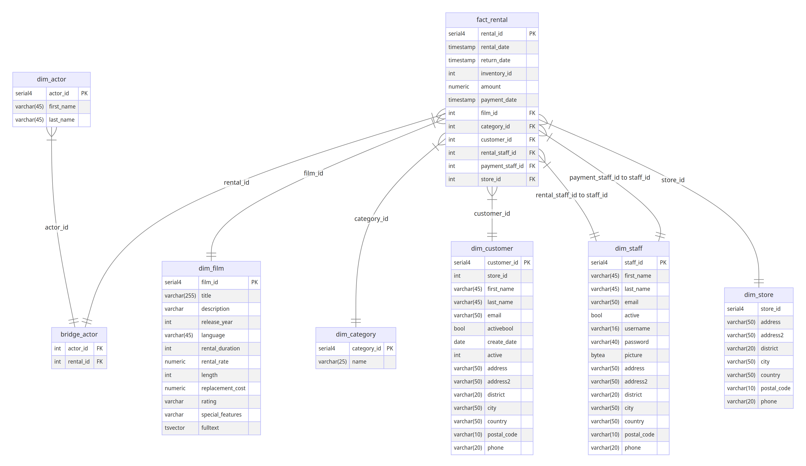

# Advanced SQL queries

As a Data Engineer, you will have to manipulate data to process it and help the organization find valuable insights. To do so, you should learn the basics of SQL to work with data in different ways.

This time, you will be working with a DVD rental sample dataset where you will find information about stores, customers, and rented films. Below you will find the diagram with the relationships between the tables and a brief description of each one.

The purpose of this assignment is to answer business questions using SQL language to query the database. The idea is that you get the same answer that is shown in each exercise.

**After this assignment you'll be able to:**

- Build SQL queries using several techniques to manipulate data.
- Distinguish between Common Table Expressions and Subqueries.
- Apply the `DATE_PART` function to manipulate date values.
- Make use of the `LAG` and `LEAD` functions to access values from other rows when making a calculation.
- Utilize the `CASE` statement to return different values based on conditions.
- Use window functions on SQL to aggregate data within a specific window.
- Understand pivot tables and identify how they are built.

# Table of Contents

- [ 1 - Database](#1)
  - [ 1.1 - Tables](#1.1)
  - [ 1.2 - Running SQL Commands in a Notebook](#1.2)
- [ 2 - Complex Queries](#2)
  - [ 2.1 - Logical Operators](#2.1)
  - [ 2.2 - Common Table Expressions (CTEs)](#2.2)
    - [ Exercise 1](#ex01)
  - [ 2.3 - Subqueries](#2.3)
    - [ Exercise 2](#ex02)
  - [ 2.4 - `CASE` Statement](#2.4)
    - [ Exercise 3](#ex03)
  - [ 2.5 - Pivot Tables](#2.5)
    - [ Exercise 4](#ex04)
    - [ Exercise 5](#ex05)
- [ 3 - SQL Functions](#3)
  - [ 3.1 - Working with Dates](#3.1)
    - [ Exercise 6](#ex06)
  - [ 3.2 - `SUBSTRING`](#3.2)
    - [ Exercise 7](#ex07)
  - [ 3.3 - Window Functions](#3.3)
    - [ Exercise 8](#ex08)
    - [ Exercise 9](#ex09)
  - [ 3.4 - `LAG`](#3.4)
    - [ Exercise 10](#ex10)
  - [ 3.5 - `LEAD`](#3.5)
    - [ Exercise 11](#ex11)
    - [ Exercise 12](#ex12)


<a name='1'></a>
## 1 - Database

You will be working with a modified version of the [Sakila Sample Database](https://dev.mysql.com/doc/sakila/en/), which is licensed under the [New BSD license](https://dev.mysql.com/doc/sakila/en/sakila-license.html).

For learning purposes, let's assume that the data belongs to _Rentio_, which is a fictitious company dedicated to renting movies to clients from all around the world. The company has a Dimensional Model created to perform analytical queries based on the data of the staff and the stores, including inventory, films, and paying customers. The management team would like to make informed decisions based on the available data.

Your task will be to design and build analytical queries based on Rentio's Dimensional Model stored in their Data Warehouse.


<a name='1.1'></a>
### 1.1 - Tables

Rentio's Dimensional Model includes the following tables.

- `fact_rental`: Contains the amount of the payment for a particular rental registry as the metric. This rental registry associates a film with its corresponding category, a customer, a rental date and a payment date. It is also related to the store where the film was rented and the staff member who rented it.
- `dim_film`: Contains information about films including the title, language, rating, and release year.
- `dim_customer`: Contains customer data including name, address, and email.
- `dim_store`: Contains store data such as the manager and store address.
- `dim_staff`: Contains staff data such as first name, last name, stores where they work, and staff status (active or not).
- `dim_category`: Stores the relationship between the film and the category it belongs to. Contains the `category_id` and `name` for each category: Action, Comedy, Documentary, Sci-Fi, among others.
- `dim_actor`: Contains the actor's data such as first and last name.
- `bridge_actor`: A bridge table relating each `actor_id` with each `rental_id`.

Here you can find the entity-relationship model (ERM) of the star schema showing all the tables and how they are related:



<a name='1.2'></a>
### 1.2 - Running SQL Commands in a Notebook

To interact with SQL Databases within a JupyterLab notebook, you will use the SQL "magic" offered by the `ipython-sql` extension. JupyterLab defines "magic" as special commands prefixed with `%`. Here, we'll employ the `load_ext` magic to load the `ipython-sql` extension.


```python
# Loading the SQL module
%load_ext sql
```

The provided magic command loads the `ipython-sql` extension, enabling connection to databases supported by [SQLAlchemy](https://www.sqlalchemy.org/features.html). In this example, you'll connect to an existing MySQL database. However, to proceed, it's essential to obtain your credentials and establish a connection to the MySQL database, which is done in the `src/env` file.


```python
import os 
import socket

from dotenv import load_dotenv

load_dotenv('./src/env', override=True)

DBHOST = socket.gethostname()
DBPORT = os.getenv('DBPORT')
DBNAME = os.getenv('DBNAME')
DBUSER = os.getenv('DBUSER')
DBPASSWORD = os.getenv('DBPASSWORD')

connection_url = f'mysql+pymysql://{DBUSER}:{DBPASSWORD}@{DBHOST}:{DBPORT}/{DBNAME}'

%sql {connection_url}
```

Some of the queries in this notebook are quite complicated. You will find optional exercises that will help you to reach the final query step-by-step.

<a name='2'></a>
## 2 - Complex Queries

<a name='2.1'></a>
### 2.1 - Logical Operators

`WHERE` clause is used to filter data based on a condition. If you want to use multiple conditions you will need to use logical operators.

The `AND` operator returns the records for those that meet all the conditions applied in the operator.

```sql
SELECT
    *
FROM table_name
WHERE
    column1 = 'value1'
    AND column2 < 'value2'
    AND column3 > 'value3';
```

The `OR` operator returns the records for those that meet at least one of the conditions applied in the operator.

```sql
SELECT
    *
FROM table_name
WHERE
    column1 = 'value1'
    OR column2 < 'value2'
    OR column3 > 'value3';
```

The `NOT` operator is used in a condition to reverse its result.

```sql
SELECT
    *
FROM table_name
WHERE NOT column1 = 'value1';
```


<a name='ex01'></a>
### Exercise 1

Write an SQL query to get the total amount obtained from the renting of Travel, Family, and Children films during the months of June and July of 2005. Present the results grouped and ordered by store id and category name.

- You can start by filling in the section starting from the keyword `FROM`. You will need to join `fact_rental` and `dim_category` tables by the `category_id` column.
- To filter required records, fill in the section after the clause `WHERE`. To get the three different category names, you can pass an [array](https://www.tutorialspoint.com/passing-an-array-to-a-query-using-where-clause-in-mysql) `('Travel', 'Family', 'Children')`. The `rental_date` should be [`BETWEEN`](https://www.w3schools.com/mysql/mysql_between.asp) `'2005-06-01'` and `'2005-08-01'`. Note that you will need to use the `AND` clause between those two conditions.
- Group by the `store_id` and the category name and order by the same two columns.
- Fill in the section after the `SELECT` clause to show `store_id`, category name and `SUM()` of the `amount`.

*Note*: Remember that a good practice when exploring your tables for the first time is to set a `LIMIT`, mostly if you want to get all columns from a table with the `*` wildcard.


```sql
%%sql
SELECT
    store_id,
    dim_category.name AS category_name,
    SUM(amount) AS total_amount
FROM
    fact_rental
    INNER JOIN dim_category ON fact_rental.category_id = dim_category.category_id
WHERE
    dim_category.name IN ('Travel', 'Family', 'Children')
    AND fact_rental.rental_date BETWEEN '2005-06-01' AND '2005-08-01'
GROUP BY
    store_id,
    dim_category.name
ORDER BY
    store_id,
    dim_category.name;
```

     * mysql+pymysql://:***@1264ded65b07:3306/sakila_star
    6 rows affected.


<table>
    <thead>
        <tr>
            <th>store_id</th>
            <th>category_name</th>
            <th>total_amount</th>
        </tr>
    </thead>
    <tbody>
        <tr>
            <td>1</td>
            <td>Children</td>
            <td>1004.38</td>
        </tr>
        <tr>
            <td>1</td>
            <td>Family</td>
            <td>1182.09</td>
        </tr>
        <tr>
            <td>1</td>
            <td>Travel</td>
            <td>901.91</td>
        </tr>
        <tr>
            <td>2</td>
            <td>Children</td>
            <td>973.39</td>
        </tr>
        <tr>
            <td>2</td>
            <td>Family</td>
            <td>1144.00</td>
        </tr>
        <tr>
            <td>2</td>
            <td>Travel</td>
            <td>1050.52</td>
        </tr>
    </tbody>
</table>


##### __Expected Output__ 

| **store_id** | **category_name** | **total_amount** |
| ------------ | ----------------- | ---------------- |
| 1            | Children          | 1004.38          |
| 1            | Family            | 1182.09          |
| 1            | Travel            | 901.91           |
| 2            | Children          | 973.39           |
| 2            | Family            | 1144.00          |
| 2            | Travel            | 1050.52          |

<a name='2.2'></a>
### 2.2 - Common Table Expressions (CTEs)

A **Common Table Expression (CTE)** is used to create a temporary result set that can be referenced in another query. It only exists during the execution of a query.

```sql
WITH temp_results AS (
    SELECT
        column1,
        column2
    FROM table1
    WHERE column2 = 'value1'
)
SELECT
    *
FROM table2
INNER JOIN temp_results
ON temp_results.column1 = table2.column1;
```

<a name='ex02'></a>
### Exercise 2

Write an SQL query using a CTE to get the average number of films per category. Then, calculate the average rounded down and rounded up.

#### Optional Exercise 2.1

You can start by creating a query to extract the `category_id` and `film_id` from the `fact_rental`. Use [`DISTINCT`](https://www.w3schools.com/sql/sql_distinct.asp) and `LIMIT`. To compare your results with the expected output, you can order by the `category_id` and `film_id`.


```sql
%%sql
SELECT DISTINCT 
    category_id, 
    film_id
FROM
    fact_rental
ORDER BY
    category_id,
    film_id
LIMIT 10;
```

     * mysql+pymysql://:***@1264ded65b07:3306/sakila_star
    10 rows affected.


<table>
    <thead>
        <tr>
            <th>category_id</th>
            <th>film_id</th>
        </tr>
    </thead>
    <tbody>
        <tr>
            <td>1</td>
            <td>19</td>
        </tr>
        <tr>
            <td>1</td>
            <td>21</td>
        </tr>
        <tr>
            <td>1</td>
            <td>29</td>
        </tr>
        <tr>
            <td>1</td>
            <td>56</td>
        </tr>
        <tr>
            <td>1</td>
            <td>67</td>
        </tr>
        <tr>
            <td>1</td>
            <td>97</td>
        </tr>
        <tr>
            <td>1</td>
            <td>105</td>
        </tr>
        <tr>
            <td>1</td>
            <td>111</td>
        </tr>
        <tr>
            <td>1</td>
            <td>115</td>
        </tr>
        <tr>
            <td>1</td>
            <td>126</td>
        </tr>
    </tbody>
</table>


##### __Expected Output__ 

*Note*: Not all of the records are shown here.

| **category_id** | **film_id** |
| --------------- | ----------- |
| 1               | 19          |
| 1               | 21          |
| 1               | 29          |
| ...             | ...         |

#### Optional Exercise 2.2

Let's practice writing Common Table Expressions (CTEs). Use optional exercise 2.1 without the `LIMIT` and `ORDER BY` statements as the code base to create a temporary result table named `film_category`. From the CTE `film_category`, select the `category_id` and aggregate the number of films in each category using the `COUNT()` function. Name the output column as `films`. Perform grouping by `category_id`. To check your result against the expected output, add the `ORDER BY` column `category_id` and `LIMIT` for the top 10 rows.


```sql
%%sql
WITH film_category AS (
    SELECT DISTINCT 
        category_id,
        film_id
    FROM
        fact_rental
)
SELECT
    category_id,
    COUNT(1) AS films
FROM
    film_category
GROUP BY
    category_id
ORDER BY
    category_id
LIMIT 10;
```

     * mysql+pymysql://:***@1264ded65b07:3306/sakila_star
    10 rows affected.


<table>
    <thead>
        <tr>
            <th>category_id</th>
            <th>films</th>
        </tr>
    </thead>
    <tbody>
        <tr>
            <td>1</td>
            <td>61</td>
        </tr>
        <tr>
            <td>2</td>
            <td>64</td>
        </tr>
        <tr>
            <td>3</td>
            <td>58</td>
        </tr>
        <tr>
            <td>4</td>
            <td>54</td>
        </tr>
        <tr>
            <td>5</td>
            <td>56</td>
        </tr>
        <tr>
            <td>6</td>
            <td>63</td>
        </tr>
        <tr>
            <td>7</td>
            <td>61</td>
        </tr>
        <tr>
            <td>8</td>
            <td>67</td>
        </tr>
        <tr>
            <td>9</td>
            <td>67</td>
        </tr>
        <tr>
            <td>10</td>
            <td>58</td>
        </tr>
    </tbody>
</table>


##### __Expected Output__ 

*Note*: Not all of the records are shown here.

| **category_id** | **films**   |
| --------------- | ----------- |
| 1               | 61          |
| 2               | 64          |
| 3               | 58          |
| 4               | 54          |
| 5               | 56          |
| 6               | 63          |
| ...             | ...         |

#### Optional Exercise 2.3

In this exercise, create a query with 2 CTEs. The first CTE uses the code for `film_category` as in optional exercise 2.2, and the second CTE is based on the code for the `SELECT` part of the query for optional exercise 2.2, naming the second CTE as `film_category_count`. Here is the scheme showing how to use two CTEs in the query:


```sql
WITH temp_results AS (
    SELECT
        column1,
        column2
    FROM table1
    WHERE column2 = 'value1'
),
temp_results_2 AS (
    SELECT
        *
    FROM table2
    INNER JOIN temp_results
    ON temp_results.column1 = table2.column1;
)
SELECT
    *
FROM temp_results_2
```


To calculate the average number of unique films from all categories, `average_by_category`, use the CTE `film_category_count`, averaging all the film counts with the `AVG()` function applied to `films` column.


```sql
%%sql
WITH film_category AS (
    SELECT DISTINCT 
        category_id,
        film_id
    FROM
        fact_rental
),
film_category_count AS (
    SELECT
        category_id,
        COUNT(1) AS films
    FROM
        film_category
    GROUP BY
        category_id
    ORDER BY
        category_id
)
SELECT
    AVG(films) AS average_by_category
FROM
    film_category_count;
```

     * mysql+pymysql://:***@1264ded65b07:3306/sakila_star
    1 rows affected.


<table>
    <thead>
        <tr>
            <th>average_by_category</th>
        </tr>
    </thead>
    <tbody>
        <tr>
            <td>59.8750</td>
        </tr>
    </tbody>
</table>


##### __Expected Output__ 

| **average_by_category** |
| ----------------------- |
| 59.8750                 |

#### Optional Exercise 2.4

Use the query from the optional exercise 2.3. Wrap the last part into a CTE with the name `films_average_by_category`. From `films_average_by_category` select `average_by_category`, and also apply the `FLOOR()` and `CEIL()` functions to `average_by_category` to create separate columns for each function's result. This will give you the final output.


```sql
%%sql
WITH film_category AS (
    SELECT DISTINCT 
        category_id,
        film_id
    FROM
        fact_rental
),
film_category_count AS (
    SELECT
        category_id,
        COUNT(1) AS films
    FROM
        film_category
    GROUP BY
        category_id
    ORDER BY
        category_id
),
films_average_by_category AS (
    SELECT
        AVG(films) AS average_by_category
    FROM
        film_category_count
)
SELECT
    average_by_category AS average,
    FLOOR(average_by_category) AS average_down,
    CEIL(average_by_category) AS average_up
FROM
    films_average_by_category;
```

     * mysql+pymysql://:***@1264ded65b07:3306/sakila_star
    1 rows affected.


<table>
    <thead>
        <tr>
            <th>average</th>
            <th>average_down</th>
            <th>average_up</th>
        </tr>
    </thead>
    <tbody>
        <tr>
            <td>59.8750</td>
            <td>59</td>
            <td>60</td>
        </tr>
    </tbody>
</table>


##### __Expected Output__ 

| **average** | **average_down** | **average_up** |
| ----------- | ---------------- | -------------- |
| 59.875      | 59               | 60             |

<a name='2.3'></a>
### 2.3 - Subqueries

A **subquery** is a query nested inside another query. The inner queries will be executed first and their results will be passed into the outer queries in order to be executed.

```sql
SELECT
    *
FROM table1
WHERE column1 > (
    SELECT AVG(column1)
    FROM table1
);
```


<a name='ex03'></a>
### Exercise 3

Write an SQL query using a subquery to get the film categories that have the number of films above the average rounded up calculated in the previous exercise.

#### Optional Exercise 3.1

Start by using the following two CTEs from the previous exercise 2: `film_category` and `film_category_count`. Then from the `film_category_count` CTE, select the average number of films, but enclose this result inside the `CEIL` function. Name this result as `average_by_category`.


```sql
%%sql
WITH film_category AS (
    SELECT DISTINCT 
        category_id,
        film_id
    FROM
        fact_rental
),
film_category_count AS (
    SELECT
        category_id,
        COUNT(1) AS films
    FROM
        film_category
    GROUP BY
        category_id
    ORDER BY
        category_id
)
SELECT
    CEIL(AVG(films)) AS average_by_category
FROM
    film_category_count;
```

     * mysql+pymysql://:***@1264ded65b07:3306/sakila_star
    1 rows affected.


<table>
    <thead>
        <tr>
            <th>average_by_category</th>
        </tr>
    </thead>
    <tbody>
        <tr>
            <td>60</td>
        </tr>
    </tbody>
</table>


##### __Expected Output__ 

| **average_by_category** |
| ----------------------- |
| 60                      |


#### Optional Exercise 3.2

Use the same two CTEs `film_category` and `film_category_count`. Then, select all columns from `film_category_count`. Create a condition where you will compare the `films` column with the result of the main query that you created in the previous optional exercise 3.1, but now you will use it as a subquery and you won't need to rename the column as `average_by_category`.


```sql
%%sql
WITH film_category AS (
    SELECT DISTINCT 
        category_id,
        film_id
    FROM
        fact_rental
),
film_category_count AS (
    SELECT
        category_id,
        COUNT(1) AS films
    FROM
        film_category
    GROUP BY
        category_id
    ORDER BY
        category_id
)
SELECT
    *
FROM
    film_category_count
WHERE
    films > (
        SELECT
            CEIL(AVG(films))
        FROM
            film_category_count
    );
```

     * mysql+pymysql://:***@1264ded65b07:3306/sakila_star
    7 rows affected.


<table>
    <thead>
        <tr>
            <th>category_id</th>
            <th>films</th>
        </tr>
    </thead>
    <tbody>
        <tr>
            <td>1</td>
            <td>61</td>
        </tr>
        <tr>
            <td>2</td>
            <td>64</td>
        </tr>
        <tr>
            <td>6</td>
            <td>63</td>
        </tr>
        <tr>
            <td>7</td>
            <td>61</td>
        </tr>
        <tr>
            <td>8</td>
            <td>67</td>
        </tr>
        <tr>
            <td>9</td>
            <td>67</td>
        </tr>
        <tr>
            <td>15</td>
            <td>73</td>
        </tr>
    </tbody>
</table>


##### __Expected Output__ 

| **category_id** | **films** |
| --------------- | --------- |
| 1               | 61        |
| 2               | 64        |
| 6               | 63        |
| 7               | 61        |
| 8               | 67        |
| 9               | 67        |
| 15              | 73        |

#### Optional Exercise 3.3

In the previous optional exercise, you've got nearly the final result, but now you need to load the category names instead of the IDs.
- Take the query from the optional exercise 3.2.
- Delete `ORDER BY` statements in both of the CTEs.
- Add `INNER JOIN` statement into the CTE `film_category` joining the `fact_rental` table with the table `dim_category` based on the `category_id`. In the same CTE change the selection of `category_id` to `dim_category.category_id` and add `dim_category.name category,` to pull the category name as a `category` column.
- In the CTE `film_category_count` select also `category` in addition to `category_id`.
- In the very last selection exchange `*` with the `category` and `films`. You can also add `ORDER BY` statement using `category` column.

This should give you the final result.


```sql
%%sql
WITH film_category AS (
    SELECT DISTINCT 
        fact_rental.category_id,
        dim_category.name AS category,
        film_id
    FROM
        fact_rental
        INNER JOIN dim_category ON fact_rental.category_id = dim_category.category_id
),
film_category_count AS (
    SELECT
        category_id,
        category,
        COUNT(1) AS films
    FROM
        film_category
    GROUP BY
        category_id
)
SELECT
    category,
    films
FROM
    film_category_count
WHERE
    films > (
        SELECT
            CEIL(AVG(films))
        FROM
            film_category_count
    )
ORDER BY
    category;
```

     * mysql+pymysql://:***@1264ded65b07:3306/sakila_star
    7 rows affected.


<table>
    <thead>
        <tr>
            <th>category</th>
            <th>films</th>
        </tr>
    </thead>
    <tbody>
        <tr>
            <td>Action</td>
            <td>61</td>
        </tr>
        <tr>
            <td>Animation</td>
            <td>64</td>
        </tr>
        <tr>
            <td>Documentary</td>
            <td>63</td>
        </tr>
        <tr>
            <td>Drama</td>
            <td>61</td>
        </tr>
        <tr>
            <td>Family</td>
            <td>67</td>
        </tr>
        <tr>
            <td>Foreign</td>
            <td>67</td>
        </tr>
        <tr>
            <td>Sports</td>
            <td>73</td>
        </tr>
    </tbody>
</table>


##### __Expected Output__ 

| **category** | **films** |
| ------------ | --------- |
| Action       | 61        |
| Animation    | 64        |
| Documentary  | 63        |
| Drama        | 61        |
| Family       | 67        |
| Foreign      | 67        |
| Sports       | 73        |

<a name='2.4'></a>
### 2.4 - `CASE` Statement

The CASE statement works like an if statement in programming. It will evaluate some conditions and return a value when the first condition is met. If no conditions are met it will return the value used in the ELSE clause.

```sql
SELECT
    CASE
        WHEN column1 < 0 THEN 'value1'
        WHEN column1 > 0 THEN 'value2'
        ...
        ELSE 'value3'
    END
    column2
FROM table_name;
```

<a name='ex04'></a>
### Exercise 4

Write an SQL query to get the maximum purchase amount by customers on `2007-04-30` between `15:00` and `16:00`. Obtain the customer's full name in capital letters, the maximum purchase amount, and the payment date. Then, create a column called `value_rate`, and assign the `low` label if the amount is between 0 and 3, the `mid` label if it is between 3 and 6, and the `high` label if it is above 6. Sort by the maximum purchase amount in descending order and full name in ascending order.

#### Optional Exercise 4.1

Start by creating a query to extract from the `fact_rental` table these columns: the customer ID, the maximum `amount` named as `max_amount` (use function `MAX()`) and from `payment_date` column get only the date without hours. Use function `DATE()` naming the resulting column as `payment_date`. Constrain your results to the date times between '2007-04-30 15:00:00' and '2007-04-30 16:00:00'. Remember to group by the customer identifier and by the `payment_date`(only date, without hours, so the `DATE()` function should be applied there as well).

Limit the output to 10 records just for this optional exercise.


```sql
%%sql
SELECT
    customer_id,
    MAX(amount) AS max_amount,
    DATE(payment_date) AS payment_date
FROM
    fact_rental
WHERE
    payment_date BETWEEN '2007-04-30 15:00:00'
    AND '2007-04-30 16:00:00'
GROUP BY
    customer_id,
    DATE(payment_date)
LIMIT 10;
```

     * mysql+pymysql://:***@1264ded65b07:3306/sakila_star
    10 rows affected.


<table>
    <thead>
        <tr>
            <th>customer_id</th>
            <th>max_amount</th>
            <th>payment_date</th>
        </tr>
    </thead>
    <tbody>
        <tr>
            <td>555</td>
            <td>7.99</td>
            <td>2007-04-30</td>
        </tr>
        <tr>
            <td>571</td>
            <td>1.99</td>
            <td>2007-04-30</td>
        </tr>
        <tr>
            <td>174</td>
            <td>4.99</td>
            <td>2007-04-30</td>
        </tr>
        <tr>
            <td>55</td>
            <td>2.99</td>
            <td>2007-04-30</td>
        </tr>
        <tr>
            <td>186</td>
            <td>2.99</td>
            <td>2007-04-30</td>
        </tr>
        <tr>
            <td>296</td>
            <td>2.99</td>
            <td>2007-04-30</td>
        </tr>
        <tr>
            <td>82</td>
            <td>8.99</td>
            <td>2007-04-30</td>
        </tr>
        <tr>
            <td>336</td>
            <td>0.99</td>
            <td>2007-04-30</td>
        </tr>
        <tr>
            <td>538</td>
            <td>0.99</td>
            <td>2007-04-30</td>
        </tr>
        <tr>
            <td>267</td>
            <td>6.99</td>
            <td>2007-04-30</td>
        </tr>
    </tbody>
</table>


##### __Expected Output__

*Note*: Not all of the records are shown here.

| **customer_id** | **max_amount** | **payment_date** |
| --------------- | -------------- | ---------------- |
| 555             | 7.99           | 2007-04-30       |
| 571             | 1.99           | 2007-04-30       |
| 174             | 4.99           | 2007-04-30       |
| ...             | ...            | ...              |

#### Optional Exercise 4.2

Use the previous query as a CTE `max_amount_customer` (without the `LIMIT` statement). Then, create a query expression following these steps:
- Join the `dim_customer` table with the CTE result on the `customer_id` column.
- Review how [`CONCAT`](https://www.w3schools.com/sql/func_mysql_concat.asp) and [`UPPER`](https://www.w3schools.com/sql/func_mysql_upper.asp) functions are used in the `SELECT` statement to get the full name in capital letters.
- Extract the `max_amount` and `payment_date`.
- Use a `CASE WHEN` clause and compare the `max_amount` column with the corresponding values.
- Order by the `max_amount` in a descending way while order by `full_name` in an ascending way.

This should give you the expected final result.


```sql
%%sql
WITH max_amount_customer AS (
    SELECT
        customer_id,
        MAX(amount) AS max_amount,
        DATE(payment_date) AS payment_date
    FROM
        fact_rental
    WHERE
        payment_date BETWEEN '2007-04-30 15:00:00'
        AND '2007-04-30 16:00:00'
    GROUP BY
        customer_id,
        DATE(payment_date)
)
SELECT
    CONCAT(
        UPPER(dim_customer.first_name),
        ' ',
        UPPER(dim_customer.last_name)
    ) AS full_name,
    max_amount,
    payment_date,
    CASE
        WHEN max_amount >= 0
        AND max_amount < 3 THEN 'low'
        WHEN max_amount >= 3
        AND max_amount < 6 THEN 'mid'
        WHEN max_amount >= 6 THEN 'high'
    END AS value_rate
FROM
    max_amount_customer
    INNER JOIN dim_customer ON max_amount_customer.customer_id = dim_customer.customer_id
ORDER BY
    max_amount DESC,
    full_name ASC;
```

     * mysql+pymysql://:***@1264ded65b07:3306/sakila_star
    54 rows affected.


<table>
    <thead>
        <tr>
            <th>full_name</th>
            <th>max_amount</th>
            <th>payment_date</th>
            <th>value_rate</th>
        </tr>
    </thead>
    <tbody>
        <tr>
            <td>KATHRYN COLEMAN</td>
            <td>8.99</td>
            <td>2007-04-30</td>
            <td>high</td>
        </tr>
        <tr>
            <td>LOUIS LEONE</td>
            <td>8.99</td>
            <td>2007-04-30</td>
            <td>high</td>
        </tr>
        <tr>
            <td>ROY WHITING</td>
            <td>8.99</td>
            <td>2007-04-30</td>
            <td>high</td>
        </tr>
        <tr>
            <td>CARRIE PORTER</td>
            <td>7.99</td>
            <td>2007-04-30</td>
            <td>high</td>
        </tr>
        <tr>
            <td>DWIGHT LOMBARDI</td>
            <td>7.99</td>
            <td>2007-04-30</td>
            <td>high</td>
        </tr>
        <tr>
            <td>MARION SNYDER</td>
            <td>7.99</td>
            <td>2007-04-30</td>
            <td>high</td>
        </tr>
        <tr>
            <td>ALEXANDER FENNELL</td>
            <td>6.99</td>
            <td>2007-04-30</td>
            <td>high</td>
        </tr>
        <tr>
            <td>BESSIE MORRISON</td>
            <td>6.99</td>
            <td>2007-04-30</td>
            <td>high</td>
        </tr>
        <tr>
            <td>BRANDON HUEY</td>
            <td>6.99</td>
            <td>2007-04-30</td>
            <td>high</td>
        </tr>
        <tr>
            <td>DAVID ROYAL</td>
            <td>6.99</td>
            <td>2007-04-30</td>
            <td>high</td>
        </tr>
        <tr>
            <td>DERRICK BOURQUE</td>
            <td>6.99</td>
            <td>2007-04-30</td>
            <td>high</td>
        </tr>
        <tr>
            <td>GEORGE LINTON</td>
            <td>6.99</td>
            <td>2007-04-30</td>
            <td>high</td>
        </tr>
        <tr>
            <td>MARGIE WADE</td>
            <td>6.99</td>
            <td>2007-04-30</td>
            <td>high</td>
        </tr>
        <tr>
            <td>ROSA REYNOLDS</td>
            <td>6.99</td>
            <td>2007-04-30</td>
            <td>high</td>
        </tr>
        <tr>
            <td>BYRON BOX</td>
            <td>5.99</td>
            <td>2007-04-30</td>
            <td>mid</td>
        </tr>
        <tr>
            <td>LYDIA BURKE</td>
            <td>5.99</td>
            <td>2007-04-30</td>
            <td>mid</td>
        </tr>
        <tr>
            <td>STEPHANIE MITCHELL</td>
            <td>5.99</td>
            <td>2007-04-30</td>
            <td>mid</td>
        </tr>
        <tr>
            <td>ANGEL BARCLAY</td>
            <td>4.99</td>
            <td>2007-04-30</td>
            <td>mid</td>
        </tr>
        <tr>
            <td>ARLENE HARVEY</td>
            <td>4.99</td>
            <td>2007-04-30</td>
            <td>mid</td>
        </tr>
        <tr>
            <td>DIANA ALEXANDER</td>
            <td>4.99</td>
            <td>2007-04-30</td>
            <td>mid</td>
        </tr>
        <tr>
            <td>ERIK GUILLEN</td>
            <td>4.99</td>
            <td>2007-04-30</td>
            <td>mid</td>
        </tr>
        <tr>
            <td>FRED WHEAT</td>
            <td>4.99</td>
            <td>2007-04-30</td>
            <td>mid</td>
        </tr>
        <tr>
            <td>VANESSA SIMS</td>
            <td>4.99</td>
            <td>2007-04-30</td>
            <td>mid</td>
        </tr>
        <tr>
            <td>WILLARD LUMPKIN</td>
            <td>4.99</td>
            <td>2007-04-30</td>
            <td>mid</td>
        </tr>
        <tr>
            <td>YVONNE WATKINS</td>
            <td>4.99</td>
            <td>2007-04-30</td>
            <td>mid</td>
        </tr>
        <tr>
            <td>MONICA HICKS</td>
            <td>3.99</td>
            <td>2007-04-30</td>
            <td>mid</td>
        </tr>
        <tr>
            <td>SHEILA WELLS</td>
            <td>3.99</td>
            <td>2007-04-30</td>
            <td>mid</td>
        </tr>
        <tr>
            <td>STACY CUNNINGHAM</td>
            <td>3.99</td>
            <td>2007-04-30</td>
            <td>mid</td>
        </tr>
        <tr>
            <td>AGNES BISHOP</td>
            <td>2.99</td>
            <td>2007-04-30</td>
            <td>low</td>
        </tr>
        <tr>
            <td>ANNE POWELL</td>
            <td>2.99</td>
            <td>2007-04-30</td>
            <td>low</td>
        </tr>
        <tr>
            <td>DARYL LARUE</td>
            <td>2.99</td>
            <td>2007-04-30</td>
            <td>low</td>
        </tr>
        <tr>
            <td>DORIS REED</td>
            <td>2.99</td>
            <td>2007-04-30</td>
            <td>low</td>
        </tr>
        <tr>
            <td>EDWIN BURK</td>
            <td>2.99</td>
            <td>2007-04-30</td>
            <td>low</td>
        </tr>
        <tr>
            <td>HELEN HARRIS</td>
            <td>2.99</td>
            <td>2007-04-30</td>
            <td>low</td>
        </tr>
        <tr>
            <td>HERBERT KRUGER</td>
            <td>2.99</td>
            <td>2007-04-30</td>
            <td>low</td>
        </tr>
        <tr>
            <td>HOLLY FOX</td>
            <td>2.99</td>
            <td>2007-04-30</td>
            <td>low</td>
        </tr>
        <tr>
            <td>IRENE PRICE</td>
            <td>2.99</td>
            <td>2007-04-30</td>
            <td>low</td>
        </tr>
        <tr>
            <td>JESUS MCCARTNEY</td>
            <td>2.99</td>
            <td>2007-04-30</td>
            <td>low</td>
        </tr>
        <tr>
            <td>LESLIE SEWARD</td>
            <td>2.99</td>
            <td>2007-04-30</td>
            <td>low</td>
        </tr>
        <tr>
            <td>MARION OCAMPO</td>
            <td>2.99</td>
            <td>2007-04-30</td>
            <td>low</td>
        </tr>
        <tr>
            <td>MEGAN PALMER</td>
            <td>2.99</td>
            <td>2007-04-30</td>
            <td>low</td>
        </tr>
        <tr>
            <td>MELISSA KING</td>
            <td>2.99</td>
            <td>2007-04-30</td>
            <td>low</td>
        </tr>
        <tr>
            <td>MORRIS MCCARTER</td>
            <td>2.99</td>
            <td>2007-04-30</td>
            <td>low</td>
        </tr>
        <tr>
            <td>RAMONA HALE</td>
            <td>2.99</td>
            <td>2007-04-30</td>
            <td>low</td>
        </tr>
        <tr>
            <td>SHAWN HEATON</td>
            <td>2.99</td>
            <td>2007-04-30</td>
            <td>low</td>
        </tr>
        <tr>
            <td>VINCENT RALSTON</td>
            <td>2.99</td>
            <td>2007-04-30</td>
            <td>low</td>
        </tr>
        <tr>
            <td>AMANDA CARTER</td>
            <td>1.99</td>
            <td>2007-04-30</td>
            <td>low</td>
        </tr>
        <tr>
            <td>JOHNNIE CHISHOLM</td>
            <td>1.99</td>
            <td>2007-04-30</td>
            <td>low</td>
        </tr>
        <tr>
            <td>STEPHEN QUALLS</td>
            <td>1.99</td>
            <td>2007-04-30</td>
            <td>low</td>
        </tr>
        <tr>
            <td>ANITA MORALES</td>
            <td>0.99</td>
            <td>2007-04-30</td>
            <td>low</td>
        </tr>
        <tr>
            <td>JOSHUA MARK</td>
            <td>0.99</td>
            <td>2007-04-30</td>
            <td>low</td>
        </tr>
        <tr>
            <td>KEVIN SCHULER</td>
            <td>0.99</td>
            <td>2007-04-30</td>
            <td>low</td>
        </tr>
        <tr>
            <td>RACHEL BARNES</td>
            <td>0.99</td>
            <td>2007-04-30</td>
            <td>low</td>
        </tr>
        <tr>
            <td>TED BREAUX</td>
            <td>0.99</td>
            <td>2007-04-30</td>
            <td>low</td>
        </tr>
    </tbody>
</table>


##### __Expected Output__

*Note*: Not all of the records are shown here.

| **full_name**      | **max_amount** | **payment_date** | **value_rate** |
| ------------------ | -------------- | ---------------- | -------------- |
| KATHRYN COLEMAN    | 8.99           | 2007-04-30       | high           |
| LOUIS LEONE        | 8.99           | 2007-04-30       | high           |
| ROY WHITING        | 8.99           | 2007-04-30       | high           |
| CARRIE PORTER      | 7.99           | 2007-04-30       | high           |
| DWIGHT LOMBARDI    | 7.99           | 2007-04-30       | high           |
| MARION SNYDER      | 7.99           | 2007-04-30       | high           |
| ALEXANDER FENNELL  | 6.99           | 2007-04-30       | high           |
| BESSIE MORRISON    | 6.99           | 2007-04-30       | high           |
| BRANDON HUEY       | 6.99           | 2007-04-30       | high           |
| DAVID ROYAL        | 6.99           | 2007-04-30       | high           |
| DERRICK BOURQUE    | 6.99           | 2007-04-30       | high           |
| GEORGE LINTON      | 6.99           | 2007-04-30       | high           |
| MARGIE WADE        | 6.99           | 2007-04-30       | high           |
| ROSA REYNOLDS      | 6.99           | 2007-04-30       | high           |
| BYRON BOX          | 5.99           | 2007-04-30       | mid            |
| LYDIA BURKE        | 5.99           | 2007-04-30       | mid            |
| STEPHANIE MITCHELL | 5.99           | 2007-04-30       | mid            |
| ANGEL BARCLAY      | 4.99           | 2007-04-30       | mid            |
| ARLENE HARVEY      | 4.99           | 2007-04-30       | mid            |
| DIANA ALEXANDER    | 4.99           | 2007-04-30       | mid            |
| ...                | ...            | ...              | ...            |

<a name='2.5'></a>
### 2.5 - Pivot Tables

A **pivot table** is a term used to describe a rotated table with one or more categories as columns used to aggregate the items by a specific value.

For example, let's say you want to pivot the following table by `category` while adding the `value`.

| **id** | **category** | **value** |
| ------ | ------------ | --------- |
| 1      | category1    | 1.0       |
| 1      | category1    | 1.5       |
| 1      | category2    | 1.0       |
| 1      | category2    | 1.5       |
| 2      | category1    | 2.0       |
| 2      | category1    | 2.5       |
| 2      | category2    | 2.0       |
| 2      | category2    | 2.5       |
| 3      | category1    | 3.0       |
| 3      | category1    | 3.5       |
| 3      | category2    | 3.0       |
| 3      | category2    | 3.5       |
| ...    | ...          | ...       |

Then you should get the following result.

| **id** | **category1** | **category2** |
| ------ | ------------- | ------------- |
| 1      | 2.5           | 2.5           |
| 2      | 4.5           | 4.5           |
| 3      | 6.5           | 6.5           |
| ...    | ...           | ...           |

<a name='ex05'></a>
### Exercise 5

Based on rental orders, write an SQL query to get the customer's full name, film category, and payment amount by customer and film category. Sort the results by the customer's full name, film category, and payment amount in ascending order.
    
- Use the `fact_rental` table as the main table for the queries. You will have to join with two additional tables in the following way:
    - Join `fact_rental` with `dim_customer` by the `customer_id`.
    - Join `fact_rental` with `dim_category` by the `category_id`.
    - All joins must be inner joins.
- In the `SELECT` clause, use the `CONCAT` function to join the first and last name of each customer.
- Select the `dim_category.name` as `category` and sum the `amount` column, naming it as `amount`.
- Group by `full_name` and `category` columns; order by `full_name`,  `category` and `amount`.
- Limit your results to 30 rows.


```sql
%%sql
SELECT
    CONCAT(
        dim_customer.first_name,
        ' ',
        dim_customer.last_name
    ) AS full_name,
    dim_category.name AS category,
    SUM(amount) AS amount
FROM
    fact_rental
    INNER JOIN dim_customer ON fact_rental.customer_id = dim_customer.customer_id
    INNER JOIN dim_category ON fact_rental.category_id = dim_category.category_id
GROUP BY
    full_name,
    category
ORDER BY
    full_name,
    category,
    amount
LIMIT 30;
```

     * mysql+pymysql://:***@1264ded65b07:3306/sakila_star
    30 rows affected.


<table>
    <thead>
        <tr>
            <th>full_name</th>
            <th>category</th>
            <th>amount</th>
        </tr>
    </thead>
    <tbody>
        <tr>
            <td>Aaron Selby</td>
            <td>Action</td>
            <td>4.99</td>
        </tr>
        <tr>
            <td>Aaron Selby</td>
            <td>Classics</td>
            <td>7.98</td>
        </tr>
        <tr>
            <td>Aaron Selby</td>
            <td>Comedy</td>
            <td>7.98</td>
        </tr>
        <tr>
            <td>Aaron Selby</td>
            <td>Drama</td>
            <td>5.99</td>
        </tr>
        <tr>
            <td>Aaron Selby</td>
            <td>Family</td>
            <td>8.98</td>
        </tr>
        <tr>
            <td>Aaron Selby</td>
            <td>Foreign</td>
            <td>8.97</td>
        </tr>
        <tr>
            <td>Aaron Selby</td>
            <td>Games</td>
            <td>6.99</td>
        </tr>
        <tr>
            <td>Aaron Selby</td>
            <td>Horror</td>
            <td>10.98</td>
        </tr>
        <tr>
            <td>Aaron Selby</td>
            <td>Music</td>
            <td>None</td>
        </tr>
        <tr>
            <td>Aaron Selby</td>
            <td>Travel</td>
            <td>25.94</td>
        </tr>
        <tr>
            <td>Adam Gooch</td>
            <td>Action</td>
            <td>2.99</td>
        </tr>
        <tr>
            <td>Adam Gooch</td>
            <td>Animation</td>
            <td>10.99</td>
        </tr>
        <tr>
            <td>Adam Gooch</td>
            <td>Children</td>
            <td>6.97</td>
        </tr>
        <tr>
            <td>Adam Gooch</td>
            <td>Classics</td>
            <td>3.99</td>
        </tr>
        <tr>
            <td>Adam Gooch</td>
            <td>Comedy</td>
            <td>8.99</td>
        </tr>
        <tr>
            <td>Adam Gooch</td>
            <td>Family</td>
            <td>1.98</td>
        </tr>
        <tr>
            <td>Adam Gooch</td>
            <td>Foreign</td>
            <td>13.98</td>
        </tr>
        <tr>
            <td>Adam Gooch</td>
            <td>Games</td>
            <td>10.98</td>
        </tr>
        <tr>
            <td>Adam Gooch</td>
            <td>Horror</td>
            <td>12.97</td>
        </tr>
        <tr>
            <td>Adam Gooch</td>
            <td>Music</td>
            <td>6.99</td>
        </tr>
        <tr>
            <td>Adam Gooch</td>
            <td>New</td>
            <td>4.99</td>
        </tr>
        <tr>
            <td>Adam Gooch</td>
            <td>Sports</td>
            <td>11.98</td>
        </tr>
        <tr>
            <td>Adrian Clary</td>
            <td>Children</td>
            <td>2.98</td>
        </tr>
        <tr>
            <td>Adrian Clary</td>
            <td>Classics</td>
            <td>2.99</td>
        </tr>
        <tr>
            <td>Adrian Clary</td>
            <td>Drama</td>
            <td>7.99</td>
        </tr>
        <tr>
            <td>Adrian Clary</td>
            <td>Family</td>
            <td>6.97</td>
        </tr>
        <tr>
            <td>Adrian Clary</td>
            <td>Foreign</td>
            <td>2.99</td>
        </tr>
        <tr>
            <td>Adrian Clary</td>
            <td>Games</td>
            <td>15.96</td>
        </tr>
        <tr>
            <td>Adrian Clary</td>
            <td>Horror</td>
            <td>3.99</td>
        </tr>
        <tr>
            <td>Adrian Clary</td>
            <td>Music</td>
            <td>17.97</td>
        </tr>
    </tbody>
</table>


##### __Expected Output__

*Note*: Not all of the records are shown here.

| **full_name** | **category** | **amount** |
| ------------- | ------------ | ---------- |
| Aaron Selby   | Action       | 4.99       |
| Aaron Selby   | Classics     | 7.98       |
| Aaron Selby   | Comedy       | 7.98       |
| Aaron Selby   | Drama        | 5.99       |
| Aaron Selby   | Family       | 8.98       |
| Aaron Selby   | Foreign      | 8.97       |
| Aaron Selby   | Games        | 6.99       |
| Aaron Selby   | Horror       | 10.98      |
| Aaron Selby   | Music        | None       |
| Aaron Selby   | Travel       | 25.94      |
| Adam Gooch    | Action       | 2.99       |
| Adam Gooch    | Animation    | 10.99      |
| Adam Gooch    | Children     | 6.97       |
| Adam Gooch    | Classics     | 3.99       |
| Adam Gooch    | Comedy       | 8.99       |
| Adam Gooch    | Family       | 1.98       |
| Adam Gooch    | Foreign      | 13.98      |
| Adam Gooch    | Games        | 10.98      |
| Adam Gooch    | Horror       | 12.97      |
| Adam Gooch    | Music        | 6.99       |
| ...           | ...          | ...        |

<a name='ex06'></a>
### Exercise 6

Using previous results, write an SQL query to create a pivot table that shows the total amount spent for each customer in each category. Also, fill the null values with a 0.

- Use the query from the previous exercise as a CTE (without the `LIMIT` statement); name it as `customer_category_sum`.
- In the query expression select the `full_name` of each customer. Then, for each category, use a `MAX()` function combined with a `CASE WHEN` statement to select the `amount` for that category or return 0 if the category doesn't match. For example, if the category is `Family`, the statement should look like `MAX(CASE WHEN category = 'Family' THEN amount ELSE 0 END) AS "Family"`.
- Group and order by the customer's `full_name`.
- Limit your results to 10 rows.

This approach ensures that each customer's total spending in each category is accurately pivoted into separate columns.


```sql
%%sql
WITH customer_category_sum AS (
    SELECT
        CONCAT(
            dim_customer.first_name,
            ' ',
            dim_customer.last_name
        ) AS full_name,
        dim_category.name AS category,
        SUM(amount) AS amount
    FROM
        fact_rental
        INNER JOIN dim_customer ON fact_rental.customer_id = dim_customer.customer_id
        INNER JOIN dim_category ON fact_rental.category_id = dim_category.category_id
    GROUP BY
        full_name,
        category
    ORDER BY
        full_name,
        category,
        amount
)
SELECT
    full_name,
    MAX(
        CASE
            WHEN category = 'Family' THEN amount
            ELSE 0
        END
    ) AS "Family",
    MAX(
        CASE
            WHEN category = 'Games' THEN amount
            ELSE 0
        END
    ) AS "Games",
    MAX(
        CASE
            WHEN category = 'Animation' THEN amount
            ELSE 0
        END
    ) AS "Animation",
    MAX(
        CASE
            WHEN category = 'Classics' THEN amount
            ELSE 0
        END
    ) AS "Classics",
    MAX(
        CASE
            WHEN category = 'Documentary' THEN amount
            ELSE 0
        END
    ) AS "Documentary",
    MAX(
        CASE
            WHEN category = 'Sports' THEN amount
            ELSE 0
        END
    ) AS "Sports",
    MAX(
        CASE
            WHEN category = 'New' THEN amount
            ELSE 0
        END
    ) AS "New",
    MAX(
        CASE
            WHEN category = 'Children' THEN amount
            ELSE 0
        END
    ) AS "Children",
    MAX(
        CASE
            WHEN category = 'Music' THEN amount
            ELSE 0
        END
    ) AS "Music",
    MAX(
        CASE
            WHEN category = 'Travel' THEN amount
            ELSE 0
        END
    ) AS "Travel"
FROM
    customer_category_sum
GROUP BY
    full_name
ORDER BY
    full_name
LIMIT 10;
```

     * mysql+pymysql://:***@1264ded65b07:3306/sakila_star
    10 rows affected.


<table>
    <thead>
        <tr>
            <th>full_name</th>
            <th>Family</th>
            <th>Games</th>
            <th>Animation</th>
            <th>Classics</th>
            <th>Documentary</th>
            <th>Sports</th>
            <th>New</th>
            <th>Children</th>
            <th>Music</th>
            <th>Travel</th>
        </tr>
    </thead>
    <tbody>
        <tr>
            <td>Aaron Selby</td>
            <td>8.98</td>
            <td>6.99</td>
            <td>0.00</td>
            <td>7.98</td>
            <td>0.00</td>
            <td>0.00</td>
            <td>0.00</td>
            <td>0.00</td>
            <td>0.00</td>
            <td>25.94</td>
        </tr>
        <tr>
            <td>Adam Gooch</td>
            <td>1.98</td>
            <td>10.98</td>
            <td>10.99</td>
            <td>3.99</td>
            <td>0.00</td>
            <td>11.98</td>
            <td>4.99</td>
            <td>6.97</td>
            <td>6.99</td>
            <td>0.00</td>
        </tr>
        <tr>
            <td>Adrian Clary</td>
            <td>6.97</td>
            <td>15.96</td>
            <td>0.00</td>
            <td>2.99</td>
            <td>0.00</td>
            <td>6.98</td>
            <td>0.00</td>
            <td>2.98</td>
            <td>17.97</td>
            <td>0.00</td>
        </tr>
        <tr>
            <td>Agnes Bishop</td>
            <td>3.98</td>
            <td>7.98</td>
            <td>8.98</td>
            <td>9.98</td>
            <td>4.99</td>
            <td>0.00</td>
            <td>0.00</td>
            <td>2.99</td>
            <td>0.00</td>
            <td>11.98</td>
        </tr>
        <tr>
            <td>Alan Kahn</td>
            <td>8.99</td>
            <td>4.99</td>
            <td>12.98</td>
            <td>14.97</td>
            <td>4.99</td>
            <td>9.98</td>
            <td>9.98</td>
            <td>0.99</td>
            <td>2.99</td>
            <td>0.00</td>
        </tr>
        <tr>
            <td>Albert Crouse</td>
            <td>9.98</td>
            <td>1.98</td>
            <td>3.98</td>
            <td>0.00</td>
            <td>14.98</td>
            <td>8.98</td>
            <td>2.99</td>
            <td>0.00</td>
            <td>13.97</td>
            <td>0.00</td>
        </tr>
        <tr>
            <td>Alberto Henning</td>
            <td>6.97</td>
            <td>0.99</td>
            <td>0.00</td>
            <td>0.00</td>
            <td>7.97</td>
            <td>0.00</td>
            <td>2.99</td>
            <td>0.00</td>
            <td>10.97</td>
            <td>4.99</td>
        </tr>
        <tr>
            <td>Alex Gresham</td>
            <td>2.99</td>
            <td>14.98</td>
            <td>0.99</td>
            <td>4.99</td>
            <td>13.98</td>
            <td>32.93</td>
            <td>6.99</td>
            <td>2.99</td>
            <td>9.96</td>
            <td>9.98</td>
        </tr>
        <tr>
            <td>Alexander Fennell</td>
            <td>23.95</td>
            <td>5.98</td>
            <td>17.97</td>
            <td>2.99</td>
            <td>0.00</td>
            <td>2.99</td>
            <td>2.99</td>
            <td>11.97</td>
            <td>8.98</td>
            <td>4.99</td>
        </tr>
        <tr>
            <td>Alfred Casillas</td>
            <td>4.98</td>
            <td>3.98</td>
            <td>0.00</td>
            <td>4.99</td>
            <td>11.98</td>
            <td>11.98</td>
            <td>0.00</td>
            <td>7.98</td>
            <td>8.97</td>
            <td>9.98</td>
        </tr>
    </tbody>
</table>


##### __Expected Output__

*Note*: Not all of the records are shown here.

| **full_name**     | **Family** | **Games** | **Animation** | **Classics** | **Documentary** | **Sports** | **New** | **Children** | **Music** | **Travel** |
| ----------------- | ---------- | --------- | ------------- | ------------ | --------------- | ---------- | ------- | ------------ | --------- | ---------- |
| Aaron Selby       | 8.98       | 6.99      | 0             | 7.98         | 0               | 0          | 0       | 0            | 0         | 25.94      |
| Adam Gooch        | 1.98       | 10.98     | 10.99         | 3.99         | 0               | 11.98      | 4.99    | 6.97         | 6.99      | 0          |
| Adrian Clary      | 6.97       | 15.96     | 0             | 2.99         | 0               | 6.98       | 0       | 2.98         | 17.97     | 0          |
| Agnes Bishop      | 3.98       | 7.98      | 8.98          | 9.98         | 4.99            | 0          | 0       | 2.99         | 0         | 11.98      |
| Alan Kahn         | 8.99       | 4.99      | 12.98         | 14.97        | 4.99            | 9.98       | 9.98    | 0.99         | 2.99      | 0          |
| Albert Crouse     | 9.98       | 1.98      | 3.98          | 0            | 14.98           | 8.98       | 2.99    | 0            | 13.97     | 0          |
| Alberto Henning   | 6.97       | 0.99      | 0             | 0            | 7.97            | 0          | 2.99    | 0            | 10.97     | 4.99       |
| ...               | ...        | ...       | ...           | ...          | ...             | ...        | ...     | ...          | ...       | ...        |

<a name='3'></a>
## 3 - SQL Functions

<a name='3.1'></a>
### 3.1 - Working with Dates

Depending on the [Database Management System (DBMS)](https://www.ibm.com/docs/en/zos-basic-skills?topic=zos-what-is-database-management-system) that you use, there can be some differences with the function names to handle dates. As the DBMS that you are using here is MySQL, it provides the `EXTRACT` function.

The `EXTRACT` function is used to get the year, month, week, and other date information from a date or time value. Other DBMS such as PostgreSQL have the `DATE_PART` function for the same purpose.


```sql
%%sql
SELECT
    EXTRACT(SECOND FROM TIMESTAMP '2022-03-04 01:02:03') AS second_value,
    EXTRACT(MINUTE FROM TIMESTAMP '2022-03-04 01:02:03') AS minute_value,
    EXTRACT(DAY FROM TIMESTAMP '2022-03-04 01:02:03') AS day_value,
    EXTRACT(YEAR FROM TIMESTAMP '2022-03-04 01:02:03') AS year_value;
```

     * mysql+pymysql://:***@1264ded65b07:3306/sakila_star
    1 rows affected.


<table>
    <thead>
        <tr>
            <th>second_value</th>
            <th>minute_value</th>
            <th>day_value</th>
            <th>year_value</th>
        </tr>
    </thead>
    <tbody>
        <tr>
            <td>3</td>
            <td>2</td>
            <td>4</td>
            <td>2022</td>
        </tr>
    </tbody>
</table>


<a name='ex07'></a>
### Exercise 7

Write an SQL query to get the customers who made a payment on `2007-04-30` between `15:00` and `16:00`. Get the customer id and create a column that shows `On time` if the rental return was within the borrow time limit, and `Late` if it was overdue.

- You will need to join the `fact_rental` table with:
    - `dim_customer` table on the `customer_id`.
    - `dim_film` table on the `film_id`.
- At the `SELECT` clause add `dim_customer.customer_id`. Then use a `CASE WHEN` statement to differentiate between the `On time` and `Late` rentals. In that statement, you will use the `TIMEDIFF` function to compare the return and rental dates. Use the `EXTRACT` function to get the hour from the previous result:

    ```sql
    EXTRACT(HOUR FROM TIMEDIFF(fact_rental.return_date, fact_rental.rental_date))
    ```

    Compare this with the `rental_duration` from the `dim_film` table. Take into account that extracting the hour from a `TIMEDIFF` will give you a result in hours, while the rental duration is in days so you will have to multiply the rental duration by 24 to keep the same units.
- Filter your results so that the `fact_rental.payment_date` was BETWEEN `2007-04-30 15:00:00` and `2007-04-30 16:00:00`. 
- Order your results by the `dim_customer.customer_id`.


```sql
%%sql
SELECT
    fact_rental.customer_id,
    CASE
        WHEN (EXTRACT(HOUR FROM TIMEDIFF(fact_rental.return_date, fact_rental.rental_date))) > dim_film.rental_duration * 24 THEN 'Late'
        ELSE 'On time'
    END AS delivery    
FROM
    fact_rental
    INNER JOIN dim_customer ON fact_rental.customer_id = dim_customer.customer_id
    INNER JOIN dim_film ON fact_rental.film_id = dim_film.film_id
WHERE
    fact_rental.payment_date BETWEEN '2007-04-30 15:00:00'
    AND '2007-04-30 16:00:00'
ORDER BY
    dim_customer.customer_id
;
```

     * mysql+pymysql://:***@1264ded65b07:3306/sakila_star
    57 rows affected.


<table>
    <thead>
        <tr>
            <th>customer_id</th>
            <th>delivery</th>
        </tr>
    </thead>
    <tbody>
        <tr>
            <td>15</td>
            <td>On time</td>
        </tr>
        <tr>
            <td>30</td>
            <td>Late</td>
        </tr>
        <tr>
            <td>40</td>
            <td>Late</td>
        </tr>
        <tr>
            <td>41</td>
            <td>Late</td>
        </tr>
        <tr>
            <td>55</td>
            <td>On time</td>
        </tr>
        <tr>
            <td>76</td>
            <td>On time</td>
        </tr>
        <tr>
            <td>79</td>
            <td>On time</td>
        </tr>
        <tr>
            <td>82</td>
            <td>Late</td>
        </tr>
        <tr>
            <td>85</td>
            <td>On time</td>
        </tr>
        <tr>
            <td>96</td>
            <td>On time</td>
        </tr>
        <tr>
            <td>112</td>
            <td>Late</td>
        </tr>
        <tr>
            <td>124</td>
            <td>Late</td>
        </tr>
        <tr>
            <td>129</td>
            <td>Late</td>
        </tr>
        <tr>
            <td>131</td>
            <td>Late</td>
        </tr>
        <tr>
            <td>136</td>
            <td>On time</td>
        </tr>
        <tr>
            <td>151</td>
            <td>On time</td>
        </tr>
        <tr>
            <td>174</td>
            <td>On time</td>
        </tr>
        <tr>
            <td>178</td>
            <td>Late</td>
        </tr>
        <tr>
            <td>180</td>
            <td>Late</td>
        </tr>
        <tr>
            <td>186</td>
            <td>On time</td>
        </tr>
        <tr>
            <td>195</td>
            <td>On time</td>
        </tr>
        <tr>
            <td>217</td>
            <td>Late</td>
        </tr>
        <tr>
            <td>221</td>
            <td>Late</td>
        </tr>
        <tr>
            <td>225</td>
            <td>Late</td>
        </tr>
        <tr>
            <td>225</td>
            <td>On time</td>
        </tr>
        <tr>
            <td>243</td>
            <td>Late</td>
        </tr>
        <tr>
            <td>267</td>
            <td>Late</td>
        </tr>
        <tr>
            <td>296</td>
            <td>On time</td>
        </tr>
        <tr>
            <td>304</td>
            <td>Late</td>
        </tr>
        <tr>
            <td>314</td>
            <td>Late</td>
        </tr>
        <tr>
            <td>321</td>
            <td>On time</td>
        </tr>
        <tr>
            <td>332</td>
            <td>Late</td>
        </tr>
        <tr>
            <td>336</td>
            <td>On time</td>
        </tr>
        <tr>
            <td>363</td>
            <td>Late</td>
        </tr>
        <tr>
            <td>363</td>
            <td>Late</td>
        </tr>
        <tr>
            <td>366</td>
            <td>Late</td>
        </tr>
        <tr>
            <td>369</td>
            <td>On time</td>
        </tr>
        <tr>
            <td>373</td>
            <td>Late</td>
        </tr>
        <tr>
            <td>390</td>
            <td>On time</td>
        </tr>
        <tr>
            <td>414</td>
            <td>On time</td>
        </tr>
        <tr>
            <td>427</td>
            <td>Late</td>
        </tr>
        <tr>
            <td>428</td>
            <td>On time</td>
        </tr>
        <tr>
            <td>432</td>
            <td>On time</td>
        </tr>
        <tr>
            <td>439</td>
            <td>Late</td>
        </tr>
        <tr>
            <td>476</td>
            <td>Late</td>
        </tr>
        <tr>
            <td>503</td>
            <td>On time</td>
        </tr>
        <tr>
            <td>506</td>
            <td>On time</td>
        </tr>
        <tr>
            <td>529</td>
            <td>On time</td>
        </tr>
        <tr>
            <td>538</td>
            <td>On time</td>
        </tr>
        <tr>
            <td>555</td>
            <td>Late</td>
        </tr>
        <tr>
            <td>555</td>
            <td>Late</td>
        </tr>
        <tr>
            <td>571</td>
            <td>Late</td>
        </tr>
        <tr>
            <td>573</td>
            <td>Late</td>
        </tr>
        <tr>
            <td>576</td>
            <td>Late</td>
        </tr>
        <tr>
            <td>578</td>
            <td>On time</td>
        </tr>
        <tr>
            <td>579</td>
            <td>On time</td>
        </tr>
        <tr>
            <td>588</td>
            <td>On time</td>
        </tr>
    </tbody>
</table>


##### __Expected Output__

*Note*: Not all of the records are shown here.

| **customer_id** | **delivery** |
| --------------- | ------------ |
| 15              | On time      |
| 30              | Late         |
| 40              | Late         |
| 41              | Late         |
| 55              | On time      |
| 76              | On time      |
| 79              | On time      |
| 82              | Late         |
| 85              | On time      |
| 96              | On time      |
| ...             | ...          |

<a name='3.2'></a>
### 3.2 - `SUBSTRING`

The `SUBSTRING` function is used to get part of a string value by defining a start position and a length. Here is an example. 


```sql
SELECT
    column1,
    SUBSTRING(column1, 1, 3) AS part_column1
FROM
    table_name;
```


Example of the query result:

| **column1** | **part_column1** |
| ----------- | ---------------- |
| 1value      | 1val             |
| 2value      | 2val             |
| 3value      | 3val             |
| ...         | ...              |


<a name='ex08'></a>
### Exercise 8

Write an SQL query to get the initials of the staff using the `first_name` and `last_name` columns. Use `CONCAT()` function to join the substrings.

*Example*: John Lennon -> JL


```sql
%%sql
SELECT
    CONCAT(
        SUBSTRING(first_name, 1, 1),
        SUBSTRING(last_name, 1, 1)
    ) AS initials
FROM
    dim_staff;

```

     * mysql+pymysql://:***@1264ded65b07:3306/sakila_star
    2 rows affected.


<table>
    <thead>
        <tr>
            <th>initials</th>
        </tr>
    </thead>
    <tbody>
        <tr>
            <td>MH</td>
        </tr>
        <tr>
            <td>JS</td>
        </tr>
    </tbody>
</table>


##### __Expected Output__

| **initials** |
| ------------ |
| MH           |
| JS           |

<a name='3.3'></a>
### 3.3 - Window Functions

Window functions aggregate the query results without reducing the number of rows returned by the query.

Considering data from the sales department, let's say you want to get the maximum amount of units sold for every month without grouping the rows. For example, you have the following data.

| **id** | **month** | **units** |
| ------ | --------- | --------- |
| 1      | 1         | 1         |
| 2      | 1         | 2         |
| 3      | 1         | 3         |
| 4      | 2         | 2         |
| 5      | 2         | 4         |
| 6      | 2         | 6         |
| 7      | 3         | 4         |
| 8      | 3         | 8         |
| 9      | 3         | 12        |
| 10     | 4         | 8         |
| 11     | 4         | 16        |
| 12     | 4         | 24        |
| ...    | ...       | ...       |


If you apply this query to get the desired result:

```sql
SELECT
    id,
    month,
    units,
    MAX(units) OVER (
        PARTITION BY month
    ) AS units_maximum
FROM sales;
```

Then you should get the following output.

| **id** | **month** | **units** | **units_maximum** |
| ------ | --------- | --------- | ----------------- |
| 1      | 1         | 1         | 3                 |
| 2      | 1         | 2         | 3                 |
| 3      | 1         | 3         | 3                 |
| 4      | 2         | 2         | 6                 |
| 5      | 2         | 4         | 6                 |
| 6      | 2         | 6         | 6                 |
| 7      | 3         | 4         | 12                |
| 8      | 3         | 8         | 12                |
| 9      | 3         | 12        | 12                |
| 10     | 4         | 8         | 24                |
| 11     | 4         | 16        | 24                |
| 12     | 4         | 24        | 24                |
| ...    | ...       | ...       | ...               |

<a name='ex09'></a>
### Exercise 9

Write an SQL query to get the most paid movie by rating. Get the title of the movie, the rating, and the amount collected.

#### Optional Exercise 9.1

Join the `fact_rental` and `dim_film` tables through the `film_id`, and select the film `title` and `rating` from `dim_film`. Then take the `SUM()` of the `fact_rental.amount` column as `amount`. Group by `title` and `rating`. Limit your result to 10 rows.


```sql
%%sql
SELECT
    dim_film.title,
    dim_film.rating,
    SUM(fact_rental.amount) AS amount
FROM
    fact_rental
    INNER JOIN dim_film ON fact_rental.film_id = dim_film.film_id
GROUP BY
    title,
    rating
LIMIT 10;
```

     * mysql+pymysql://:***@1264ded65b07:3306/sakila_star
    10 rows affected.


<table>
    <thead>
        <tr>
            <th>title</th>
            <th>rating</th>
            <th>amount</th>
        </tr>
    </thead>
    <tbody>
        <tr>
            <td>Academy Dinosaur</td>
            <td>PG</td>
            <td>33.79</td>
        </tr>
        <tr>
            <td>Ace Goldfinger</td>
            <td>G</td>
            <td>52.93</td>
        </tr>
        <tr>
            <td>Adaptation Holes</td>
            <td>NC-17</td>
            <td>34.89</td>
        </tr>
        <tr>
            <td>Affair Prejudice</td>
            <td>G</td>
            <td>83.79</td>
        </tr>
        <tr>
            <td>African Egg</td>
            <td>G</td>
            <td>47.89</td>
        </tr>
        <tr>
            <td>Agent Truman</td>
            <td>PG</td>
            <td>111.81</td>
        </tr>
        <tr>
            <td>Airplane Sierra</td>
            <td>PG-13</td>
            <td>82.85</td>
        </tr>
        <tr>
            <td>Airport Pollock</td>
            <td>R</td>
            <td>86.85</td>
        </tr>
        <tr>
            <td>Alabama Devil</td>
            <td>PG-13</td>
            <td>71.88</td>
        </tr>
        <tr>
            <td>Aladdin Calendar</td>
            <td>NC-17</td>
            <td>131.77</td>
        </tr>
    </tbody>
</table>


##### __Expected Output__

*Note*: Not all of the records are shown here.

| **title**         | **rating** | **amount** |
| ----------------- | ---------- | ---------- |
| Academy Dinosaur  | PG         | 33.79      |
| Ace Goldfinger    | G          | 52.93      |
| Adaptation Holes  | NC-17      | 34.89      |
| Affair Prejudice  | G          | 83.79      |
| ...               | ...        | ...        |

#### Optional Exercise 9.2

Create a CTE named `movies_amount_rating` with the previous query (without the `LIMIT` statement). As query expression, select the `title`, `rating`, `amount` and use the [`RANK()`](https://www.geeksforgeeks.org/mysql-ranking-functions/) window function to assign a rank to each row based on a partition over the `rating` and ordered by the `amount` in descending order. Name this last column as `rank_movies`. Limit your results to 10.


```sql
%%sql
WITH movies_amount_rating AS(
    SELECT
        dim_film.title,
        dim_film.rating,
        SUM(fact_rental.amount) AS amount
    FROM
        fact_rental
        INNER JOIN dim_film ON fact_rental.film_id = dim_film.film_id
    GROUP BY
        title,
        rating
)
SELECT
    title,
    rating,
    amount,
    RANK() over (
        PARTITION BY rating
        ORDER BY
            amount DESC
    ) AS rank_movies
FROM
    movies_amount_rating
LIMIT 10;
```

     * mysql+pymysql://:***@1264ded65b07:3306/sakila_star
    10 rows affected.


<table>
    <thead>
        <tr>
            <th>title</th>
            <th>rating</th>
            <th>amount</th>
            <th>rank_movies</th>
        </tr>
    </thead>
    <tbody>
        <tr>
            <td>Saturday Lambs</td>
            <td>G</td>
            <td>190.74</td>
            <td>1</td>
        </tr>
        <tr>
            <td>Torque Bound</td>
            <td>G</td>
            <td>169.76</td>
            <td>2</td>
        </tr>
        <tr>
            <td>Dogma Family</td>
            <td>G</td>
            <td>168.72</td>
            <td>3</td>
        </tr>
        <tr>
            <td>Cat Coneheads</td>
            <td>G</td>
            <td>159.73</td>
            <td>4</td>
        </tr>
        <tr>
            <td>Secrets Paradise</td>
            <td>G</td>
            <td>139.82</td>
            <td>5</td>
        </tr>
        <tr>
            <td>Garden Island</td>
            <td>G</td>
            <td>134.82</td>
            <td>6</td>
        </tr>
        <tr>
            <td>Easy Gladiator</td>
            <td>G</td>
            <td>132.80</td>
            <td>7</td>
        </tr>
        <tr>
            <td>Heartbreakers Bright</td>
            <td>G</td>
            <td>132.80</td>
            <td>7</td>
        </tr>
        <tr>
            <td>Midsummer Groundhog</td>
            <td>G</td>
            <td>129.82</td>
            <td>9</td>
        </tr>
        <tr>
            <td>Beauty Grease</td>
            <td>G</td>
            <td>125.79</td>
            <td>10</td>
        </tr>
    </tbody>
</table>


##### __Expected Output__

*Note*: Not all of the records are shown here.

| **title**         | **rating** | **amount** | **rank_movies** |
| ----------------- | ---------- | ---------- | --------------- |
| Saturday Lambs    | G          | 190.74     | 1               |
| Torque Bound      | G          | 169.76     | 2               |
| Dogma Family      | G          | 168.72     | 3               |
| Cat Coneheads     | G          | 159.73     | 4               |
| ...               | ...        | ...        | ...             |

#### Optional Exercise 9.3

Create a new CTE named `movies_ranking` with the previous query expression (do not include the `LIMIT`); you should have 2 CTEs at this point. As a query expression, select the `title`, `rating`, `amount` from `movies_ranking`; filter to get only the `rank_movies` equals to 1. This will give you the final result for this exercise.


```sql
%%sql
WITH movies_amount_rating AS(
    SELECT
        dim_film.title,
        dim_film.rating,
        SUM(fact_rental.amount) AS amount
    FROM
        fact_rental
        INNER JOIN dim_film ON fact_rental.film_id = dim_film.film_id
    GROUP BY
        title,
        rating
),
movies_ranking AS (
    SELECT
        title,
        rating,
        amount,
        RANK() over (
            PARTITION BY rating
            ORDER BY
                amount DESC
        ) AS rank_movies
    FROM
        movies_amount_rating
)
SELECT
    title,
    rating,
    amount
FROM
    movies_ranking
WHERE
    rank_movies = 1;
```

     * mysql+pymysql://:***@1264ded65b07:3306/sakila_star
    5 rows affected.


<table>
    <thead>
        <tr>
            <th>title</th>
            <th>rating</th>
            <th>amount</th>
        </tr>
    </thead>
    <tbody>
        <tr>
            <td>Saturday Lambs</td>
            <td>G</td>
            <td>190.74</td>
        </tr>
        <tr>
            <td>Telegraph Voyage</td>
            <td>PG</td>
            <td>215.75</td>
        </tr>
        <tr>
            <td>Innocent Usual</td>
            <td>PG-13</td>
            <td>191.74</td>
        </tr>
        <tr>
            <td>Velvet Terminator</td>
            <td>R</td>
            <td>152.77</td>
        </tr>
        <tr>
            <td>Zorro Ark</td>
            <td>NC-17</td>
            <td>199.72</td>
        </tr>
    </tbody>
</table>


##### __Expected Output__

| **title**         | **rating** | **amount** |
| ----------------- | ---------- | ---------- |
| Saturday Lambs    | G          | 190.74     |
| Telegraph Voyage  | PG         | 215.75     |
| Innocent Usual    | PG-13      | 191.74     |
| Velvet Terminator | R          | 152.77     |
| Zorro Ark         | NC-17      | 199.72     |

<a name='ex10'></a>
### Exercise 10

Write an SQL query to get the 10 actors with the highest number of films produced. Get the first name, last name, number of films and rank.

#### Optional Exercise 10.1

Use the `dim_actor` as the main table for this query. Perform the following joins:
* `dim_actor` and `bridge_actor` table on the `actor_id`.
* `fact_rental` and `bridge_actor` on the `rental_id`.
* `dim_film` and `fact_rental` on the `film_id`.

Then, select the distinct `dim_actor.actor_id`, `dim_actor.first_name`, `dim_actor.last_name` and `dim_film.film_id` combinations. Limit your results to 20 rows; To compare with the expected output, you can order by `dim_actor.actor_id` and `dim_film.film_id`.


```sql
%%sql
SELECT DISTINCT 
    dim_actor.actor_id,
    dim_actor.first_name,
    dim_actor.last_name,
    dim_film.film_id
FROM
    dim_actor
    INNER JOIN bridge_actor ON dim_actor.actor_id = bridge_actor.actor_id
    INNER JOIN fact_rental ON bridge_actor.rental_id = fact_rental.rental_id
    INNER JOIN dim_film ON fact_rental.film_id = dim_film.film_id
ORDER BY
    dim_actor.actor_id,
    dim_film.film_id
LIMIT 20;
```

     * mysql+pymysql://:***@1264ded65b07:3306/sakila_star
    20 rows affected.


<table>
    <thead>
        <tr>
            <th>actor_id</th>
            <th>first_name</th>
            <th>last_name</th>
            <th>film_id</th>
        </tr>
    </thead>
    <tbody>
        <tr>
            <td>1</td>
            <td>Penelope</td>
            <td>Guiness</td>
            <td>1</td>
        </tr>
        <tr>
            <td>1</td>
            <td>Penelope</td>
            <td>Guiness</td>
            <td>23</td>
        </tr>
        <tr>
            <td>1</td>
            <td>Penelope</td>
            <td>Guiness</td>
            <td>25</td>
        </tr>
        <tr>
            <td>1</td>
            <td>Penelope</td>
            <td>Guiness</td>
            <td>106</td>
        </tr>
        <tr>
            <td>1</td>
            <td>Penelope</td>
            <td>Guiness</td>
            <td>140</td>
        </tr>
        <tr>
            <td>1</td>
            <td>Penelope</td>
            <td>Guiness</td>
            <td>166</td>
        </tr>
        <tr>
            <td>1</td>
            <td>Penelope</td>
            <td>Guiness</td>
            <td>277</td>
        </tr>
        <tr>
            <td>1</td>
            <td>Penelope</td>
            <td>Guiness</td>
            <td>361</td>
        </tr>
        <tr>
            <td>1</td>
            <td>Penelope</td>
            <td>Guiness</td>
            <td>438</td>
        </tr>
        <tr>
            <td>1</td>
            <td>Penelope</td>
            <td>Guiness</td>
            <td>499</td>
        </tr>
        <tr>
            <td>1</td>
            <td>Penelope</td>
            <td>Guiness</td>
            <td>506</td>
        </tr>
        <tr>
            <td>1</td>
            <td>Penelope</td>
            <td>Guiness</td>
            <td>509</td>
        </tr>
        <tr>
            <td>1</td>
            <td>Penelope</td>
            <td>Guiness</td>
            <td>605</td>
        </tr>
        <tr>
            <td>1</td>
            <td>Penelope</td>
            <td>Guiness</td>
            <td>635</td>
        </tr>
        <tr>
            <td>1</td>
            <td>Penelope</td>
            <td>Guiness</td>
            <td>749</td>
        </tr>
        <tr>
            <td>1</td>
            <td>Penelope</td>
            <td>Guiness</td>
            <td>832</td>
        </tr>
        <tr>
            <td>1</td>
            <td>Penelope</td>
            <td>Guiness</td>
            <td>939</td>
        </tr>
        <tr>
            <td>1</td>
            <td>Penelope</td>
            <td>Guiness</td>
            <td>970</td>
        </tr>
        <tr>
            <td>1</td>
            <td>Penelope</td>
            <td>Guiness</td>
            <td>980</td>
        </tr>
        <tr>
            <td>2</td>
            <td>Nick</td>
            <td>Wahlberg</td>
            <td>3</td>
        </tr>
    </tbody>
</table>


##### __Expected Output__

*Note*: Not all of the records are shown here.

| **actor_id** | **first_name** | **last_name** | **film_id** |
| ------------ | -------------- | ------------- | ----------- |
| 1            | Penelope       | Guiness       | 1           |
| 1            | Penelope       | Guiness       | 23          |
| 1            | Penelope       | Guiness       | 25          |
| 1            | Penelope       | Guiness       | 106         |
| ...          | ...            | ...           | ...         |

#### Optional Exercise 10.2

Create a CTE with the previous query and name it `actor_film` (without the `ORDER BY` and `LIMIT` statements). Then, in the query expression select the `actor_id`, `first_name`, `last_name` and count the number of films from the `actor_film` CTE result with the function `COUNT(*)` giving the column name `films`. Remember to group by the `actor_id`. Limit your results to 10 rows. To compare with the expected output, you can order by `actor_id`.


```sql
%%sql
WITH actor_film AS (
    SELECT DISTINCT 
        dim_actor.actor_id,
        dim_actor.first_name,
        dim_actor.last_name,
        dim_film.film_id
    FROM
        dim_actor
        INNER JOIN bridge_actor ON dim_actor.actor_id = bridge_actor.actor_id
        INNER JOIN fact_rental ON bridge_actor.rental_id = fact_rental.rental_id
        INNER JOIN dim_film ON fact_rental.film_id = dim_film.film_id
)
SELECT
    actor_id,
    first_name,
    last_name,
    COUNT(*) AS films
FROM
    actor_film
GROUP BY
    actor_id
ORDER BY
    actor_id
LIMIT 10;
```

     * mysql+pymysql://:***@1264ded65b07:3306/sakila_star
    10 rows affected.


<table>
    <thead>
        <tr>
            <th>actor_id</th>
            <th>first_name</th>
            <th>last_name</th>
            <th>films</th>
        </tr>
    </thead>
    <tbody>
        <tr>
            <td>1</td>
            <td>Penelope</td>
            <td>Guiness</td>
            <td>19</td>
        </tr>
        <tr>
            <td>2</td>
            <td>Nick</td>
            <td>Wahlberg</td>
            <td>24</td>
        </tr>
        <tr>
            <td>3</td>
            <td>Ed</td>
            <td>Chase</td>
            <td>21</td>
        </tr>
        <tr>
            <td>4</td>
            <td>Jennifer</td>
            <td>Davis</td>
            <td>19</td>
        </tr>
        <tr>
            <td>5</td>
            <td>Johnny</td>
            <td>Lollobrigida</td>
            <td>28</td>
        </tr>
        <tr>
            <td>6</td>
            <td>Bette</td>
            <td>Nicholson</td>
            <td>20</td>
        </tr>
        <tr>
            <td>7</td>
            <td>Grace</td>
            <td>Mostel</td>
            <td>29</td>
        </tr>
        <tr>
            <td>8</td>
            <td>Matthew</td>
            <td>Johansson</td>
            <td>19</td>
        </tr>
        <tr>
            <td>9</td>
            <td>Joe</td>
            <td>Swank</td>
            <td>23</td>
        </tr>
        <tr>
            <td>10</td>
            <td>Christian</td>
            <td>Gable</td>
            <td>22</td>
        </tr>
    </tbody>
</table>


##### __Expected Output__

*Note*: Not all of the records are shown here.

| **actor_id** | **first_name** | **last_name** | **films** |
| ------------ | -------------- | ------------- | --------- |
| 1            | Penelope       | Guiness       | 19        |
| 2            | Nick           | Wahlberg      | 24        |
| 3            | Ed             | Chase         | 21        |
| 4            | Jennifer       | Davis         | 19        |
| ...          | ...            | ...           | ...       |

#### Optional Exercise 10.3

Alongside the `actor_film` CTE, add the previous query as `actor_film_count` (without the `ORDER BY` and `LIMIT` statements). In the query expression, select the actor's first and last name (`first_name` and `last_name`), also the count of films `films` and use the `ROW_NUMBER()` window function over a window ordered by the film count in descending order and by the first and last name in ascending order; name this column as `actor_rank`. Limit this result to 10.


```sql
%%sql
WITH actor_film AS (
    SELECT DISTINCT 
        dim_actor.actor_id,
        dim_actor.first_name,
        dim_actor.last_name,
        dim_film.film_id
    FROM
        dim_actor
        INNER JOIN bridge_actor ON dim_actor.actor_id = bridge_actor.actor_id
        INNER JOIN fact_rental ON bridge_actor.rental_id = fact_rental.rental_id
        INNER JOIN dim_film ON fact_rental.film_id = dim_film.film_id
),
actor_film_count AS (
SELECT
    actor_id,
    first_name,
    last_name,
    COUNT(*) AS films
FROM
    actor_film
GROUP BY
    actor_id
)
SELECT
    first_name,
    last_name,
    films,
    ROW_NUMBER() over (
        ORDER BY
            films DESC, first_name, last_name ASC
    ) AS actor_rank
FROM
    actor_film_count
LIMIT 10;
```

     * mysql+pymysql://:***@1264ded65b07:3306/sakila_star
    10 rows affected.


<table>
    <thead>
        <tr>
            <th>first_name</th>
            <th>last_name</th>
            <th>films</th>
            <th>actor_rank</th>
        </tr>
    </thead>
    <tbody>
        <tr>
            <td>Gina</td>
            <td>Degeneres</td>
            <td>42</td>
            <td>1</td>
        </tr>
        <tr>
            <td>Mary</td>
            <td>Keitel</td>
            <td>40</td>
            <td>2</td>
        </tr>
        <tr>
            <td>Walter</td>
            <td>Torn</td>
            <td>39</td>
            <td>3</td>
        </tr>
        <tr>
            <td>Matthew</td>
            <td>Carrey</td>
            <td>37</td>
            <td>4</td>
        </tr>
        <tr>
            <td>Sandra</td>
            <td>Kilmer</td>
            <td>36</td>
            <td>5</td>
        </tr>
        <tr>
            <td>Angela</td>
            <td>Witherspoon</td>
            <td>35</td>
            <td>6</td>
        </tr>
        <tr>
            <td>Henry</td>
            <td>Berry</td>
            <td>35</td>
            <td>7</td>
        </tr>
        <tr>
            <td>Scarlett</td>
            <td>Damon</td>
            <td>35</td>
            <td>8</td>
        </tr>
        <tr>
            <td>Val</td>
            <td>Bolger</td>
            <td>35</td>
            <td>9</td>
        </tr>
        <tr>
            <td>Vivien</td>
            <td>Basinger</td>
            <td>35</td>
            <td>10</td>
        </tr>
    </tbody>
</table>


##### __Expected Output__

*Note*: Not all of the records are shown here.

| **first_name** | **last_name** | **films** | **actor_rank** |
| -------------- | ------------- | --------- | -------------- |
| Gina           | Degeneres     | 42        | 1              |
| Mary           | Keitel        | 40        | 2              |
| Walter         | Torn          | 39        | 3              |
| Matthew        | Carrey        | 37        | 4              |
| Sandra         | Kilmer        | 36        | 5              |
| Angela         | Witherspoon   | 35        | 6              |
| ...            | ...           | ...       | ...            |

#### Optional Exercise 10.4

Create a third CTE statement named `actors_rank` using the previous query expression (without the `LIMIT` statement). Then, select all columns from the `actors_rank` result and filter by the top 10 actors with the help of the `actor_rank` column. Order by `actor_rank` in ascending way. This will give the final result for this exercise.


```sql
%%sql
WITH actor_film AS (
    SELECT DISTINCT 
        dim_actor.actor_id,
        dim_actor.first_name,
        dim_actor.last_name,
        dim_film.film_id
    FROM
        dim_actor
        INNER JOIN bridge_actor ON dim_actor.actor_id = bridge_actor.actor_id
        INNER JOIN fact_rental ON bridge_actor.rental_id = fact_rental.rental_id
        INNER JOIN dim_film ON fact_rental.film_id = dim_film.film_id
),
actor_film_count AS (
SELECT
    actor_id,
    first_name,
    last_name,
    COUNT(*) AS films
FROM
    actor_film
GROUP BY
    actor_id
),
actors_rank AS (
    SELECT
        first_name,
        last_name,
        films,
        ROW_NUMBER() over (
            ORDER BY
                films DESC, first_name, last_name ASC
        ) AS actor_rank
    FROM
        actor_film_count
)
SELECT
    *
FROM
    actors_rank
WHERE
    actor_rank <= 10
ORDER BY
    actor_rank ASC;
```

     * mysql+pymysql://:***@1264ded65b07:3306/sakila_star
    10 rows affected.


<table>
    <thead>
        <tr>
            <th>first_name</th>
            <th>last_name</th>
            <th>films</th>
            <th>actor_rank</th>
        </tr>
    </thead>
    <tbody>
        <tr>
            <td>Gina</td>
            <td>Degeneres</td>
            <td>42</td>
            <td>1</td>
        </tr>
        <tr>
            <td>Mary</td>
            <td>Keitel</td>
            <td>40</td>
            <td>2</td>
        </tr>
        <tr>
            <td>Walter</td>
            <td>Torn</td>
            <td>39</td>
            <td>3</td>
        </tr>
        <tr>
            <td>Matthew</td>
            <td>Carrey</td>
            <td>37</td>
            <td>4</td>
        </tr>
        <tr>
            <td>Sandra</td>
            <td>Kilmer</td>
            <td>36</td>
            <td>5</td>
        </tr>
        <tr>
            <td>Angela</td>
            <td>Witherspoon</td>
            <td>35</td>
            <td>6</td>
        </tr>
        <tr>
            <td>Henry</td>
            <td>Berry</td>
            <td>35</td>
            <td>7</td>
        </tr>
        <tr>
            <td>Scarlett</td>
            <td>Damon</td>
            <td>35</td>
            <td>8</td>
        </tr>
        <tr>
            <td>Val</td>
            <td>Bolger</td>
            <td>35</td>
            <td>9</td>
        </tr>
        <tr>
            <td>Vivien</td>
            <td>Basinger</td>
            <td>35</td>
            <td>10</td>
        </tr>
    </tbody>
</table>


##### __Expected Output__

| **first_name** | **last_name** | **films** | **actor_rank** |
| -------------- | ------------- | --------- | -------------- |
| Gina           | Degeneres     | 42        | 1              |
| Mary           | Keitel        | 40        | 2              |
| Walter         | Torn          | 39        | 3              |
| Matthew        | Carrey        | 37        | 4              |
| Sandra         | Kilmer        | 36        | 5              |
| Angela         | Witherspoon   | 35        | 6              |
| Henry          | Berry         | 35        | 7              |
| Scarlett       | Damon         | 35        | 8              |
| Val            | Bolger        | 35        | 9              |
| Vivien         | Basinger      | 35        | 10             |

<a name='3.4'></a>
### 3.4 - `LAG`

The `LAG` function is a window function used to get the value of a row that comes before the current row at a given offset. Have a look at the example:


```sql
SELECT
    id,
    column1
    LAG(column1) OVER (ORDER BY id) AS prev_column1
FROM table_name;
```

Query result:

| **id** | **column1** | **prev_column1** |
| ------ | ----------- | ---------------- |
| 1      | a           |                  |
| 2      | b           | a                |
| 3      | c           | b                |
| ...    | ...         | ...              |


The `LAG` function can also take an optional second parameter which specifies the offset from the current row. By default, this offset is 1, but you can set it to any integer value. For example, `LAG(column1, 2) OVER (ORDER BY id)` would return the value from two rows before the current row.

<a name='ex11'></a>
### Exercise 11

Filtering rental orders with payments, write an SQL query to get the amount spent by month of the customer ID `388`. Get the total amount of the current month and, the total amount of the previous month, and calculate the difference between those values.

#### Optional Exercise 11.1

Taking the `fact_rental` table, use the `EXTRACT()` function to obtain the `MONTH` from the `payment_date` column. Then, name the new column as `month`. Use the `SUM()` function over the column `amount` and name the resulting column as `amount`. Filter the corresponding `customer_id` and where `payment_date` is `NOT NULL`. Group by `month`. Order by `month` to compare with the expected output.


```sql
%%sql
SELECT
    EXTRACT(MONTH FROM payment_date) AS month,
    SUM(amount) AS amount
FROM
    fact_rental
WHERE
    customer_id = 388
    AND payment_date IS NOT NULL
GROUP BY
    month
ORDER BY
    month
```

     * mysql+pymysql://:***@1264ded65b07:3306/sakila_star
    4 rows affected.


<table>
    <thead>
        <tr>
            <th>month</th>
            <th>amount</th>
        </tr>
    </thead>
    <tbody>
        <tr>
            <td>2</td>
            <td>26.95</td>
        </tr>
        <tr>
            <td>3</td>
            <td>50.89</td>
        </tr>
        <tr>
            <td>4</td>
            <td>35.89</td>
        </tr>
        <tr>
            <td>5</td>
            <td>0.99</td>
        </tr>
    </tbody>
</table>


##### __Expected Output__

*Note*: The order of the records can be different.

| **month** | **amount** |
| --------- | ---------- |
| 2         | 26.95      |
| 3         | 50.89      |
| 4         | 35.89      |
| 5         | 0.99       |

#### Optional Exercise 11.2

With the previous query, create a CTE named `total_payment_amounts_sum` (do not include the `ORDER BY` statement). In the query expression, extract the `month` and `amount` columns. Then, use the [`LAG`](https://www.geeksforgeeks.org/mysql-lead-and-lag-function/) function and set the first parameter as the `amount` column and the second parameter as 1; this function will work over a window ordered by month and this should be named `previous_month_amount`.
Take the difference between the result of the `LAG` function with the same parameters and over the same window, and the current value of `amount`. Set the name for this value as `difference`. This will give you the final result for this exercise.


```sql
%%sql
WITH total_payment_amounts_sum AS (
    SELECT
        EXTRACT(MONTH FROM payment_date) AS month,
        SUM(amount) AS amount
    FROM
        fact_rental
    WHERE
        customer_id = 388
        AND payment_date IS NOT NULL
    GROUP BY
        month
)
SELECT
    month,
    amount,
    LAG(amount, 1) OVER (
        ORDER BY
            month
    ) AS previous_month_amount,
    LAG(amount, 1) OVER (
        ORDER BY
            month
    ) - amount AS difference
FROM
    total_payment_amounts_sum;
```

     * mysql+pymysql://:***@1264ded65b07:3306/sakila_star
    4 rows affected.


<table>
    <thead>
        <tr>
            <th>month</th>
            <th>amount</th>
            <th>previous_month_amount</th>
            <th>difference</th>
        </tr>
    </thead>
    <tbody>
        <tr>
            <td>2</td>
            <td>26.95</td>
            <td>None</td>
            <td>None</td>
        </tr>
        <tr>
            <td>3</td>
            <td>50.89</td>
            <td>26.95</td>
            <td>-23.94</td>
        </tr>
        <tr>
            <td>4</td>
            <td>35.89</td>
            <td>50.89</td>
            <td>15.00</td>
        </tr>
        <tr>
            <td>5</td>
            <td>0.99</td>
            <td>35.89</td>
            <td>34.90</td>
        </tr>
    </tbody>
</table>


##### __Expected Output__

| **month** | **amount** | **previous_month_amount** | **difference** |
| --------- | ---------- | ------------------------- | -------------- |
| 2         | 26.95      | None                      | None           |
| 3         | 50.89      | 26.95                     | -23.94         |
| 4         | 35.89      | 50.89                     | 15.00          |
| 5         | 0.99       | 35.89                     | 34.90          |

<a name='3.5'></a>
### 3.5 - `LEAD`

The `LEAD` function is a window function used to get the value of a row that comes after the current row at a given offset.


```sql
SELECT
    id,
    column1
    LEAD(column1) OVER (ORDER BY id) AS next_column1
FROM table_name;
```

Query result:

| **id** | **column1** | **next_column1** |
| ------ | ----------- | ---------------- |
| 1      | a           | b                |
| 2      | b           | c                |
| 3      | c           | d                |
| ...    | ...         | ...              |


The `LEAD` function can also take an optional second parameter which specifies the offset from the current row. By default, this offset is 1, but you can set it to any integer value. For example, `LEAD(column1, 2) OVER (ORDER BY id)` would return the value from two rows after the current row.

#### Exercise 12

Filtering rental orders with payments, write an SQL query to get the amount spent by month of the `customer_id` `388`. Get the total amount of the current month and the total amount of the next month (name it as `next_month_amount`), then calculate the difference between those values.

To complete this exercise, you can follow the same process as in the previous exercise, but change the `LAG` function with the `LEAD` function.


```sql
%%sql
WITH total_payment_amounts_sum AS (
    SELECT
        EXTRACT(MONTH FROM payment_date) AS month,
        SUM(amount) AS amount
    FROM
        fact_rental
    WHERE
        customer_id = 388
        AND payment_date IS NOT NULL
    GROUP BY
        month
)
SELECT
    month,
    amount,
    LEAD(amount, 1) OVER (
        ORDER BY
            month
    ) AS previous_month_amount,
    LEAD(amount, 1) OVER (
        ORDER BY
            month
    ) - amount AS difference
FROM
    total_payment_amounts_sum;

```

     * mysql+pymysql://:***@1264ded65b07:3306/sakila_star
    4 rows affected.


<table>
    <thead>
        <tr>
            <th>month</th>
            <th>amount</th>
            <th>previous_month_amount</th>
            <th>difference</th>
        </tr>
    </thead>
    <tbody>
        <tr>
            <td>2</td>
            <td>26.95</td>
            <td>50.89</td>
            <td>23.94</td>
        </tr>
        <tr>
            <td>3</td>
            <td>50.89</td>
            <td>35.89</td>
            <td>-15.00</td>
        </tr>
        <tr>
            <td>4</td>
            <td>35.89</td>
            <td>0.99</td>
            <td>-34.90</td>
        </tr>
        <tr>
            <td>5</td>
            <td>0.99</td>
            <td>None</td>
            <td>None</td>
        </tr>
    </tbody>
</table>


##### __Expected Output__

| **month** | **amount** | **next_month_amount**     | **difference** |
| --------- | ---------- | ------------------------- | -------------- |
| 2         | 26.95      | 50.89                     | 23.94          |
| 3         | 50.89      | 35.89                     | -15.00         |
| 4         | 35.89      | 0.99                      | -34.90         |
| 5         | 0.99       | None                      | None           |

During this lab, you've written several SQL queries to manipulate data from the DVD rental sample database. Firstly, you applied different conditions to the WHERE clause using logical operators. Then, you built more complex queries using different techniques such as Common Table Expressions, `CASE` statements, and so on. Finally, you applied window functions to summarize data using a specific window. Overall, you now have different tools to process data using SQL in a desired way.


