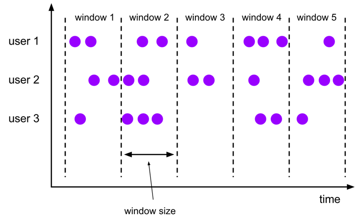
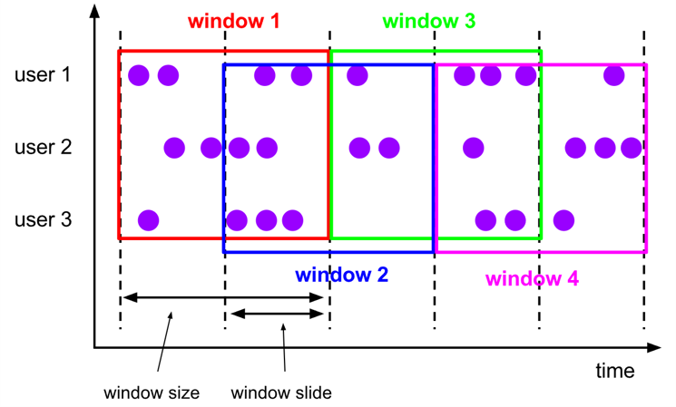
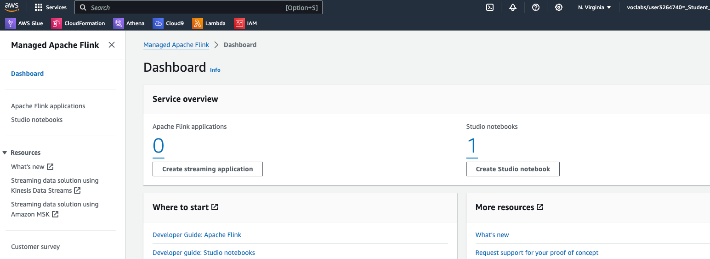
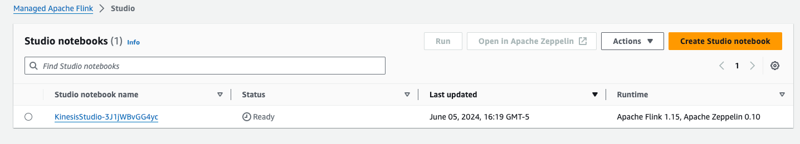
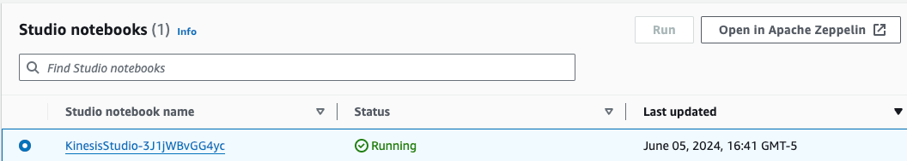
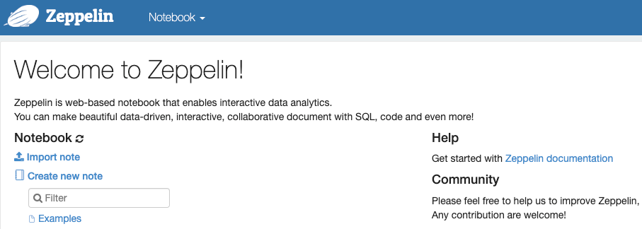
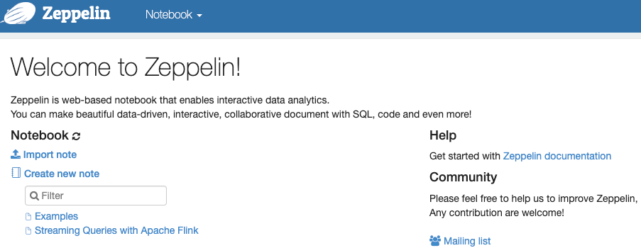

# Week 3 Lab 2: Streaming Queries with Apache Flink

In this lab, you will learn how to perform queries on top of streaming sources using Apache Flink. 

# Table of Contents

- [ 1 - Introduction](#1)
- [ 2 - Apache Flink 101](#2)
  - [ 2.1 - Table Environment](#2.1)
  - [ 2.2 - Table Definition](#2.2)
  - [ 2.3 - Table Definition with SQL](#2.3)
  - [ 2.4 - SQL Queries](#2.4)
  - [ 2.5 - Window Queries](#2.5)
    - [ Exercise 1](#ex01)
    - [ Exercise 2](#ex02)
  - [ 2.6 - Output Tables](#2.6)
- [ 3 - PyFlink with Kinesis](#3)

Start from loading the required libraries.


```python
import os
import json
import pandas as pd
from datetime import datetime
from pyflink.table.expressions import col, lit
from pyflink.table import EnvironmentSettings, TableEnvironment, DataTypes
from pyflink.table.window import Slide, Tumble
from pyflink.table.udf import udf
```

<a name='1'></a>
## 1 - Introduction

In the current landscape of data engineering, one of the biggest challenges is real-time data analysis, which is necessary for certain enterprises that require immediate insights and quick responses to operate their business efficiently. Apache Flink is designed to handle data in real time, allowing you to process and analyze streaming data as soon as it arrives. This enables timely insights and immediate reactions to changing data.

Here you will work with a Kinesis data producer similar to the one introduced in Course 1, Week 4. This producer is continuously generating data related to orders made by customers on the [`classicmodels`](https://www.mysqltutorial.org/mysql-sample-database.aspx) website. The business team at Classic Models is eager to gain deeper, real-time insights into the behavior of clients on their websites. By analyzing this streaming data, they aim to understand user buying habits, preferences, and other business metrics as they happen. Through this lab, you will leverage Apache Flink to process and analyze this data stream, providing the business team with valuable, actionable insights in real time.

To learn the basics of Apache Flink and PyFlink, you will use a sample dataset based on stock prices. You will follow similar steps with the Classic Models data.

<a name='2'></a>
## 2 - Apache Flink 101

Apache Flink is a robust framework and processing engine designed for executing computations on data streams. These data streams can be either unbounded, such as continuous streams of real-time data or bounded, like a finite batch of data. Flink is structured around two major APIs: the **DataStream API** and the **Table API & SQL**. The DataStream API is tailored for complex event processing and real-time analytics, while the Table API & SQL offers a more declarative approach to data processing, akin to traditional database operations.

In this lab, you will be utilizing PyFlink, which is the Python API for Apache Flink. PyFlink enables developers to harness the power of Flink using Python, making it accessible to those familiar with the language. Additionally, PyFlink integrates with `pandas`, allowing for seamless data manipulation and analysis within the Flink ecosystem. You use the PyFlink Table API to run queries on top of a Kinesis data stream, but first, you will learn how to use PyFlink with some sample data we provided. You can find more information [here](https://nightlies.apache.org/flink/flink-docs-master/docs/dev/python/table_api_tutorial/).

<a name='2.1'></a>
### 2.1 - Table Environment

To start using the PyFlink Table API, you first need to declare a table environment. This environment acts as the primary gateway for all interactions with the Flink runtime.


```python
table_env = TableEnvironment.create(EnvironmentSettings.in_streaming_mode())
```

<a name='2.2'></a>
### 2.2 - Table Definition

The core element of the Table API & SQL in Apache Flink is the entity known as a **Table**. Tables act as both the input and output for queries, serving as the fundamental data structures upon which all operations are performed. In a Flink program, the first step involves defining these tables, meaning defining the schema and the connection details, a table can be connected to various source or target systems, such as databases, files, message queues or data streams.

After establishing the tables, you can perform a wide range of operations on them, such as filtering, aggregating, joining, and transforming the data. These operations can be expressed using either the Table API, which provides a programmatic way to manipulate tables, or SQL queries, which offer a more declarative approach. 

You have been provided two samples of the data produced by the Stock Market and Classic Models Kinesis data streams, located at `data/sample_stock.json` and `data/sample.json` respectively. You will interact with the files using PyFlink before connecting to the Classic Models stream. Load the files using the following cells and understand what each contains: 


```python
sample_stock_data = []
with open("data/sample_stock.json") as f:
    for line in f.readlines():
        sample_stock_data.append(json.loads(line))
print(json.dumps(sample_stock_data[0], indent=4))
```

    {
        "event_time": "2024-06-03T08:14:52.912728",
        "ticker": "INTC",
        "price": 81.09
    }


```python
sample_data = []
with open("data/sample.json") as f:
    for line in f.readlines():
        sample_data.append(json.loads(line))
print(json.dumps(sample_data[0], indent=4))
```

    {
        "order_id": "a03470d0-0f5d-4ab1-9ace-e1163737a4f1",
        "order_timestamp": "2024-06-01T00:00:30",
        "order_date": "2024-06-01",
        "customer_number": 497,
        "customer_visit_number": 1,
        "customer_city": "Allentown",
        "customer_country": "USA",
        "customer_credit_limit": 26955,
        "device_type": "desktop",
        "browser": "Mozilla/5.0 (iPod; U; CPU iPhone OS 4_0 like Mac OS X; he-IL) AppleWebKit/531.24.2 (KHTML, like Gecko) Version/3.0.5 Mobile/8B118 Safari/6531.24.2",
        "operating_system": "MacOS",
        "product_code": "S18_1129",
        "product_line": "Classic Cars",
        "product_unitary_price": 141.54,
        "quantity": 2,
        "total_price": 283.08,
        "traffic_source": "http://www.hawkins-rosales.com/"
    }


The Kinesis Data Streams, and in general streaming sources, are unbounded sequences of records. In the Stock market sample, you have information about the price of a certain ticker at a point in time. Before loading these records to a `Table` in Flink, you will define the schema from source stock data:


```python
row_stock_schema = DataTypes.ROW([
    DataTypes.FIELD("event_time", DataTypes.TIMESTAMP(0)),
    DataTypes.FIELD("ticker", DataTypes.STRING()),
    DataTypes.FIELD("price", DataTypes.DOUBLE())
    ])
```

On the other hand, a record for the Classic Models stream seems to be an order made by a customer in JSON format. Using the `DataTypes` classes, define the schema for the sample data in the `row_source_schema` variable.

*Note*: DataTypes includes the `INT`, `DATE` and `BOOLEAN` classes, for `TIMESTAMP` we define a value `(p)` where p is the number of digits of fractional seconds (precision), in our case 0.


```python
row_source_schema = DataTypes.ROW([
    DataTypes.FIELD("order_id", DataTypes.STRING()),
    DataTypes.FIELD("order_timestamp", DataTypes.TIMESTAMP(0)),
    DataTypes.FIELD("order_date", DataTypes.DATE()),
    DataTypes.FIELD("customer_number", DataTypes.INT()),
    DataTypes.FIELD("customer_visit_number", DataTypes.INT()),
    DataTypes.FIELD("customer_city", DataTypes.STRING()),
    DataTypes.FIELD("customer_country", DataTypes.STRING()),    
    DataTypes.FIELD("customer_credit_limit", DataTypes.INT()),
    DataTypes.FIELD("device_type",DataTypes.STRING()),
    DataTypes.FIELD("browser", DataTypes.STRING()),
    DataTypes.FIELD("operating_system", DataTypes.STRING()),
    DataTypes.FIELD("product_code",DataTypes.STRING()),
    DataTypes.FIELD("product_line", DataTypes.STRING()),
    DataTypes.FIELD("product_unitary_price", DataTypes.DOUBLE()),
    DataTypes.FIELD("in_shopping_cart", DataTypes.BOOLEAN()),
    DataTypes.FIELD("quantity", DataTypes.INT()),
    DataTypes.FIELD("total_price", DataTypes.DOUBLE()),
    DataTypes.FIELD("traffic_source", DataTypes.STRING())
    ])
```

You will enforce this schema on the `sample_stock_data` and `sample_data` arrays, as the JSON files has some of the column values that are meant to be float and date types stored as strings.


```python
for record in sample_stock_data:
    record['event_time'] = datetime.fromisoformat(record['event_time'])
    record['price'] = float(record['price'])
```

Perform the same enforcement on the numeric and date values of the `sample_data` array.


```python
for record in sample_data:
    record['order_timestamp'] = datetime.fromisoformat(record['order_timestamp'])
    record['order_date'] = datetime.strptime(record['order_date'],'%Y-%m-%d')
    record['product_unitary_price'] = float(record['product_unitary_price'])
    record['total_price'] = float(record['total_price'])
```

Now you can create the `Table` for each sample data using the `from_elements` function, PyFlink has some predefined sources for Python, such as `pandas` dataframe or collections.


```python
source_stock_table = table_env.from_elements(sample_stock_data, row_stock_schema)
```


```python
source_table = table_env.from_elements(sample_data, row_source_schema)
```

To verify the data is loaded properly, you can convert the PyFlink Tables to Pandas DataFrames and print the first records.


```python
source_stock_df = source_stock_table.to_pandas()
source_stock_df.head()
```


<div>
<style scoped>
    .dataframe tbody tr th:only-of-type {
        vertical-align: middle;
    }

    .dataframe tbody tr th {
        vertical-align: top;
    }

    .dataframe thead th {
        text-align: right;
    }
</style>
<table border="1" class="dataframe">
  <thead>
    <tr style="text-align: right;">
      <th></th>
      <th>event_time</th>
      <th>ticker</th>
      <th>price</th>
    </tr>
  </thead>
  <tbody>
    <tr>
      <th>0</th>
      <td>2024-06-03 08:14:52</td>
      <td>INTC</td>
      <td>81.09</td>
    </tr>
    <tr>
      <th>1</th>
      <td>2024-06-03 08:14:54</td>
      <td>TBV</td>
      <td>26.18</td>
    </tr>
    <tr>
      <th>2</th>
      <td>2024-06-03 08:15:00</td>
      <td>MSFT</td>
      <td>20.29</td>
    </tr>
    <tr>
      <th>3</th>
      <td>2024-06-03 08:15:05</td>
      <td>INTC</td>
      <td>88.44</td>
    </tr>
    <tr>
      <th>4</th>
      <td>2024-06-03 08:15:11</td>
      <td>AMZN</td>
      <td>91.96</td>
    </tr>
  </tbody>
</table>
</div>


```python
source_table_df = source_table.to_pandas()
source_table_df.head()
```


<div>
<style scoped>
    .dataframe tbody tr th:only-of-type {
        vertical-align: middle;
    }

    .dataframe tbody tr th {
        vertical-align: top;
    }

    .dataframe thead th {
        text-align: right;
    }
</style>
<table border="1" class="dataframe">
  <thead>
    <tr style="text-align: right;">
      <th></th>
      <th>order_id</th>
      <th>order_timestamp</th>
      <th>order_date</th>
      <th>customer_number</th>
      <th>customer_visit_number</th>
      <th>customer_city</th>
      <th>customer_country</th>
      <th>customer_credit_limit</th>
      <th>device_type</th>
      <th>browser</th>
      <th>operating_system</th>
      <th>product_code</th>
      <th>product_line</th>
      <th>product_unitary_price</th>
      <th>in_shopping_cart</th>
      <th>quantity</th>
      <th>total_price</th>
      <th>traffic_source</th>
    </tr>
  </thead>
  <tbody>
    <tr>
      <th>0</th>
      <td>a03470d0-0f5d-4ab1-9ace-e1163737a4f1</td>
      <td>2024-06-01 00:00:30</td>
      <td>2024-06-01</td>
      <td>497</td>
      <td>1</td>
      <td>Allentown</td>
      <td>USA</td>
      <td>26955</td>
      <td>desktop</td>
      <td>Mozilla/5.0 (iPod; U; CPU iPhone OS 4_0 like M...</td>
      <td>MacOS</td>
      <td>S18_1129</td>
      <td>Classic Cars</td>
      <td>141.54</td>
      <td>None</td>
      <td>2</td>
      <td>283.08</td>
      <td>http://www.hawkins-rosales.com/</td>
    </tr>
    <tr>
      <th>1</th>
      <td>e76ad923-0573-462f-a1a1-4fc39fc638fa</td>
      <td>2024-06-01 00:01:00</td>
      <td>2024-06-01</td>
      <td>363</td>
      <td>1</td>
      <td>Hatfield</td>
      <td>South Africa</td>
      <td>103991</td>
      <td>mobile</td>
      <td>Mozilla/5.0 (compatible; MSIE 9.0; Windows NT ...</td>
      <td>Windows</td>
      <td>S10_4698</td>
      <td>Motorcycles</td>
      <td>193.66</td>
      <td>None</td>
      <td>2</td>
      <td>387.32</td>
      <td>http://hernandez.com/</td>
    </tr>
    <tr>
      <th>2</th>
      <td>f282b18b-9230-4071-a23d-91450002462a</td>
      <td>2024-06-01 00:01:30</td>
      <td>2024-06-01</td>
      <td>238</td>
      <td>1</td>
      <td>Vancouver</td>
      <td>Canada</td>
      <td>122016</td>
      <td>desktop</td>
      <td>Opera/8.91.(X11; Linux x86_64; szl-PL) Presto/...</td>
      <td>iOS</td>
      <td>S18_2238</td>
      <td>Classic Cars</td>
      <td>163.73</td>
      <td>None</td>
      <td>9</td>
      <td>1473.57</td>
      <td>https://smith.net/</td>
    </tr>
    <tr>
      <th>3</th>
      <td>5dcadad7-5dc3-4c48-a712-c0b8f2a856c4</td>
      <td>2024-06-01 00:02:00</td>
      <td>2024-06-01</td>
      <td>417</td>
      <td>1</td>
      <td>Liverpool</td>
      <td>UK</td>
      <td>82556</td>
      <td>mobile</td>
      <td>Mozilla/5.0 (compatible; MSIE 9.0; Windows NT ...</td>
      <td>Windows</td>
      <td>S700_1691</td>
      <td>Planes</td>
      <td>91.34</td>
      <td>None</td>
      <td>3</td>
      <td>274.02</td>
      <td>http://brown.com/</td>
    </tr>
    <tr>
      <th>4</th>
      <td>48b1fd40-b55b-424f-8387-11f69d601ba5</td>
      <td>2024-06-01 00:02:30</td>
      <td>2024-06-01</td>
      <td>246</td>
      <td>1</td>
      <td>Oulu</td>
      <td>Finland</td>
      <td>103598</td>
      <td>desktop</td>
      <td>Mozilla/5.0 (Macintosh; Intel Mac OS X 10_7_6)...</td>
      <td>MacOS</td>
      <td>S700_1691</td>
      <td>Planes</td>
      <td>91.34</td>
      <td>None</td>
      <td>6</td>
      <td>548.04</td>
      <td>http://www.rodriguez.com/</td>
    </tr>
  </tbody>
</table>
</div>


<a name='2.3'></a>
### 2.3 - Table Definition with SQL

Now explore an alternative and more intuitive method to define a table in Flink by using SQL and connectors. In this approach, you will define an SQL table that points to the `filesystem` connector and configure various properties such as format and path. Flink provides robust support for connecting to a variety of data sources, including local files, message queues like Kafka, data streams like Kinesis, and even databases. This flexibility allows us to seamlessly integrate Flink with diverse data ecosystems, making it a powerful tool for real-time data processing.

You will also add a **WATERMARK** to the timestamp field in the table definition, the watermark helps Flink to recognize the timestamp field as the event time for each record. In Flink, data can be processed based on two types of time columns: processing time and event time. Processing time refers to the system time of the machine running Flink, while event time refers to the actual time at which the events occurred within the stream. 


```python
stock_table_ddl = """
  CREATE TABLE stock_data (
    event_time TIMESTAMP(0),
    ticker STRING,
    price NUMERIC,
    WATERMARK FOR event_time AS event_time - INTERVAL '5' MINUTES
    ) with (
        'connector' = 'filesystem',
        'format' = 'json',
        'path' = '{}',
        'json.timestamp-format.standard' = 'ISO-8601'
    )
""".format("data/sample_stock.json")
table_env.execute_sql(stock_table_ddl)
```


    <pyflink.table.table_result.TableResult at 0x7f2965fed490>


Use SQL to define the `source_data` table based on the `data/sample.json` file, don't forget to include the WATERMARK for the `order_timestamp` field.


```python
table_env.execute_sql("DROP TABLE IF EXISTS source_data")
source_table_ddl = """
  CREATE TABLE source_data (
    order_id STRING,
    order_timestamp TIMESTAMP(0),
    order_date STRING,
    customer_number INT,
    customer_visit_number INT,
    customer_city STRING,
    customer_country STRING,
    customer_credit_limit INT,
    device_type STRING,
    browser STRING,
    operating_system STRING,
    product_code STRING, 
    product_line STRING,
    product_unitary_price NUMERIC,
    quantity INT, 
    total_price NUMERIC,
    traffic_source STRING,
    WATERMARK FOR order_timestamp AS order_timestamp - INTERVAL '5' MINUTES
    ) with (
        'connector' = 'filesystem',
        'format' = 'json',
        'path' = '{}',
        'json.timestamp-format.standard' = 'ISO-8601'
    )
""".format("data/sample.json")
table_env.execute_sql(source_table_ddl)
```


    <pyflink.table.table_result.TableResult at 0x7f2933ccdbb0>


Using the from_path function you can bring a table created with SQL as a Table object in Pyflink, we can then run the `execute` and `print` functions to verify that the data was loaded successfully. In the case of the Classic Models data, convert the result to pandas and execute the `head` function, for better readability. 


```python
stock_table = table_env.from_path("stock_data")
stock_table.execute().print()
```

    +----+---------------------+--------------------------------+--------------+
    | op |          event_time |                         ticker |        price |
    +----+---------------------+--------------------------------+--------------+
    | +I | 2024-06-03 08:14:52 |                           INTC |           81 |
    | +I | 2024-06-03 08:14:54 |                            TBV |           26 |
    | +I | 2024-06-03 08:15:00 |                           MSFT |           20 |
    | +I | 2024-06-03 08:15:05 |                           INTC |           88 |
    | +I | 2024-06-03 08:15:11 |                           AMZN |           92 |
    | +I | 2024-06-03 08:15:19 |                            TBV |           63 |
    | +I | 2024-06-03 08:15:27 |                           INTC |           34 |
    | +I | 2024-06-03 08:15:34 |                           AAPL |           19 |
    | +I | 2024-06-03 08:15:42 |                           AAPL |           91 |
    | +I | 2024-06-03 08:15:51 |                           MSFT |           19 |
    | +I | 2024-06-03 08:15:55 |                           AMZN |           40 |
    | +I | 2024-06-03 08:16:01 |                           AAPL |           90 |
    | +I | 2024-06-03 08:16:04 |                            TBV |           85 |
    | +I | 2024-06-03 08:16:10 |                           INTC |           14 |
    | +I | 2024-06-03 08:16:15 |                            TBV |            5 |
    | +I | 2024-06-03 08:16:16 |                           AMZN |           93 |
    | +I | 2024-06-03 08:16:19 |                           AAPL |           45 |
    | +I | 2024-06-03 08:16:25 |                           AAPL |           39 |
    | +I | 2024-06-03 08:16:34 |                            TBV |           61 |
    | +I | 2024-06-03 08:16:38 |                           AAPL |           65 |
    | +I | 2024-06-03 08:16:42 |                           MSFT |           86 |
    | +I | 2024-06-03 08:16:44 |                           MSFT |           39 |
    | +I | 2024-06-03 08:16:51 |                            TBV |           78 |
    | +I | 2024-06-03 08:16:53 |                           MSFT |            9 |
    | +I | 2024-06-03 08:16:55 |                           AAPL |           23 |
    | +I | 2024-06-03 08:16:59 |                           MSFT |           81 |
    | +I | 2024-06-03 08:17:03 |                            TBV |           54 |
    | +I | 2024-06-03 08:17:11 |                           AMZN |           43 |
    | +I | 2024-06-03 08:17:17 |                           INTC |           36 |
    | +I | 2024-06-03 08:17:17 |                           AAPL |           75 |
    | +I | 2024-06-03 08:17:20 |                           MSFT |           60 |
    | +I | 2024-06-03 08:17:28 |                           AAPL |           74 |
    | +I | 2024-06-03 08:17:34 |                           MSFT |           31 |
    | +I | 2024-06-03 08:17:39 |                           AMZN |            7 |
    | +I | 2024-06-03 08:17:47 |                           AMZN |           55 |
    | +I | 2024-06-03 08:17:51 |                            TBV |           68 |
    | +I | 2024-06-03 08:17:58 |                           AAPL |           30 |
    | +I | 2024-06-03 08:18:06 |                           MSFT |           37 |
    | +I | 2024-06-03 08:18:11 |                            TBV |           97 |
    | +I | 2024-06-03 08:18:13 |                           MSFT |           90 |
    | +I | 2024-06-03 08:18:22 |                           INTC |           79 |
    | +I | 2024-06-03 08:18:30 |                           AAPL |           79 |
    | +I | 2024-06-03 08:18:33 |                           AAPL |           82 |
    | +I | 2024-06-03 08:18:42 |                           AMZN |           15 |
    | +I | 2024-06-03 08:18:47 |                           MSFT |           33 |
    | +I | 2024-06-03 08:18:50 |                           AAPL |           28 |
    | +I | 2024-06-03 08:18:58 |                           AMZN |            0 |
    | +I | 2024-06-03 08:19:02 |                           INTC |           47 |
    | +I | 2024-06-03 08:19:06 |                            TBV |           98 |
    | +I | 2024-06-03 08:19:07 |                           MSFT |           63 |
    | +I | 2024-06-03 08:19:15 |                            TBV |           22 |
    | +I | 2024-06-03 08:19:19 |                           AAPL |           25 |
    | +I | 2024-06-03 08:19:21 |                            TBV |           46 |
    | +I | 2024-06-03 08:19:30 |                           INTC |           42 |
    | +I | 2024-06-03 08:19:39 |                           MSFT |           26 |
    | +I | 2024-06-03 08:19:46 |                            TBV |            0 |
    | +I | 2024-06-03 08:19:46 |                           AMZN |           81 |
    | +I | 2024-06-03 08:19:47 |                           INTC |           20 |
    | +I | 2024-06-03 08:19:52 |                           MSFT |            3 |
    | +I | 2024-06-03 08:19:59 |                            TBV |            7 |
    | +I | 2024-06-03 08:20:07 |                           MSFT |           94 |
    | +I | 2024-06-03 08:20:11 |                           INTC |           41 |
    | +I | 2024-06-03 08:20:20 |                           AAPL |           44 |
    | +I | 2024-06-03 08:20:27 |                           INTC |           60 |
    | +I | 2024-06-03 08:20:31 |                            TBV |           92 |
    | +I | 2024-06-03 08:20:40 |                            TBV |           46 |
    | +I | 2024-06-03 08:20:40 |                           AAPL |           23 |
    | +I | 2024-06-03 08:20:45 |                           AMZN |           70 |
    | +I | 2024-06-03 08:20:52 |                           INTC |           33 |
    | +I | 2024-06-03 08:20:52 |                           AAPL |           43 |
    | +I | 2024-06-03 08:20:54 |                           INTC |           69 |
    | +I | 2024-06-03 08:20:56 |                            TBV |           18 |
    | +I | 2024-06-03 08:21:05 |                           INTC |           42 |
    | +I | 2024-06-03 08:21:06 |                           AAPL |           73 |
    | +I | 2024-06-03 08:21:13 |                            TBV |           22 |
    | +I | 2024-06-03 08:21:13 |                           AMZN |           73 |
    | +I | 2024-06-03 08:21:19 |                           MSFT |           76 |
    | +I | 2024-06-03 08:21:23 |                           AMZN |           55 |
    | +I | 2024-06-03 08:21:31 |                            TBV |           93 |
    | +I | 2024-06-03 08:21:40 |                           INTC |           57 |
    | +I | 2024-06-03 08:21:42 |                            TBV |           57 |
    | +I | 2024-06-03 08:21:46 |                           AMZN |           24 |
    | +I | 2024-06-03 08:21:53 |                            TBV |           58 |
    | +I | 2024-06-03 08:21:58 |                           INTC |           49 |
    | +I | 2024-06-03 08:22:00 |                           AMZN |           99 |
    | +I | 2024-06-03 08:22:05 |                           INTC |           97 |
    | +I | 2024-06-03 08:22:13 |                           INTC |           71 |
    | +I | 2024-06-03 08:22:15 |                           INTC |           43 |
    | +I | 2024-06-03 08:22:20 |                            TBV |           47 |
    | +I | 2024-06-03 08:22:29 |                            TBV |           93 |
    | +I | 2024-06-03 08:22:37 |                           AMZN |           37 |
    | +I | 2024-06-03 08:22:42 |                           AMZN |           54 |
    | +I | 2024-06-03 08:22:51 |                           AAPL |           86 |
    | +I | 2024-06-03 08:22:55 |                            TBV |           87 |
    | +I | 2024-06-03 08:23:03 |                            TBV |           69 |
    | +I | 2024-06-03 08:23:11 |                           INTC |           37 |
    | +I | 2024-06-03 08:23:14 |                           MSFT |           79 |
    | +I | 2024-06-03 08:23:16 |                           INTC |           93 |
    | +I | 2024-06-03 08:23:18 |                           AAPL |           15 |
    | +I | 2024-06-03 08:23:22 |                            TBV |           28 |
    +----+---------------------+--------------------------------+--------------+
    100 rows in set


```python
input_table = table_env.from_path("source_data")
input_table_df = input_table.to_pandas()
input_table_df.head()
```


<div>
<style scoped>
    .dataframe tbody tr th:only-of-type {
        vertical-align: middle;
    }

    .dataframe tbody tr th {
        vertical-align: top;
    }

    .dataframe thead th {
        text-align: right;
    }
</style>
<table border="1" class="dataframe">
  <thead>
    <tr style="text-align: right;">
      <th></th>
      <th>order_id</th>
      <th>order_timestamp</th>
      <th>order_date</th>
      <th>customer_number</th>
      <th>customer_visit_number</th>
      <th>customer_city</th>
      <th>customer_country</th>
      <th>customer_credit_limit</th>
      <th>device_type</th>
      <th>browser</th>
      <th>operating_system</th>
      <th>product_code</th>
      <th>product_line</th>
      <th>product_unitary_price</th>
      <th>quantity</th>
      <th>total_price</th>
      <th>traffic_source</th>
    </tr>
  </thead>
  <tbody>
    <tr>
      <th>0</th>
      <td>a03470d0-0f5d-4ab1-9ace-e1163737a4f1</td>
      <td>2024-06-01 00:00:30</td>
      <td>2024-06-01</td>
      <td>497</td>
      <td>1</td>
      <td>Allentown</td>
      <td>USA</td>
      <td>26955</td>
      <td>desktop</td>
      <td>Mozilla/5.0 (iPod; U; CPU iPhone OS 4_0 like M...</td>
      <td>MacOS</td>
      <td>S18_1129</td>
      <td>Classic Cars</td>
      <td>142</td>
      <td>2</td>
      <td>283</td>
      <td>http://www.hawkins-rosales.com/</td>
    </tr>
    <tr>
      <th>1</th>
      <td>e76ad923-0573-462f-a1a1-4fc39fc638fa</td>
      <td>2024-06-01 00:01:00</td>
      <td>2024-06-01</td>
      <td>363</td>
      <td>1</td>
      <td>Hatfield</td>
      <td>South Africa</td>
      <td>103991</td>
      <td>mobile</td>
      <td>Mozilla/5.0 (compatible; MSIE 9.0; Windows NT ...</td>
      <td>Windows</td>
      <td>S10_4698</td>
      <td>Motorcycles</td>
      <td>194</td>
      <td>2</td>
      <td>387</td>
      <td>http://hernandez.com/</td>
    </tr>
    <tr>
      <th>2</th>
      <td>f282b18b-9230-4071-a23d-91450002462a</td>
      <td>2024-06-01 00:01:30</td>
      <td>2024-06-01</td>
      <td>238</td>
      <td>1</td>
      <td>Vancouver</td>
      <td>Canada</td>
      <td>122016</td>
      <td>desktop</td>
      <td>Opera/8.91.(X11; Linux x86_64; szl-PL) Presto/...</td>
      <td>iOS</td>
      <td>S18_2238</td>
      <td>Classic Cars</td>
      <td>164</td>
      <td>9</td>
      <td>1474</td>
      <td>https://smith.net/</td>
    </tr>
    <tr>
      <th>3</th>
      <td>5dcadad7-5dc3-4c48-a712-c0b8f2a856c4</td>
      <td>2024-06-01 00:02:00</td>
      <td>2024-06-01</td>
      <td>417</td>
      <td>1</td>
      <td>Liverpool</td>
      <td>UK</td>
      <td>82556</td>
      <td>mobile</td>
      <td>Mozilla/5.0 (compatible; MSIE 9.0; Windows NT ...</td>
      <td>Windows</td>
      <td>S700_1691</td>
      <td>Planes</td>
      <td>91</td>
      <td>3</td>
      <td>274</td>
      <td>http://brown.com/</td>
    </tr>
    <tr>
      <th>4</th>
      <td>48b1fd40-b55b-424f-8387-11f69d601ba5</td>
      <td>2024-06-01 00:02:30</td>
      <td>2024-06-01</td>
      <td>246</td>
      <td>1</td>
      <td>Oulu</td>
      <td>Finland</td>
      <td>103598</td>
      <td>desktop</td>
      <td>Mozilla/5.0 (Macintosh; Intel Mac OS X 10_7_6)...</td>
      <td>MacOS</td>
      <td>S700_1691</td>
      <td>Planes</td>
      <td>91</td>
      <td>6</td>
      <td>548</td>
      <td>http://www.rodriguez.com/</td>
    </tr>
  </tbody>
</table>
</div>


<a name='2.4'></a>
### 2.4 - SQL Queries

Now that you have the source data in Table format and in the catalog, you can do run SQL queries on top of the table in the catalog. As the source data is bounded, you can run queries and get results rather quickly. If the source data was in a stream then you would have to find more carefully how your queries are meant to be run, so they don't run indefinitely.

Let's start with a simple query. You want to know the average price for the Amazon stock 'AMZN'.


```python
query_result = table_env.execute_sql("""SELECT AVG(price) as avg_price
                                     FROM stock_data
                                     WHERE ticker = 'AMZN'
                                     """)
query_result.print()
```

    +----+------------------------------------------+
    | op |                                avg_price |
    +----+------------------------------------------+
    | +I |                                92.000000 |
    | -U |                                92.000000 |
    | +U |                                66.000000 |
    | -U |                                66.000000 |
    | +U |                                75.000000 |
    | -U |                                75.000000 |
    | +U |                                67.000000 |
    | -U |                                67.000000 |
    | +U |                                55.000000 |
    | -U |                                55.000000 |
    | +U |                                49.285714 |
    | -U |                                49.285714 |
    | +U |                                43.125000 |
    | -U |                                43.125000 |
    | +U |                                47.333333 |
    | -U |                                47.333333 |
    | +U |                                49.600000 |
    | -U |                                49.600000 |
    | +U |                                51.727273 |
    | -U |                                51.727273 |
    | +U |                                52.000000 |
    | -U |                                52.000000 |
    | +U |                                49.846154 |
    | -U |                                49.846154 |
    | +U |                                53.357143 |
    | -U |                                53.357143 |
    | +U |                                52.266667 |
    | -U |                                52.266667 |
    | +U |                                52.375000 |
    +----+------------------------------------------+
    29 rows in set


As Flink goes through the table, some operations, such as group aggregation, produce update events, and in this case, the aggregation do get updated. Now, create a query to get the total amount that each customer has spend in the Classic Models sample table.


```python
query_result = table_env.execute_sql("""SELECT customer_number, 
                                     SUM(total_price) as customer_total_amount
                                     FROM source_data GROUP BY customer_number
                                     """)
query_result.print()
```

    +----+-----------------+------------------------------------------+
    | op | customer_number |                    customer_total_amount |
    +----+-----------------+------------------------------------------+
    | +I |             497 |                                      283 |
    | +I |             363 |                                      387 |
    | +I |             238 |                                     1474 |
    | +I |             417 |                                      274 |
    | -U |             497 |                                      283 |
    | +U |             497 |                                      848 |
    | +I |             459 |                                      203 |
    | +I |             228 |                                      702 |
    | +I |             359 |                                      343 |
    | +I |             126 |                                      671 |
    | +I |             407 |                                      487 |
    | +I |             355 |                                      220 |
    | +I |             409 |                                      323 |
    | +I |             158 |                                      428 |
    | +I |             206 |                                      816 |
    | -U |             459 |                                      203 |
    | +U |             459 |                                     1034 |
    | +I |             364 |                                      991 |
    | +I |             351 |                                      623 |
    | +I |             215 |                                      641 |
    | +I |             280 |                                      526 |
    | +I |             300 |                                      149 |
    | +I |             171 |                                      274 |
    | -U |             171 |                                      274 |
    | +U |             171 |                                      511 |
    | -U |             215 |                                      641 |
    | +U |             215 |                                     1004 |
    | +I |             234 |                                     1020 |
    | +I |             297 |                                      401 |
    | +I |             439 |                                      798 |
    | +I |             212 |                                      139 |
    | +I |             458 |                                      861 |
    | -U |             228 |                                      702 |
    | +U |             228 |                                      948 |
    | -U |             280 |                                      526 |
    | +U |             280 |                                     1489 |
    | +I |             185 |                                      509 |
    | +I |             242 |                                      338 |
    | -U |             215 |                                     1004 |
    | +U |             215 |                                     1783 |
    | -U |             185 |                                      509 |
    | +U |             185 |                                      725 |
    | +I |             199 |                                     1058 |
    | +I |             101 |                                      403 |
    | -U |             297 |                                      401 |
    | +U |             297 |                                      655 |
    | +I |             108 |                                      249 |
    | +I |             233 |                                      435 |
    | +I |             246 |                                      548 |
    | +I |             415 |                                      702 |
    | +I |             485 |                                      189 |
    | +I |             262 |                                      138 |
    | +I |             291 |                                     1211 |
    | +I |             329 |                                      274 |
    | +I |             370 |                                      763 |
    | +I |             352 |                                      381 |
    | +I |             425 |                                      355 |
    | +I |             324 |                                      256 |
    | +I |             153 |                                      807 |
    | +I |             314 |                                      831 |
    | +I |             353 |                                      260 |
    | +I |             180 |                                      354 |
    | +I |             367 |                                      510 |
    | +I |             333 |                                      242 |
    | +I |             289 |                                     1105 |
    | +I |             287 |                                      402 |
    | +I |             379 |                                      695 |
    | +I |             152 |                                     1068 |
    | +I |             487 |                                      267 |
    | +I |             474 |                                     2078 |
    | -U |             370 |                                      763 |
    | +U |             370 |                                     1105 |
    | +I |             198 |                                      963 |
    | +I |             403 |                                      422 |
    | -U |             324 |                                      256 |
    | +U |             324 |                                      389 |
    | +I |             286 |                                      529 |
    | +I |             369 |                                      614 |
    | +I |             444 |                                      822 |
    | +I |             354 |                                      996 |
    | +I |             243 |                                      186 |
    | -U |             198 |                                      963 |
    | +U |             198 |                                     1682 |
    | -U |             180 |                                      354 |
    | +U |             180 |                                      596 |
    | +I |             257 |                                      244 |
    | +I |             195 |                                      144 |
    | -U |             262 |                                      138 |
    | +U |             262 |                                      263 |
    | -U |             379 |                                      695 |
    | +U |             379 |                                      775 |
    | +I |             121 |                                      699 |
    | +I |             259 |                                      996 |
    | +I |             337 |                                      956 |
    | +I |             362 |                                      997 |
    | -U |             353 |                                      260 |
    | +U |             353 |                                      814 |
    | +I |             290 |                                       99 |
    | +I |             484 |                                      314 |
    | -U |             367 |                                      510 |
    | +U |             367 |                                      891 |
    | -U |             403 |                                      422 |
    | +U |             403 |                                      521 |
    | -U |             484 |                                      314 |
    | +U |             484 |                                     1199 |
    | -U |             379 |                                      775 |
    | +U |             379 |                                     1197 |
    | +I |             358 |                                      302 |
    | +I |             250 |                                      920 |
    | -U |             403 |                                      521 |
    | +U |             403 |                                     1095 |
    | +I |             162 |                                     1012 |
    | -U |             180 |                                      596 |
    | +U |             180 |                                     1952 |
    | +I |             383 |                                      369 |
    | -U |             324 |                                      389 |
    | +U |             324 |                                      727 |
    | -U |             250 |                                      920 |
    | +U |             250 |                                      994 |
    | +I |             437 |                                      342 |
    | +I |             317 |                                      281 |
    | +I |             441 |                                      968 |
    | -U |             415 |                                      702 |
    | +U |             415 |                                      802 |
    | +I |             120 |                                      497 |
    +----+-----------------+------------------------------------------+
    125 rows in set


<a name='2.5'></a>
### 2.5 - Window Queries

Before going into more detail about window queries, let's define a user-defined function (UDF) to convert timestamp fields into string fields. This will help us when writing results into output tables.


```python
@udf(input_types=[DataTypes.TIMESTAMP(3)], result_type=DataTypes.STRING())
def to_string(i):
    return str(i)

table_env.create_temporary_system_function("to_string", to_string)
```

Windows is the main tool to process unbounded streaming data. It allows us to divide the stream into manageable finite section and appy computations for each section. In Flink, the syntax will be:

```python
stream.window(...)                 <-  required: "assigner"
      .reduce/aggregate/apply()    <-  required: "function"
```

A **tumbling windows assigner** assigns each element to a window of a specified window size, the window size is fixed and the windows don't overlap.



Here is an example of a Tumble window query, you will look at the minimum price of a stock for 10 second windows.


```python
example_tumbling_window_table = (
    stock_table.window(
        Tumble.over(lit(10).seconds).on(col("event_time")).alias("ten_second_window")
    )
    .group_by(col('ticker'), col('price'), col('ten_second_window'))
    .select(col('ticker'), col('price').min.alias('price'), (to_string(col('ten_second_window').end)).alias('event_time'))
)

example_tumbling_window_df = example_tumbling_window_table.to_pandas()
example_tumbling_window_df.head()
```


<div>
<style scoped>
    .dataframe tbody tr th:only-of-type {
        vertical-align: middle;
    }

    .dataframe tbody tr th {
        vertical-align: top;
    }

    .dataframe thead th {
        text-align: right;
    }
</style>
<table border="1" class="dataframe">
  <thead>
    <tr style="text-align: right;">
      <th></th>
      <th>ticker</th>
      <th>price</th>
      <th>event_time</th>
    </tr>
  </thead>
  <tbody>
    <tr>
      <th>0</th>
      <td>TBV</td>
      <td>26</td>
      <td>2024-06-03 08:15:00</td>
    </tr>
    <tr>
      <th>1</th>
      <td>INTC</td>
      <td>88</td>
      <td>2024-06-03 08:15:10</td>
    </tr>
    <tr>
      <th>2</th>
      <td>AAPL</td>
      <td>19</td>
      <td>2024-06-03 08:15:40</td>
    </tr>
    <tr>
      <th>3</th>
      <td>AAPL</td>
      <td>91</td>
      <td>2024-06-03 08:15:50</td>
    </tr>
    <tr>
      <th>4</th>
      <td>MSFT</td>
      <td>19</td>
      <td>2024-06-03 08:16:00</td>
    </tr>
  </tbody>
</table>
</div>


<a id='ex01'></a>
### Exercise 1

Create a query to get the number of orders in 1-minute windows of time (60 second windows).


```python
tumbling_window_table = (
    input_table.window(
        ### START CODE HERE ### (~ 1 line of code)
        Tumble.over(lit(60).seconds).on(col("order_timestamp")).alias("one_minute_window")
        ### END CODE HERE ###
    )
    .group_by(col('one_minute_window'))
    .select((to_string(col('one_minute_window').end)).alias('event_time'),col('order_id').count.distinct.alias('num_orders'))
)

tumbling_window_df = tumbling_window_table.to_pandas()
tumbling_window_df.head()
```


<div>
<style scoped>
    .dataframe tbody tr th:only-of-type {
        vertical-align: middle;
    }

    .dataframe tbody tr th {
        vertical-align: top;
    }

    .dataframe thead th {
        text-align: right;
    }
</style>
<table border="1" class="dataframe">
  <thead>
    <tr style="text-align: right;">
      <th></th>
      <th>event_time</th>
      <th>num_orders</th>
    </tr>
  </thead>
  <tbody>
    <tr>
      <th>0</th>
      <td>2024-06-01 00:01:00</td>
      <td>1</td>
    </tr>
    <tr>
      <th>1</th>
      <td>2024-06-01 00:02:00</td>
      <td>2</td>
    </tr>
    <tr>
      <th>2</th>
      <td>2024-06-01 00:03:00</td>
      <td>2</td>
    </tr>
    <tr>
      <th>3</th>
      <td>2024-06-01 00:04:00</td>
      <td>2</td>
    </tr>
    <tr>
      <th>4</th>
      <td>2024-06-01 00:05:00</td>
      <td>2</td>
    </tr>
  </tbody>
</table>
</div>


##### __Expected Output__ 

| **event_time**        | **num_orders** |
| --------------------- | -------------- |
| 2024-06-01 00:01:00   | 1              |
| 2024-06-01 00:02:00   | 2              |
| 2024-06-01 00:03:00   | 2              |
| 2024-06-01 00:04:00   | 2              |
| 2024-06-01 00:05:00   | 2              |

*Note*: You can also perform window queries with Flink SQL, this is an example of one:


```python
tumble_query = """SELECT window_start, window_end, COUNT(DISTINCT order_id) AS total_orders
  FROM TABLE(
    TUMBLE(TABLE source_data, DESCRIPTOR(order_timestamp), INTERVAL '60' SECONDS))
  GROUP BY window_start, window_end; """
query_result = table_env.execute_sql(tumble_query)
query_result.print()
```

    +----+-------------------------+-------------------------+----------------------+
    | op |            window_start |              window_end |         total_orders |
    +----+-------------------------+-------------------------+----------------------+
    | +I | 2024-06-01 00:00:00.000 | 2024-06-01 00:01:00.000 |                    1 |
    | +I | 2024-06-01 00:01:00.000 | 2024-06-01 00:02:00.000 |                    2 |
    | +I | 2024-06-01 00:02:00.000 | 2024-06-01 00:03:00.000 |                    2 |
    | +I | 2024-06-01 00:03:00.000 | 2024-06-01 00:04:00.000 |                    2 |
    | +I | 2024-06-01 00:04:00.000 | 2024-06-01 00:05:00.000 |                    2 |
    | +I | 2024-06-01 00:05:00.000 | 2024-06-01 00:06:00.000 |                    2 |
    | +I | 2024-06-01 00:06:00.000 | 2024-06-01 00:07:00.000 |                    2 |
    | +I | 2024-06-01 00:07:00.000 | 2024-06-01 00:08:00.000 |                    2 |
    | +I | 2024-06-01 00:08:00.000 | 2024-06-01 00:09:00.000 |                    2 |
    | +I | 2024-06-01 00:09:00.000 | 2024-06-01 00:10:00.000 |                    2 |
    | +I | 2024-06-01 00:10:00.000 | 2024-06-01 00:11:00.000 |                    2 |
    | +I | 2024-06-01 00:11:00.000 | 2024-06-01 00:12:00.000 |                    2 |
    | +I | 2024-06-01 00:12:00.000 | 2024-06-01 00:13:00.000 |                    2 |
    | +I | 2024-06-01 00:13:00.000 | 2024-06-01 00:14:00.000 |                    2 |
    | +I | 2024-06-01 00:14:00.000 | 2024-06-01 00:15:00.000 |                    2 |
    | +I | 2024-06-01 00:15:00.000 | 2024-06-01 00:16:00.000 |                    2 |
    | +I | 2024-06-01 00:16:00.000 | 2024-06-01 00:17:00.000 |                    2 |
    | +I | 2024-06-01 00:17:00.000 | 2024-06-01 00:18:00.000 |                    2 |
    | +I | 2024-06-01 00:18:00.000 | 2024-06-01 00:19:00.000 |                    2 |
    | +I | 2024-06-01 00:19:00.000 | 2024-06-01 00:20:00.000 |                    2 |
    | +I | 2024-06-01 00:20:00.000 | 2024-06-01 00:21:00.000 |                    2 |
    | +I | 2024-06-01 00:21:00.000 | 2024-06-01 00:22:00.000 |                    2 |
    | +I | 2024-06-01 00:22:00.000 | 2024-06-01 00:23:00.000 |                    2 |
    | +I | 2024-06-01 00:23:00.000 | 2024-06-01 00:24:00.000 |                    2 |
    | +I | 2024-06-01 00:24:00.000 | 2024-06-01 00:25:00.000 |                    2 |
    | +I | 2024-06-01 00:25:00.000 | 2024-06-01 00:26:00.000 |                    2 |
    | +I | 2024-06-01 00:26:00.000 | 2024-06-01 00:27:00.000 |                    2 |
    | +I | 2024-06-01 00:27:00.000 | 2024-06-01 00:28:00.000 |                    2 |
    | +I | 2024-06-01 00:28:00.000 | 2024-06-01 00:29:00.000 |                    2 |
    | +I | 2024-06-01 00:29:00.000 | 2024-06-01 00:30:00.000 |                    2 |
    | +I | 2024-06-01 00:30:00.000 | 2024-06-01 00:31:00.000 |                    2 |
    | +I | 2024-06-01 00:31:00.000 | 2024-06-01 00:32:00.000 |                    2 |
    | +I | 2024-06-01 00:32:00.000 | 2024-06-01 00:33:00.000 |                    2 |
    | +I | 2024-06-01 00:33:00.000 | 2024-06-01 00:34:00.000 |                    2 |
    | +I | 2024-06-01 00:34:00.000 | 2024-06-01 00:35:00.000 |                    2 |
    | +I | 2024-06-01 00:35:00.000 | 2024-06-01 00:36:00.000 |                    2 |
    | +I | 2024-06-01 00:36:00.000 | 2024-06-01 00:37:00.000 |                    2 |
    | +I | 2024-06-01 00:37:00.000 | 2024-06-01 00:38:00.000 |                    2 |
    | +I | 2024-06-01 00:38:00.000 | 2024-06-01 00:39:00.000 |                    2 |
    | +I | 2024-06-01 00:39:00.000 | 2024-06-01 00:40:00.000 |                    2 |
    | +I | 2024-06-01 00:40:00.000 | 2024-06-01 00:41:00.000 |                    2 |
    | +I | 2024-06-01 00:41:00.000 | 2024-06-01 00:42:00.000 |                    2 |
    | +I | 2024-06-01 00:42:00.000 | 2024-06-01 00:43:00.000 |                    2 |
    | +I | 2024-06-01 00:43:00.000 | 2024-06-01 00:44:00.000 |                    2 |
    | +I | 2024-06-01 00:44:00.000 | 2024-06-01 00:45:00.000 |                    2 |
    | +I | 2024-06-01 00:45:00.000 | 2024-06-01 00:46:00.000 |                    2 |
    | +I | 2024-06-01 00:46:00.000 | 2024-06-01 00:47:00.000 |                    2 |
    | +I | 2024-06-01 00:47:00.000 | 2024-06-01 00:48:00.000 |                    2 |
    | +I | 2024-06-01 00:48:00.000 | 2024-06-01 00:49:00.000 |                    2 |
    | +I | 2024-06-01 00:49:00.000 | 2024-06-01 00:50:00.000 |                    2 |
    | +I | 2024-06-01 00:50:00.000 | 2024-06-01 00:51:00.000 |                    1 |
    +----+-------------------------+-------------------------+----------------------+
    51 rows in set


The **sliding window assigner** assigns elements to windows of fixed length, it requires two arguments: window size and window slide. The window slide determines how frequently the windows are created, if this value is larger than the window size, then the windows will be overlapping. 



This is an example on how to use a Sliding window query using PyFlink functions. Here first you will create the sliding window for 10 seconds every 5 seconds on the Stock table, then get the minimum price for each ticker in that window of time.


```python
example_sliding_window_table = (
    stock_table
    .window(
        Slide.over(lit(10).seconds)
        .every(lit(5).seconds)        
        .on(col("event_time"))
        .alias("ten_second_window")
    )
    .group_by(col("ticker"), col("ten_second_window"))
    .select(col("ticker"), col("price").min.alias("price"),
            to_string(col("ten_second_window").end).alias("event_time"))
)

example_sliding_window_df = example_sliding_window_table.to_pandas()
example_sliding_window_df.head()
```


<div>
<style scoped>
    .dataframe tbody tr th:only-of-type {
        vertical-align: middle;
    }

    .dataframe tbody tr th {
        vertical-align: top;
    }

    .dataframe thead th {
        text-align: right;
    }
</style>
<table border="1" class="dataframe">
  <thead>
    <tr style="text-align: right;">
      <th></th>
      <th>ticker</th>
      <th>price</th>
      <th>event_time</th>
    </tr>
  </thead>
  <tbody>
    <tr>
      <th>0</th>
      <td>INTC</td>
      <td>81</td>
      <td>2024-06-03 08:14:55</td>
    </tr>
    <tr>
      <th>1</th>
      <td>TBV</td>
      <td>26</td>
      <td>2024-06-03 08:14:55</td>
    </tr>
    <tr>
      <th>2</th>
      <td>INTC</td>
      <td>81</td>
      <td>2024-06-03 08:15:00</td>
    </tr>
    <tr>
      <th>3</th>
      <td>TBV</td>
      <td>26</td>
      <td>2024-06-03 08:15:00</td>
    </tr>
    <tr>
      <th>4</th>
      <td>MSFT</td>
      <td>20</td>
      <td>2024-06-03 08:15:05</td>
    </tr>
  </tbody>
</table>
</div>


<a id='ex02'></a>
### Exercise 2

Create a sliding window query to get the total amount of sales for a sliding window of 6 minutes, every 3 minutes.


```python
sliding_window_table = (
        input_table.window(
            ### START CODE HERE ### (~ 2 lines of code)
            Slide.over(lit(6).minute)
            .every(lit(3).minutes)
            ### END CODE HERE ###
            
            .on(col("order_timestamp"))
            .alias("six_minute_window")
        )
        .group_by(col("six_minute_window"))
        .select((col("six_minute_window").end).alias("event_time"), col("total_price").sum.alias("total_sales"))
    )

sliding_window_df = sliding_window_table.to_pandas()
sliding_window_df.head()
```


<div>
<style scoped>
    .dataframe tbody tr th:only-of-type {
        vertical-align: middle;
    }

    .dataframe tbody tr th {
        vertical-align: top;
    }

    .dataframe thead th {
        text-align: right;
    }
</style>
<table border="1" class="dataframe">
  <thead>
    <tr style="text-align: right;">
      <th></th>
      <th>event_time</th>
      <th>total_sales</th>
    </tr>
  </thead>
  <tbody>
    <tr>
      <th>0</th>
      <td>2024-06-01 00:03:00</td>
      <td>2966</td>
    </tr>
    <tr>
      <th>1</th>
      <td>2024-06-01 00:06:00</td>
      <td>6045</td>
    </tr>
    <tr>
      <th>2</th>
      <td>2024-06-01 00:09:00</td>
      <td>5826</td>
    </tr>
    <tr>
      <th>3</th>
      <td>2024-06-01 00:12:00</td>
      <td>5511</td>
    </tr>
    <tr>
      <th>4</th>
      <td>2024-06-01 00:15:00</td>
      <td>5389</td>
    </tr>
  </tbody>
</table>
</div>


##### __Expected Output__ 

| **event_time**        | **total_sales** |
| --------------------- | --------------- |
| 2024-06-01 00:03:00   | 2966            |
| 2024-06-01 00:06:00   | 6045            |
| 2024-06-01 00:09:00   | 5826            |
| 2024-06-01 00:12:00   | 5511            |
| 2024-06-01 00:15:00   | 5389            |

<a name='2.6'></a>
### 2.6 - Output Tables

In Apache Flink, you need to define output tables, known as **sinks**, to store the results of the queries. The process of defining sink tables is similar to defining source tables, with the primary distinction being the specific sink configurations that can be applied. Additionally, Flink provides **print tables**, which are particularly useful for development and debugging purposes. Print tables allow us to output the results of a query directly to the console, enabling us to quickly verify and test our data processing logic. Here are some examples:


```python
query_result = table_env.sql_query("SELECT customer_number, SUM(total_price) as session_price FROM source_data GROUP BY customer_number")
```


```python
table_env.create_temporary_view("query_result_view", query_result)
```


```python
print_sink_ddl = """
    create table sink_table (
        customer_number INT,
        total_price DOUBLE
    ) with (
        'connector' = 'print'
    )
"""

table_env.execute_sql(print_sink_ddl)
```


    <pyflink.table.table_result.TableResult at 0x7f29421012e0>


```python
table_result = table_env.execute_sql("INSERT INTO {0} SELECT * FROM {1}"
                                         .format("sink_table", "query_result_view"))
```

    1> +I[246, 548.0]
    1> +I[415, 702.0]
    1> +I[485, 189.0]
    1> +I[262, 138.0]
    1> +I[291, 1211.0]
    1> +I[329, 274.0]
    1> +I[370, 763.0]
    1> +I[352, 381.0]
    1> +I[425, 355.0]
    1> +I[324, 256.0]
    1> +I[153, 807.0]
    1> +I[314, 831.0]
    1> +I[353, 260.0]
    1> +I[180, 354.0]
    1> +I[367, 510.0]
    1> +I[333, 242.0]
    1> +I[289, 1105.0]
    1> +I[287, 402.0]
    1> +I[379, 695.0]
    1> +I[152, 1068.0]
    1> +I[487, 267.0]
    1> +I[474, 2078.0]
    1> -U[370, 763.0]
    1> +U[370, 1105.0]
    1> +I[198, 963.0]
    1> +I[403, 422.0]
    1> -U[324, 256.0]
    1> +U[324, 389.0]
    1> +I[286, 529.0]
    1> +I[369, 614.0]
    1> +I[444, 822.0]
    1> +I[354, 996.0]
    1> +I[243, 186.0]
    1> -U[198, 963.0]
    1> +U[198, 1682.0]
    1> -U[180, 354.0]
    1> +U[180, 596.0]
    1> +I[257, 244.0]
    1> +I[195, 144.0]
    1> -U[262, 138.0]
    1> +U[262, 263.0]
    1> -U[379, 695.0]
    1> +U[379, 775.0]
    1> +I[121, 699.0]
    1> +I[259, 996.0]
    1> +I[337, 956.0]
    1> +I[362, 997.0]
    1> -U[353, 260.0]
    1> +U[353, 814.0]
    1> +I[290, 99.0]
    1> +I[484, 314.0]
    1> -U[367, 510.0]
    1> +U[367, 891.0]
    1> -U[403, 422.0]
    1> +U[403, 521.0]
    1> -U[484, 314.0]
    1> +U[484, 1199.0]
    1> -U[379, 775.0]
    1> +U[379, 1197.0]
    1> +I[358, 302.0]
    1> +I[250, 920.0]
    1> -U[403, 521.0]
    1> +U[403, 1095.0]
    1> +I[162, 1012.0]
    1> -U[180, 596.0]
    1> +U[180, 1952.0]
    1> +I[383, 369.0]
    1> -U[324, 389.0]
    1> +U[324, 727.0]
    1> -U[250, 920.0]
    1> +U[250, 994.0]
    1> +I[437, 342.0]
    1> +I[317, 281.0]
    1> +I[441, 968.0]
    1> -U[415, 702.0]
    1> +U[415, 802.0]
    1> +I[120, 497.0]
    2> +I[497, 283.0]
    2> +I[363, 387.0]
    2> +I[238, 1474.0]
    2> +I[417, 274.0]
    2> -U[497, 283.0]
    2> +U[497, 848.0]
    2> +I[459, 203.0]
    2> +I[228, 702.0]
    2> +I[359, 343.0]
    2> +I[126, 671.0]
    2> +I[407, 487.0]
    2> +I[355, 220.0]
    2> +I[409, 323.0]
    2> +I[158, 428.0]
    2> +I[206, 816.0]
    2> -U[459, 203.0]
    2> +U[459, 1034.0]
    2> +I[364, 991.0]
    2> +I[351, 623.0]
    2> +I[215, 641.0]
    2> +I[280, 526.0]
    2> +I[300, 149.0]
    2> +I[171, 274.0]
    2> -U[171, 274.0]
    2> +U[171, 511.0]
    2> -U[215, 641.0]
    2> +U[215, 1004.0]
    2> +I[234, 1020.0]
    2> +I[297, 401.0]
    2> +I[439, 798.0]
    2> +I[212, 139.0]
    2> +I[458, 861.0]
    2> -U[228, 702.0]
    2> +U[228, 948.0]
    2> -U[280, 526.0]
    2> +U[280, 1489.0]
    2> +I[185, 509.0]
    2> +I[242, 338.0]
    2> -U[215, 1004.0]
    2> +U[215, 1783.0]
    2> -U[185, 509.0]
    2> +U[185, 725.0]
    2> +I[199, 1058.0]
    2> +I[101, 403.0]
    2> -U[297, 401.0]
    2> +U[297, 655.0]
    2> +I[108, 249.0]
    2> +I[233, 435.0]


You can revisit one of the previous example queries. Define a Table with the filesystem connector and save the results of the query into a JSON file.


```python
example_sliding_window_table = (
    stock_table
    .window(
        Slide.over(lit(10).seconds)
        .every(lit(5).seconds)
        .on(col("event_time"))
        .alias("ten_second_window")
    )
    .group_by(col("ticker"), col("ten_second_window"))
    .select(col("ticker"), col("price").min.alias("price"),
            to_string(col("ten_second_window").end).alias("event_time")))
table_env.create_temporary_view("example_sliding_window_view", example_sliding_window_table)
```


```python
output_ddl =  """ CREATE TABLE json_sink (
                ticker VARCHAR(6),
                price DOUBLE,
                event_time VARCHAR(64)
              )
              PARTITIONED BY (ticker)
              WITH (
                'connector' = 'filesystem',
                'path' = '{0}',
                'format' = 'json',
                'json.timestamp-format.standard' = 'ISO-8601'
              ) """.format('data/output_sample')
table_env.execute_sql(output_ddl)
```


    <pyflink.table.table_result.TableResult at 0x7f29421045b0>


```python
table_result = table_env.execute_sql("INSERT INTO {0} SELECT * FROM {1}"
                                         .format("json_sink", "example_sliding_window_view"))
```

Check the folder in the `data/output_sample` path to see the output of the query in JSON files.

<a name='3'></a>
## 3 - PyFlink with Kinesis

For Flink (and PyFlink) to work with Kinesis, you would need to configure Flink SQL Connectors using JARs. JAR stands for **J**ava **AR**chive, it contains a collection of files that compose a package. Instead of configuring the connectors, to better leverage the power of Kinesis, you are going to use the Amazon Managed Service for Apache Flink service. The Managed service allows to develop Flink applications or to run Flink in notebooks in a Studio environment. You will use it to run queries on the Kinesis Data stream.

3.1. To enter the studio which was provided for this lab, return to the AWS console and search for `Managed Apache Flink`. Select the service, and you should see a dashboard like this one:



3.2. Select the **Studio notebooks** link in the sidebar of the dashboard, you should see this new Dashboard with a single Studio notebook:



3.3. Click on the notebook name and click on **Run** button. It takes around 3-5 minutes to get the Studio environment ready. Once it's done, the status should change to `Running`



3.4. Select the studio notebook name and then click on **Open in Apache Zeppelin** button. You now should see the Apache Zeppelin Environment UI:



3.5. In Cloud9 or Jupyter environment you should see the `C3_W3_Lab_2_Streaming_Queries_Flink_Studio.zpln` notebook. Download it locally, then go to the Zeppelin UI, click on **Import note**. A new menu should appear. Click on `Select JSON File/IPYNB File` and import the `C3_W3_Lab_2_Streaming_Queries_Flink_Studio.zpln` notebook. The notebook should now appear in the UI:



3.6. Open the notebook and follow the instructions there.


```python

```
